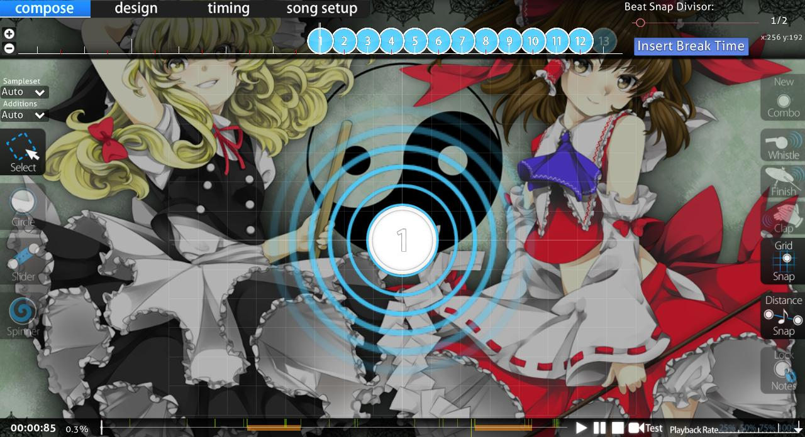
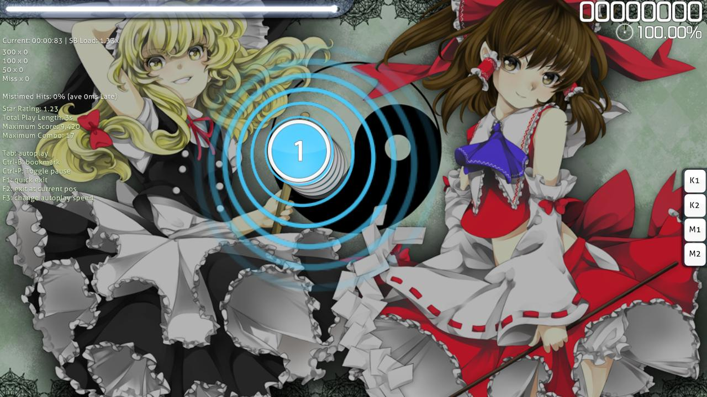

---
tags:
  - stacking
  - stack
  - stack lenience
  - stacking lenience
  - stacking leniency
  - automatic stack
  - automated stack
  - automatic stacking
  - automated stacking
  - autostacking
---

# Stack leniency

**Stack leniency** คือพารามิเตอร์ของ [Beatmap](/wiki/Beatmap) ที่ควบคุมการเกิด [การซ้อนทับอัตโนมัติ (Stacks)](/wiki/Beatmapping/Mapping_techniques/Stack) ของ [Circles](/wiki/Gameplay/Hit_object/Hit_circle) และ [Sliders](/wiki/Gameplay/Hit_object/Slider) ในโหมด [osu!](/wiki/Game_mode/osu!) ค่า Stack leniency ที่ต่ำจะช่วยลดระยะเวลาสูงสุดที่ [Hit objects](/wiki/Gameplay/Hit_object) จะถูกจัดให้อยู่ในกองซ้อนเดียวกัน ในทางกลับกัน ค่า Stack leniency ที่สูงจะรวมวัตถุที่วางห่างกันในเชิงเวลามากกว่าเข้าไว้ด้วยกันในกองซ้อนเดียวกัน

คุณสามารถเปลี่ยนค่า Stack leniency ได้จากแถบ `Advanced` ในส่วน [การตั้งค่าเพลง (Song Setup)](/wiki/Client/Beatmap_editor/Song_setup) ของ [ตัวแก้ไข Beatmap (Beatmap editor)](/wiki/Client/Beatmap_editor) แม้ว่าค่าที่แสดงในตัวแก้ไขจะมีตั้งแต่ `0` ถึง `10` แต่ค่าเหล่านี้จะถูกแปลงเป็นช่วง `0.0` ถึง `1.0` ของพารามิเตอร์ `StackLeniency` ภายใน [ไฟล์ .osu](/wiki/Client/File_formats/osu_(file_format))

## พฤติกรรมการทำงาน

ค่า Stack leniency เมื่อใช้ร่วมกับ [Approach rate (AR)](/wiki/Beatmap/Approach_rate) จะเป็นตัวกำหนดว่า Circles หรือส่วนของ Slider ใดจะถูกพิจารณาให้ซ้อนกัน[^stacking-algorithm] กองซ้อน (Stack) จะประกอบด้วยวัตถุที่มีระยะห่างกันไม่เกิน `preempt * StackLeniency` มิลลิวินาที โดยที่ `preempt` คือ [ความกว้างของช่วงการปรากฏ (Approach window)](/wiki/Beatmap/Approach_rate#animation-timing) และ `StackLeniency` คือค่าที่ดึงมาจากไฟล์ .osu ของ Beatmap นั้นๆ

ค่า Stack leniency ต่ำสุดคือ `0` ซึ่งจะเป็นการปิดระบบการซ้อนทับอัตโนมัติทั้งหมด ขณะที่ค่าสูงสุดคือ `1` จะถือว่าวัตถุซ้อนกันตั้งแต่วินาทีที่พวกมันเริ่มปรากฏให้เห็น

## อ้างอิง

[^stacking-algorithm]: [ตัวอย่างโค้ดโดย peppy (2011-08-24) "osu! stacking algorithm"](https://gist.github.com/peppy/1167470)
