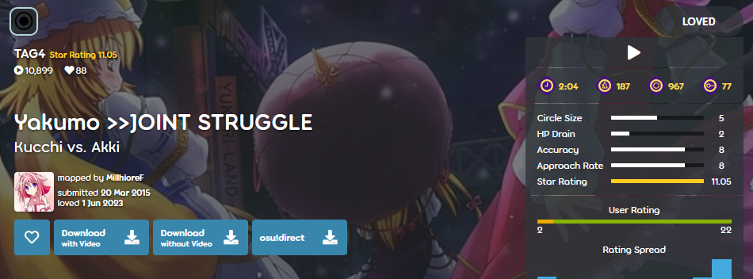

---
tags:
  - multiplayer
  - co-op
---

# Beatmap TAG

*Da non confondere coi tag, che sono una [parte dei metadati di una beatmap](/wiki/Client/Beatmap_editor/Song_setup).*

Le **beatmap TAG** (o solo *TAG*) sono beatmap create specificamente per le [modalità Tag co-op e Tag-team VS](/wiki/Client/Interface/Multiplayer#tag-co-op-/-tag-team-vs) nelle [lobby multigiocatore](/wiki/Client/Interface/Multiplayer). In quanto tali, spesso è necessario che due o più giocatori nella lobby cooperino in gioco per riuscire a completare queste beatmap.

In queste modalità, tutti i giocatori sono responsabili del proprio [set di combo](/wiki/Beatmapping/Combo), tra i quali si alternano nel corso del brano. Per questo motivo, le beatmap TAG sono progettate in modo tale che le loro combo siano molto distanti tra loro, rendendo il completamento della beatmap quasi impossibile per un giocatore singolo.

Le [difficoltà](/wiki/Beatmap/Difficulty) TAG sono solitamente indicate dall'uso del termine `TAG` nel nome della difficoltà della beatmap. Il più delle volte `TAG` è seguito da un numero, che indica la quantità di giocatori per cui la difficoltà è stata concepita (ad esempio `TAG2` per due giocatori o `TAG4` per quattro giocatori).

A causa della loro natura, le difficoltà TAG sono per la maggior parte non classificate, [Approvate](/wiki/Beatmap/Category#approved), o [Amate](/wiki/Beatmap/Category#loved). Tuttavia, in rare occasioni, le beatmap TAG che seguono i [criteri di classificazione](/wiki/Ranking_criteria) e sono ritenute idonee ad essere classificate dai [Nominatori di Beatmap](/wiki/People/Beatmap_Nominators) potrebbero farsi strada nella sezione [Classificate](/wiki/Beatmap/Category#ranked).
