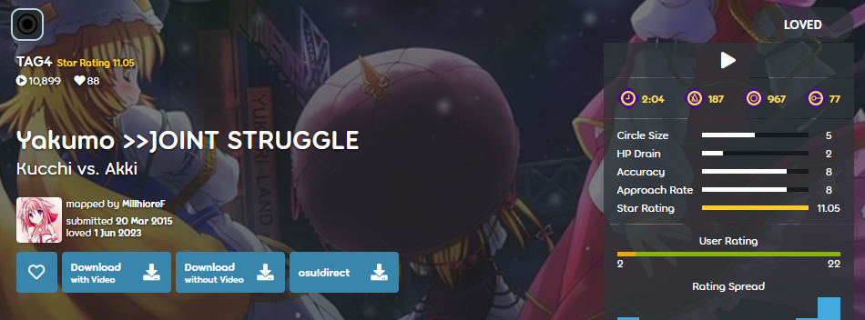

---
tags:
  - multiplayer
  - co-op
---

# TAG beatmaps

*อย่าสับสนกับ tags ซึ่งเป็น[ส่วนหนึ่งของ metadata ของบีตแมป](/wiki/Client/Beatmap_editor/Song_setup)*

**TAG beatmaps** (หรือเรียกสั้น ๆ ว่า *TAG*) คือบีตแมปที่สร้างมาเฉพาะสำหรับโหมด [Tag co-op หรือ Tag-team VS](/wiki/Client/Interface/Multiplayer#tag-co-op-/-tag-team-vs) ใน[ล็อบบี้ multiplayer](/wiki/Client/Interface/Multiplayer) ด้วยเหตุนี้ บีตแมปเหล่านี้จึงมักต้องอาศัยการเล่นร่วมกันของผู้เล่นสองคนขึ้นไปในล็อบบี้เพื่อเคลียร์ให้จบ

ในโหมดเหล่านี้ ผู้เล่นแต่ละคนจะรับผิดชอบ [combo chain](/wiki/Beatmapping/Combo) หนึ่งชุด และตลอดทั้งเพลงผู้เล่นจะสลับกันเล่นแต่ละ combo chain ด้วยเหตุนี้ TAG beatmaps จึงมักออกแบบให้ combo chain อยู่ห่างจากกันมาก จนแทบเป็นไปไม่ได้ที่ผู้เล่นคนเดียวจะเคลียร์บีตแมปได้

[ระดับความยาก](/wiki/Beatmap/Difficulty)แบบ TAG มักสังเกตได้จากการใช้คำว่า `TAG` ในชื่อระดับความยาก โดยส่วนใหญ่ `TAG` นี้จะตามด้วยตัวเลข ซึ่งมักบอกว่าระดับความยากนั้นออกแบบมาสำหรับผู้เล่นกี่คน (เช่น `TAG2` สำหรับผู้เล่นสองคน หรือ `TAG4` สำหรับผู้เล่นสี่คน)

ด้วยลักษณะของมัน ระดับความยากแบบ TAG จึงมักเป็น unranked, [Approved](/wiki/Beatmap/Category#approved), หรือ [Loved](/wiki/Beatmap/Category#loved) อย่างไรก็ตาม ในบางกรณีที่พบไม่บ่อย TAG beatmaps ที่ทำตาม [ranking criteria](/wiki/Ranking_criteria) และถูก [Beatmap Nominators](/wiki/People/Beatmap_Nominators) มองว่าเหมาะสมสำหรับ ranking ก็อาจเข้าสู่หมวด [Ranked](/wiki/Beatmap/Category#ranked) ได้
