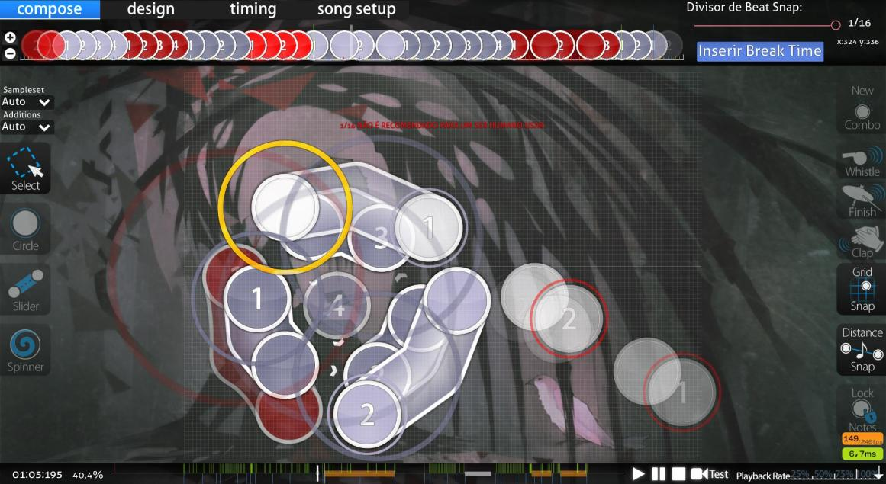
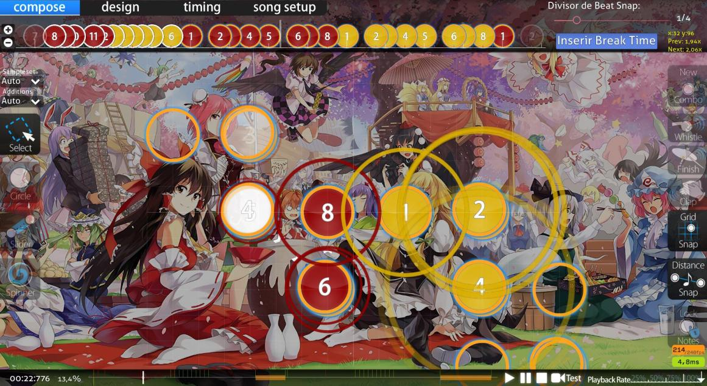
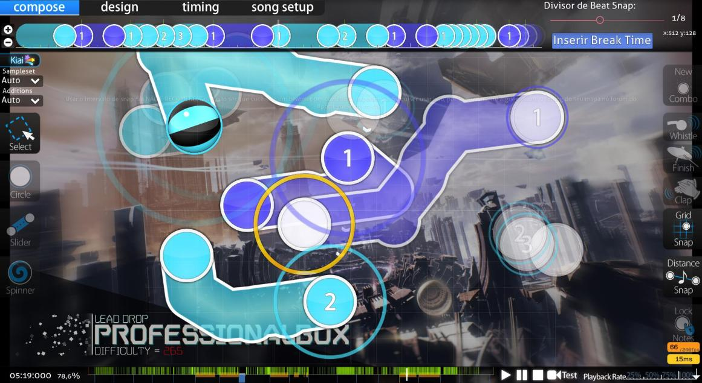

# Technical maps

<!-- Line to be added eventually: *Not to be confused with [Slider Art](link) or [Taikosu maps](link) -->

*หมายเหตุ: สำหรับบทความนี้ คำว่า "tech map" จะถูกใช้เป็นคำครอบคลุมที่รวมทุกนิยามเหล่านี้*

**Technical maps** (มักย่อว่า "tech map") เป็นคำที่ยังไม่มีนิยามชัดเจนและเป็นที่ตกลงร่วมกันในชุมชน osu! ขึ้นอยู่กับผู้ใช้แต่ละคน "tech map" อาจกว้างได้ตั้งแต่[บีตแมป](/wiki/Beatmap)ที่มี [patterns](/wiki/Beatmap/Pattern) ไม่ทั่วไป ไปจนถึงบีตแมปที่มีจำนวน[ออบเจกต์](/wiki/Gameplay/Hit_object)หนาแน่น และมีรูปทรง[สไลเดอร์](/wiki/Gameplay/Hit_object/Slider)ผิดปกติจำนวนมากที่เปลี่ยนความเร็วอย่างรวดเร็วและรุนแรง (มักอยู่ในความเข้มข้นสูง)

Tech maps มักถูกเชื่อมโยงกับ genre เพลงที่มีเสียงซับซ้อนและเร็ว (เช่น drum-and-bass, dubstep, และ drumstep) เพราะเพลงเหล่านี้มักเปิดโอกาสให้แมปเปอร์สำรวจเสียงแต่ละจุดได้ละเอียด และใช้ให้เป็นประโยชน์กับบีตแมป แม้เพลงประเภทนี้จะไม่ได้เป็นข้อบังคับก็ตาม

ไม่ว่านิยามจะเป็นแบบไหน ผู้เล่นจำนวนมากมองว่า tech maps ไม่แฟร์ในแง่ทักษะ เพราะความยากที่เพิ่มขึ้นหลัก ๆ หรือทั้งหมดมาจากแพตเทิร์นที่อ่านยากหรือสไลเดอร์ที่ผิดปกติ ในทำนองเดียวกัน นั่นทำให้แมปแบบนี้ไม่ค่อยนิยมใช้เก็บ [pp](/wiki/Performance_points) จำนวนมากในครั้งเดียว เนื่องจากระบบปัจจุบันทำงานในแบบที่ให้ค่ากับบีตแมปลักษณะนี้ต่ำกว่าที่ควร

## นิยาม

เพราะคำว่า "tech map" มีขอบเขตกว้างมาก จึงมีหลายแง่มุมที่ใช้อธิบายคำนี้ได้ รายการด้านล่างอธิบายนิยามต่าง ๆ จาก "ประเภท" ผู้เล่นที่พบได้บ่อย

### นิยามที่กว้างที่สุด

*หมายเหตุ: นิยามที่ "กว้างที่สุด" ต้องการเพียงหนึ่งหรือสองแง่มุมจากรายการด้านล่างก็พอที่จะเรียกบีตแมปว่า tech ได้*

- Beatmap patterns ที่ไม่ทั่วไปหรืออ่านยาก (มีตัวอย่างด้านล่าง)
  - "flow" ของบีตแมปที่ยาก
- SV sliders
  - อาจมี slider art รวมอยู่ด้วย
- รูปทรงสไลเดอร์ที่ผิดปกติ
- การเปลี่ยนความเร็วสไลเดอร์ที่เร็วและเฉียบ
- ความเข้มข้นโดยรวมสูง
  - จำนวนออบเจกต์หนาแน่นมากตลอดส่วนใหญ่ของแมป (ไม่รวม [streams](/wiki/Beatmap/Pattern/osu!/Stream))

ตัวอย่าง tech maps ที่ดีและเข้ากับนิยามนี้คือ [Silentroom - Nhelv (Nyxa) \[iniquitatem\]](https://osu.ppy.sh/beatmapsets/917915#osu/2009432) และ [RUMI - Densetsu no Matsuri (Net0) \[Oni\]](https://osu.ppy.sh/beatmapsets/781683#osu/1641637)

### นิยามที่เข้มงวด/เฉพาะที่สุด

*หมายเหตุ: นิยามที่ "เข้มงวด/เฉพาะที่สุด" ต้องมี **ทุก** แง่มุมในรายการด้านล่าง จึงจะเรียกบีตแมปว่า tech ได้*

- รูปทรงสไลเดอร์ที่ผิดปกติ
- การเปลี่ยนความเร็วสไลเดอร์ที่เร็วและเฉียบ
- SV sliders
- Beatmap patterns ที่อ่านยาก (มักอธิบายว่ามี "flow" ยาก) (มีตัวอย่างด้านล่าง)

")

ตัวอย่าง tech maps ที่ดีและเข้ากับนิยามนี้คือ [Camelia - Exit This Earth's Atomosphere (Camellia's "PLANETARY//200STEP" Remix) (ProfessionalBox) \[Primordial Nucleosynthesis\]](https://osu.ppy.sh/beatmapsets/855677#osu/1787848) และ [LeaF - MARENOL (Yugu) \[Extra\]](https://osu.ppy.sh/beatmapsets/1136149#osu/2404722)

<!--Some other sections that would be cool to add:
- A "History" section would be pretty cool. But idk how feasible this would be. -->
