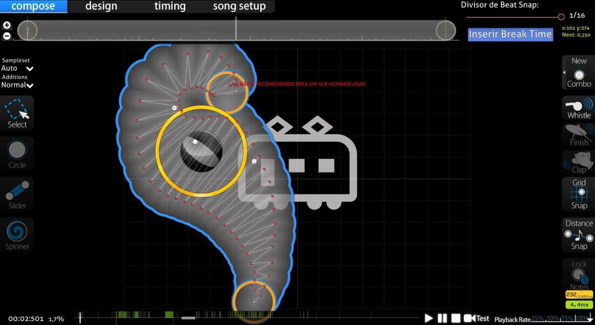

# 科技谱

<!-- 最后添加一行：*请勿与[滑条艺术](link)或[Taikosu 谱](link)（一种优先考虑太鼓转谱游玩的主模式谱面）相混淆。 -->

*注意：在本文中，“科技谱”是包含以下所有定义的总括术语。*

**科技谱**（常简称为 “tech map”） 这个专有名词目前并未被 osu! 社区明确而统一地定义。在玩家群体中，“科技谱”可用于概括一类仅仅包含特殊[排列](/wiki/Beatmap/Pattern)的[谱面](/wiki/Beatmap)，或是一类[物件](/wiki/Gameplay/Hit_object)密集，包含多种特殊的[滑条形状](/wiki/Gameplay/Hit_object/Slider)且滑条速度经常大幅度变化的谱面。

科技谱往往与结构复杂、节奏丰富的歌曲（如：DnB、Dubstep、Drumstep 风格）密切相关。因为这种歌曲让谱师能够捕捉歌曲内每一个声音，从而制作更复杂、花样繁多的科技谱。当然，科技谱的歌曲也不一定是这种风格。

但不管定义如何，许多玩家抱怨科技谱因为含有迷惑排列和特殊滑条形状而导致谱面实际难度与星数不匹配，游玩这种图也需要玩家拥有更高的实力水平。同样地，这也意味着当前星数系统低估了科技谱的真实难度，玩家无法一次获得大量[pp](/wiki/Performance_points)而导致它们不太热门。

## 定义

由于术语“科技谱”被广泛使用，因此可以从许多不同的方面描述它。下面的列表描述了玩家间常用的几种定义。

### 广义

*注意：只需要谱面符合以下列表内一到两个特点，即可广泛定义为科技谱。*

- 非常规或难读的谱面排列（如以下的例子）
  - 含有很“硬”的 flow，需要较强的手控能力游玩的谱面
- 变速滑条
  - 或包含艺术滑条
- 特殊滑条形状
- 滑条速度突变
- 高密度的物件
  - 谱面大部分时间都被高密度物件所覆盖（但不是[连打](/wiki/Beatmap/Pattern/osu!/Stream)）

比较符合以上广泛定义的科技谱有：[Silentroom - Nhelv (Nyxa) \[iniquitatem\]](https://osu.ppy.sh/beatmapsets/917915#osu/2009432) 和 [RUMI - Densetsu no Matsuri (Net0) \[Oni\]](https://osu.ppy.sh/beatmapsets/781683#osu/1641637)。

### 狭义

*注意：谱面需要符合以下列表内**所有**特点，才能狭窄定义为科技谱。*

- 特殊滑条形状
- 滑条速度突变
- 变速滑条
- 难读的谱面排列（又常描述为谱面含有较硬的 “flow”，也称为手控图）（如以下的例子）

比较符合以上狭窄定义的科技谱有：[Camelia - Exit This Earth's Atomosphere (Camellia's "PLANETARY//200STEP" Remix) (ProfessionalBox) \[Primordial Nucleosynthesis\]](https://osu.ppy.sh/beatmapsets/855677#osu/1787848) 和 [LeaF - MARENOL (Yugu) \[Extra\]](https://osu.ppy.sh/beatmapsets/1136149#osu/2404722)。

<!--添加其他描述段落可能会很酷：
- 比如 “tech 谱面的发展历史”。但我不知道这么写是否可行。-->
