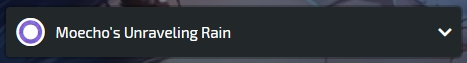
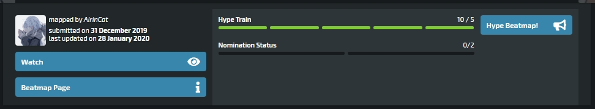
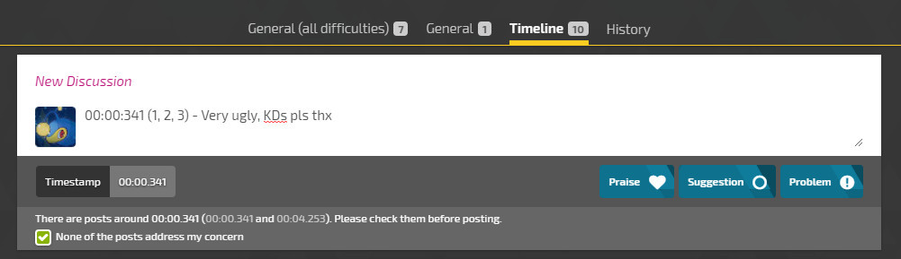
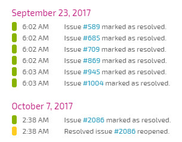
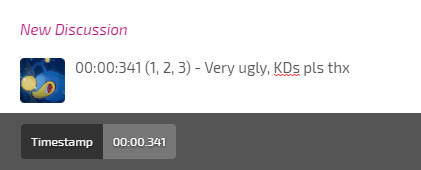
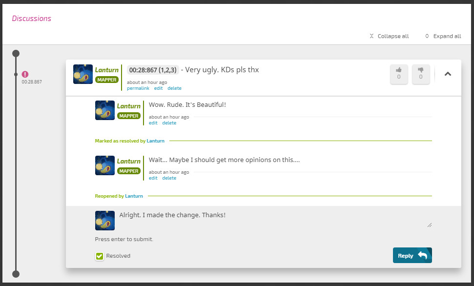

# Discusión de Beatmaps

La Discusión de beatmaps (introducido como *Modding v2*) esta ahora activada!

## Presentar un beatmap para la discusión de Beatmap

### Nuevos beatmaps

Los nuevos beatmaps enviados a través del sistema de envío de Beatmaps utilizarán la Discusión de Beatmaps.

### Viejos beatmaps

Un miembro del personal tiene que mover el beatmap manualmente para usar la Discusión de Beatmaps. [Ephemeral](https://osu.ppy.sh/users/102335) está actualmente a cargo de transferir los beatmapsets. Todos los beatmaps existentes en el WIP y pendientes que no tienen ninguna publicación modificada en el foro se han convertido para usar la Discusión de Beatmaps.

### Volviendo al antiguo sistema de modding

Ya no es posible volver al antiguo sistema de modding. Los únicos beatmaps que pueden usar el sistema antiguo son aquellos con publicaciones de modificaciónes. Si los beatmaps ya usan la Discusión de Beatmaps, el hilo del foro no tendrá un botón de respuesta, sino que se reemplazará con un botón que redirecciona al panel de Discusión de Beatmaps.

## Accediendo a la pagina de Discusión de Beatmaps

### Mediante new.ppy.sh:

Presiona en el boton `Discusión` en la pagina de informacion del beatmap.

### Mediante osu.ppy.sh:

Presionando en `Modding/Discussion` en la pagina del beatmap te llevara a la pagina, si está actualmente en el sistema de Discusión de Beatmaps.

## Pagina de Discusión de Beatmaps

### Seleccion de modalidad

Cambia el modo de juego entre osu!standard, osu!taiko, osu!catch y osu!mania. Solo puedes seleccionar cada modo de juego si el beatmapset tiene una dificultad con dicho modo de juego.

## Pagina del beatmap / Selección de dificultad

Al hacer clic en el artista/título del beatmap, volveras a la página de información del Beatmap. Puedes seleccionar una dificultad para modificar usando el menú desplegable. El número que aparece ademas del nombre de dificultad es el número de discusiones pendientes que deben resolverse. **¡Asegúrate de estar en la dificultad correcta antes de enviar modificaciones al beatmap!**

### Estado de modificaciones

Todas las modificaciones a continuación son para la dificultad seleccionada. Al hacer clic en cualquiera de estos, se mostrarán las modificaciones específicas en la línea de tiempo y en la sección de Discusión.

- Mias: Modificaciones que has constribuido.
- Resueltas: Modificaciones que el creador ha respondido y marcado como resueltas.
- Pendientes: Modificaciones que no han sido respondidas o marcadas como resueltas.
- Elogios: Modificaciones que han sido enviadas como un elogio
- Todas: Cada sugerencia, problema y elogio publicado en la dificultad del beatmap y la sección general del set del beatmap.

### Modificación de la línea de tiempo

Esto muestra todas las modificaciones hechas para dicha dificultad que tiene una marca de tiempo. Al hacer clic en estas se desplazará hacia abajo hasta la modificacion publicada en esa marca de tiempo.

## Estado del beatmap

### Creador del beatmap

Este contiene al creador que envió el beatmapset, muestra la fecha de envío y la fecha en que se actualizó el beatmap por última vez.

### Mirar/Dejar de mirar

Esto reemplaza la suscripción de beatmap. Puedes seguir el estado de los beatmaps y los problemas abiertos. Se accede a esta página a través de la página de inicio del sitio web haciendo clic en [`link de la lista de seguimiento de modding`](https://osu.ppy.sh/beatmapsets/watches) ubicado cerca de la parte superior de la página.

### Tren del Hype

*Nota: ahora debes clic en `Hype` para agregar hype; dar elogios ya no aumentará el hype automáticamente.*

El tren del hype es similar al anterior sistema de prioridad por estrellas.

> ¡Agregar elogios aumentará el hype de este beatmap, haciéndolo más visible para la nominación y el ranking!

*Nota: Se requiere que los jugadores jueguen una dificultad en el beatmapset para agregar Hype a un beatmap.*

Los elogios deben hacerse en la sección General `(Todas las dificultades)` para agregar hype. No funcionará a través de las pestañas `General` o `Linea de Tiempo`.

### Nominación

Una vez que un beatmap acumule al menos 5 puntos de Hype, el beatmap sera elegible para la nominación. Esto funciona como lo hizo con el sistema de modding anterior. Se requiere que el beatmap tenga 2 nominaciones por los [Nominadores de beatmaps](/wiki/Beatmap_Nominators) para pasar al estado de [Calificado](/wiki/qualified).

## Campo de envío de modificaciones

### Sección de presentación de modificaciones

Esta es la sección del beatmap al que enviarás tus inquietudes.

- `General (Todas las dificultades)`: Problemas generales con el beatmap asi como metadatos y discusión general sobre el beatmapset como un todo. También puedes agregar Hype a un beatmap aquí publicando un comentario con Elogios.
- `General`: Problemas generales con la dificultad, como la configuración del beatmap y la discusión general sobre la dificultad específica.
- `Linea de tiempo`: Problemas en ciertos puntos del beatmap. Debe contener una marca de tiempo. La mayoría de las modificaciones terminarán en esta sección.
- `Historial`: Muestra cuando los problemas que fueron marcados como resueltos. Puedes hacer clic en cualquier problema para saltar a la publicación.

### Campo de Modding

Aquí es donde escribes tu modificación. Si usa la sección de la Línea de tiempo, debe incluir una marca de tiempo en la publicación. La primera marca de tiempo que se colocará será la marca de tiempo que se muestra en la sección Discusión. Las secciones generales no requieren marcas de tiempo, pero pueden incluirlas.

### Advertencia de publicación similar

Si tu marca de tiempo enviada a través de la sección Línea de tiempo está cerca de otra modificación ya publicada, deberá confirmar que la modificación no aborda el problema que está enviando actualmente. **¡Por favor revisa el campo de discusión antes de marcar la casilla!**

### Tipo de modificación

Aquí es donde envías tus modificaciones. Puede elegir entre `Elogios`, `Sugerencia` o `Problema`. Cada uno es bastante autoexplicativo. **Al hacer clic en esto, enviarás tu modificación. Si cometiste un error o necesitas hacer una edición de tu modificación, busca la publicación en la sección de Discusión.** Puede agregar hype al beatmap presentando elogios en la sección `General (Todas las Dificultades)`.

### Alfiler

Al habilitar el alfiler, el [Campo de modding](# modding-field) se desplazará con usted, una vez que se haya desplazado hacia abajo más allá del Campo de modding.

## Campo de discusión de modding

### Funciones

- `Ordenar por`: Ordena las publicaciones por `linea de tiempo` (predeterminado, ordenada por la marca de tiempo dada desde la publicación de la modificación) o `Ultima actualización` (ordenada segun cuando se publicó la publicación)
- `Contraer todo` y `Expandir todo` Y la flecha hacia arriba: Estos mostrarán/ocultarán las publicaciones.
- Pulgares arriba/abajo: Me gusta/No me gusta la modificación.
  - Todos menos el publicador de la modificacion pueden dar su pulgar arriba.
  - **Dar un pulgar arriba ahora le dará al publicador de la modificación [Kudosu!](/wiki/Kudosu!) en sugerencias o problemas**
  - Solo los miembros del [BN](/wiki/BN), [NAT](/wiki/People/Nomination_Assessment_Team), y [GMT](/wiki/GMT) pueden dar pulgar abajo (para denegar cualquier Kudosu!).
- Linea de tiempo: Muestra la marca de tiempo que aborda el problema. Solo disponible en la sección Línea de tiempo.
- Icono de CREADOR: Muestra respuestas/publicaciones del usuario que creó el beatmapset.
- Permalink, editar, eliminar: El Permalink toma un link directo a la publicación. Editar permite al remitente editar su publicación. Eliminar permite que el remitente elimine su publicacion.
- `Responder`: Responde a la publicación presionando 'Enter' o haciendo clic en 'Responder', mas tarde se enviará tu respuesta.
- `Marcar como resuelto`: El creador o el publicador de la modificación puede seleccionar esto cuando el problema ha sido abordado y aceptado o denegado
- `Re abrir una discusión`: Si la publicación necesita más discusión, el creador o el remitente de la modificación puede reabrir el envío respondiendo y desmarcando Resuelto.

## Hype, Nominación, y Kudosu!

### Hype

Hype se usa para ayudar a impulsar beatmaps a la nominación; similar a cómo la prioridad por estrellas se utilizó anteriormente. Una vez que un beatmapset recibe 5 Hypes, es elegible para la nominación. Ten en cuenta lo siguiente:

- Cada usuario tiene un suministro limitado de hype (5 por semana para comenzar).
  - Recuperarás un hype 7 días después de ser utilizado
  - El Hype solo se puede usar después de jugar a través de una dificultad de un beatmapset.

### Nominación

La nominación es similar al sistema de modding anterior. Un beatmap debe recibir 2 nominaciones de dos [Nominadores de Beatmap](/wiki/Beatmap_Nominators) antes de pasar automáticamente a la etapa de calificación. Los beatmaps deben tener todas las sugerencias y problemas resueltos antes de que puedan clasificarse. BN/NAT puede restablecer las nominaciones publicando un problema en el campo de discusión.

### Kudosu!

Darle pulgar arriba a una sugerencia o problema en el campo de discusión le dará al modificador Kudosu!. La cantidad de votos recibidos determina cuánto Kudosu! el modder reciba. Cualquier usuario que no sea el publicador puede dar pulgar arriba cualquier publicación.

*Nota: Estas limitado a 60 votos por hora, mientras que los miembros de BN y NAT no tienen este límite.*

Actualmente, estos son los umbrales para ganar una cierta cantidad de Kudosu!:

- 1 pulgar arriba = 1 Kudosu!
- 2 pulgares arriba = 2 Kudosu!
- 5 pulgares arriba = 3 Kudosu!

Los miembros de BN, NAT y GMT pueden denegar Kudosu! dando un pulgar hacia abajo.

## Recordatorios

- ¡Elige el modo correcto y la dificultad que deseas modificar!
- Selecciona la sección adecuada a la que envías tu modificación.
- **Solo publica un problema a la vez.** ¡No envíe múltiples problemas en una sola publicación!
- La sección Línea de tiempo requiere al menos una marca de tiempo antes de poder enviar tu publicación.
- Verifica si el problema ya ha sido abordado si aparece la advertencia de publicación similar.
- ¿Te gusta el beatmap? ¡Da tu Hype para ayudar al beatmap a acercarse a la nominación!
- Asegúrate de votar sobre sugerencias y/o problemas, ya que ahora premian con Kudosu! a los modders

## Consejos

- Puedes filtrar las modificaciones usando los botones en el Estado de modificación en la información del Beatmap. Por ejemplo, puedes ver solo las publicaciones pendientes.
- Puede editar o eliminar tus publicaciones si enviaste una publicación y encontraste un error.
- Como creador, puedes volver a abrir cualquier problema resuelto anteriormente respondiendo a la publicación y desmarcando Resuelto.
- Puedes editar la descripción del beatmap utilizando la página de beatmapset. Haz clic en el icono de edición en la parte superior derecha del campo de descripción.

## Guía paso a paso para publicar una modificación

1. Selecciona el modo de juego apropiado en la parte superior de la página del beatmap que deseas modificar (osu!standar, osu!taiko, osu!catch, osu!mania)
2. Selecciona la dificultad que desea modificar en el menú desplegable. (Fácil, Normal, Difícil, Insano, etc.)
3. Selecciona la sección en la que desea publicar su modificación (`General (todas las dificultades)`, `General` o `Linea de tiempo`)
4. Escribe tu modificación en el campo de discusión. Usa una marca de tiempo si estás usando la sección Línea de tiempo. **¡Un problema por publicación!**
5. Selecciona el tipo de modificación que estás haciendo (`Elogio`,`Sugerencia`, o `Problema`)

¡Tu publicación será enviada! Puede reiniciar en el paso 3 si desea continuar modificando la misma dificultad. No te olvides de darle hype al beatmap si quieres ayudarlo a avanzar para la nominación.

## FAQ

### ¿Podré modificar con el sistema anterior después de que se lance la Discusión de Beatmap?

Debes modificar con el sistema que el creador ha elegido. Si se centran en la Discusión Beatmap, deberas modificar con la Discusión Beatmap. De lo contrario, tus modificaciones pueden pasar desapercibidas.

### ¡No me gusta la discusión de Beatmap! ¿Cómo vuelvo al sistema anterior?

La Discusión de Beatmap ya esta activada. No hay forma de volver al sistema anterior; sin embargo, los beatmaps anteriores a la Discusión de Beatmap con modificaciones, todavía pueden usar el sistema de modding anterior.

## Ver también

- Hilo original del foro: [Guía de discusión de Modding (MV2)](https://osu.ppy.sh/community/forums/topics/650961) por [Lanturn](https://osu.ppy.sh/users/1446665)
- Video de [pishifat](https://osu.ppy.sh/users/3178418) sobre Discusión de Beatmap: [osu!mapping: moddingv2](https://www.youtube.com/watch?v=gZxsB98HGq0)
- Hilo del foro Discusión de Beatmap de peppy (para retroalimentación): [Ayuda general de la Discusión de Beatmap (Modding v2)](https://osu.ppy.sh/community/forums/topics/662559)
