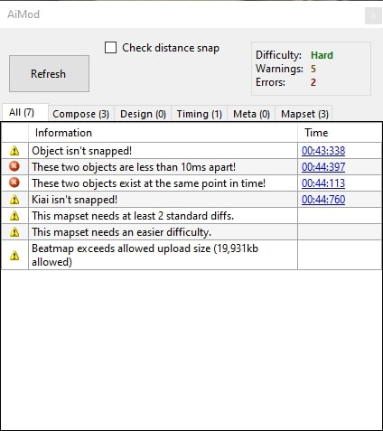

# AiMod

**AiMod** es una herramienta construida en el osu!Beatmap Editor, puedes abrirlo presionando `Control`+`Shift`+`A` o haciendo clic en **Archivo**» **Abrir AiMod**. AiMod ayudará a los nuevos mappers a "modificar" sus mapas. El problema con AiMod es que fue diseñado para ser simple, por lo que es muy probable que AiMod no detecte problemas con los patrones de mapeo o mal BPM/timing. Así que al final, necesitarás un [modder](/wiki/Glossary) para modificar tu beatmap.

Después de que AiMod revise su mapa de ritmo (debería tomar menos de un minuto), se muestran las advertencias y los errores. Si "¡No se encontraron problemas en este mapa!"... ¡Felicitaciones! Tu beatmap pasó el modding de AiMod, pero igual necesitarás encontrar un [modder](/wiki/Glossary) para modificar tu beatmap, porque ellos encontrarán más problemas de los que AiMod puede detectar.

## Pestañas

- **All**
  - Recopila los elementos de las otras pestañas.
- **Compose**
  - Estos generalmente son problemas con la colocación de objetos.
    - Es posible que tengas que marcar la casilla  "Check distance snap" para que aparezcan estas advertencias (mientras escanea se podria producir lag, dependiento del tamaño/longitud del beatmap)
- **Design**
  - Estos suelen ser algunos de los problemas de interfaz, como el fondo, storyboard, etc.
- **Timing**
  - Cuando aparecen estos problemas, verifica la línea de tiempo porque es probable que algo esté mal colocado.
- **Meta**
  - Cuando aparezcan estos problemas, revisa la configuración de la canción.
- **Mapset**
  - Estos problemas afectan al mapset en su conjunto.

## Mensajes

> Nota: los números dentro de los corchetes (es decir, "{0}") son un marcador de posición para un número o una palabra.

### Informativo

#### All

| Mensaje | Explicación| Solución |
| :-- | :-- | :-- |
| ¡No se encontraron problemas en este mapa! | ¡AiMod no pudo encontrar ningun problema con tu mapa! | Podrias subir tu beatmap usando BSS para permitir que los osu!modders encuentren otros errores y problemas con tu beatmap. |

#### Meta

| Mensaje | Explicación | Solución |
| :-- | :-- | :-- |
| Se recomienda que la tasa de HP para Fácil/Normal sea como mínimo 4. | ¡Mapas de osu!mania solamente! | Ve a "Song Settings" y configura la velocidad de HP en 4 o superior |
| Se recomienda que la tasa de HP para Difícil y superior sea de al menos 7. | ¡Mapas de osu!mania solamente! | Ve a "Song Settings" y configura la frecuencia de HP en 7 o superior |
| Se sugiere que la tasa de OD para mapas con pocos sliders sea al menos 7. | ¡Mapas de osu!mania solamente! | Ve a "Song Settings" y configura la tasa de OD en 7 o más |
| La velocidad del control deslizante debe ser 1.40 o 1.60. | ¡Mapas de osu!taiko solamente! | Ve a la pestaña "Timing" y cambia la Velocidad de los sliders a 1.40 o 1.60 |

### Errors

#### Compose

| Mensaje | Explicación | Solución |
| :-- | :-- | :-- |
| ¡Estos dos objetos están a menos de 10ms de distancia! | Dos objetos están muy cerca uno del otro. Esto significa que el jugador tendrá que hacer clic a una velocidad imposible. | Encuentra los dos objetos, muévelos o elimínalos. |

#### Design

| Mensaje | Explicación | Solución |
| :-- | :-- | :-- |
| Tu beatmap no tiene una imagen de fondo. | ¡La dificultad actual no tiene una imagen de fondo! Ten en cuenta que los videos no cuentan como imágenes de fondo porque no es necesario que el usuario los descargue | Encuentra una imagen adecuada y úsala como imagen de fondo. |

### Warnings

#### Compose

| Mensaje | Explicación | Solución |
| :-- | :-- | :-- |
| Este control deslizante se mueve de forma anormal. |  |  |
| Este combo es muy largo. Considera dividirlo. | La duración de los combos puede afectar la dificultad del mapa, así como la cantidad de frutas que se apilarán en el plato del receptor. | Ve a "offending combos" y decide dónde comenzar el nuevo combo. (Se prefiere que la duración de los combos sea, como máximo 15-18) |
| Esta ruleta aparece en la pantalla más tarde que los objetos que lo siguen. | Los objetos aparecen mientras la ruleta está activa. Esto podría ser causado por tener baja AR y/o colocar objetos demasiado cerca (en el tiempo) a la ruleta. | Cambia la longitud de la ruleta y/o elimina los siguientes objetos |
| ¡El fin del objeto está fuera de la pantalla! | Los objetos que están fuera de la pantalla podrian no verse en clientes osu! que se ejecutan en proporciones de 4:3. | Retira o mueve el extremo del objeto |
| ¡El objeto está fuera de pantalla! | Los objetos que están fuera de la pantalla podrian no verse en clientes osu! que se ejecutan en proporciones de 4:3. | Retira o mueve el objeto |
| Este objeto está muy cerca del objeto anterior. |  |  |
| Este objeto está demasiado lejos del objeto anterior. |  |  |
| Esta ruleta es demasiado corta. Auto debe alcanzar al menos 1000 puntos de bonificación en las ruletas. | La ruleta especifica es demasiado corta; esto hará que sea imposible obtener una SS. | Encuentra la ruleta y quítala, o haz que la ruleta sea un poco más larga, alrededor de 3 beats completos. |
| ¡Estos dos objetos existen en el mismo punto en el tiempo! | Dos objetos están uno encima del otro. ¡Esto hará que el mapa sea imposible de clasificar! | Encuentra los dos objetos de golpeao y muévelos o elimínalos. |
| Las ruletas deben tener un nuevo combo. |  |  |
| ¡El objeto no esta puesto! | El objeto especificado no está encajado en la línea de tiempo. | Verifique el tiempo, si hiciste un cambio en él, es posible que debas rescatar todas las notas (puedes hacerlo manualmente o haciendo clic en Timing » Resnap all notes (¡Si haces esto, deberás verificarsi se colocaron notas en el lugar equivocado!). colocado en el lugar equivocado!)). |
| ¡El final del objeto no está roto! | El final del objeto especificado no se ajusta en la línea de tiempo. | Verifica el tiempo, si hiciste un cambio en él, es posible que debas rescatar todas las notas (puedes hacerlo manualmente o haciendo clic en Timing » Resnap all notes (¡Si haces esto, deberás verificar si se colocaron notas en el lugar equivocado!)). |
| ¡Esta nota mantenida tiene menos de 10 ms de largo! | ¡Mapas de osu!mania solamente! Esto requerirá que el jugador presione y suelte la tecla a una velocidad muy rápida, lo que hace que tu mapa sea imposible de obtener una SS. |  |
| Este objeto se superpone con otro objeto. | ¡Mapas de osu!mania solamente! |  |
| Este objeto está apilado encima de otro objeto. | ¡Mapas de osu!mania solamente! Las teclas especificadas y/o notas mantenidas están una encima de la otra. ¡Esto hará que tu mapa sea imposible de obtener una SS! | Encuentra la tecla o nota mantenida, corríjela o elimínala. |
| No se permiten más de 6 notas simultáneamente. | ¡Mapas de osu!mania solamente! La mayoría de los teclados pueden permitir hasta 6 pulsaciones de teclas a la vez. | Verifica tu beatmap para asegurarte de que cada columna tenga, como máximo, 6 pulsaciones de notas. |

#### Design

| Mensaje | Explicación | Solución |
| :-- | :-- | :-- |
| La imagen de fondo es más grande que 1366x768. |  |  |
| Este mapa puede necesitar una advertencia de epilepsia, ya que contiene storyboard con frecuencias cambiantes. |  |  |
| Falta archivo: |  |  |
| Las dimensiones de {0} deben ser {1}x{1} |  |  |
| Las dimensiones de su video no deben exceder 1024x768 para el formato 4:3. |  |  |
| Las dimensiones de su video no deben exceder 1280x720 para el formato 16:9. |  |  |

#### Timing

| Mensaje | Explicación | Solución |
| :-- | :-- | :-- |
| Todas las secciones de tiempo tienen un volumen por debajo del 5%. |  |  |
| Este beatmap tiene más de 6 minutos de duración. Considera acortarlo si no es un mapa de estilo maratón. |  |  |
| Su beatmap es más corto que 45 segundos. Considera hacerlo más largo. |  |  |
| La tasa de bits del audio es superior a 192 kbps. Considera comprimirlo a CBR 192 kbps o VBR ~1.0. |  |  |
| El tiempo del Kiai se activa por menos de 15 segundos. |  |  |
| La tasa de bits de audio es inferior a 128 kbps. Considera encontrar un audio de mejor calidad. |  |  |
| El mp3 que está utilizando es mucho más largo que la parte que está mapeada. Considera recortarlo para reducir el tamaño del archivo. |  |  |
| Kiai necesita un punto de tiempo final. |  |  |
| Un punto de vista previa para este mapa no está configurado. Considera establecer uno en el menú de Sincronización. |  |  |
| ¡Dos puntos de tiempo existen al mismo tiempo! |  |  |
| {0} de {1} secciones de tiempo tienen un volumen por debajo del 5%. |  |  |
| Más de 1/3 del mapa esta en Kiai. Considera reducir esto. |  |  |
| Más de la mitad del TV Size esta en Kiai. Considera reducir esto. |  |  |
| ¡Kiai no está puesto! |  |  |
| ¡El final de Kiai no esta puesto! |  |  |
| Descanso no se sugiere para los mapas de manía. |  |  |
| La diferencia fácil/normal contiene demasiados cambios de velocidad. |  |  |
| ¡Kiai se alterna con mucha frecuencia! |  |  |
| Más de 1/3 del mapa es Kiai. Considera reducir esto. |  |  |
| Más de 1/3 del mapa es Kiai. Considera reducir esto. |  |  |
| Más de 1/3 del mapa es Kiai. Considera reducir esto. |  |  |
| Más de 1/3 del mapa es Kiai. Considera reducir esto. |  |  |

#### Meta

| Mensaje | Explicación | Solución |
| :-- | :-- | :-- |
| La acumulación en pilas es mayor que 0,9 o menor que 0,3. |  |  |
| El artista romanizado contiene unicode. |  |  |
| El título romanizado contiene unicode. |  |  |
| La cuenta regresiva no está permitida en el modo de manía. | ¡Mapas de osu!mania solamente! | Ve a "Song Settings" y deshabilita la cuenta regresiva en la pestaña "Diseño" |
| Letterboxing no está permitido en el modo Mania. | ¡Mapas de osu!mania solamente! |  |
| La tasa de OD se recomienda que sea al menos 5. | ¡Mapas de osu!mania solamente! | Ve a "Song Settings" y configura la tasa de OD en 5 o más |
| Se sugiere que la tasa de OD para mapas con muy pocos controles deslizantes sea de al menos 8. | ¡Mapas de osu!mania solamente! |  |
| La cuenta regresiva no está permitida en el modo Taiko. | ¡Mapas de osu!taiko solamente! |  |
| La advertencia de epilepsia no está permitida en el modo Taiko. | ¡Mapas de osu!taiko solamente! |  |
| Letterboxing no está permitido en el modo Taiko. | ¡Mapas de osu!taiko solamente! |  |

#### Mapset

| Mensaje | Explicación | Solución |
| :-- | :-- | :-- |
| El artista entra en conflicto con la dificultad {0}. |  |  |
| El archivo de audio entra en conflicto con la dificultad {0}. |  |  |
| La cuenta regresiva está en conflicto con la dificultad {0}. |  |  |
| El audio entra en conflicto con la dificultad {0}. |  |  |
| El Letterbox en los descansos entra en conflicto con la dificultad {0}. |  |  |
| El tiempo de vista previa de audio entra en conflicto con la dificultad {0}. |  |  |
| La fuente está en conflicto con la dificultad {0}. |  |  |
| Las etiquetas entran en conflicto con la dificultad {0}. |  |  |
| El título está en conflicto con la dificultad {0}. |  |  |
| El artista con Unicode entra en conflicto con la dificultad {0}. |  |  |
| El título con Unicode entra en conflicto con la dificultad {0}. |  |  |
| Este mapset no puede tener una dificultad Insane. sin una dificultad Hard. |  |  |
| El tamaño de archivo del mapset supera los 10 MB sin video. |  |  |
| El tamaño de archivo del mapset excede los 24MB con video. |  |  |
| A este mapset le falta la dificultad: {0} |  |  |
| Este mapset necesita al menos 2 dificultad osu!catch. | ¡Solo mapas de osu!catch! |  |
| Este mapset necesita al menos 1 dificultad Fácil/Normal. |  |  |
| Este mapset necesita al menos 2 dificultad osu!mania | ¡Mapas de osu!mania solamente! |  |
| Este mapset necesita al menos 2 dificultades estándar. | ¡Mapas de estándar solamente! |  |
| Este mapset necesita al menos 2 dificultades de osu!taiko. | ¡Mapas de osu!taiko solamente! |  |
| Los puntos de temporización no heredados entran en conflicto con la dificultad {0} . |  |  |
