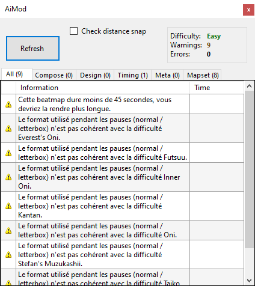

# AiMod

**AiMod** est un outil intégré à l'[éditeur de beatmap](/wiki/Beatmap_Editor) qui détecte les problèmes dans une [beatmap](/wiki/Beatmap). Il peut être ouvert via l'option de menu `Fichier` > `Ouvrir AiMod` ou les [raccourcis clavier](/wiki/Shortcut_key_reference) `Ctrl` + `Shift` + `A`.

Si AiMod peut être utile pour détecter les problèmes de base d'une carte, il ne remplace pas le [modding](/wiki/Modding) réalisé par de vraies personnes. AiMod ne peut pas évaluer la qualité d'une carte ou détecter des problèmes complexes tels qu'un mauvais [patterning](/wiki/Beatmap/Pattern) ou [timing](/wiki/Guides/How_to_Time_Songs). Lorsque vous [créez une beatmap](/wiki/Beatmapping), il est recommandé de corriger d'abord les avertissements d'AiMod, puis de demander l'aide d'autres [moddeurs](/wiki/Modding/Modder).

Le développement d'AiMod est généralement en retard par rapport aux normes de la communauté de mapping et aux [critères de classement](/wiki/Ranking_Criteria), et par conséquent, [certains de ses résultats sont considérés comme incorrects](#défauts).

## Onglets

- **All :** Rassemble les éléments des autres onglets.
- **Compose :** Ces problèmes sont généralement dus au placement des objets. Vous devrez peut-être cocher la case "Check distance snap" pour que ces avertissements apparaissent (car ces vérifications peuvent provoquer un décalage, en fonction de la taille/longueur de la beatmap).
- **Design :** Ces problèmes concernent généralement certains aspects de l'interface, comme l'arrière-plan, les storyboards, etc.
- **Timing :** Lorsque ces problèmes apparaissent, vérifiez la timeline car un élément est probablement mal placé.
- **Meta :** Lorsque ces problèmes apparaissent, vérifiez le song setup.
- **Mapset :** Ces problèmes affectent la map dans son ensemble.

## Messages

*Remarque : Les chiffres entre crochets (par exemple `{0}`) sont des caractères de remplacement pour un nombre ou un mot.*

### Informatif

#### All

| Message | Explication | Solution |
| :-- | :-- | :-- |
| Aucun problème détecté ! | AiMod n'a trouvé aucun problème avec votre map ! | Vous pourriez télécharger votre beatmap en utilisant BSS pour permettre aux moddeurs de trouver d'autres erreurs et problèmes avec votre beatmap. |

#### Meta

| Message | Explication | Solution |
| :-- | :-- | :-- |
| Le taux de drain de santé des difficultés Easy et Normal devrait être au minimum 4. | maps osu!mania uniquement ! | Allez dans le Song Settings et réglez le taux de drain de santé sur 4 ou plus. |
| Le taux de drain de santé des difficultés Hard et supérieures devrait être au minimum 7. | maps osu!mania uniquement ! | Allez dans le Song Settings et réglez le taux drain de santé sur 7 ou plus. |
| L'overall difficulty des maps contenant peu de sliders devrait être au minimum 7. | maps osu!mania uniquement ! | Allez dans Song Settings et réglez le taux d'OD sur 7 ou plus. |
| Le slider velocity devrait être égal à 1,40 ou 1,60. | maps osu!taiko uniquement ! | Allez dans l'onglet Timing et modifiez le slider velocity à 1,40 ou 1,60. |

### Erreurs

#### Compose

| Message | Explication | Solution |
| :-- | :-- | :-- |
| Ces deux objets sont séparés de moins de 10 ms. | Deux objets sont très proches l'un de l'autre. Cela signifie que le joueur devra cliquer à une vitesse impossible ! | Trouvez les deux objets et déplacez-les ou supprimez-les. |
| Ces deux objets apparaissent exactement au même moment. | Deux objets se trouvent l'un sur l'autre. Cela rendra la map impossible à classer ! | Trouvez les deux objets et déplacez-les ou supprimez-les. |
| Il n'y a pas de hitsounds sur aucun objet. Les hitsounds sont nécessaires pour les beatmaps classables. | *Auto-explicatif* | Ajouter des hitsounds sur la map en utilisant des whistles, des claps et des finishes. |
| Ce spinner et l'objet suivant ne sont pas assez espacés. | Des objets apparaissent lorsque le spinner est actif. Cela peut être dû au fait que l'AR est faible et/ou que les objets sont placés trop près (dans le temps) du spinner. | Modifiez la longueur du spinner et/ou retirez les objets suivants |
| Cette note dure moins de 10 ms ! | maps osu!mania uniquement ! Cela obligera le joueur à appuyer et relâcher la touche à un rythme très rapide, rendant votre map impossible à SS. | Augmenter la longueur de la hold note ou supprimez-la |
| Cet objet chevauche un autre objet. | maps osu!mania uniquement ! | Supprimez l'un des objets qui se chevauchent. |
| Cet objet est placé par-dessus un autre objet. | maps osu!mania uniquement Les keys et/ou les hold notes spécifiées sont superposées. Cela rendra votre carte impossible à obtenir un SS ! | Trouvez la key ou la hold note et corrigez-la ou supprimez-la. |
| Il est interdit de placer plus de 6 notes simultanément. | maps osu!mania uniquement La plupart des claviers permettent de presser jusqu'à 6 touches à la fois. | Vérifiez votre beatmap pour vous assurer que chaque colonne a au maximum 6 notes pressés. |

#### Design

| Message | Explication | Solution |
| :-- | :-- | :-- |
| Aucune image de fond n'a été définie. | La difficulté actuelle n'a pas d'image de fond ! Notez que les vidéos ne comptent pas comme images de fond car l'utilisateur n'est pas obligé de les télécharger. | Trouvez une image appropriée et utilisez-la comme image de fond. |
| Fichier introuvable : {0} | Il manque des fichiers à votre beatmap. | Récupérez les fichiers manquants ou vérifiez que la beatmap n'essaie pas d'utiliser des fichiers inexistants. |

#### Timing

| Message | Explication | Solution |
| :-- | :-- | :-- |
| Aucune des sections n'a un volume supérieur à 5%. | *Auto-explicatif* | Réglez au moins une section de timing pour qu'elle ait un volume de hitsound de 5% ou plus. |

#### Meta

| Message | Explication | Solution |
| :-- | :-- | :-- |
| Le temps de drain doit être supérieur à 30 secondes. | La longueur de votre map du début à la fin, sans compter les temps de pause, est inférieure à 30 secondes. AiMod ne détecte pas les spinners qui peuvent s'étendre au-delà de la marque des 30 secondes de temps de drain. | Essayez d'utiliser un spinner pour terminer la map si votre chanson le permet. Sinon, votre chanson est peut-être trop courte. Il est possible de prolonger votre mp3 afin d'atteindre la barre des 30 secondes. |

### Avertissements

#### Compose

| Message | Explication | Solution |
| :-- | :-- | :-- |
| <!-- Not sure how to test this one --> Ce slider se déplace de manière anormale. |  |  |
| Le slider a un nombre de points absurdement élevé ! | *Auto-explicatif* | Supprimez certains des points d'ancrage de votre slider. |
| Ce combo est très long. Pensez à le diviser. | La longueur des combos peut affecter la difficulté de la map, ainsi que la quantité de fruits qui seront empilés sur l'attrapeur. | Allez voir les combos fautifs et décidez où commencer le nouveau combo (Il est préférable que la longueur des combos soit, au maximum, de 15-18). |
| La fin de l'objet est hors champ ! | Les objets qui sont hors écran peuvent ne pas être vus dans les clients d'osu! fonctionnant avec un rapport d'écran 4:3. Cela n'est pas toujours exact, alors vérifiez en utilisant une résolution de rapport d'écran 4:3. | Retirer ou déplacer l'objet. |
| L'objet est hors champ ! | Les objets qui sont hors écran peuvent ne pas être vus dans les clients osu! fonctionnant dans des rapports d'écran 4:3. | Retirer ou déplacer l'objet. |
| Cet objet est trop proche de l'objet précédent. | "Check distance snap" doit être vérifié. | Déplacez l'objet plus loin de l'objet précédent. |
| Cet objet est trop éloigné de l'objet précédent. | "Check distance snap" doit être vérifié. | Rapprochez l'objet de l'objet précédent. |
| Ce spinner est trop court. le mod Auto doit obtenir au moins 1000 points de bonus sur les spinners. | Le spinner spécifiée est trop courte, ce qui rendra impossible un SS. | Trouvez le spinner et supprimez-le ou allongez-le d'environ 3 temps entiers. La longueur peut varier en fonction du BPM de la chanson. |
| Les spinners doivent avoir un nouveau combo. |  |  |
| <!-- Potential removal? Wasn't able to make an actual object (not including slider ends) go offscreen as editor forced it back in again -->L'objet n'est pas aligné ! | L'objet spécifié n'est pas aligner sur la timeline. | Vérifiez le timing, si vous l'avez modifié, il se peut que vous deviez aligner toutes les notes (vous pouvez le faire manuellement ou cliquer sur Timing > Resnap all notes (si vous faites cela, vous devrez vérifier si des notes ont été placées au mauvais endroit !)). |
| La fin de l'objet n'est pas alignée ! | La fin de l'objet spécifié n'est pas alignée sur la timeline. | Vérifiez le timing, si vous l'avez modifié, il se peut que vous deviez aligner toutes les notes (vous pouvez le faire manuellement ou cliquer sur Timing > Resnap all notes (si vous faites cela, vous devrez vérifier si des notes ont été placées au mauvais endroit !)). |

#### Design

| Message | Explication | Solution |
| :-- | :-- | :-- |
| L'image d'arrière-plan est plus grande que 2560x1440. | *Auto-explicatif* | Redimensionnez ou remplacez l'image de fond. |
| Cette map doit faire l'objet d'une mise en garde contre l'épilepsie, car elle contient des storyboards qui bouge fréquemment. | Les éléments du storyboard changent très rapidement. | Activez l'option `Afficher l'avertissement d'épilepsie (le storyboard a un stroboscope rapide)` dans l'onglet Design du menu [song setup](/wiki/Beatmap_Editor/Song_Setup). |
| <!-- Not sure how to test this one -->Les dimensions de {0} doivent être {1}x{1}. |  |  |
| Les dimensions de votre vidéo ne doivent pas dépasser 1024x768 pour le format 4:3. | *Auto-explicatif* | Redimensionnez ou remplacez la vidéo de fond. |
| Les dimensions de votre vidéo ne doivent pas dépasser 1280x720 pour le format 16:9. | *Auto-explicatif* | Redimensionnez ou remplacez la vidéo de fond. |

#### Timing

| Message | Explication | Solution |
| :-- | :-- | :-- |
| Cette beatmap dure plus de 6 minutes. Pensez à la raccourcir s'il ne s'agit pas d'une map de type marathon. |  |  |
| Votre beatmap est plus courte que 45 secondes. Envisagez de l'allonger. |  |  |
| <!-- Potential removal? Not sure if this is broken, but AiMod doesn't seem to detect an issue when I use a 320Kbps audio file -->Le débit binaire audio est supérieur à 192kbps. Pensez à recompresser en CBR 192kbps ou VBR ~1.0. |  |  |
| <!-- Same as above -->Le débit binaire audio est inférieur à 128 kbps. Envisagez de trouver une source de meilleure qualité. |  |  |
| Le kiai time est activé pendant moins de 15 secondes. | *Auto-explicatif* | Étendre la durée du kiai time à plus de 15 secondes. |
| Le mp3 que vous utilisez est beaucoup plus long que la partie qui est mappée. Envisagez de le recadrer pour réduire la taille du fichier. | *Auto-explicatif* | Prolongez la beatmap ou coupez le morceau. |
| Le kiai a besoin d'un end time point. |  |  |
| Aucun preview point n'a été défini pour cette map. Pensez à en définir une à partir de l'onglet Timing. |  |  |
| Deux timing points existent en même temps ! |  |  |
| {0} des {1} sections de chronométrage ont un volume inférieur à 5%. |  |  |
| Plus d'un tiers de la carte est un kiai time. Envisagez de réduire ce temps. |  |  |
| Plus de la moitié de la carte TV Size est constituée d'un kiai time. Envisagez de le réduire. |  |  |
| Le kiai n'est pas aligné ! |  |  |
| La fin du kiai n'est pas aligné ! |  |  |
| Les pauses ne sont pas suggérées pour les map du mode osu!mania. | maps osu!mania uniquement ! | Insérez des notes à l'endroit où se trouve la pause. |
| <!-- Can't confirm -->La difficulté Easy/Normal contient trop de changements de vitesse. |  |  |
| <!-- Can't confirm -->Le kiai est basculé très fréquemment ! |  |  |

#### Meta

| Message | Explication | Solution |
| :-- | :-- | :-- |
| Le stack leniency est supérieure à 0,9 ou inférieure à 0,3. | Le stack leniency dans l'onglet Advanced de Song Setup est réglé sur 2 ou 10. | Réglez le slider de manière à ce qu'il se situe entre 3 et 9. |
| <!-- editor removes any unicode automatically, but this warning probably still exists -->L'artiste romanisé contient de l'unicode. |  |  |
| <!-- editor removes any unicode automatically, but this warning probably still exists -->Le titre romanisé contient de l'unicode. |  |  |
| Le compte à rebours n'est pas autorisé en mode osu!mania. | maps osu!mania uniquement ! | Décochez la case `Enable countdown` dans l'onglet `Design` de l'onglet Song Setup. |
| Le Letterboxing n'est pas autorisé en mode osu!mania. | maps osu!mania uniquement ! | Décochez la case `Letterbox during breaks` dans l'onglet "Design" de l'onglet Song Setup. |
| Il est suggéré que le taux d'OD soit d'au moins 5. | maps osu!mania uniquement ! | Réglez le paramètre `Difficulté générale` dans l'onglet "Difficulty" de l'onglet Song Setup sur 5 ou plus. |
| Il est suggéré que le taux d'OD pour les maps comportant très peu de sliders soit d'au moins 7. | maps osu!mania uniquement ! |  |
| <!-- Both seem to occur, not sure what changes the value -->Il est suggéré que le taux d'OD pour les maps comportant très peu de sliders soit d'au moins 8. | maps osu!mania uniquement ! |  |
| <!-- potential removal? tried using countdown on taiko maps, and aimod does not complain -->Le compte à rebours n'est pas autorisé en mode osu!taiko. | maps osu!taiko uniquement ! |  |
| <!-- same as above -->L'avertissement d'épilepsie n'est pas autorisé en mode osu!taiko. | maps osu!taiko uniquement |  |
| Le Letterboxing n'est pas autorisé en mode osu!taiko. | maps osu!taiko uniquement |  |

#### Mapset

| Message | Explication | Solution |
| :-- | :-- | :-- |
| L'artiste est en conflit avec la difficulté {0}. |  |  |
| Le fichier audio est en conflit avec la difficulté {0}. |  |  |
| Le compte à rebours est en conflit avec la difficulté {0}. |  |  |
| L'introduction audio est en conflit avec la difficulté {0}. |  |  |
| Le Letterbox dans les pauses est en conflit avec la difficulté {0}. |  |  |
| Le temps de prévisualisation audio est en conflit avec la difficulté {0}. |  |  |
| La source est en conflit avec la difficulté {0}. |  |  |
| Les tags sont en conflit avec la difficulté {0}. |  |  |
| Le titre est en conflit avec la difficulté {0}. |  |  |
| L'artiste Unicode est en conflit avec la difficulté {0}. |  |  |
| Le titre Unicode est en conflit avec la difficulté {0}. |  |  |
| Ce mapset ne peut pas avoir une difficulté Insane sans une difficulté Hard. |  |  |
| La beatmap dépasse la taille de téléchargement autorisée ({0}kb autorisé) | Le fichier zippé `.osz` est trop lourd |  |
| Ce mapset a besoin d'une difficulté plus facile |  |  |
| Ce mapset est dépourvu de difficulté : {0} |  |  |
| Ce mapset a besoin d'au moins 2 difficulté en mode osu!catch. | maps osu!catch uniquement ! |  |
| Ce mapset a besoin d'au moins 1 difficulté Easy/Normal. |  |  |
| Ce mapset a besoin d'au moins 2 difficultés en mode osu!mania. | maps osu!mania uniquement |  |
| Ce mapset a besoin d'au moins 2 difficultés en mode osu!. | maps osu! uniquement |  |
| Ce mapset a besoin d'au moins 2 difficultés osu!taiko. | maps osu!taiko uniquement |  |
| Les timing points non hérités entrent en conflit avec la difficulté {0}. |  |  |

## Défauts

<!-- TODO: I'm sure there are more flaws, just can't think of any more off the top of my head -->

- **AiMod ne peut pas détecter un grand nombre de problèmes** qui sont considérés comme non classables par les [critères de classement](/wiki/Ranking_Criteria), tels que les objets potentiellement mal rythmés, les hitsounds retardés, les fichiers d'arrière-plan de plus de 2,5 Mo, etc.
- **AiMod peut vous avertir de l'absence de problèmes**, comme le fait que les mapsets nécessite deux difficultés du mode osu! sur une map [marathon](/wiki/Beatmap/Marathon) et que l'option [kiai time](/wiki/Kiai_time) soit activée pendant moins de 15 secondes.
- **Si `Check distance snap` est activé, AiMod ne vérifiera pas la distance snap entre les combos.**
- **S'il y a plusieurs fichiers MP3 dans le dossier beatmap, AiMod peut vous avertir de la présence de plusieurs fichiers**, Toutefois, les fichiers MP3 peuvent également être utilisés pour des effets sonores tels que des applaudissements.

Il est recommandé d'utiliser d'autres programmes tels que [Mapset Verifier](https://github.com/Naxesss/MapsetVerifier/releases) par ![][flag_SE] [Naxess](https://osu.ppy.sh/users/8129817) en plus d'AiMod si vous cherchez à faire [classer](/wiki/Beatmap/Category#ranked) votre beatmap. D'autres programmes sont plus à jour avec les critères de classement actuels et peuvent détecter beaucoup plus de problèmes qu'AiMod. Cependant, n'ignorez pas complètement AiMod car certaines règles des critères de classement en dépendent.

[flag_SE]: /wiki/shared/flag/SE.gif "Suède"
