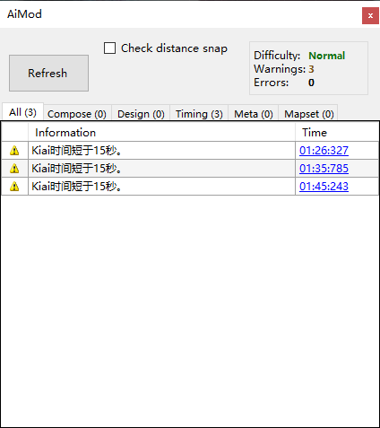

# AiMod

Aimod 是一个内置于 beatmap editor 中的一个工具，你可以在 “File-->Open AiMod” 或者按下 “Ctrl+Shift+A” 打开它。当你做完一张 beatmap 正在找或者打算找 modder 来看你的 beatmap 的时候，你就可以打开这个工具来看看。AiMod 可以检测出一些新人比较容易出现的问题，也可以对较简单难度的图进行一个检测。不过 AiMod 始终都带有一个 Ai，就肯定有一些检测不出来的问题，所以，除了需要使用 AiMod 进行 beatmap 检测之外，还需要一些 modder 来检测你的 beatmap。

## 常见错误解释

在 Aimod 检测完你的 beatmap 之后，会显示结果给你。如果显示 “No problems were found in this map!” 的话，那恭喜你，你的 beatmap 已经通过了 AiMod 的检测，不过在这个时候，你依然需要找 modder 来检测你的 beatmap，他们能够发现很多 AiMod 检测不出来的问题。

#### Conpose（Beatmap 制作）

这些问题一般都是物件放置的问题。

### This object is too far/close from the previous one

翻译：**这个物件距离上一个物件太远/太近**

级别：警告

原因：相邻的物件的间距跟其他物件的间距差异比较大

解决：如果是 Easy/Normal 难度的话，可以参考其他物件来进行调整，或者使用“Distance Snap”来锁定间距作图

### Spinners must have new combo

翻译：**spinner 必须是 new combo**

级别：警告

原因：一般 spinner 都会自动设置 new combo 的，除非将将 new combo 取消掉了

解决：补上 new combo 即可。

### These two objects are less than 10ms apart

翻译：**这两个物件出现的时间间隔小于10毫秒**

级别：错误

原因：一般是物件在时间轴上有重叠

解决：检查时间轴，分离时间轴上重叠的物件

### Object/Object's end isn't snapped

翻译：**物件/物件的末端没有对齐时间轴**

原因：一般是修改了歌曲的 timing 才会出现，修改了之后就不会对齐了

解决：

- Timing-->Resnap All Notes，可以重新对齐大部分物件
- Timing-->Move all notes in time，如果只改变了 offset（偏移量），可以修改这个
- 自行在时间轴上拖放物件

### There are no hitsounds on any objects. Hitsounds are required for rankable beatmaps

翻译：**物件无击打音效，对于ranked图而言是必须有的**

级别：错误

解决：为谱面添加whistle、clap、finish等击打音效

#### Design（背景设计）

这些问题一般都是一些界面的问题，比如背景、故事板等等

### Your beatmap has no background image

翻译：**你的 beatmap 没有背景图片**

级别：错误

解决：找一张背景图片放进去然后调用就是了。

Design-->Background Image/Video-->选择你的图片

#### Timing（时间校对）

这些问题，出现的话，需要看一下时间轴，有没有什么不正确的地方。

### This beatmap is over 6 minutes long. Consider shortening it if it's not a marathon-style map

翻译：**这个 beatmap 的时间长度超过了6分钟。除非你在制作游戏时间较长的 beatmap，请尝试缩短游戏时间**

级别：警告

### Kiai time is toggled on less than 15 second

翻译：**kiai（一般是歌曲的高潮）的切换时间少于15秒**

级别：警告

#### Meta（元信息）

### Drain time should be over 30 seconds.

翻译：**掉血时间应该超过30秒**

级别：错误

解决: **地图从头到尾的时间应该超过30秒**

#### Mapset（难度设置）

一般来说，一个**完整的** beatmap 并不会只有一个难度，而这些难度里面的内容，也要协调一下。

### xxx conflict with xxx diff

翻译：**来源/继承时间轴（所谓的绿线）/等等跟xxx难度不一致**

xxx confict...的xxx可能代表的信息：Source（来源）、Tags、Title（标题）、Romanised Artist（拉丁字母拼写的艺术家，比如汉语拼音、日语罗马音）、等等

级别：警告

解决：仔细检查每个难度的 metadata，确保其一致。

### This mapset needs at least xxx diff(s)

翻译：**这张 beatmap 需要有至少xxx难度**

..at least xxx diff(s)的xxx可能代表的信息：1 easy/normal（需要1个 easy 或者 normal 的难度）、2 standard（需要2个难度）

级别：警告

## 缺陷
- **AiMod 无法检测许多在[Ranking Criteria](/wiki/Ranking_Criteria)中被视为违反规则的问题。** 例如未对齐节拍的物件、击打音效延迟、谱面背景图片大小超过2.5MB等。
- **AiMod 可能会警告您一些不是问题的问题。** 例如[马拉松图](/wiki/Beatmap/Marathon)应当有两个难度，[Kiai](/wiki/Kiai_Time)时长少于 15 秒。
- **如果启用了 `Check distance snap` 功能，AiMod 将不会检查 Combo 间的距离。**
- **如果beatmap文件夹里面有多个MP3文件，AiMod可能会警告您您有多个歌曲文件**，虽然这些mp3可能会用作在Hitsound 比如"掌声"。 **请注意：过短或过小的mp3文件不会被视作“歌曲文件”，如果确实超出了这个限制，请考虑是否进行文件压缩/裁剪等。** <!-- 此处意思未知 -->
- **放置物件时不要打开AiMod,尤其是Spinner** <!-- 此处证据可以自己在Edit模式下选择Spinner的时候打开AiMod -->

另外 建议使用其他程序，比如 ![][flag_SE] [Naxess](https://osu.ppy.sh/users/8129817) 的 [Mapset Verifier](https://github.com/Naxesss/MapsetVerifier/releases)。除了AiMod，如果你想让你的beatmap 被[ranked](/wiki/Beatmap/Category#ranked)。其他程序可以比AiMod更了解最新的[Ranking criteria](/wiki/Ranking_Criteria)，并且能检测到的问题比AiMod多。但是，请不要完全忽略了AiMod，因为[Ranking criteria](/wiki/Ranking_Criteria)中的某些规则需要依赖于它(如 Drain time should be over 30 seconds)

[flag_SE]: /wiki/shared/flag/SE.gif "Sweden"
