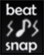

# Beat Snap

Le **Beat Snap** est une fonctionnalité intégrée à l'éditeur qui permet de s'assurer que tous les [objets](/wiki/Hit_object) sont snappés/quantisés proportionnellement au rythme de la chanson. Son fonctionnement est basé sur les principes communs de la [quantification musicale](https://en.wikipedia.org/wiki/Quantization_(music)).
