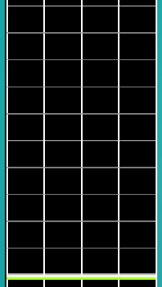
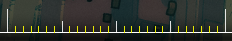
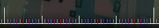

# Beat Snap Divisor

Le **Beat Snap Divisor** est un paramètre de l'éditeur qui détermine le comportement de l'éditeur dans la quantification des [objets](/wiki/Hit_object) en fonction des principes du [beat snap](/wiki/Beatmap_Editor/Beat_Snap). Il se trouve dans la partie supérieure droite de l'écran de l'éditeur, où il correspond à la granularité des objets sur la [timeline](/wiki/Beatmap_Editor/Timelines) ; c'est-à-dire qu'un réglage plus dense du Beat Snap Divisor permet de placer plus de notes dans la même mesure de temps et vice versa. 

L'éditeur de beatmap prend en charge onze réglages différents du Beat Snap Divisor, comme suit :

## Diviseur 1/1

Le diviseur 1/1 permet de placer des objets sur chaque *temps plein*. Il est représenté par des ticks de couleur blanche sur la timeline de l'éditeur.

En raison de sa simplicité et de sa facilité d'utilisation, ce diviseur est le plus souvent utilisé pour les difficultés Easy.

## Diviseur 1/2

Le diviseur 1/2 permet de placer les objets sur des *demi battements* et leurs multiples (par exemple 1/2). Il est représenté par des ticks de couleur rouge sur la timeline de l'éditeur.

## Diviseur 1/3

Le diviseur 1/3 permet de placer les objets sur des *triplets*, c'est-à-dire la troisième fraction d'un temps, et leurs multiples (par exemple 1/3 et 2/3). Il est représenté par des ticks de couleur violette sur la timeline de l'éditeur.

Bien que cela soit relativement rare, il existe certaines chansons et certains genres musicaux (par exemple le swing jazz) qui utilisent principalement ce diviseur tout au long du morceau.

## Diviseur 1/4

Le diviseur 1/4 permet de placer les objets sur des *quarts de temps*, c'est-à-dire la quatrième fraction d'un temps, et leurs multiples (par exemple 1/4 et 3/4). Il est représenté par des ticks de couleur bleue sur la timeline de l'éditeur.

En raison de sa polyvalence, ce diviseur est extrêmement populaire parmi les mappeurs et est fréquemment utilisé dans toutes sortes de beatmaps. C'est également le paramètre par défaut qui est désigné par l'éditeur lors de l'importation d'un nouveau fichier audio.

## Diviseur 1/5

Le diviseur 1/5 permet de placer des objets sur la cinquième fraction d'un temps et ses multiples (par exemple 1/5, 2/5, 3/5 et 4/5). Il est représenté par des ticks de couleur jaune sur la timeline de l'éditeur.

Ce diviseur est extrêmement rare et doit être utilisé avec précaution. Si vous vous retrouvez à utiliser le diviseur 1/5 de façon inattendue, il est recommandé de demander conseil à des mappeurs expérimentés.

## Diviseur 1/6

Le diviseur 1/6 permet de placer des objets sur des *doubles triplets*, soit la sixième fraction d'un temps, et leurs multiples (par exemple 1/6 et 5/6). Il est représenté par des ticks de couleur violette sur la timeline de l'éditeur.

Bien que cela soit relativement rare, il existe certaines chansons et certains genres musicaux (par exemple le swing jazz) qui utilisent principalement ce diviseur tout au long du morceau.

## Diviseur 1/7

Le diviseur 1/7 permet de placer les objets sur la septième fraction d'un temps et ses multiples (par exemple 1/7, 2/7, 3/7, etc.). Il est représenté par des ticks de couleur jaune sur la timeline de l'éditeur.

Ce diviseur est extrêmement rare et doit être utilisé avec précaution. Si vous vous retrouvez à utiliser le diviseur 1/7 de façon inattendue, il est recommandé de demander conseil à des mappeurs expérimentés.

## Diviseur 1/8

Le diviseur 1/8 permet de placer des objets sur la huitième fraction d'un temps et ses multiples (par exemple 1/8, 3/8, 5/8 et 7/8). Il est représenté par des ticks de couleur jaune sur la timeline de l'éditeur.

## Diviseur 1/9

Le diviseur 1/9 permet de placer les objets sur la neuvième fraction d'un temps et ses multiples (par exemple 1/9, 2/9, 3/9, etc.). Il est représenté par des ticks de couleur jaune sur la timeline de l'éditeur.

Ce diviseur est extrêmement rare et doit être utilisé avec précaution. Si vous vous retrouvez à utiliser le diviseur 1/9 de façon inattendue, il est recommandé de demander conseil à des mappeurs expérimentés.

## Diviseur 1/12

Le diviseur 1/12 permet de placer les objets sur la douzième fraction d'un temps et ses multiples (par exemple 1/12, 5/12, 7/12, etc.). Il est représenté par des ticks de couleur grise sur la timeline de l'éditeur.

Ce diviseur est extrêmement rare et doit être utilisé avec précaution. Si vous vous retrouvez à utiliser le diviseur 1/12 de façon inattendue, il est recommandé de demander conseil à des mappeurs expérimentés.

## Diviseur 1/16

Le diviseur 1/16 permet de placer les objets sur la seizième fraction d'un temps et ses multiples (par exemple 1/16, 3/16, 5/16, etc.). Il est représenté par des ticks de couleur grise sur la timeline de l'éditeur.

Ce diviseur est extrêmement rare et doit être utilisé avec précaution. Si vous vous retrouvez à utiliser le diviseur 1/16 de façon inattendue, il est recommandé de demander conseil à des mappeurs expérimentés.
