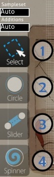
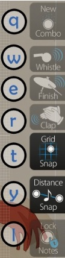

Compose
==========

")

**Compose** is the place where a [mapper](/wiki/Glossary) spent most of the time mapping out his/her design with respect to timeline after setting the BPM and Timing Sections. This is also the place where players can practice a ranked difficulty and inspect its design akin to DDR's Training mode.

Due to different needs in mapping style (osu! is very flexible, allowing much room for creativity while osu!mania is restrained to selected K, demanding extreme precision to evoke the keysounds harmonically), osu!'s editor and osu!mania-only's editor are given their own Features section. You can easily access osu!mania editor by setting your difficulty to osu!mania-only.

Features (osu!)
-----------------

For a newbie guide: [Beatmapping](/wiki/Beatmapping).

(Starting from top-down left-right order)

### Top-Left (Hit Objects Timeline)

**Shows the timeline for hitobjects with respect to Beat Snap Divisor and timestamp.**

<table>
<thead>
<tr class="header">
<th>
Hit Object Timeline
</th>
</tr>
</thead>
<tbody>
<tr class="odd">
<td>
&quot;+&quot;/&quot;-&quot; buttons
</td>
</tr>
<tr class="even">
<td>
Double white vertical lines
</td>
</tr>
<tr class="odd">
<td>
Click on hitobject
</td>
</tr>
</tbody>
</table>

### Top-Right (Beat Snap Divisor)

**In layman term, adjusting given length of a coloured sewing thread (timing section) for an embroidery design space (measures, divided by the divisor to be called beats) on the cloth (song).**

Hold **Alt** to trigger Distance Snap. The value can range from x0.1 - x2.0.

| A Measure                        | Divisor | Beat              | Ticks notes                                        | Notes                                                      |
|----------------------------------|---------|-------------------|----------------------------------------------------|------------------------------------------------------------|
|  | 1/1     | Full Beats        | White ticks only                                   | Best used for Easy difficulty.                             |
|    | 1/2     | Half Beats        | Adds red ticks                                     | Best used for Easy/Normal difficulties.                    |
|    | 1/3     | Triplets\*        | Has two purple ticks between each white tick       | Compound timing - songs which use this are rare.           |
|    | 1/4     | Quarter Beats     | Adds blue ticks, in addition to the red ticks      | Preference for general mapping, no matter what difficulty. |
|    | 1/6     | Double Triplets\* | Has two purple ticks between each red tick         | Compound timing - same as 1/3.                             |
|    | 1/8     | Eighth Beats      | Adds yellow ticks, in addition to the red and blue | Not recommended unless you are very experienced.           |

**Insert Break Time** button will start/stop "Break Time" in current timestamp and **x/y** is current mouse coordinate.

### Centre-Left (Selector)

**Your construction toolkit, made for DIY.**

**Please note that in Standard/osu! 's default notes hitsound works different with osu!mania**

- adding clap on a notes will play 'hitclap' **+ hitnormal** sound on hit while in osu!mania : will only play 'hitclap' sound on hit

<table>
<thead>
<tr class="header">
<th>
Selector
</th>
</tr>
</thead>
<tbody>
<tr class="odd">
<td>
Buttons/ Header 
(Keyboard Shortcut)
</td>
</tr>
<tr class="even">
<td>
Sampleset
</td>
</tr>
<tr class="odd">
<td>
Additions
</td>
</tr>
<tr class="even">
<td>
Select 
(1)
</td>
</tr>
<tr class="odd">
<td>
Circle 
(2)
</td>
</tr>
<tr class="even">
<td>
Slider 
(3)
</td>
</tr>
<tr class="odd">
<td>
Spinner 
(4)
</td>
</tr>
</tbody>
</table>

### Centre (Playfield)

**Visual representation of mapping based on current timestamp.** Map your design here and your design will appear exactly like you mapped during play. This is WYSIWYG mapping. For text-based (usually for fine-tuning) mapping, you can open the .osu file directly using Notepad.

### Centre-Right (Hit Sounds & Assist Tools)

**List of available subtools complement to the original DIY toolkit.**

<table>
<thead>
<tr class="header">
<th>
Button 
(Keyboard Shortcut)
</th>
<th>
Usage
</th>
<th>
Description
</th>
</tr>
</thead>
<tbody>
<tr class="odd">
<td>
New Combo 
(q)
</td>
<td>
<strong>Right-click:</strong> Change current note to next combo colour.
</td>
<td>
Note combo. This is equivalent to a verse / measure in song / instrument script. An acceptable range is about 5-20.
</td>
</tr>
<tr class="even">
<td>
Hit Sounds
</td>
</tr>
<tr class="odd">
<td>
Whistle 
(w)
</td>
<td>
(&quot;Select&quot; on a Hit note) <strong>Left-Click:</strong> Use whistle sound on this note
</td>
<td>
Add a whistle sound addition to the selection.
</td>
</tr>
<tr class="even">
<td>
Finish 
(e)
</td>
<td>
(&quot;Select&quot; on a Hit note) <strong>Left-Click:</strong> Use finish sound on this note
</td>
<td>
Add a finish (cymbal) sound addition to the selection.
</td>
</tr>
<tr class="odd">
<td>
Clap 
(r)
</td>
<td>
(&quot;Select&quot; on a Hit note) <strong>Left-Click:</strong> Use clap sound on this note
</td>
<td>
Add a clap sound addition to the selection.
</td>
</tr>
<tr class="even">
<td>
Assist Tools
</td>
</tr>
<tr class="odd">
<td>
Grid Snap 
(t)
</td>
<td>
<strong>Shift (Hold):</strong> Temporary toggle. 
<strong>Ctrl (Hold):</strong> Temporary disable angle snapping.
</td>
<td>
Hit notes will be snapped to the grid by default.
</td>
</tr>
<tr class="even">
<td>
Distance Snap 
(y)
</td>
<td>
<strong>Alt (Hold):</strong> Temporary toggle. Switch Beat Snap Divisor to Distance Snap 
<strong>Alt + Mousewheel:</strong> Adjust Distance Snap multiplier.
</td>
<td>
Distance between consecutive hit notes will be snapped based on their rhythmical difference. Best use while the timeline is paused.
</td>
</tr>
<tr class="odd">
<td>
Lock Notes 
(l)
</td>
<td>
(&quot;Select&quot; on a Hit note) <strong>Left-Click:</strong> Lock this note
</td>
<td>
Lock selected note to current position and timestamp.
</td>
</tr>
</tbody>
</table>

### Bottom (Song's Timeline)

At **bottom-left**, it shows **timestamp in milliseconds (ms)** and **song duration %**. The "%" may be switched to "intro/outro" when there is intro/outro storyboarding.

At **bottom-centre**, it shows the **timeline with markings and the compulsory music player buttons.** For "Test" button, your beatmap will be saved to test the beatmap starting on current timestamp.

| Colour markers      |
|---------------------|
| Colour              |
| Bright White Long   |
| Yellow Long         |
| Yellow up           |
| Green up            |
| Red up              |
| Blue Down           |
| Colour Highlights   |
| Grey                |
| Orange              |
| Bookmarking command |
| Ctrl + B            |
| Ctrl + Shift + B    |
| Ctrl + Right Arrow  |
| Ctrl + Left Arrow   |

At **bottom-right**, you can adjust the **Playback Rate** by **per quarter value.**

Features (osu!mania)
-----------------------

(The top-left hitobjects timeline holds no significance. Please ignore it.) For a simple guide: [Basics](https://osu.ppy.sh/forum/t/118868) [Mapping & Keysound](https://osu.ppy.sh/forum/t/139139)

### Top-Right (Beat Snap Divisor)

")

***Main Article: [Beat Snap Divisor](/wiki/Beatmap_Editor/Beat_Snap_Divisor)***

**In layman term, adjusting given length of a coloured sewing thread (timing section) for an embroidery design space (measures, divided by the divisor to be called beats) on the cloth (song).** Since osu!mania highly prioritise every timing of the notes, **Time signature** (MM:B) from the Timing section is added (15:3 = 15th measure 3rd beat) beside the adjustment bar for easier mapper's reference. It can go to negative value (-8:-3 for example) if the first timing section is a *few seconds away* from the start of the beatmap's song file.

**Insert Break Time** button will put/stop "Break Time" in current timestamp. Beside the button is the **short sound file name storyboarded to the selected(blue) note**, known as **keysound** (refer to "Sampling" section at the end of this page).

### Centre-Left (Selector)

**Your construction toolkit osu!mania ver., made for DIY.**

**Please note that in osu!mania's default notes hitsound works different with Standard/osu!**

- adding clap on a notes will only play 'hitclap' sound instead of 'hitclap' *' + hitnormal*' sound on hit while in osu!mania :

")

<table>
<thead>
<tr class="header">
<th>
Selector
</th>
</tr>
</thead>
<tbody>
<tr class="odd">
<td>
Buttons/Header 
(Keyboard Shortcut)
</td>
</tr>
<tr class="even">
<td>
Sampleset
</td>
</tr>
<tr class="odd">
<td>
Additions
</td>
</tr>
<tr class="even">
<td>
Select 
(1)
</td>
</tr>
<tr class="odd">
<td>
Circle 
(2)
</td>
</tr>
<tr class="even">
<td>
Hold 
(3)
</td>
</tr>
</tbody>
</table>

### Centre (Playfield)

**Visual representation of mapping based on current timestamp.**

| Playfield Boxes          |
|--------------------------|
| Name                     |
| Left Box                 |
| Centre                   |
| Colour notes             |
| Double white line        |
| White line               |
| Green line               |
| Blue colour              |
| White/Pink/Yellow colour |

| Half-measure |                    |                     |
|--------------|----------------------------------------------|-----------------------------------------------|
| Divisor      | 1/1                                          | 1/2                                           |
| Beat         | Full Beats                                   | Half Beats                                    |
| Ticks notes  | White ticks only                             | Adds red ticks                                |
| Notes        | Best used for Easy difficulty.               |                                               |
| Half-measure |                    |                     |
| Divisor      | 1/3                                          | 1/4                                           |
| Beat         | Triplets                                     | Quarter Beats                                 |
| Ticks notes  | Has two purple ticks between each white tick | Adds blue ticks, in addition to the red ticks |
| Notes        | Compound Timing                              | Useful for general mapping                    |

### Centre-Right (Hit Sounds & Assist Tools)

**List of available subtools complement to the toolkit.**

<table>
<thead>
<tr class="header">
<th>
Button 
(Keyboard Shortcut)
</th>
<th>
Usage
</th>
<th>
Description
</th>
</tr>
</thead>
<tbody>
<tr class="odd">
<td>
New Combo 
(q)
</td>
<td>
<strong>Right-click:</strong> Change current note to next combo colour.
</td>
<td>
Note combo. This is equivalent to a verse in song script. An acceptable range is about 5-20.
</td>
</tr>
<tr class="even">
<td>
Hit Sounds
</td>
</tr>
<tr class="odd">
<td>
Whistle 
(w)
</td>
<td>
(&quot;Select&quot; on a Hit note) <strong>Left-Click:</strong> Use whistle sound on this note
</td>
<td>
Add a whistle sound addition to the selection.
</td>
</tr>
<tr class="even">
<td>
Finish 
(e)
</td>
<td>
(&quot;Select&quot; on a Hit note) <strong>Left-Click:</strong> Use finish sound on this note
</td>
<td>
Add a finish (cymbal) sound addition to the selection.
</td>
</tr>
<tr class="odd">
<td>
Clap 
(r)
</td>
<td>
(&quot;Select&quot; on a Hit note) <strong>Left-Click:</strong> Use clap sound on this note
</td>
<td>
Add a clap sound addition to the selection.
</td>
</tr>
<tr class="even">
<td>
Assist Tools
</td>
</tr>
<tr class="odd">
<td>
Grid Snap 
(t)
</td>
<td>
<strong>Shift (Hold):</strong> Temporary toggle. 
<strong>Ctrl (Hold):</strong> Temporary disable angle snapping.
</td>
<td>
Hit notes will be snapped to the grid by default.
</td>
</tr>
<tr class="even">
<td>
Distance Snap 
(y)
</td>
<td>
<strong>Alt (Hold):</strong> Temporary toggle. Switch Beat Snap Divisor to Distance Snap 
<strong>Alt + Mousewheel:</strong> Adjust Distance Snap multiplier.
</td>
<td>
Distance between consecutive hit notes will be snapped based on their rhythmical difference. Best use while the timeline is paused.
</td>
</tr>
<tr class="odd">
<td>
Lock Notes 
(l)
</td>
<td>
(&quot;Select&quot; on a Hit note) <strong>Left-Click:</strong> Lock this note
</td>
<td>
Lock selected note to current position and timestamp.
</td>
</tr>
</tbody>
</table>

For **keysound** (adding SE on hitnotes), select the note and **ALT + Left Click** on the selected note (a pop-up window will be shown with sound samples inside your beatmap folder). Refer to "Sampling" section at end of page.

### Bottom (Song Timeline)

At **bottom-left**, it shows **timestamp in milliseconds (ms)** and **song duration %**.

At **bottom-centre**, it shows the **timeline with markings and the compulsory music player buttons.** For "Test" button, your beatmap will be saved to test the beatmap starting on current timestamp.

| Bookmarking command |
|:-------------------:|
|       Ctrl + B      |
|   Ctrl + Shift + B  |
|  Ctrl + Right Arrow |
|  Ctrl + Left Arrow  |

At **bottom-right**, you can adjust the **Playback Rate** by **per quarter value.**

### Sampling

")

**Sampling** is a process of **adding sound to the note.** To begin, select the note and **ALT + Left Click** on the selected note (a pop-up window will be shown with sound samples inside your beatmap folder).

#### Sample import

**Left-section** is the **list of sound files you have in the beatmap's folder.**

**Right-section** is **settings for the selected sound file.**

| colspan=2| Basics  |
|--------------------|
| Name               |
| CustomSet          |
| Volume             |
| Use basic sample   |
| colspan=2| Buttons |
| Play               |
| Import             |
| Delete             |
| Apply              |
| Sample             |
| Sample list        |
| Reset              |
| Cancel             |

#### Sample event list

**Actual storyboarding**. Click on "Sample list" will summon another window (shown in right-side of the picture) named "Sample event list", which would be this. The two buttons should be self-explanatory (Delete = Delete the selected event. Close = Close the window). '''These storyboarded elements will go to the .osu file (the selected difficulty) '''

The coding is `MM:SS:XXX` `{Sound_file}@{Volume}` where MM:SS:XXX is Minutes:Seconds:Milliseconds respectively.

**Example:** 1:57:745 kick.wav@100% means at 1 min 57 second 745th millisecond, trigger the "kick.wav" file at 100% volume regardless of condition.

[If this doesn't tickle your fancy, you can always go for the hardcore SBS way.](/wiki/Storyboard_Scripting/Miscellaneous)
