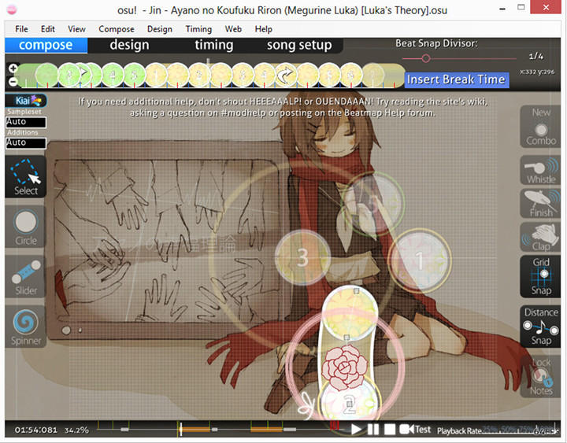

# Componer

")

**Componer** es el lugar donde un [mapper](/wiki/Glossary) pasa la mayor parte del tiempo mapeando su diseño con respecto a la línea de tiempo después de configurar las Secciones de BPM y Sincronización. Este es también el lugar donde los jugadores pueden practicar una dificultad clasificada e inspeccionar su diseño similar al modo de entrenamiento de DDR.

Debido a las diferentes necesidades en el estilo de mapeo (osu! Es muy flexible, permitiendo mucho espacio para la creatividad mientras osu!mania está restringido a la clave seleccionada, exigiendo una precisión extrema para evocar los sonidos clave armónicamente), al editor de osu! y al editor osu!mania-only se les da su propia sección de características. Puedes acceder fácilmente al editor de osu!mania estableciendo su dificultad en osu!mania-only.

## Caracteristicas (osu!)

Para una guía de novatos: [Beatmapping](/wiki/Beatmapping).

Comenzando desde izquierda a derecha y de arriba hacia abajo)

### Esquina superior izquierda (Linea de Tiempo de los Objetos golpeables)

<!-- TODO find the article that links to this and possibly redirect to here instead (why is this shared?) -->

**Muestra la línea de tiempo para los objetos golpeables con respecto al Divisor de ritmo y la marca de tiempo.**

#### Linea de Tiempo de los Objetos golpeables

| Nomnre | Descripción |
| :-- | :-- |
| Botones `+`/`-` | Aumenta / disminuye el zoom de la línea de tiempo. |
| Líneas blancas verticales dobles | Marca de tiempo actual con respecto a la línea de tiempo de los objetos de golpeo. |
| Cliquear los objetos de golpeo | **Clic izquierdo:** Selecciona / Mueve los objetos golpeables contra la línea de tiempo. **Clic derecho:** Eliminar objeto golpeable. |

### Esquina superior derecha (Divisor de ritmo)

**En términos sencillos, ajusta la longitud dada de un hilo de coser de color (sección de temporización) para un espacio de diseño de bordado (medidas, divididas por el divisor para llamarlas beats) en la tela (canción).**

Mant `Alt` para activar el Divisor de ritmo. El valor puede variar de x0.1 a x2.0.

### Divisor 1/1

- Beats enteros
- Solo marcas blancas
- Mejor utilizado para la dificultad fácil

### Divisor 1/2

- Medios Beats
- Agrega marcas rojas

### Divisor 1/3

- Tresillo*
- Tiene dos marcas de color púrpura entre cada marca blanca
- Tiempo compuesto

### Divisor 1/4

- Cuatro beats
- Agrega marcas azules, además de las marcas rojas
- Útil para el mapeo general

### Divisor 1/6

- Tresillo doble*
- Tiene dos marcas de color púrpura entre cada marca roja
- Tiempo compuesto

### Divisor 1/8

- Ocho beats
- Agrega marcas amarillas, además de las rojas y azules

El botón de **Insertar descanso** iniciará / detendrá el "descanso" en la marca de tiempo actual y **x / y** es la coordenada actual del mouse.

### Centro izquierda (Selector)

**Su kit de herramientas de construcción, hecho para DIY ("Do it yourself": hágalo usted mismo).**

**Ten en cuenta que en las notas predeterminadas de osu!standard, los sonidos de golpe funcionan de manera diferente que en osu!mania.**

- Al poner aplausos en una nota, se reproducirá el sonido `hitclap` + `hitnormal` al golpear mientras está en osu!mania: solo se reproducirá el sonido de `hitclap` al golpear

#### Selector

| Botones / Titulo (Atajo de Teclado) | Uso | Descripción |
| :-- | :-- | :-- |
| Sampleset | Auto, Normal, Soft, Drum | Esto ignora la configuración del Sampleset de la sección de tiempo, y agrega la configuración seleccionada... Ej. Punto de sincronización con **suave 77%**, Mientras este conjunto de samples se establece en **Drum** y tiene **Clap** en las notas, se reproducirá por defecto drum-hitnormal 77% + drum-hitclap 77% en el golpe |
| Adiciones | Auto, Normal, Soft, Drum | Las adiciones de sonidos de golpe significan agregar Clap, Finish y Whistle con el conjunto SELECCIONADO... Ej. Sampleset **Normal**, Punto de tiempo **Soft 77%**, mientras que Adiciones está configurado en **Drum** y tiene **Clap** en las notas, resultará de normal-hitnormal 77% + drum-hitclap 77% en el golpe |
| Seleccionar (`1`) | **Clic izquierdo/arrastre:** Selecciona/Ajusta la ubicación de las notas/puntos de controles deslizantes. **Clic derecho:** Elimina las notas/controles deslizantes. **`Ctrl` + Click:** Selección múltiple. | Selecciona y modifica las notas existentes. |
| Circulo (`2`) | **Clic izquierdo/derecho:** Agrega/Elimina el Círculo de Golpeo. | Círculo de Golpeo. |
| Deslizador (`3`) | **Clic izquierdo/derecho:** Empieza/Termina un control deslizante. Agrega/Elimina puntos de controles deslizantes (cuadrado blanco). **Clic izquierdo x2:** Nueva sección de curva(cuadrado rojo). | Control deslizante. |
| Ruleta (`4`) | **Clic izquierdo/derecho:** Inicia/Termina la ruleta en la marca de tiempo actual. | Ruleta. Asegúrate de que Auto pueda al menos obtener 2.000 Bonus por Ruleta (para evitar la infame ruleta spam/ruleta ninja ). |

### Centro (Area de juego)

**Representación visual del mapeo basado en la marca de tiempo actual.** Asigna aquí tu diseño y ese diseño aparecerá exactamente como lo mapeaste durante el juego. Este es el mapeo WYSIWYG ("What you see is what you get": lo que ves es lo que obtienes). Para el mapeo basado en texto (generalmente para ajustes), puedes abrir el archivo `.osu` directamente usando el Bloc de notas.

### Centro derecha (Sonidos de golpeo y herramientas de ayuda)

**Lista de herramientas complementarias al kit de herramientas original de DIY disponibles.**

| Boton (Atajo de teclado) | Uso | Descripción |
| :-- | :-- | :-- |
| Nuevo combo (`Q`) | **Clic derecho:** Cambiar la nota actual al siguiente color combinado. | Nota combo. Esto es equivalente a un verso / medida en el guión de canción / instrumento. Un rango aceptable es de aproximadamente 5-20. |

#### Sonidos de Golpe

| Boton (Atajo de teclado) | Uso | Descripción |
| :-- | :-- | :-- |
| Whistle (`W`) | ("Seleccionar" en una nota de golpeo) **Clic izquierdo:** Usar sonido de silbido en esta nota | Agrega una adición de sonido de silbido a la selección. |
| Finish (`E`) | ("Seleccionar" en una nota de golpeo) **Clic izquierdo:** Usar sonido de finalización en esta nota | Agrega un sonido final (platillos) a la selección. |
| Clap (`R`) | ("Seleccionar" en una nota de golpeo) **Clic izquierdo:** Usa un sonido de aplauso en esta nota | Agrega una adición de sonido de aplauso a la selección. |

#### Herramientas de ayuda

| Boton (Atajo de teclado) | Uso | Descripción |
| :-- | :-- | :-- |
| Ajuste de cuadricula (`T`) | **`Shift` (Mantener):** Alterna temporalmente. **`Ctrl` (mantener):** Desactiva temporalmente el ajuste de ángulo. | Las notas de golpeo se ajustarán a la cuadrícula de forma predeterminada. |
| Ajuste de distancia (`Y`) | **`Alt` (Mantener):** Alterna temporalmente. Cambia el divisor de ritmo por el ajuste de distancia **`Alt` + Rueda del mouse:** Ajuste el multiplicador de ajuste de distancia. | La distancia entre notas de golpeo consecutivas se ajustará en función de su diferencia rítmica. Se usa mejor cuando la línea de tiempo está en pausa. |
| Bloquear notas (`L`) | ("Seleccionar" en una nota de golpeo) **Clic izquierdo:** Bloquea esta nota | Bloquea la nota seleccionada en la posición y marca de tiempo actual. |

### Parte inferior (Linea de tiempo de la Canción)

**Abajo a la izquierda**, está la **marca de tiempo** en milisegundos (ms) y **la duración de la canción** en porcentaje. El porcentaje puede cambiarse a "introducción" o "outro" si hay un guion gráfico antes o después de la música.

En la zona **central inferior**, hay una **línea de tiempo** con marcas y los botones del reproductor de música. El botón `Test` a la derecha de la línea de tiempo guardará tú Beatmap y luego podrás probarlo, comenzando en la marca de tiempo actual.

#### Marcadores de color

| Color | Descripción |
| :-- | :-- |
| Blanco brillante largo | Sección de prueba actual |
| Amarillo largo | Punto de vista previa |
| Amarillo arriba | Inicio del tiempo de drenaje |
| Verde arriba | Puntos heredados. (Ver [Configuración de sincronización](/wiki/Beatmap_Editor/Timing)) |
| Rojo arriba | Marcas de tiempo. (Ver configuración de tiempo) |
| Azul abajo | Marcador |

#### Aspectos destacados del color

| Color | Descripción |
| :-- | :-- |
| Gris | Descanso |
| Naranjo | Momento Kiai |

#### Comandos de marcadores

| Atajo | Descripción |
| :-- | :-- |
| `Ctrl` + `B` | Agrega un marcador en la ubicación actual. |
| `Ctrl` + `Shift` + `B` | Elimina el marcador en la ubicación actual. |
| `Ctrl` + `Right Flecha` | Siguiente marcador. |
| `Ctrl` + `Left Flecha` | Marcador anterior. |

**Abajo a la derecha** se puede ajustar la **Tasa de reproducción** en **valores por cuartos**

## Características (osu!mania)

(La línea de tiempo superior de objetos golpeables no tiene importancia. Por favor ignórala.) Para una guía simple: [Basicos](https://osu.ppy.sh/community/forums/topics/118868) [Mapping & Sonido de notas](https://osu.ppy.sh/community/forums/topics/139139)

### Esquina superior derecha (Divisor de ritmo)

")

*Articulo principal: [Divisor de ritmo](/wiki/Beatmap_Editor/Beat_Snap_Divisor)*

**En terminos simples, ajustar la longitud dada de un hilo de color (sección de tiempo) para un espacio de diseño de bordado (medidas, dividido por los divisores que se llamaran beats) en la tela (canción).** Ya que osu!mania prioriza mucho cada sincronización de las notas, **Signatura de compás** (MM:B) desde la sección de Tiempo se agrega (15:3 = 15a medida 3ra pulsación) al lado de la barra de ajuste para facilitar la referencia del mapper. Puede ir a un valor negativo (-8:-3 por ejemplo) si la primera sección de tiempo está a *unos segundos de distancia* del inicio del archivo de la canción del Beatmap.

El botón de **Insertar Descanso** pondrá/detendrá el "Descanso" en la marca de tiempo actual. Al lado del botón se encuentra el **nombre breve del archivo de sonido grabado en la nota (azul) seleccionada**, conocido como **sonido de tecla** (consulte la sección "Muestreo" al final de esta página).

### Centro Izquierda (Selector)

**Su kit de herramientas de construcción versión osu!mania, hecho para "hacerlo tu mismo".**

**Ten en cuenta que el sonido predeterminado de las notas de osu!mania funcionan de manera diferente con Standard/osu!**

- Al agregar aplausos en las notas, solo se reproducirá el sonido `hitclap` en lugar de `hitclap` + `hitnormal` al golpear mientras está en osu!mania :

")

#### Selector

| Botones / Titulo (Atajo de teclado) | Uso | Descripción |
| :-- | :-- | :-- |
| Conjunto de muestra | Auto, Normal, So, Drum | Cambia el Sampleset ignorando el actual en la sección de tiempo. Ej: Temporización **Drum 66%**, mientras que este conjunto de samples es **Soft**, reproducirá todo el sonido **Soft** relacionado en las notas como clap, normal, finish, whistle con 66% de volumen. |
| Adiciones | Auto, Normal, Soft, Drum | Básicamente lo mismo de arriba, PERO la configuración de Adiciones sobrescribe la configuración del conjunto de muestras. Ej: Temporización **Drum 55%**, conjunto de muestras **Soft**, mientras que estas Adiciones es **Normal**, reproducirá todo el sonido **Normal** relacionado en las notas como clap, normal, finish, whistle con 55% de volumen. |
| Seleccionar (`1`) | **Clic izquierdo/ arrastrar:** Mueve la marda de tiempo y ubicación de una nota. **Clic derecho:** Elimina la nota. **`Ctrl` + Clic:** Selección múltiple. | Selecciona y modifica las notas existentes. |
| Circulo (`2`) | **Clic Izquierdo/Derecho** Coloca/Elimina la nota. | Agrega una nota en la columna actual en función de la posición del mouse. |
| Mantener (`3`) | **Clic izquierdo (Mantener):** Coloca una nota sostenida y ajusta su duración. **Sotarla:** Establece longitud de retención | Agrega un nota de sostenida en la columna actual según la posición del mouse. |

### Centro (Area de juego)

**Representación visual del mappeo basada en la marca de tiempo actual.**

#### Recuadros del Area de juego

| Nombre | Descripción |
| :-- | :-- |
| Cuadro izquierdo | Intensidad de las notas (línea de tiempo). |
| Centro | Area de juego verdadera ([Divisor de ritmo](/wiki/Beatmap_Editor/Beat_Snap_Divisor)). |

#### Colour notes

| Nombre | Descripción |
| :-- | :-- |
| Doble línea Blanca | Medida |
| Línea Blanca | Tiempo común |
| Línea Verde | Tú / Linea de juicio |
| Color Azul | Nota seleccionada actualmente |
| Color Blanco/Rosa/Amarillo | Color de notas normales |

#### Divisor 1/1

- Beats enteros
- Solo marcas blancas
- Mejor utilizado para la dificultad fácil

#### Divisor 1/2

- Medios Beats
- Agrega marcas rojas

#### Divisor 1/3

- Tresillo*
- Tiene dos marcas de color púrpura entre cada marca blanca
- Tiempo compuesto

#### Divisor 1/4

- Cuatro beats
- Agrega marcas azules, además de las marcas rojas
- Útil para el mapeo general

### Centro derecha (Sonidos de Golpeo y Herramientas de Ayuda)

**La lista de subherramientas disponibles que complementan al kit de herramientas.**

| Boton (Atajo de teclado) | Uso | Descripción |
| :-- | :-- | :-- |
| Nuevo combo (`Q`) | **Clic Derecho:** Cambia la nota actual al siguiente color de combo. | Nota combo. Esta es equivalente a un verso en el guion de la canción. Un rango aceptable es de aproximadamente 5-20. |

#### Sonidos de Golpeo

| Boton (Atajo de teclado) | Uso | Descripción |
| :-- | :-- | :-- |
| Whistle (`W`) | ("Seleccionar" en una Nota de Golpeo) **Clic izquierdo:** Usar sonido de whistle en esta nota | Agrega una adición de sonido de whistle a la selección. |
| Finish (`E`) | ("Seleccionar" en una Nota de Golpeo) **Clic izquierdo:** Usar sonido de finish en esta nota | Agrega una adición de sonido de finish (platillo) a la selección. |
| Clap (`R`) | ("Seleccionar" en una Nota de Golpeo) **Clic izquierdo:** Usar sonido de clap en esta nota | Agrega una adición de sonido de clap a la selección. |

#### Assist Tools

| Boton (Atajo de teclado) | Uso | Descripción |
| :-- | :-- | :-- |
| Ajuste de Cuadricula (`T`) | **`Shift` (Mantener):** Temporalmente activado **`Ctrl` (Mantener):** Temporalmente desactiva el ajuste de ángulo | Las notas de golpeo se ajustarán a la cuadrícula de forma predeterminada. |
| Ajuste de Distancia (`Y`) | **`Alt` (Mantener):** Temporalmente activado. Cambia el Divisor de ritmo por el Ajuste de Distancia **`Alt` + Rueda del ratón:** Ajusta el multiplicador del Ajuste de Distancia. | La distancia entre notas de golpeo consecutivas se ajustará en función de su diferencia rítmica. Mejor uso mientras la línea de tiempo está en pausa. |
| Bloquear Notas (`L`) | ("Select" en una Nota de Golpeo) **Clic izquierdo:** Bloquea esta nota | Bloquea la nota seleccionada en la posición y marca de tiempo actual. |

Para **Sonidos de teclas** (Agregando SE en Notas de Golpeo), selecciona la nota y presiona **`Alt` + Clic Izquierdo** sobre la nota seleccionada (se mostrará una ventana emergente con muestras de sonido dentro de tu carpeta del Beatmap). Consulta la sección "Muestreo" al final de la página.

### Parte Inferior (Linea de Tiempo de la Canción)

**Abajo a la izquierda** se muestra la **marca de tiempo en milisegundos (ms)** y la **duración de la canción%**.
**Abajo en el centro** se muestra la **línea de tiempo con marcas y los botones obligatorios del reproductor de música.** Para el botón "Prueba", su Beatmap se guardará para probarse comenzando en la marca de tiempo actual.

#### Comandos de Marcadores

| Atajo | Descripción |
| :-- | :-- |
| `Ctrl` + `B` | Agrega un marcador en la ubicación actual. |
| `Ctrl` + `Shift` + `B` | Elimina el marcador en la ubicación actual. |
| `Ctrl` + `Right Flecha` | Siguiente marcador |
| `Ctrl` + `Left Flecha` | Marcador anterior. |

**Abajo a la derecha** se puede ajustar la **Tasa de reproducción** en **valores por cuartos**

### Muestreo

")

El **Muestreo** es el proceso de **agregar sonido a la nota.** Para comenzar, selecciona la nota y presiona **`Alt` + Clic Izquierdo** sobre la nota seleccionada (Se mostrará una ventana emergente con muestras de sonido dentro de su carpeta del beatmap).

#### Importación de Muestreo

La **Sección izquierda** es la **lista de archivos de sonido que tienes en la carpeta del beatmap.**

La **Sección Derecha** es **la configuración para el archivo de sonido seleccionado.**

##### Basico

| Nombre | Descripción |
| :-- | :-- |
| Conjunto personalizado | **Ignorando** el Hitsound personalizado seleccionado en este editor, y aplicando el **SET** de hitsound **predeterminado**,  y volumen sin usar el punto de tiempo. (El uso de la muestra básica debe estar habilitada para usar esto y que funcione como está previsto) Por ejemplo: agregó soft-hitwhistle77.wav con un volumen del 90%. Ten en cuenta que también debes agregar el whistle a la nota manualmente. **Además, esta característica no se recomienda debido a que la función APLICAR normal en este editor es más fácil de usar que esta, aunque ambas funcionen básicamente igual.** |
| Volumen | Que tan fuerte quieres que sea este archivo de sonido. Usa solo valores enteros. (8 - 100) |
| Usar muestra básica | **Ignorando** el hitsound personalizado seleccionado en este editor, y aplicando solo el volumen en las notas seleccionadas. Esto significa que, independientemente de las notas, esta función solo cambia el volumen de las notas seleccionadas. Ej: Esto puede usarse para cambiar múltiples volumenes en diferentes notas con diferente muestra de hitsound a la vez o simplemente mejorar el hitsound predeterminado ignorando la configuración de volumen de cualquier punto de tiempo. |

##### Botones

| Nombre | Descripción |
| :-- | :-- |
| Reproducir | Reproduce el archivo de sonido seleccionado |
| Importar | Importa el archivo de sonido personalizado desde una subcarpeta dentro de la carpeta de beatmap |
| Eliminar | **Borra el archivo de sonido personalizado.** Para eliminar el archivo de sonido asociado con la nota, usa el botón "Reiniciar". |
| Aplicar | Aplica este archivo de sonido personalizado seleccionado a esta nota. |
| Muestra | Coloca este archivo de sonido personalizado seleccionado en el guión gráfico con respecto a la marca de tiempo actual. |
| Lista de Muestras | Archivos de sonido con storyboarded. Consulta la "Lista de eventos de la muestra" a continuación. |
| Reiniciar| Eliminar el archivo de sonido asociado con la nota |
| Cancelar | Cierra la ventana. |

#### Lista de eventos de la muestra

**Storyboarding real**. Haz clic en "Lista de muestra" para hacer aparecer otra ventana (que se muestra en el lado derecho de la imagen) llamada "Lista de eventos de la muestra", que sería esta. Los dos botones deben ser autoexplicativos (Eliminar = Elimina el evento seleccionado. Cerrar = Cierra la ventana). **Estos elementos del storyboard pasarán al archivo `.osu` (en la dificultad seleccionada)**

La codificación es `MM:SS:XXX` `{Sound_file}@{Volume}` donde MM:SS:XXX es Minutos:Segundos:Milisegu`ndos respectivamente.

**Ejemplo:** 1:57:745 kick.wav@100% significa 1 min 57 segundos 745avo millisegundo, reproduce el archivo "kick.wav" al 100% del volumen, independientemente de la condición.
