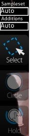
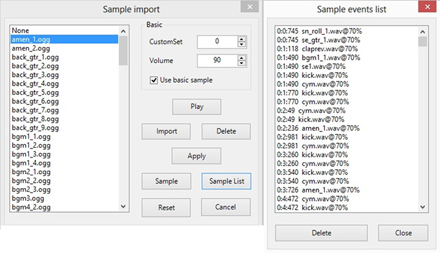

# Compose

**Compose（作曲）** 是一个在[作图者于](/wiki/Glossary) Timing 画面中设定完 BPM 后会花费大部份时间来依照时间轴设计他 / 她的图谱的地方。玩家们也可以在这里练习 Rank 图并且观察其设计，类似 DDR 的训练模式。

由于作图风格上有不同的需求（osu! 非常弹性，拥有许多可供发挥创意的空间；而 osu!mania 则有键数的限制，需要极高的准确度方能用键盘演奏出一段段天籁之音），osu! 的编辑器和 osu!mania 独占编辑器拥有不同的功能配置。你可以将一难度设置为 osu!mania 模式，就可以启用 osu!mania 编辑器。

## 功能（osu! 编辑器）

（以上至下、左至右的顺序编列）新手教学：[Beatmapping](/wiki/Beatmapping)。

### 左上（物件时间轴）

**以 Beat Snap Divsor 和所在时间为基准显示物件的时间轴。**

| Name | Description |
| :-- | :-- |
| `+`/`-` 按钮 | 放大 / 缩小时间轴 |
| 白色垂直双线 | 当下于时间轴上所在的位置 |
| 点击物件 | 左键：在时间轴上选择 / 移动物件。 右键：移除物件。 |

### 右上（Beat Snap Divisor）

*主条目: [Beat Snap Divisor](/wiki/Beatmap_Editor/Beat_Snap_Divisor) / [Distance Snap](/wiki/Beatmap_Editor/Distance_Snap)*

**简单来说，就是在裁缝桌（尺规，以节拍作划分）上为一条布（歌曲）调整色线（划分方式）的长度。**

按着 `Alt` 可以启用 [Distance Snap](/wiki/Beatmap_Editor/Distance_Snap)。这个数值可为 x0.1 至 x2.0。

#### 时值 1/1

- 四分音符
- 只有白色线条
- 在简单难度中经常使用

#### 时值 1/2

- 八分音符
- 在两根白色线条中间多了一根红色线条

#### 时值 1/3

- 十二分音符*
- 在两根白色线条中间多了两根紫色线条
- 复合节奏

#### 时值 1/4

- 十六分音符
- 在两根红色线条中间多了一根蓝色线条
- 普遍用于作图

#### 时值 1/6

- 二十四分音符*
- 在两根红色线条中间多了两根紫色线条
- 复合节奏

#### 时值 1/8

- 三十二分音符
- 在红和蓝色线条中间多了一根黄色线条

**Insert Break Time（插入休息时间** 按钮可以在目前位置上开始 / 中止休息时间；而 x / y 则是目前游标的所在位置。

### 左边（Selector）

**你的工具箱，专为 DIY 设计。**

| 按钮 / 名称 (键盘快捷键) | 用途 | 注解 |
| :-- | :-- | :-- |
| Sampleset（音效组） | 自动 Normal Soft Drum | (?) |
| Additions（额外音效） | 自动 Normal Soft Drum | (?) |
| Select (`1`) | 左键 / 右键： 新增 / 删除物件 / 滑条节点。 `Ctrl`+点击： 多重选取。 | 选取并调整现有物件。 |
| Circle (`2`) | 左键 / 右键： 新增 / 移除打击圈圈。 | 打击圈圈。 |
| Slider (`3`) | 左 / 右键： 开始 / 收尾一个滑条；新增 / 移除滑条节点（白色小方格）。 两下左键： 新增转角（红色小方格）。 | 滑条。 |
| Spinner (`4`) | 左 / 右键： 在目前位置上开始 / 收尾一个大轮盘。 | 大轮盘。请确定自动模式可以在大轮盘上获得至少 2000 分的加分（以防止恶名昭彰的 连环轮盘 / 忍者轮盘）。 |

### 中央（游玩区域）

**显示现在所在时间的谱面样貌。** 在这里设计你的图，游玩时就会长得一模一样。这是所见即所得式作图。如果要以文本方式作图（通常是用来微调），你可以直接用记事本打开 `.osu` 文件。

### 右边（打击音效 & 辅助工具）

**其他可用的辅助工具。**

| 按钮 （键盘快捷键） | 用途 | 描述 |
| :-- | :-- | :-- |
| New Combo (`Q`) | **右键：** 将目前选取的物件或是下一个物件改成另一个颜色。 | 物件的 Combo。这就和歌曲中的副歌、乐谱中的小节线一样重要。可接受的范围为 5 至 20。 |

#### 打击音效

| 按钮 （键盘快捷键） | 用途 | 描述 |
| :-- | :-- | :-- |
| Whistle (`W`) | （先选取一个物件）**左键：** 在此物件上使用吹哨音 | 在所选取物件上添加哨音。 |
| Finish (`E`) | （先选取一个物件）**左键：** 在此物件上使用收尾音 | 在所选取物件上添加收尾（钹）音。 |
| Clap (`R`) | （先选取一个物件）**左键：** 在此物件上使用拍掌音 | 在所选取物件上添加拍手音。 |

#### 辅助工具

| 按钮 （键盘快捷键） | 用途 | 描述 |
| :-- | :-- | :-- |
| Grid Snap（网格校准）(`T`) | **按住 `Shift`：** 暂时启用 **按住 `Ctrl`**：暂时停用 | 物件会自动被校准到网格间。 |
| Distance Snap（间距控制）(`Y`) | **按住 `Alt`：** 暂时启用，同时将 Beat Snap Divisor 改为 Distance Snap 的数值设定 **`Alt` + 滚轮：** 调整 Distance Snap 数值 | 两个连续圈圈的距离会自动依节奏上的差距控制。最好在时间轴暂停时使用。 |
| Lock Notes（锁定物件）(`L`) | （先选取一个物件）**左键：** 锁定此物件 | 将所选取物件锁定在目前位置和时间上。 |

### 下方（歌曲时间轴）

在**左下角**显示的是以**毫秒表示的所在时间**和**歌曲长度百分比**。这个百分比会在歌曲开始之前 / 结束之后还有故事板的情况下变成 "Intro" / "Outro"。

在**下方中央**显示的是**标记和音乐控制按钮**。至于 "Test" 钮，则是在目前所在时间开始进行测试，同时谱面更改会被储存。

#### 颜色标记

| 颜色 | 描述 |
| :-- | :-- |
| 亮白长条 | 目前所在时间 |
| 黄色长条 | 预览桥段。 |
| 黄色上半条 | Drain 时间的开始。 |
| 绿色上半条 | Inherited 的 Timing 设定。(参照 Timing 设定) |
| 红色上半条 | Timing 设定。(参照 Timing 设定) |
| 蓝色下半条 | 书签 |

#### 颜色区块

| 颜色 | 描述 |
| :-- | :-- |
| 灰色 | 休息时间 |
| 橘色 | [Kiai Time](/wiki/Beatmap_Editor/Kiai_Time) |

#### 书签指令

| 颜色 | 描述 |
| :-- | :-- |
| `Ctrl` + `B` | 在所在时间上新增书签。 |
| `Ctrl` + `Shift` + `B` | 在所在时间上移除书签。 |
| `Ctrl` + 右方向键 | 下一个书签。 |
| `Ctrl` + 左方向键 | 上一个书签。 |

在**右下角**，你可以将**播放速度**调整为 25%、50%、75%、100%。

## 功能（osu!mania）

（左上角的物件时间轴没有用处。请忽略。）简易教学：[基础](https://osu.ppy.sh/community/forums/topics/118868)、[作图 & 按键音效](https://osu.ppy.sh/community/forums/topics/139139)

### 右上（Beat Snap Divisor）

*主页面：[Beat Snap Divisor](/wiki/Beatmap_Editor/Beat_Snap_Divisor)*

**简单来说，就是在裁缝桌（尺规，以节拍作划分）上为一条布（歌曲）调整色线（划分方式）的长度。**由于 osu!mania 中的每个物件都非常要求准确性，在 Beat Snap Divisor 的旁边额外加上了原只存在于 Timing 面板的**Time signature（时间标记）**（MM:B）以供作图者参考。当第一个 Timing 区段存在于谱面歌曲档案的*几秒钟之前*，其值可为负数（例如 -8:-3）。

**Insert Break Time（插入休息时间）**按钮可以目前位置上新增 / 中止休息时间。在其旁边的是**利用 Storyboard 为目前所选取的物件附属的音频文件名称**，名为 **Keysound（按键音效）**（参照此页尾端的 Sampling 段落）。

### 左边（Selector）

**你的 osu!mania 版工具包，专为 DIY 设计。**

| 按钮 / 标题 （键盘快捷键） | 用途 | 描述 |
| :-- | :-- | :-- |
| Sampleset | 自动 Normal Soft Drum | (?) |
| Additions | 自动 Normal Soft Drum | (?) |
| Select (`1`) | **按住左 / 右键：** 在时间轴上移动、改变物件位置。 **右键：** 移除物件。 **`Ctrl`+点击：** 多重选取。 | 选取并调整现有物件。 |
| Circle (`2`) | **左 / 右键：** 新增 / 移除物件。 | 在鼠标所在的键位新增物件。 |
| Hold (`3`) | **左键（按住）：** 新增长条、调整长条的长度。**放开：** 为长条收尾。 | 在鼠标所在的键位新增长条。 |

### 中央（游玩区域）

**显示现在所在时间的谱面样貌。**

#### 游玩区域的框框

| 名称 | 描述 |
| :-- | :-- |
| 左边的框框 | 表示困难度。 |
| 中间的框框 | 游玩区域。 |

#### 颜色意义

| 名称 | 描述 |
| :-- | :-- |
| 白色双线 | 尺规 |
| 白色线条 | 普通拍子 |
| 绿色线条 | 你所在的时间 / 判定线 |
| 蓝色 | 已选取的物件 |
| 白色、粉红色、黄色 | 一般物件 |

#### 时值 1/1

- 四分音符
- 只有白色线条
- 在简单难度中经常使用

#### 时值 1/2

- 八分音符
- 在两根白色线条中间多了一根红色线条

#### 时值 1/3

- 十二分音符
- 在两根白色线条中间多了两根紫色线条
- 复合节奏

#### 时值 1/4

- 十六分音符
- 在两根红色线条中间多了一根蓝色线条
- 普遍用于作图

### 右边（打击音效 & 辅助工具）

**其他可用的辅助工具。**

| 按钮 （键盘快捷键） | 用途 | 描述 |
| :-- | :-- | :-- |
| New Combo (`Q`) |**右键：** 将目前物件改为下一个 Combo 颜色。 | 物件 Combo。这和歌曲中的副歌一样重要。一串 Combo 中可接受的数量范围在 5 到 20 之间。 |

#### 打击音效

| 按钮 （键盘快捷键） | 用途 | 描述 |
| :-- | :-- | :-- |
| Whistle (`W`) | （先选取一个物件）**左键：** 在此物件上使用吹哨音 | 在所选取物件上添加哨音。 |
| Finish (`E`) | （先选取一个物件）**左键：** 在此物件上使用收尾音 | 在所选取物件上添加收尾（钹）音。 |
| Clap (`R`) | （先选取一个物件）**左键：** 在此物件上使用拍掌音 | 在所选取物件上添加拍手音。 |

#### 辅助工具

| 按钮 （键盘快捷键） | 用途 | 描述 |
| :-- | :-- | :-- |
| Grid Snap（网格校准）(`T`) | **按住 `Shift`：** 暂时启用 **按住 `Ctrl`：** 暂时停用 | 物件会自动被校准到网格间。 |
| Distance Snap（间距控制）(`Y`) | **按住 `Alt`：** 暂时启用，同时将 Beat Snap Divisor 改为 Distance Snap 的数值设定 **`Alt` + 滚轮：** 调整 Distance Snap 数值 | 两个连续圈圈的距离会自动依节奏上的差距控制。最好在时间轴暂停时使用。 |
| Lock Notes（锁定物件）(`L`) | （先选取一个物件）**左键：** 锁定此物件 | 将所选取物件锁定在目前位置和时间上。 |

如果要使用**按键音效**（在物件上加特效音），选取该物件并按下 **`Alt`+左键**（会跳出一个列出谱面资料夹下所有音效的视窗）。参照页尾的 Sampling 段落。

### 下方（歌曲时间轴）

 在**左下角**会**以毫秒显示目前所在时间**及**歌曲长度百分比**。

在**下方中央**显示的是**标记和音乐控制按钮**。至于 "Test" 钮，则是在目前所在时间开始进行测试，同时谱面更改会被储存。

#### 书签指令

| Shortcut | Description |
| :-- | :-- |
| `Ctrl` + `B` | 在所在时间上新增书签。 |
| `Ctrl` + `Shift` + `B` | 在所在时间上移除书签。 |
| `Ctrl` + 右方向键 | 下一个书签。 |

在 **右下角**，你可以将**播放速度**调整为 25%、50%、75%、100%。

### Sampling

**Sampling** 是指**在物件上添加音效**的过程。先选取物件然后按下 **`Alt`+左键**即可（会跳出一个列出谱面资料夹下所有音效的视窗）。

#### 汇入音效

**左边**是**谱面资料夹中所有的音频文件**。

**右边**是**所选取音频文件的设定**。

##### 基本

| 名字 | 叙述 |
| :-- | :-- |
| CustomSet | (?) |
| Volume | 以此决定你想要这个音频文件有多大声。只能使用整数。 |
| Use basic sample | (?) |

##### 按钮

| 名字 | 叙述 |
| :-- | :-- |
| Play | 播放音频文件 |
| Import | 从谱面资料夹所包含的其他资料夹中汇入音频文件 |
| Delete | 删除音频文件。如果只是想取消物件上的按键音效，请使用 Reset 钮。 |
| Apply | 将此音频文件套用到物件上。 |
| Sample | 将此音频文件插入当前所在时间上的故事板中。 |
| Sample list | 已使用过的音效档。请参考下面的 Sample even list。 |
| Reset | 移除音频文件和此物件的关联。 |
| Cancel | 关闭视窗。 |

#### Sample event list

**制作真正的故事板。**点击 Sample list 会弹出另一个叫作 "Sample event list" 的视窗（参考图中右侧），也就是这个。其中两个按钮应可轻易理解（Delete = 删除选定项目；Close = 关闭视窗）。**这些故事板元素会被放入当前选定难度的 `.osu` 文件中。**

代码写法是 `MM:SS:XXX` `{音频文件}@{音量}` 其中 MM:SS:XXX 的格式为 分:秒:毫秒。

**例如：** 1:57:745 kick.wav@100% 代表在 1 分 57.745 秒钟，会以 100% 音量播放文件 "kick.wav"。
