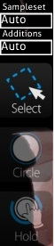

Compose
===========

**Compose（作曲）** 是一个在[作图者于](/wiki/Glossary) Timing 画面中设定完 BPM 后会花费大部份时间来依照时间轴设计他 / 她的图谱的地方。玩家们也可以在这里练习 Rank 图并且观察其设计，类似 DDR 的训练模式。

由于作图风格上有不同的需求（osu! 非常弹性，拥有许多可供发挥创意的空间；而 osu!mania 则有键数的限制，需要极高的准确度方能用键盘演奏出一段段天籁之音），osu! 的编辑器和 osu!mania 独占编辑器拥有不同的功能配置。你可以将一难度设置为 osu!mania 模式，就可以启用 osu!mania 编辑器。

功能（osu! 编辑器
--------------------

（以上至下、左至右的顺序编列）新手教学：[Beatmapping](/wiki/Beatmapping)。

### 左上（物件时间轴）

**以 Beat Snap Divsor 和所在时间为基准显示物件的时间轴**

<table>
<thead>
<tr class="header">
<th>
物件时间轴
</th>
</tr>
</thead>
<tbody>
<tr class="odd">
<td>
&quot;+&quot;/&quot;-&quot; 按钮
</td>
</tr>
<tr class="even">
<td>
白色垂直双线
</td>
</tr>
<tr class="odd">
<td>
点击物件
</td>
</tr>
</tbody>
</table>

### 右上（Beat Snap Divisor）

*'*主条目: [Beat Snap Divisor](/wiki/Beatmap_Editor/Beat_Snap_Divisor) / [Distance Snap](/wiki/Beatmap_Editor/Distance_Snap) *'*

**简单来说，就是在裁缝桌（尺规，以节拍作划分）上为一条布（歌曲）调整色线（划分方式）的长度。**

按着 **Alt** 可以启用 [Distance Snap](/wiki/Beatmap_Editor/Distance_Snap)。这个数值可为 x0.1 至 x2.0。

| 尺规                             | 划分方式 | 节拍         | 细线                           | 备注                  |
|----------------------------------|----------|--------------|--------------------------------|-----------------------|
|  | 1/1      | 整拍         | 只有白线                       | Easy 难度中推荐使用。 |
|    | 1/2      | 半拍         | 多了红线                       |                       |
|    | 1/3      | 三分之一拍\* | 每两条白线之间会有两条紫线     | 复拍子                |
|    | 1/4      | 四分之一拍   | 除红线以外，再多加上蓝线       | 一般作图时很有用。    |
|    | 1/6      | 六分之一拍\* | 每两条红线之间会有两条紫线     | 复拍子                |
|    | 1/8      | 八分之一拍   | 除红线、蓝线以外，再多加上黄线 |                       |

**Insert Break Time（插入休息时间** 按钮可以在目前位置上开始 / 中止休息时间；而 x / y 则是目前游标的所在位置。

### 左边（Selector）

**你的工具箱，专为 DIY 设计。**

<table>
<thead>
<tr class="header">
<th>
Selector
</th>
</tr>
</thead>
<tbody>
<tr class="odd">
<td>
按钮 / 名称 
(键盘快捷键)
</td>
</tr>
<tr class="even">
<td>
Sampleset（音效组）
</td>
</tr>
<tr class="odd">
<td>
Additions（额外音效）
</td>
</tr>
<tr class="even">
<td>
Select 
(1)
</td>
</tr>
<tr class="odd">
<td>
Circle 
(2)
</td>
</tr>
<tr class="even">
<td>
Slider 
(3)
</td>
</tr>
<tr class="odd">
<td>
Spinner 
(4)
</td>
</tr>
</tbody>
</table>

### 中央（游玩区域）

**显示现在所在时间的谱面样貌。** 在这里设计你的图，游玩时就会长得一模一样。这是所见即所得式作图。如果要以文本方式作图（通常是用来微调），你可以直接用记事本打开 .osu 文件。

### 右边（打击音效 & 辅助工具）

**其他可用的辅助工具。**

<table>
<thead>
<tr class="header">
<th>
按钮 
（键盘快捷键）
</th>
<th>
用途
</th>
<th>
描述
</th>
</tr>
</thead>
<tbody>
<tr class="odd">
<td>
New Combo 
(q)
</td>
<td>
<strong>右键：</strong> 将目前选取的物件或是下一个物件改成另一个颜色。
</td>
<td>
物件的 Combo。这就和歌曲中的副歌、乐谱中的小节线一样重要。可接受的范围为 5 至 20。
</td>
</tr>
<tr class="even">
<td>
打击音效
</td>
</tr>
<tr class="odd">
<td>
Whistle 
(w)
</td>
<td>
（先选取一个物件）<strong>左键：</strong> 在此物件上使用吹哨音
</td>
<td>
在所选取物件上添加哨音。
</td>
</tr>
<tr class="even">
<td>
Finish 
(e)
</td>
<td>
（先选取一个物件）<strong>左键：</strong> 在此物件上使用收尾音
</td>
<td>
在所选取物件上添加收尾（钹）音。
</td>
</tr>
<tr class="odd">
<td>
Clap 
(r)
</td>
<td>
（先选取一个物件）<strong>左键：</strong> 在此物件上使用拍掌音
</td>
<td>
在所选取物件上添加拍手音。
</td>
</tr>
<tr class="even">
<td>
辅助工具
</td>
</tr>
<tr class="odd">
<td>
Grid Snap（网格校准） 
(t)
</td>
<td>
<strong>按住 Shift：</strong>暂时启用 
<strong>按住 Ctrl：</strong>暂时停用
</td>
<td>
物件会自动被校准到网格间。
</td>
</tr>
<tr class="even">
<td>
Distance Snap（间距控制） 
(y)
</td>
<td>
<strong>按住 Alt：</strong>暂时启用，同时将 Beat Snap Divisor 改为 Distance Snap 的数值设定 
<strong>Alt + 滚轮：</strong>调整 Distance Snap 数值
</td>
<td>
两个连续圈圈的距离会自动依节奏上的差距控制。最好在时间轴暂停时使用。
</td>
</tr>
<tr class="odd">
<td>
Lock Notes（锁定物件） 
(l)
</td>
<td>
（先选取一个物件）<strong>左键：</strong>锁定此物件
</td>
<td>
将所选取物件锁定在目前位置和时间上。
</td>
</tr>
</tbody>
</table>

### 下方（歌曲时间轴）

在**左下角**显示的是以**毫秒表示的所在时间**和**歌曲长度百分比**。这个百分比会在歌曲开始之前 / 结束之后还有故事板的情况下变成 "Intro" / "Outro"。

在**下方中央**显示的是**标记和音乐控制按钮**。至于 "Test" 钮，则是在目前所在时间开始进行测试，同时谱面更改会被储存。

| 颜色标记         |
|------------------|
| 颜色             |
| 亮白长条         |
| 黄色长条         |
| 黄色上半条       |
| 绿色上半条       |
| 红色上半条       |
| 蓝色下半条       |
| 颜色区块         |
| 灰色             |
| 橘色             |
| 书签指令         |
| Ctrl + B         |
| Ctrl + Shift + B |
| Ctrl + 右方向键  |
| Ctrl + 左方向键  |

在**右下角**，你可以将**播放速度**调整为 25%、50%、75%、100%。

功能（osu!mania）
------------------

（左上角的物件时间轴没有用处。请忽略。）简易教学：[基础](https://osu.ppy.sh/forum/t/118868)、[作图 & 按键音效](https://osu.ppy.sh/forum/t/139139)

### 右上（Beat Snap Divisor）

***主页面：[Beat Snap Divisor](/wiki/Beatmap_Editor/Beat_Snap_Divisor)***

**简单来说，就是在裁缝桌（尺规，以节拍作划分）上为一条布（歌曲）调整色线（划分方式）的长度。**由于 osu!mania 中的每个物件都非常要求准确性，在 Beat Snap Divisor 的旁边额外加上了原只存在于 Timing 面板的**Time signature（时间标记）**（MM:B）以供作图者参考。当第一个 Timing 区段存在于谱面歌曲档案的*几秒钟之前*，其值可为负数（例如 -8:-3）。

**Insert Break Time（插入休息时间）**按钮可以目前位置上新增 / 中止休息时间。在其旁边的是**利用 Storyboard 为目前所选取的物件附属的音频文件名称**，名为　**Keysound（按键音效）**（参照此页尾端的 Sampling 段落）。

### 左边（Selector）

**你的 osu!mania 版工具包，专为 DIY 设计。** 

<table>
<thead>
<tr class="header">
<th>
Selector
</th>
</tr>
</thead>
<tbody>
<tr class="odd">
<td>
按钮 / 标题 
（键盘快捷键）
</td>
</tr>
<tr class="even">
<td>
Sampleset
</td>
</tr>
<tr class="odd">
<td>
Additions
</td>
</tr>
<tr class="even">
<td>
Select 
(1)
</td>
</tr>
<tr class="odd">
<td>
Circle 
(2)
</td>
</tr>
<tr class="even">
<td>
Hold 
(3)
</td>
</tr>
</tbody>
</table>

### 中央（游玩区域）

**显示现在所在时间的谱面样貌。**

| 游玩区域的框框     |
|--------------------|
| 名称               |
| 左边的框框         |
| 中间的框框         |
| 颜色意义           |
| 白色双线           |
| 白色线条           |
| 绿色线条           |
| 蓝色               |
| 白色、粉红色、黄色 |

| 尺规     |      |  |
|----------|--------------------------------|----------------------------|
| Divisor  | 1/1                            | 1/2                        |
| 节拍     | 整拍                           | 半拍                       |
| 颜色线条 | 只有白线                       | 多出了红线                 |
| 注解     | Easy 难度中推荐使用。          |                            |
| 尺规     |      |  |
| Divisor  | 1/3                            | 1/4                        |
| 节拍     | 三分之一拍                     | 四分之一拍                 |
| 颜色线条 | 两条白色线条间多出两条紫色线条 | 红线之外再多出蓝线         |
| 注解     | 复拍子                         | 一般作图时很有用           |

### 右边（打击音效 & 辅助工具）

**其他可用的辅助工具。**

<table>
<thead>
<tr class="header">
<th>
按钮 
（键盘快捷键）
</th>
<th>
用途
</th>
<th>
描述
</th>
</tr>
</thead>
<tbody>
<tr class="odd">
<td>
New Combo 
(q)
</td>
<td>
<strong>右键：</strong>将目前物件改为下一个 Combo 颜色。
</td>
<td>
物件 Combo。这和歌曲中的副歌一样重要。一串 Combo 中可接受的数量范围在 5 到 20 之间。
</td>
</tr>
<tr class="even">
<td>
打击音效
</td>
</tr>
<tr class="odd">
<td>
Whistle 
(w)
</td>
<td>
（先选取一个物件）<strong>左键：</strong> 在此物件上使用吹哨音
</td>
<td>
在所选取物件上添加哨音。
</td>
</tr>
<tr class="even">
<td>
Finish 
(e)
</td>
<td>
（先选取一个物件）<strong>左键：</strong> 在此物件上使用收尾音
</td>
<td>
在所选取物件上添加收尾（钹）音。
</td>
</tr>
<tr class="odd">
<td>
Clap 
(r)
</td>
<td>
（先选取一个物件）<strong>左键：</strong> 在此物件上使用拍掌音
</td>
<td>
在所选取物件上添加拍手音。
</td>
</tr>
<tr class="even">
<td>
辅助工具
</td>
</tr>
<tr class="odd">
<td>
Grid Snap（网格校准） 
(t)
</td>
<td>
<strong>按住 Shift：</strong>暂时启用 
<strong>按住 Ctrl：</strong>暂时停用
</td>
<td>
物件会自动被校准到网格间。
</td>
</tr>
<tr class="even">
<td>
Distance Snap（间距控制） 
(y)
</td>
<td>
<strong>按住 Alt：</strong>暂时启用，同时将 Beat Snap Divisor 改为 Distance Snap 的数值设定 
<strong>Alt + 滚轮：</strong>调整 Distance Snap 数值
</td>
<td>
两个连续圈圈的距离会自动依节奏上的差距控制。最好在时间轴暂停时使用。
</td>
</tr>
<tr class="odd">
<td>
Lock Notes（锁定物件） 
(l)
</td>
<td>
（先选取一个物件）<strong>左键：</strong>锁定此物件
</td>
<td>
将所选取物件锁定在目前位置和时间上。
</td>
</tr>
</tbody>
</table>

如果要使用**按键音效**（在物件上加特效音），选取该物件并按下 **ALT+左键**（会跳出一个列出谱面资料夹下所有音效的视窗）。参照页尾的 Sampling 段落。

### 下方（歌曲时间轴）

 在**左下角**会**以毫秒显示目前所在时间**及**歌曲长度百分比**。

在**下方中央**显示的是**标记和音乐控制按钮**。至于 "Test" 钮，则是在目前所在时间开始进行测试，同时谱面更改会被储存。

|     书签指令     |
|:----------------:|
|     Ctrl + B     |
| Ctrl + Shift + B |
|  Ctrl + 右方向键 |
|  Ctrl + 左方向键 |

在 **右下角**，你可以将**播放速度**调整为 25%、50%、75%、100%。

### Sampling

**Sampling** 是指**在物件上添加音效**的过程。先选取物件然后按下 **ALT+左键**即可（会跳出一个列出谱面资料夹下所有音效的视窗）。

#### 汇入音效

**左边**是**谱面资料夹中所有的音频文件**。

**右边**是**所选取音频文件的设定**。

| colspan=2| 基本  |
|------------------|
| 名字             |
| CustomSet        |
| Volume           |
| Use basic sample |
| colspan=2| 按钮  |
| Play             |
| Import           |
| Delete           |
| Apply            |
| Sample           |
| Sample list      |
| Reset            |
| Cancel           |

#### Sample event list

**制作真正的故事板。**点击 Sample list 会弹出另一个叫作 "Sample event list" 的视窗（参考图中右侧），也就是这个。其中两个按钮应可轻易理解（Delete = 删除选定项目；Close = 关闭视窗）。**这些故事板元素会被放入当前选定难度的 .osu 文件中。**

代码写法是 `MM:SS:XXX` `{音频文件}@{音量}` 其中 MM:SS:XXX 的格式为 分:秒:毫秒。

**例如：** 1:57:745 kick.wav@100% 代表在 1 分 57.745 秒钟，会以 100% 音量播放文件 "kick.wav"。

[如果这满足不了你，你也可以试试更硬派的故事板制作法。](/wiki/Storyboard_Scripting/Miscellaneous)
