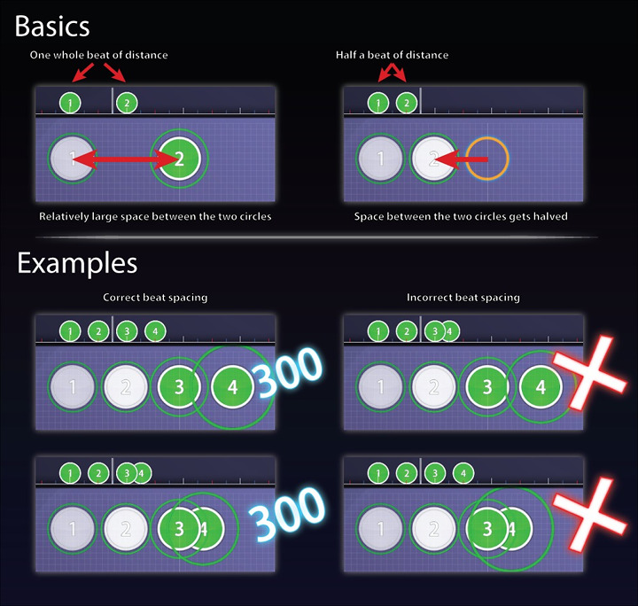

# Distance Snap

***Les distances entre les cercles consécutifs seront brisées en fonction de leur différence rythmique.***

La façon la plus simple de s'assurer que l'espacement des battements est correct sur vos cartes de rythme est d'utiliser la fonction Distance Snapping de l'éditeur, qui se trouve en haut à droite de l'éditeur. La distance relative entre les notes peut être ajustée en utilisant 'Alt' et la molette de la souris. Cela permet de s'assurer que les temps qui sont proches sur la timeline le sont aussi sur le beatmap, et vice versa. Cela permet un jeu intuitif et un bon espacement des temps. Si vous vous en tenez à l'utilisation de Distance Snap pour tout le morceau, l'espacement correct des temps est garanti !

Lorsque la fonction Distance Snap est activée, chaque objet ne peut être placé que dans un cercle autour de l'objet précédent. Le rayon du cercle est basé sur le temps écoulé depuis le dernier objet. La variable distance/temps peut être modifiée dans l'éditeur pour rendre le cercle plus petit/plus grand. Après un certain temps (temps nécessaire), l'accrochage est désactivé.

## Description de l'édition

La distance entre les cercles consécutifs sera déterminée en fonction de leur différence rythmique.
Raccourci : Maintenez "Alt" pour basculer temporairement, ou appuyez sur "Y".
Alt + la molette de la souris ajuste le multiplicateur d'accrochage.
Le multiplicateur d'accrochage peut également être modifié en maintenant la touche "Alt" enfoncée et en faisant glisser la barre de défilement en haut à droite.

## Pourquoi ai-je besoin de fixer la distance ?

La règle de base d'une bonne difficulté de jeu rythmique est que le rythme de la musique doit être en corrélation avec la position de l'objet frappé dans le champ de jeu. Par exemple, un rythme intensif signifie que les objets de frappe doivent être placés près les uns des autres pour faciliter le flot chaotique comme le fait la chanson ; de même, un rythme lent signifie que les objets de frappe doivent être placés juste assez loin pour sentir la chanson résonner avec grâce et timing. Si la chanson comporte une partie où le rythme est cohérent, les objets de frappe doivent être espacés et disposés de façon égale.
Contrairement à la plupart des jeux rythmiques qui n'ont qu'une interface et des contrôles fixes, osu ! Standard fournit une grande toile à dessin pour vous permettre de montrer votre créativité à la musique. Parce que le mapper a une utilisation illimitée du champ de jeu, il peut être intimidant pour les nouveaux mappers de mapper une difficulté *sensible* sans la faire paraître gênante et non naturelle (comme des sauts en fin d'écran ou des formes non adaptées au rythme).
Pour aider les nouveaux mappers peu familiers avec la méthode peu orthodoxe de cartographie, **Distance Snap** a été inventé pour faciliter une meilleure lisibilité de la cartographie et une meilleure jouabilité à la différence rythmique de la chanson. Lorsque Distance Snap est activé, chaque objet ne peut être placé que dans un cercle autour de l'objet précédent. Le rayon du cercle est basé sur le temps écoulé depuis le dernier objet. La variable distance/temps peut être modifiée dans l'éditeur pour rendre le cercle plus petit/plus grand. Après un certain temps (temps nécessaire), l'accrochage est automatiquement désactivé avec un marquage rouge ; une erreur car le cercle est hors du champ de jeu. De plus, l'espacement entre les notes affecte le multiplicateur de vitesse des curseurs et la section de timing BPM actuelle.
Il y a **trois façons d'activer/désactiver l'accrochage à distance** :

- **Cliquez sur l'icône "Distance Snap" en bas à droite de l'écran**. Elle est activée si elle s'allume ; cliquez à nouveau pour la désactiver.
- Utilisez la touche de raccourci du clavier, `Y"`, pour l'activer/désactiver.
- Maintenez la touche du clavier, `Alt`, pour **activer/désactiver temporairement** le Distance Snap désactivé/activé respectivement **jusqu'à ce que vous relâchiez** la touche.
  - Tout en maintenant la touche `Alt` enfoncée, le curseur du diviseur de battement situé en haut à droite de l'éditeur basculera sur le curseur d'espacement de la distance, vous permettant de régler le multiplicateur de la variable distance/temps par la molette de la souris ou en le faisant glisser. La valeur par défaut est 1,0x de 0,1x à 6,0x.

**Note** : Une icône rouge de Distance Snap signifie que le cercle est trop éloigné du terrain de jeu, d'où une erreur. Vous pouvez le corriger en abaissant le multiplicateur d'espacement des distances ou en utilisant votre propre jugement et l'opinion des autres mappers.

## Multiplicateur de distance suggéré ?

Lors du réglage de la distance, vous devez vous concentrer sur certains points ayant à peu près le même BPM et utiliser votre propre jugement. Bien qu'il soit possible d'utiliser jusqu'à 6,0x, une utilisation élevée et incohérente du multiplicateur donnera l'impression que les objets touchés sont dispersés de façon aléatoire sur le terrain. Comme la limite inférieure peut varier, essayez de vous assurer que les objets frappés ne se chevauchent pas trop étroitement, sauf dans des cas spéciaux comme les flux (de mort).

## Utilisation de la fonction Distance Snap

Le Distance Snap est juste un **outil** pour maintenir une distance proportionnelle entre deux objets touchés, une "béquille" si vous voulez. Il fonctionne bien dans la plupart des situations, mais une confiance excessive rendra votre difficulté prévisible et avec un espace de travail limité. Bien qu'il ne soit pas mauvais d'utiliser Distance Snap, souvenez-vous que c'est juste un outil destiné à convenir au but du mappeur. Un changement de distance devrait être logique et bien suivre le rythme. Distance Snap n'est qu'une aide et ne constitue pas un conseil professionnel, qui serait plutôt sur [le forum beatmap](https://osu.ppy.sh/community/forums/56).
