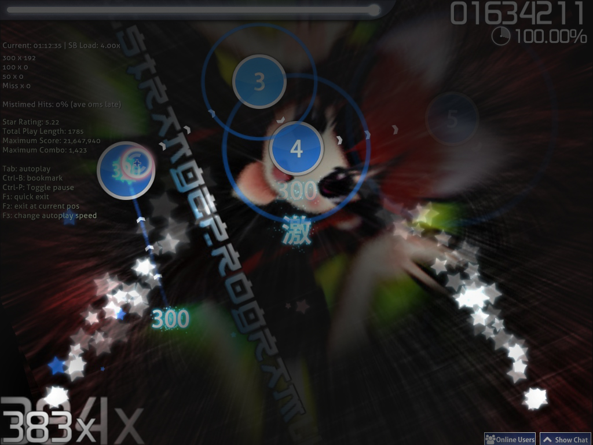
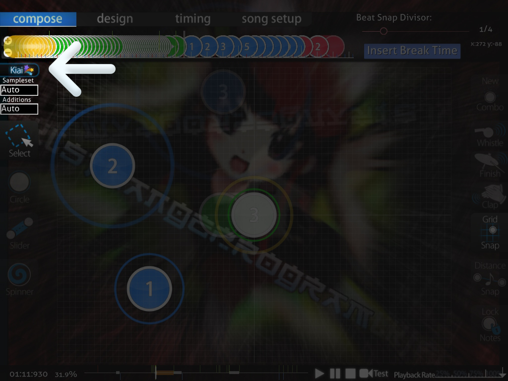

  **Czas Kiai** jest umieszczany przez [twórcę mapy](PL:Mapper "wikilink") między dwoma [miejscami](PL:Timing "wikilink") w [beatmapie](PL:Beatmap "wikilink"). Czas Kiai łatwo zauważyć, ponieważ wraz z jego rozpoczęciem pojawia się gwiezdna fontanna, a ekran oraz [elementy beatmapy](PL:Hit_Objects "wikilink") zaczynają migać zgodnie z [rytmem](PL:BPM "wikilink") piosenki. Gdy Czas Kiai jest aktywny, z kursora będą wylatywały gwiazdki przy każdym naciśnięciu kółka, przeciągnięciu slidera oraz kręceniu spinnerem.

Czas Kiai w mapowaniu
---------------------

Przy [tworzeniu](Editor "wikilink") beatmap, Czas Kiai stosuje się najczęściej na „najmocniejszym” momencie w piosence - zazwyczaj refrenie. Niektóre piosenki nie mają refrenu, natomiast mają inny odczuwalnie zaakcentowany element, który może świetnie współgrać z Czasem Kiai. Należy pamiętać, że nadmierne użycie sekcji rozpoczynajacych Czas Kiai spowoduje tak samo nadmierne występowanie gwiezdnych fontann. Pozbawia to mapę możliwość uzyskania statusu rankingowego.

Rady dotyczące używania Czasu Kiai
----------------------------------

1.  Na mapach **[Taiko](Taiko "wikilink")** sekcje z Czasem Kiai dodają 20% więcej [punktów](PL:Score "wikilink"). Jako że wpływa to na rozgrywkę, należy wziąć pod uwagę ewentualne rozmieszczenie tychże sekcji podczas tworzenia [map](PL:beatmap "wikilink") dedykowanych dla trybu Taiko.
2.  **Konsekwencja**: używanie sekcji Czasu Kiai w odmiennych miejscach piosenki na tym samym [poziomie trudności](PL:difficulty "wikilink") może być niekomfortowe dla graczy. Wszystkie poziomy trudności od tego samego [twórcy](PL:mapper "wikilink") powinny mieć ujednolicone sekcje Czasu Kiai.
3.  **Nie powinno się używać całkowicie białego [koloru combo](combo_colours "wikilink")** (255,255,255); psuje to efekt Kiai i powoduje ból oczu.
4.  Jako, że sekcje Czasu Kiai są używane w „najmocniejszych” momentach piosenki, normalnością jest fakt, że momenty te są stosunkowo trudniejsze do zagrania od innych części mapy.
5.  **[Gościnne poziomy trudności](Guest_Difficulty "wikilink") mogą mieć inaczej ustawione sekcje Czasu Kiai**. Wynika to z faktu, że każda osoba inaczej rozumie „najmocniejszy” moment w piosence. Mimo wszystko, sekcje Czasu Kiai powinny być konsekwentnie ułożone.
