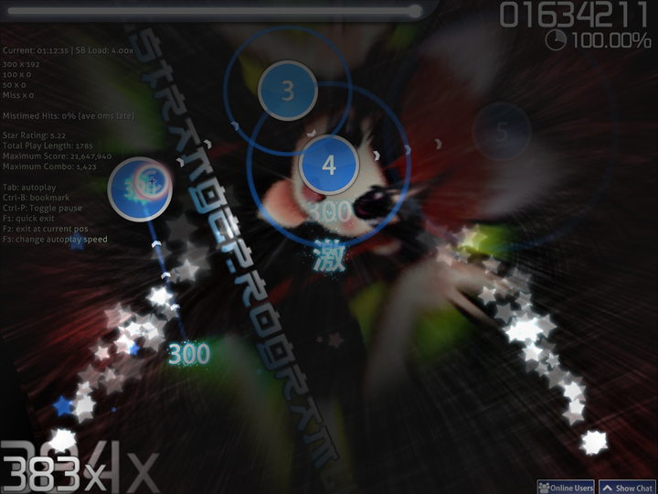
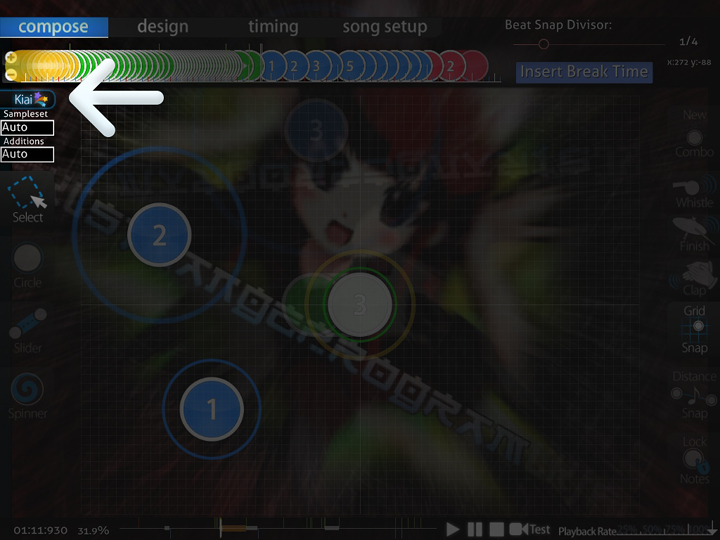

# Kiai Time

**Киаи тайм** (*Киай тайм, Kiai Time*) — секция, предназначенная для выделения наиболее сильных частей в песне. В начале киаи из нижних углов вылетают фонтаны звёзд, на протяжении всей секции при нажатии на ноты также будут вылетать звёзды, а круги и слайдеры будут пульсировать в [ритме](/wiki/Beatmap_Editor/Timing) песни.

## Киаи в маппинге

Подходящим местом для киаи являются наиболее сильные части песни, как правило — припевы. В некоторых песнях припевов нет вовсе, но это не значит, что в них нет мест, подходящих для киаи. Избыточное использование киаи запрещёно по причине того, что это может вызвать лаги у игроков на слабых компьютерах, да и просто выглядит неизящно.

## То, что следует учитывать при использовании киаи

1. В [тайко](/wiki/Game_Modes/osu!taiko) на секциях с киаи игрок получает на 20% больше очков.
2. Многих раздражают секции с киаи, расположенные на по-разному звучащих участках песни в большом количестве. Хорошим тоном считается иметь одинаковые киаи во всех уровнях сложности карты, сделанных одним маппером.
3. Не используйте белый цвет нот (255,255,255), так как это делает киаи слишком ярким.
4. Части карты с киаи могут быть несколько сложнее остальных.
5. Уровни сложности, сделанные другими игроками, могут иметь расположение киаи, отличное от вашего.
