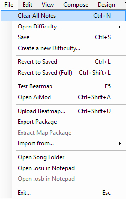
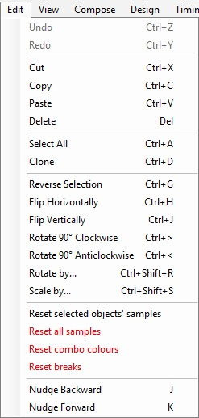
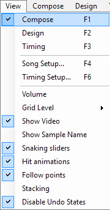
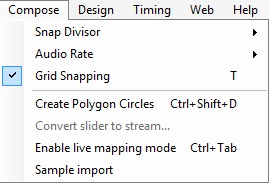
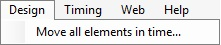
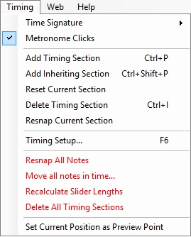
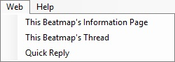
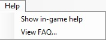

File
====

 **Basic File commands.**

<table>
<thead>
<tr class="header">
<th>
File menu
</th>
</tr>
</thead>
<tbody>
<tr class="odd">
<td>
colspan=2| File commands
</td>
</tr>
<tr class="even">
<td>
Clear All Notes 
(Ctrl + N)
</td>
</tr>
<tr class="odd">
<td>
Open Difficulty...
</td>
</tr>
<tr class="even">
<td>
Save 
(Ctrl + S)
</td>
</tr>
<tr class="odd">
<td>
Create a new Difficulty...
</td>
</tr>
<tr class="even">
<td>
colspan=2| Revert commands
</td>
</tr>
<tr class="odd">
<td>
Revert to Saved 
(Ctrl + L)
</td>
</tr>
<tr class="even">
<td>
Revert to Saved (Full) 
(Ctrl + Shift + L)
</td>
</tr>
<tr class="odd">
<td>
colspan=2| Troubleshoot commands
</td>
</tr>
<tr class="even">
<td>
Test Beatmap 
(F5)
</td>
</tr>
<tr class="odd">
<td>
Open AiMod 
(Ctrl + Shift + A)
</td>
</tr>
<tr class="even">
<td>
colspan=2| Beatmap Packaging commands
</td>
</tr>
<tr class="odd">
<td>
Upload Beatmap... 
(Ctrl + Shift + U)
</td>
</tr>
<tr class="even">
<td>
Export Package...
</td>
</tr>
<tr class="odd">
<td>
Extract Map Package
</td>
</tr>
<tr class="even">
<td>
Import from...
</td>
</tr>
<tr class="odd">
<td>
colspan=2| Programmer's commands
</td>
</tr>
<tr class="even">
<td>
Open Song Folder
</td>
</tr>
<tr class="odd">
<td>
Open .osu in Notepad
</td>
</tr>
<tr class="even">
<td>
Open .osb in Notepad
</td>
</tr>
<tr class="odd">
<td>
colspan=2| Emergency Exit command.
</td>
</tr>
<tr class="even">
<td>
Exit... 
(Esc)
</td>
</tr>
</tbody>
</table>

Edit
====

 Edit commands. Same as default MS shortcuts.

<table>
<thead>
<tr class="header">
<th>
Edit menu
</th>
</tr>
</thead>
<tbody>
<tr class="odd">
<td>
colspan=2| Redo/Undo commands
</td>
</tr>
<tr class="even">
<td>
colspan=2|Do note that these commands can be disabled at <a href="Options#Editor_section" title="wikilink">Options</a> sidebar to prevent crash when editing marathon songs.
</td>
</tr>
<tr class="odd">
<td>
Undo 
(Ctrl + Z)
</td>
</tr>
<tr class="even">
<td>
Redo 
(Ctrl + Y)
</td>
</tr>
<tr class="odd">
<td>
colspan=2| Edit commands (Select a note before use)
</td>
</tr>
<tr class="even">
<td>
Cut 
(Ctrl + X)
</td>
</tr>
<tr class="odd">
<td>
Copy 
(Ctrl + C)
</td>
</tr>
<tr class="even">
<td>
Paste 
(Ctrl + V)
</td>
</tr>
<tr class="odd">
<td>
Delete 
(Del / Delete)
</td>
</tr>
<tr class="even">
<td>
colspan=2| Special commands
</td>
</tr>
<tr class="odd">
<td>
Select All 
(Ctrl + A)
</td>
</tr>
<tr class="even">
<td>
Clone 
(Ctrl + D)
</td>
</tr>
<tr class="odd">
<td>
colspan=2| Rotation commands
</td>
</tr>
<tr class="even">
<td>
Reverse selection 
(Ctrl + G)
</td>
</tr>
<tr class="odd">
<td>
Flip Horizontally 
(Ctrl + H)
</td>
</tr>
<tr class="even">
<td>
Flip Vertically 
(Ctrl + J)
</td>
</tr>
<tr class="odd">
<td>
Rotate 90° Clockwise 
(Ctrl + &gt;)
</td>
</tr>
<tr class="even">
<td>
Rotate 90° Anticlockwise 
(Ctrl + &lt;)
</td>
</tr>
<tr class="odd">
<td>
Rotate by... 
(Ctrl + Shift + R)
</td>
</tr>
<tr class="even">
<td>
Scale by... 
(Ctrl + Shift + S)
</td>
</tr>
<tr class="odd">
<td>
colspan=2| Reset Buttons
</td>
</tr>
<tr class="even">
<td>
Reset selected objects' samples
</td>
</tr>
<tr class="odd">
<td>
Reset all samples
</td>
</tr>
<tr class="even">
<td>
Reset all combo colour
</td>
</tr>
<tr class="odd">
<td>
Reset breaks
</td>
</tr>
<tr class="even">
<td>
colspan=2| Nudge commands
</td>
</tr>
<tr class="odd">
<td>
Nudge Backward 
(J)
</td>
</tr>
<tr class="even">
<td>
Nudge Forward 
(K)
</td>
</tr>
</tbody>
</table>

View
====

 Places of interest.

<table>
<thead>
<tr class="header">
<th>
View menu
</th>
</tr>
</thead>
<tbody>
<tr class="odd">
<td>
colspan=2| Tabbing commands
</td>
</tr>
<tr class="even">
<td>
Compose 
(F1)
</td>
</tr>
<tr class="odd">
<td>
Design 
(F2)
</td>
</tr>
<tr class="even">
<td>
Timing 
(F3)
</td>
</tr>
<tr class="odd">
<td>
colspan=2| Setup commands
</td>
</tr>
<tr class="even">
<td>
Song Setup... 
(F4)
</td>
</tr>
<tr class="odd">
<td>
Timing Setup... 
(F6)
</td>
</tr>
<tr class="even">
<td>
colspan=2| Special commands
</td>
</tr>
<tr class="odd">
<td>
Volume
</td>
</tr>
<tr class="even">
<td>
Grid Level
</td>
</tr>
<tr class="odd">
<td>
Show Video
</td>
</tr>
<tr class="even">
<td>
Show Sample Name
</td>
</tr>
<tr class="odd">
<td>
Snaking sliders
</td>
</tr>
<tr class="even">
<td>
Hit animations
</td>
</tr>
<tr class="odd">
<td>
Follow points
</td>
</tr>
<tr class="even">
<td>
Stacking
</td>
</tr>
<tr class="odd">
<td>
Disable Undo States
</td>
</tr>
</tbody>
</table>

Compose
=======

  
***Main page: [Compose](Compose "wikilink")***

<table>
<thead>
<tr class="header">
<th>
Compose menu
</th>
</tr>
</thead>
<tbody>
<tr class="odd">
<td>
colspan=2| Rulers commands
</td>
</tr>
<tr class="even">
<td>
Snap Divisor
</td>
</tr>
<tr class="odd">
<td>
Audio Rate
</td>
</tr>
<tr class="even">
<td>
Grid Snapping 
(T)
</td>
</tr>
<tr class="odd">
<td>
colspan=2| Special commands
</td>
</tr>
<tr class="even">
<td>
Create Polygon Circles 
(Ctrl + Shift + D)
</td>
</tr>
<tr class="odd">
<td>
Convert slider to stream...
</td>
</tr>
<tr class="even">
<td>
Enable live mapping mode 
(Ctrl + Tab)
</td>
</tr>
<tr class="odd">
<td>
Sample import
</td>
</tr>
</tbody>
</table>

Design
======

  
***Main page: [Design](Design "wikilink")***

| Design menu                  |
|------------------------------|
| Move all elements on time... |

Timing
======

  
***Main page: [Timing](Timing "wikilink")***

<table>
<thead>
<tr class="header">
<th>
Timing menu
</th>
</tr>
</thead>
<tbody>
<tr class="odd">
<td>
colspan=2| Metronome commands
</td>
</tr>
<tr class="even">
<td>
Time Signature
</td>
</tr>
<tr class="odd">
<td>
Metronome Clicks
</td>
</tr>
<tr class="even">
<td>
colspan=2| Markers commands
</td>
</tr>
<tr class="odd">
<td>
Add Timing Section 
(Ctrl + P)
</td>
</tr>
<tr class="even">
<td>
Add Inheriting Section 
(Ctrl + Shift + P)
</td>
</tr>
<tr class="odd">
<td>
Reset Current Section
</td>
</tr>
<tr class="even">
<td>
Delete Timing Section 
(Ctrl + I)
</td>
</tr>
<tr class="odd">
<td>
Resnap Current Section
</td>
</tr>
<tr class="even">
<td>
colspan=2| Timing Setup
</td>
</tr>
<tr class="odd">
<td>
Timing Setup... 
(F6)
</td>
</tr>
<tr class="even">
<td>
colspan=2|Special commands
</td>
</tr>
<tr class="odd">
<td>
Resnap All Notes
</td>
</tr>
<tr class="even">
<td>
Move all notes in time...
</td>
</tr>
<tr class="odd">
<td>
Recalculate Slider Lengths
</td>
</tr>
<tr class="even">
<td>
Delete All Timing Sections
</td>
</tr>
<tr class="odd">
<td>
colspan=2| Preview command
</td>
</tr>
<tr class="even">
<td>
Set Current Position as Preview Point
</td>
</tr>
</tbody>
</table>

Web
===

 Opens your browser. Mainly send you to the beatmap's thread (requires log-in to the website.)

| Web menu                        |
|---------------------------------|
| This Beatmap's Information Page |
| This Beatmap's Thread           |
| Quick Reply                     |

Help
====

<table>
<thead>
<tr class="header">
<th>
Help menu
</th>
</tr>
</thead>
<tbody>
<tr class="odd">
<td>
Show in-game help 
(H)
</td>
</tr>
<tr class="even">
<td>
View FAQ
</td>
</tr>
</tbody>
</table>

<Category:Beatmapping>
