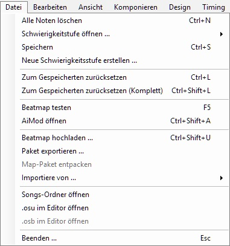
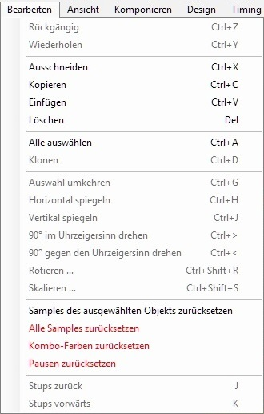
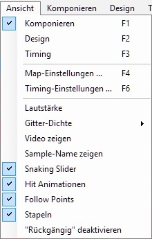
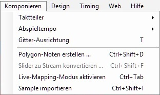
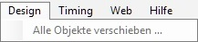
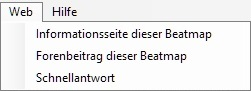
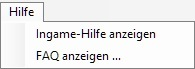

Datei
=====

 **Kommandos.**

<table>
<thead>
<tr class="header">
<th>
Dateimenü
</th>
</tr>
</thead>
<tbody>
<tr class="odd">
<td>
colspan=2| Kommandos
</td>
</tr>
<tr class="even">
<td>
Alle Noten löschen 
(Strg + N)
</td>
</tr>
<tr class="odd">
<td>
Schwierigkeitsstufe öffnen...
</td>
</tr>
<tr class="even">
<td>
Speichern 
(Strg + S)
</td>
</tr>
<tr class="odd">
<td>
Neue Schwierigkeitsstufe erstellen...
</td>
</tr>
<tr class="even">
<td>
colspan=2| Rückkehrfunktion
</td>
</tr>
<tr class="odd">
<td>
Zum Gespeicherten zurücksetzen 
(Strg + L)
</td>
</tr>
<tr class="even">
<td>
Zum Gespeicherten zurücksetzen (Komplett) 
(Strg + Shift + L)
</td>
</tr>
<tr class="odd">
<td>
colspan=2| Kommandos zur Fehlerbehebung
</td>
</tr>
<tr class="even">
<td>
Beatmap testen 
(F5)
</td>
</tr>
<tr class="odd">
<td>
AiMod öffnen 
(Strg + Shift + A)
</td>
</tr>
<tr class="even">
<td>
colspan=2| Kommandos für Beatmap Verpackungen
</td>
</tr>
<tr class="odd">
<td>
Beatmap hochladen ... 
(Strg + Shift + U)
</td>
</tr>
<tr class="even">
<td>
Paket exportieren ...
</td>
</tr>
<tr class="odd">
<td>
Map-Paket entpacken
</td>
</tr>
<tr class="even">
<td>
Importieren von ...
</td>
</tr>
<tr class="odd">
<td>
colspan=2| Kommandos für Programmierer
</td>
</tr>
<tr class="even">
<td>
Songs-Ordner öffnen
</td>
</tr>
<tr class="odd">
<td>
<a href="DE:.osu" title="wikilink">.osu</a> im Editor öffnen
</td>
</tr>
<tr class="even">
<td>
<a href="DE:.osb" title="wikilink">.osb</a> im Editor öffnen
</td>
</tr>
<tr class="odd">
<td>
colspan=2| Emergency Exit command.
</td>
</tr>
<tr class="even">
<td>
Beenden... 
(Esc)
</td>
</tr>
</tbody>
</table>

Bearbeiten
==========

 Edit commands. Same as default MS shortcuts.

<table>
<thead>
<tr class="header">
<th>
Bearbeitungsmenü
</th>
</tr>
</thead>
<tbody>
<tr class="odd">
<td>
colspan=2|Kommando für Rückgängig/Wiederherstellen
</td>
</tr>
<tr class="even">
<td>
colspan=2|Diese Kommandos können in den <a href="DE:Options#Editor" title="wikilink">Einstellungen</a> geaktiviert werden, um ein Crash während dem Bearbeiten von Marathon Maps zu verhindern.
</td>
</tr>
<tr class="odd">
<td>
Rückängig 
(Strg + Z)
</td>
</tr>
<tr class="even">
<td>
Wiederherstellen 
(Strg + Y)
</td>
</tr>
<tr class="odd">
<td>
colspan=2| Kommandos fürs Bearbeiten (Hit Objekt zuvor markieren)
</td>
</tr>
<tr class="even">
<td>
Ausschneiden 
(Strg + X)
</td>
</tr>
<tr class="odd">
<td>
Kopieren 
(Strg + C)
</td>
</tr>
<tr class="even">
<td>
Einfügen 
(Strg + V)
</td>
</tr>
<tr class="odd">
<td>
Löschen 
(Enft/ Entfernen)
</td>
</tr>
<tr class="even">
<td>
colspan=2| Spezielle Kommandos
</td>
</tr>
<tr class="odd">
<td>
Alles auswählen 
(Strg + A)
</td>
</tr>
<tr class="even">
<td>
Klonen 
(Strg + D)
</td>
</tr>
<tr class="odd">
<td>
colspan=2| Kommandos fürs Rotieren
</td>
</tr>
<tr class="even">
<td>
Auswahl umkehren 
(Strg + G)
</td>
</tr>
<tr class="odd">
<td>
Horizontal spiegeln 
(Strg + H)
</td>
</tr>
<tr class="even">
<td>
Vertikal spiegeln 
(Strg + J)
</td>
</tr>
<tr class="odd">
<td>
90° im Uhrzeigersinn drehen 
(Strg + &gt;)
</td>
</tr>
<tr class="even">
<td>
90° gegen den Uhrzeigersinn drehen 
(Strg + &lt;)
</td>
</tr>
<tr class="odd">
<td>
Rotieren ... 
(Strg + Shift + R)
</td>
</tr>
<tr class="even">
<td>
Skalieren... 
(Strg + Shift + S)
</td>
</tr>
<tr class="odd">
<td>
colspan=2| Tasten zum Zurücksetzen
</td>
</tr>
<tr class="even">
<td>
Samples des ausgewählten Objekts zurücksetzen
</td>
</tr>
<tr class="odd">
<td>
Alle Samples zurücksetzen
</td>
</tr>
<tr class="even">
<td>
Kombo-Farben zurücksetzen
</td>
</tr>
<tr class="odd">
<td>
Pausen zurücksetzen
</td>
</tr>
<tr class="even">
<td>
colspan=2| Kommandos zum Stubsen
</td>
</tr>
<tr class="odd">
<td>
Stubs zurück 
(J)
</td>
</tr>
<tr class="even">
<td>
Stubs vrfwärts 
(K)
</td>
</tr>
</tbody>
</table>

Ansicht
=======

<table>
<thead>
<tr class="header">
<th>
Ansichtmenü
</th>
</tr>
</thead>
<tbody>
<tr class="odd">
<td>
colspan=2| Kommandos für die Tabs
</td>
</tr>
<tr class="even">
<td>
Komponieren 
(F1)
</td>
</tr>
<tr class="odd">
<td>
Design 
(F2)
</td>
</tr>
<tr class="even">
<td>
Timing 
(F3)
</td>
</tr>
<tr class="odd">
<td>
colspan=2| Kommandos für Einstellungen
</td>
</tr>
<tr class="even">
<td>
Map-Einstellungen ... 
(F4)
</td>
</tr>
<tr class="odd">
<td>
Timing-Einstellungen ... 
(F6)
</td>
</tr>
<tr class="even">
<td>
colspan=2| Spezielle Kommandos
</td>
</tr>
<tr class="odd">
<td>
Lautstärke
</td>
</tr>
<tr class="even">
<td>
Gitter-Dichte
</td>
</tr>
<tr class="odd">
<td>
Video zeigen
</td>
</tr>
<tr class="even">
<td>
Sample-Name anzeigen
</td>
</tr>
<tr class="odd">
<td>
Snaking Slider
</td>
</tr>
<tr class="even">
<td>
Hit Animationen
</td>
</tr>
<tr class="odd">
<td>
Follow Points
</td>
</tr>
<tr class="even">
<td>
Stapeln
</td>
</tr>
<tr class="odd">
<td>
&quot;Rückgängig&quot; deaktivieren
</td>
</tr>
</tbody>
</table>

Komponieren
===========

***Hauptseite: [Komposition](DE:Compose "wikilink")***

<table>
<thead>
<tr class="header">
<th>
Kompositionsmenü
</th>
</tr>
</thead>
<tbody>
<tr class="odd">
<td>
colspan=2| Regler
</td>
</tr>
<tr class="even">
<td>
Taktteiler
</td>
</tr>
<tr class="odd">
<td>
Abspieltempo
</td>
</tr>
<tr class="even">
<td>
Gitter-Ausrichtung 
(T)
</td>
</tr>
<tr class="odd">
<td>
colspan=2| Spezielle Kommandos
</td>
</tr>
<tr class="even">
<td>
Polygon-Noten erstellen ... 
(Strg + Shift + D)
</td>
</tr>
<tr class="odd">
<td>
Slider zu Stream konvertieren...
</td>
</tr>
<tr class="even">
<td>
Live-Editorapping-Editorodus aktivieren 
(Strg + Tab)
</td>
</tr>
<tr class="odd">
<td>
Sample importieren
</td>
</tr>
</tbody>
</table>

Design
======

***Main page: [Design](Design "wikilink")***

| Designmenü               |
|--------------------------|
| Alle Objekte verschieben |

Timing
======

***Main page: [Timing](Timing "wikilink")***

<table>
<thead>
<tr class="header">
<th>
Timingmenü
</th>
</tr>
</thead>
<tbody>
<tr class="odd">
<td>
colspan=2| Kommandos fürs Metronom
</td>
</tr>
<tr class="even">
<td>
Rhythmus
</td>
</tr>
<tr class="odd">
<td>
Metronom
</td>
</tr>
<tr class="even">
<td>
colspan=2| Kommandos zum Markieren
</td>
</tr>
<tr class="odd">
<td>
Sektion hinzufügen 
(Strg + P)
</td>
</tr>
<tr class="even">
<td>
Erbende Sektion hinzufügen 
(Strg + Shift + P)
</td>
</tr>
<tr class="odd">
<td>
Aktuelle Sektion zurücksetzen
</td>
</tr>
<tr class="even">
<td>
Sektion entfernen 
(Strg + I)
</td>
</tr>
<tr class="odd">
<td>
Sektion neu ausrichten
</td>
</tr>
<tr class="even">
<td>
colspan=2| Timing Einstellungen
</td>
</tr>
<tr class="odd">
<td>
Timing Einstellungen... 
(F6)
</td>
</tr>
<tr class="even">
<td>
colspan=2|Spezielle Kommandos
</td>
</tr>
<tr class="odd">
<td>
Alle Noten neu ausrichten
</td>
</tr>
<tr class="even">
<td>
Alle Noten verschieben ...
</td>
</tr>
<tr class="odd">
<td>
Sliderlängen neu berechnen
</td>
</tr>
<tr class="even">
<td>
Alle Sektionen löschen
</td>
</tr>
<tr class="odd">
<td>
colspan=2| Kommando fürs Vorschau
</td>
</tr>
<tr class="even">
<td>
Aktuelle Position als Vorschaupunkt festlegen
</td>
</tr>
</tbody>
</table>

Web
===

 Öffnet Ihren Browser. Leitet Sie hauptsächlich zum Beatmap-Thread (Sie müssen angemeldet sein).

| Webmenü                          |
|----------------------------------|
| Informationsseite dieser Beatmap |
| Forenbeitrag dieser Beatmap      |
| Schnellantwort                   |

Hilfe
=====

<table>
<thead>
<tr class="header">
<th>
Hilfemenü
</th>
</tr>
</thead>
<tbody>
<tr class="odd">
<td>
Ingame-Hilfe anzeigen 
(H)
</td>
</tr>
<tr class="even">
<td>
FAQ anzeigen
</td>
</tr>
</tbody>
</table>
