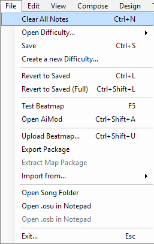
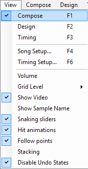
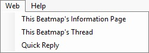

# Beatmap editor menu

## File

**Basic File commands.**

### File commands

| Name | Description |
| :-- | :-- |
| Clear All Notes (`Ctrl` + `N`) | Purge the current difficulty's hitnotes. |
| Open Difficulty... | **For Editing:** Quickly switch between difficulties. **For Reference:** (osu!mania Only) Overlay the selected difficulty over the (currently) opened one. |
| Save (`Ctrl` + `S`) | Save current changes (both `.osu` and `.osb`) |
| Create a new Difficulty... | Save the current changes on this difficulty as a new difficulty. The old difficulty is preserved to its last saved state when reloaded. |

### Revert commands

| Name | Description |
| :-- | :-- |
| Revert to Saved (`Ctrl` + `L`) | Cancel current changes and return to the last saved state. For general mishaps (hitnotes). |
| Revert to Saved (Full) (`Ctrl` + `Shift` + `L`) | Cancel current changes and return to the last saved state. For complicated mishaps (timing, storyboard). |

### Troubleshoot commands

| Name | Description |
| :-- | :-- |
| Test Beatmap (F5) | Test the Beatmap. Current changes will be saved in order to test. |
| Open AiMod (`Ctrl` + `Shift` + `A`) | Open AiMod. |

### Beatmap Packaging commands

| Name | Description |
| :-- | :-- |
| Upload Beatmap... (`Ctrl` + `Shift` + `U`) | Upload the beatmap to the [WIP section](https://osu.ppy.sh/community/forums/10). Requires osu!account signed in to the website to view "Beatmaps" forum. |
| Export Package... | Export the beatmap as `.osz`. The file will be sent to "Exports" folder and you will be directed to osu!/Exports from the Beatmap Editor. |
| Extract Map Package | ? |
| Import from... | **bms/bme:** (osu!mania only) Open .bms/.bme file to be imported as osu!mania difficulty. |

### Programmer's commands

| Name | Description |
| :-- | :-- |
| Open Song Folder | Open the song folder location inside osu!/Songs. |
| Open `.osu` in Notepad | Open beatmap's difficulty file in MS Notepad. |
| Open `.osb` in Notepad | Open base file (storyboard) in MS Notepad. |

### Emergency Exit command

| Name | Description |
| :-- | :-- |
| Exit... (`Esc`) | Exit Beatmap Editor. May prompt you to save recent changes. Sometimes *ignores* Design tab changes. |

## Edit

Edit commands. Same as default MS shortcuts.

### Redo/Undo commands

Do note that these commands can be disabled at [Options](/wiki/Options) sidebar to prevent crash when editing marathon songs.

| Name | Description |
| :-- | :-- |
| Undo (`Ctrl` + `Z`) | Undo one step. |
| Redo (`Ctrl` + `Y`) | Redo one step. |

### Edit commands (Select a note before use)

| Name | Description |
| :-- | :-- |
| Cut (`Ctrl` + `X`) | Cut the note(s). |
| Copy (`Ctrl` + `C`) | Copy the note(s) |
| Paste (`Ctrl` + `V`) | Paste the note(s) |
| Delete (`Delete`) | Delete the note(s) |

### Special commands

| Name | Description |
| :-- | :-- |
| Select All (`Ctrl` + `A`) | Select every single notes. |
| Clone (`Ctrl` + `D`) | Copy + Paste. |

### Rotation commands

| Name | Description |
| :-- | :-- |
| Reverse selection (`Ctrl` + `G`) | **Slider:** Reverse the numbering placement. **Select All + this:** Your beatmap design goes the other way around. Example: A hitcircle @ 10th second will be moved to the last 10th second of the song and vice versa. |
| Flip Horizontally (`Ctrl` + `H`) | Flip the note(s) from left to right (with respect to y-axis line of Playfield origin) and vice versa. |
| Flip Vertically (`Ctrl` + `J`) | Flip the note(s) from up to down (with respect to x-axis line of Playfield origin) and vice versa. |
| Rotate 90° Clockwise (`Ctrl` + `>`) | Rotate the note(s) 90° right |
| Rotate 90° Anticlockwise (`Ctrl` + `<`) | Rotate the note(s) 90° left |
| Rotate by... (`Ctrl` + `Shift` + `R`) | Set your rotation angle (+/- 180°) for the poor note(s). You can adjust the rotation Direction \[(Anti-)Clockwise\] and Origin \[(Playfield/Selection) Centre\]. |
| Scale by... (`Ctrl` + `Shift` + `S`) | Set your enlargement size (0.500x - 1.200x) for the poor note(s). You can adjust the Origin [(Playfield/Selection) Centre] and "Apply to" (the enlargement scale to) either or both x-axis and/or y-axis. |

### Reset Buttons

| Name | Description |
| :-- | :-- |
| Reset selected objects' samples | Remove hitsound of currently selected note. |
| Reset all samples | Remove all hitsounds from all the notes in this difficulty. |
| Reset all combo colour | Cancel all combo colourings on the notes. |
| Reset breaks | Cancel breaktimes. Does not work on automated breaktimes that prevent excessive HP drain. |

### Nudge commands

| Name | Description |
| :-- | :-- |
| Nudge Backward (`J`) | Move the note(s) one beat backward based on Beat Snap Divisor. |
| Nudge Forward (`K`) | Move the note(s) one beat forward based on Beat Snap Divisor. |

## View

Places of interest.

### Tabbing commands

| Name | Description |
| :-- | :-- |
| Compose (`F1`) | Direct to Compose tab. |
| Design (`F2`) | Direct to Design tab. |
| Timing (`F3`) | Direct to Timing tab. |

### Setup commands

| Name | Description |
| :-- | :-- |
| Song Setup... (`F4`) | Direct to Song Setup window. |
| Timing Setup... (`F6`) | Direct to Timing Setup window. |

### Special commands

| Name | Description |
| :-- | :-- |
| Volume | Adjust two volumes (Music / Sample). |
| Grid Level | Size of grid square. 1(most sparse)/2/3/4 (most precise) which is Large/Medium/Small/Tiny each named respectively. |
| Show Video | Show Video. Usually disabled because it's distracting. |
| Show Sample Name | Show keysound attached to the notes. Very useful in osu!mania. |
| Snaking sliders | Animate the sliders as if playing in-game. |
| Hit animations | Animate the hitcircles as if being clicked (when the timestamp passes the hitcircle) in-game. |
| Follow points | Display (and animate) the follow points as if in-game. |
| Stacking | Stack the overlaid hitcircles as if in-game (dependent on difficulty settings) |
| Disable Undo States | Give up the ability to *undo* for osu! to be faster during editing (this comes in handy for long marathon maps) |

## Compose

*Main page: [Compose](/wiki/Beatmap_Editor/Compose)*

### Rulers commands

| Name | Description |
| :-- | :-- |
| Snap Divisor | [Beat Snap Divisor](/wiki/Beatmap_Editor/Beat_Snap_Divisor) |
| Audio Rate | Same as Playback Rate. |
| Grid Snapping (T) | Allow snapping of the notes with respect to current grid line. |

### Special commands

| Name | Description |
| :-- | :-- |
| Create Polygon Circles (`Ctrl` + `Shift` + `D`) | Create a circular flow of hitcircles. You can adjust the Distance Snap (0.1x - 2.0x) {Spacing between notes}, Offset angle (0° - 180°) {Rotation angle}, Repeat and Points (3 - 14/282) {Number of hitcircles}. |
| Convert slider to stream... | (Select a slider) Change the slider to streams of hitcircles. You can select between two options: By object count or By distance snap. **By object count:** Adjust the slider flow with the given amount of hitcircles (1 - 17/100). **By distance snap:** Adjust the slider flow with a set distance between two notes (0.10x - 5.00x). Can result in absurd amount of hitcircles, since it relies on Beat Snap Divisor (one beat = one note). **Beat Snap Divisor:** Note timing adjuster. |
| Enable live mapping mode (`Ctrl` + Tab) | osu!/osu!catch/osu!taiko maps: use osu!taiko keys to input hitcircles/fruit/taiko hitcircles, while playing song in editor. Placed via cursor location. Different hitsounds based on what osu!taiko key you pressed. osu!mania maps: use osu!mania keys to input circles, while playing song in editor. Placed via the key you pressed. Does not work for sliders/holds. |
| Sample import | [Keysound and Sound Sampling.](/wiki/Beatmap_Editor/Compose) |

## Design

*Main page: [Design](/wiki/Beatmap_Editor/Design)*

| Name | Description |
| :-- | :-- |
| Move all elements on time... | Move *everything* by #ms value. Useful if you changed the .mp3 or offset. |

## Timing

*Main page: [Timing](/wiki/Beatmap_Editor/Timing)*

### Metronome commands

| Name | Description |
| :-- | :-- |
| Time Signature | Waltz (3/4) or Standard (4/4) timing. For exotic timing, use Timing Setup. |
| Metronome Clicks | Allow/Deny the signature metronome's "tic, tic , (tic) , toc" sound. |

### Markers commands

| Name | Description |
| :-- | :-- |
| Add Timing Section (`Ctrl` + `P`) | Add red offset (New BPM) |
| Add Inheriting Section (`Ctrl` + `Shift` + `P`) | Add green offset (New adjuster) |
| Reset Current Section | ? |
| Delete Timing Section (`Ctrl` + `I`) | Delete the red/green offset (delete one before the double line) |
| Resnap Current Section | Resnap the current section with new current timing. |

### Timing Setup

| Name | Description |
| :-- | :-- |
| Timing Setup... (F6) | [Timing Setup.](/wiki/Beatmap_Editor/Timing) |

### Special commands

| Name | Description |
| :-- | :-- |
| Resnap All Notes | Resnap all the notes to their respective sections |
| Move all notes in time.. | Move all the notes by #ms |
| Recalculate Slider Lengths | Let osu! recalculate the length of sliders. (Best to use if bpm/slider velocity/slider velocity multiplier had changed.) **Caution:** Doing so can shorten none to all slider lengths! Check your map after use! |
| Delete All Timing Sections | Purge timing. |

### Preview command

| Name | Description |
| :-- | :-- |
| Set Current Position as Preview Point | Set this timestamp as yellow mark (demo excerpt for Song Selection). |

## Web

Opens your browser. Mainly send you to the beatmap's thread (requires sign-in to the website.)

| Name | Description |
| :-- | :-- |
| This Beatmap's Information Page | Go to this beatmap's information page. Link is `https://osu.ppy.sh/beatmaps/###` where "###" is the beatmap's ID. |
| This Beatmap's Thread | Go to this beatmap thread. |
| Quick Reply | Post a reply to the beatmap thread. |

## Help

| Name | Description |
| :-- | :-- |
| Show in-game help (H) | Opens the in-game help reference. |
| View FAQ | Links to [Beatmapping](/wiki/Beatmapping). |
