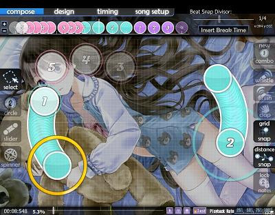

Slider (Português)
===================

Um slider é um [Hit Object](/wiki/Hit_Objects) usado frequentemente no osu!.

One of three objects the player interacts with (the other two being the [Hit Circle](/wiki/Hit_Objects) and the [Spinner](/wiki/Hit_Objects). It consists of two Hit Circles with a path between them, usually straight or curved. An [Approach Circle](/wiki/Beatmap_Editor/Song_Setup) is around the beginning Hit Circle of the Slider. Once it reaches its border, the player must tap the beginning of the Slider and then, keeping the button pressed, follow with his cursor a moving graphic (the Slider Ball - An graphic (ball-shaped by default) that moves along a Slider's path and on which a player must keep his cursor while pressing the button in order to successfully clear the Slider.) along the Slider's path until the end Hit Circle is reached. If there is a reverse arrow graphic at that point, the player follows the Slider Ball back along the same path and repeats as long as a reverse arrow graphic is visible.

Slider Ticks are small circles that appear in regular intervals along a Slider's path. The player only fails to completely clear a Slider if the cursor is not on the Slider Ball and/or the button is not pressed while the Slider Ball is passing over a tick. Not keeping the cursor on the Slider or the button pressed at any other time during a Slider's path will actually not yield any penalty. Users can adjust the number of ticks on their beatmap's Sliders. More ticks make the Combo rise faster and thus offer the oppotunity for higher scores, but at the same time they provide more chances for the player to fail to clear the Slider. Each cleared Slider Tick is worth 10 points (regardless of Combo).

Sliders are often mapped to long sounds in the music. They are also used to carry the rhythm (especially when the rhythm would be very complex without a slider), and are sometimes just used for the heck of it.

Inserindo Sliders em um Beatmap
-------------------------------

Para criar um slider em um [beatmap](/wiki/Glossary), primeiro vá ate o menu da esquerda e selecione o ícone do Slider (esteja no ponto da timeline e também da tela que pretende começar o slider). Então, clique uma vez para criar o ponto inicial do slider. Para criar um novo ponto de controle do slider, clique em outro lugar da grade e vai criar um novo ponto de controle como referencia para curvas. Ao clicar duas vezes vai fazer o ponto de controle ficar vermelho e o slider vai ter um alinhamento direto a posição exata do ponto de controle vermelho em vez de ter uma curva gradual.

Quando estiver satisfeito com seu slider, simplesmente de um clique com o botão direito na grade.

Você é livre para mover/adicionar/remover um ponto de controle depois que o slider estiver pronto. Você pode remover pontos de controle apertando o botão direito sobre eles depois de selecionar o slider, ou também pode adicionar um ponto de controle ao pressionar control e clicando em alguma parte das linhas do slider (clique duplo ou control+clique em um slider fazem um ponto vermelho). Adicionar slider repeats é simples, apenas clique e segure no final do slider na timeline mova para direita ou esquerda para criar/remover slider repeats.

Guia para criação de sliders: [Guia para Belos Sliders](/wiki/Mapping_Techniques/Making_Good_Sliders)

Inserindo hitsounds em sliders
------------------------------

Isso pode parecer óbvio para jogadores experientes. Porem, essa é uma das perguntas mais comuns feitas. Para inserir [hitsounds](/wiki/Glossary) em sliders, você deve primeiro decidir onde você quer por um hitsound. No começo? No corpo? No final? Na repeat? Tendo isso em mente, clique no slider. Então clique na parte do slider que deseja um hitsound (vai ficar destacado em vermelho). Isso é mais fácil de fazer clicando na nota na [timeline](/wiki/Beatmap_Editor/Timelines). (Quando usar kick sliders, será mais fácil se você ampliar a timeline.) E depois, clique no hitsound que deseja adicionar da lista a direita.

Slider Speed
------------

Uma **slider speed** define quanto tempo um slider demora para atravessar determinada distancia--ou o quão longe o slider chega em determinado tempo.

A Slider speed é medida em *centenas de [osupixels](/wiki/Glossary/#osupixels) por batida,* sendo assim, um slider com velocidade de 1.00 vai percorrer 100 osupixels (100 pixels em resolução 640x480) em um uma batida completa. Isso significa que sliders com uma configuração particular de velocidade vão se mover mais rápido quando o BPM for maior.

Slider speed pode ser definida na aba Timing pela janela principal do editor. você também pode definir um multiplicador para esse valor de velocidade ao adicionar uma inherited [timing section](/wiki/Beatmap_Editor/Timing).
