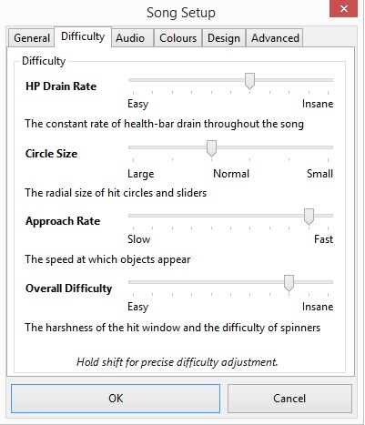
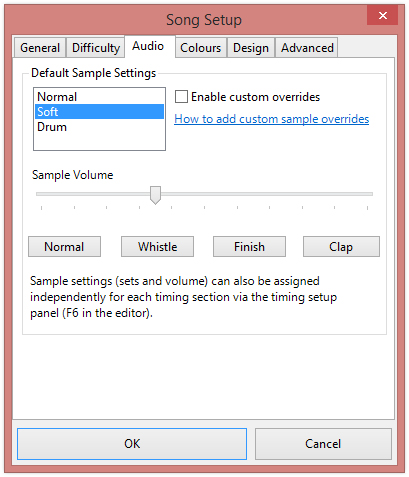
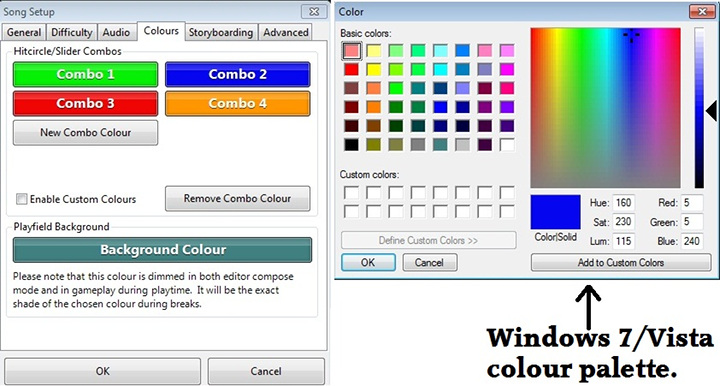
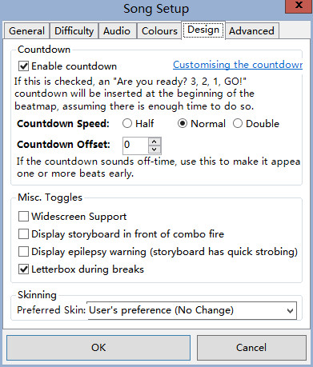
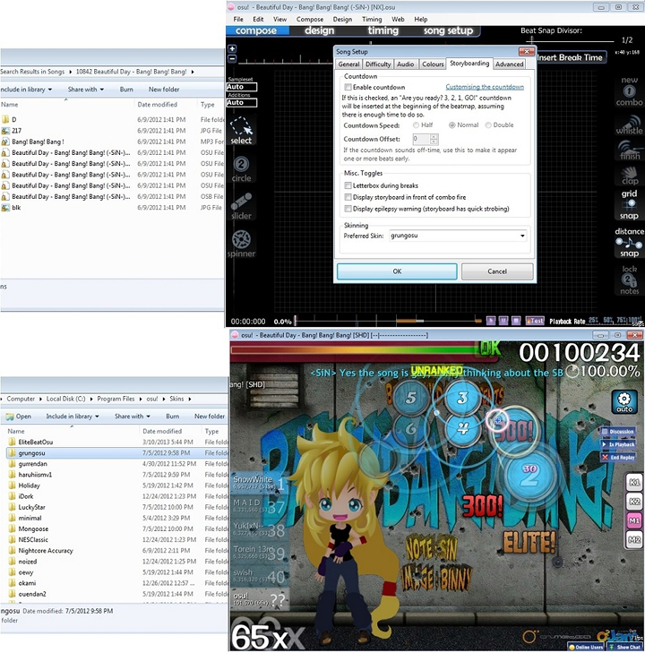
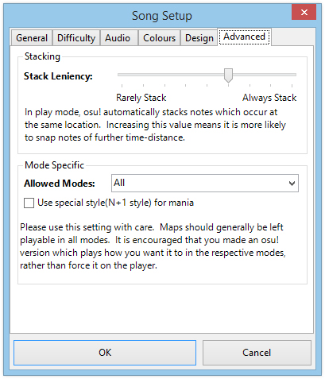

# Configuration de la chanson

Song Setup est la quatrième section de [Beatmap Editor](/wiki/Beatmap_Editor). Il contient des métadonnées et des paramètres généraux de configuration du beatmap.

## Généralités

### Métadonnées des chansons et des cartes

*Voir également : [\[Guide\] Metadata](https://osu.ppy.sh/community/forums/topics/249288 "osu! forums")*

 dans la configuration de la chanson")

Ces champs doivent être remplis avant de créer une deuxième difficulté. Ceci est principalement pour s'assurer que les métadonnées seront cohérentes à travers toutes les difficultés du beatmapset.

#### Artiste

**Le groupe, le chanteur, le compositeur ou le groupe qui a interprété ou créé la chanson.** Normalement, cela est automatiquement pris dans les métadonnées du fichier MP3, mais vérifiez l'orthographe et la ponctuation.

*Avis : Les titres d'anime ou de jeu appartiennent à la catégorie [Source](#source). Les noms des vocaloïdes ou des sociétés appartiennent à la catégorie [Tags](#balises)*

Les noms étrangers/orientaux doivent être présentés dans le même ordre que celui utilisé sur Wikipédia (généralement, le prénom suivi du nom de famille ; l'ordre occidental, par souci de cohérence).

Ce champ doit être préféré à l'orthographe des sources de diffusion officielles. L'artiste peut parfois être trouvé sur [Wikipedia](https://www.wikipedia.org) ou d'autres sources non officielles telles que [Anime News Network](https://www.animenewsnetwork.com) ou [MyAnimeList](https://myanimelist.net). Comme pour toute source non officielle, le contenu fourni doit être vérifié par recoupement avec les sources officielles ou, s'il fournit un lien vers la source officielle, il faut plutôt consulter la source officielle. En cas de doute, remplissez toutes les informations connues maintenant et faites un post de demande de vérification.

##### Artiste romanisé

**Le nom romanisé de l'artiste** doit être présenté dans le même ordre que celui utilisé sur Wikipédia (généralement, le prénom suivi du nom de famille ; l'ordre occidental, par souci de cohérence). Ce champ ne sera disponible que si des caractères Unicode sont utilisés dans la catégorie [Artist](#artiste).

#### Titre

**Le titre de la chanson**. Normalement, il est automatiquement extrait des métadonnées du fichier MP3, mais vérifiez l'orthographe et la ponctuation.

##### Titre romanisé

**Le nom romanisé de la chanson.** Ce champ ne sera disponible que si des caractères Unicode sont utilisés dans la catégorie [Title](#titre).

#### Créateur de Beatmap

**Le nom d'utilisateur du créateur de la beatmap.** Le client du jeu devrait gérer cela automatiquement et ne vous permettra pas de modifier ce champ, c'est-à-dire si vous êtes le créateur.

*Avis : Les noms d'utilisateur de [Guest Creators](/wiki/GD) appartiennent à la catégorie [Difficulty](#difficulté) et/ou [Tags](#balises).*

#### Difficulté

**Le nom du beatmap, autrement dit, le nom de la difficulté.** La liste déroulante contient les noms prédéfinis de `Easy`,  `Normal`, `Hard` et `Insane`. Le créateur peut sélectionner un des noms de préréglage dans le menu déroulant ou en taper un. Bien qu'il soit bon d'être créatif, essayez de rendre les noms de difficulté très clairs quant à la difficulté qu'ils représentent. Les noms de difficulté ambigus ennuieront les joueurs et ne sont pas classables.

Ce champ peut également être utilisé pour indiquer qu'il s'agit d'une difficulté d'invité (par exemple "Larto's Hard").

#### Source

**L'origine de la chanson.** En général, ce champ ne doit être utilisé que pour les chansons d'anime ou de jeux vidéo et occasionnellement pour les chansons de nouveauté (films, TV ou Internet).

Si la chanson est tirée d'un anime, d'un jeu vidéo, ou est célèbre pour son utilisation dans un film ou une émission de télévision ; alors le titre de cette source doit être ajouté dans ce champ. Dans le cas contraire, ce champ doit être laissé vide.

*Avis : Ceci ne doit pas être utilisé pour les titres d'albums, ceux-ci appartiennent à la catégorie [Tags](#balises).*

Toutes les chansons n'ont pas besoin de quelque chose sur le champ source. La source est seulement pour les chansons qui proviennent de quelque chose (par exemple un jeu vidéo ou un anime). Pour les chansons rock et pop, ce champ peut être laissé vide. D'autres informations pertinentes doivent être entrées dans la catégorie [Tags](#balises) comme le titre de l'album ou des informations sur les sous-genres

#### Balises

**Une liste de mots-clés pour aider à la recherche.** En général, les balises devraient inclure les noms d'albums, les noms d'utilisateurs des créateurs invités, les noms de sociétés et d'autres termes qui peuvent être utilisés par les utilisateurs lors de la recherche de beatmaps. Si la beatmap comporte des éléments de collaboration (comme le scénarimage) réalisés par d'autres utilisateurs, leurs noms d'utilisateur devraient être ajoutés à ce champ.

Les balises sont séparées par des espaces. Il n'est pas nécessaire d'utiliser ce champ car d'autres métadonnées des autres champs sont utilisées pour aider à la recherche de beatmaps ; cependant, il est très apprécié des utilisateurs qui essaient de trouver un beatmap spécifique.

## Difficulté

*Remarque : Le mode de jeu spécifique [Ranking Criterias](/wiki/Ranking_Criteria) ont des valeurs de classement qui devraient être utilisées.*

Les réglages de difficulté de la carte de rythme ; chaque réglage affecte différents aspects de la carte de rythme.

*Remarque : En maintenant la touche `Shift` enfoncée, on peut régler avec précision la valeur 0,1 par rapport au réglage standard de la valeur 1.*

La notation courante pour représenter un réglage de difficulté et sa valeur est l'abréviation du réglage suivie de la valeur du réglage. Par exemple, `CS4` et `HP4.3` seraient une carte de rythme avec une taille de cercle de 4 et un taux de drainage de HP de 4,3 respectivement. En théorie, les réglages de difficulté négative peuvent ressembler à `AR-2` pour un taux d'approche de -2.

### Débit de drainage HP

Le taux de drainage HP, communément abrégé en HP, détermine le taux de récupération de la santé à partir de bons scores de coups et la punition de la santé à partir de mauvais scores de coups. La valeur varie de 0 à 10 ; des valeurs de HP plus élevées donneront une récupération de santé plus faible avec une punition de santé plus élevée.

Dans osu!standard et osu!catch, cela affecte également le [Passive HP](/wiki/Passive_HP) (la vitesse constante à laquelle HP diminue, sauf pendant les[Breaks](/wiki/Breaks).

*Remarque : Plus de HP est récupéré avec [Geki and Katu](/wiki/Score#osu) les scores de coups, qui peuvent être donnés à partir du dernier objet touché dans un combo.*

### Taille du cercle

*Remarque : Cette option est visible dans osu!taiko, mais elle ne fait rien qui affecte le gameplay.*

La taille du cercle, communément abrégée en CS, n'existe que dans osu!standard et osu!catch. CS détermine la taille des objets touchés ou, plus précisément dans osu!catch, détermine la taille du receveur et du fruit. Les valeurs vont de 2 à 7 ; des valeurs CS plus élevées rendront les objets touchés plus petits. L'utilisation de la valeur la plus élevée rendra les objets touchés aussi gros que le curseur.

La plupart des beatmaps utilisent une valeur de 3 ou 4, alors qu'une valeur de 5 ou 6 est parfois utilisée et qu'une valeur de 7 n'est presque jamais utilisée. Une valeur de 7 et plus est susceptible d'être vue lorsque l'on utilise le mod [Hard Rock](/wiki/HR).

Il est possible de définir la valeur de la CS à une valeur inférieure à 2 ou supérieure à 7 en éditant manuellement le fichier OSU, mais ceci est à éviter car il est considéré comme non classable.

#### Nombre de clés

Key Count, aussi connu sous le nom de Keys, remplace le [Circle Size](#taille-du-cercle) métrique pour [osu!mania-specific](#mode-spécifique) des cartes de rythme. Key Count est explicite, il définit le nombre de clés utilisées. Les valeurs vont de 1 à 9 touches.

Si vous cochez la case `Mode Co-op`, le montant actuellement sélectionné sera doublé (à partir de 5), ce qui donne un total de 10K (5), 12K (6), 14K (7), 16K (8) et 18K (9).

### Taux d'approche

*Remarque : Cette option est visible dans osu!taiko et osu!mania, mais elle ne fait rien qui affecte le gameplay. C'est principalement parce que les deux utilisent une vitesse de défilement, qui est basée sur le BPM (battements par minute).*

Le taux d'approche, communément abrégé en AR, n'existe que dans osu!standard et osu!catch. Les valeurs vont de 0 à 10 ; des valeurs AR plus élevées rendront les fenêtres de frappe des objets frappés plus courtes. AR indique combien de temps les objets frappés resteront à l'écran, à partir du moment où ils apparaissent jusqu'au moment de taper/recueillir.

Des taux d'approche plus élevés signifient que les objets touchés seront montrés pendant une période plus courte, ce qui donne moins de temps de réaction pour planifier à l'avance. Inversement, des vitesses d'approche plus faibles signifient que les objets touchés seront affichés à l'écran plus longtemps, ce qui laisse plus de temps pour réagir, mais peuvent entraîner l'apparition d'une quantité excessive d'objets touchés à l'écran en même temps si AR est trop faible.

---

La durée d'un hit object qui reste visible à l'écran (sans mods) va de 1800ms à AR0 à 450ms à AR10.

Il existe quatre modes qui modifient la synchronisation du taux d'approche lorsqu'ils sont activés :

- [Easy](/wiki/EZ): Réduit de moitié la valeur AR. (par ex. AR10→AR5)
- [Hard Rock](/wiki/HR): Multiplie la valeur AR par 1,40, jusqu'à un maximum de AR10. (p. ex. AR3→AR4.2 ou AR9→AR10)
- [Double Time](/wiki/DT): La valeur AR n'est pas affectée, mais en raison de l'augmentation de 50 % de la vitesse de jeu, les cercles restent à l'écran 33 % plus courts.
- [Half Time](/wiki/HT): La valeur AR n'est pas affectée, mais en raison de la diminution de 25 % de la vitesse de jeu, les cercles restent à l'écran 33 % de plus en millisecondes.

Bien que le Half Time et le Double Time ne changent pas la valeur AR réelle donnée, la différence de vitesse entraîne un changement apparent de AR, aussi bas que AR-5 ou aussi haut que AR11. Dans le graphique AR fourni, ces valeurs apparentes sont données pour permettre une comparaison facile entre les vitesses d'approche avec et sans mods. La valeur AR réelle, cependant, est toujours un nombre compris entre 0 et 10. Notez que les niveaux AR s'échelonnent de 120 ms pour une vitesse inférieure à AR5 et de 150 ms pour une vitesse supérieure à AR5.

### Difficulté générale

*Avis : Sur la page de la carte des temps, la difficulté globale est indiquée comme précision.*

La difficulté globale, communément abrégée en OD, définit la difficulté à atteindre une haute précision. Les valeurs vont de 0 à 10 ; des valeurs de OD plus élevées nécessiteront plus de précision et d'exactitude. Comme la précision est importante pour obtenir des HP, la Difficulté Globale influence indirectement la difficulté à passer la carte de rythme. Des valeurs OD plus élevées signifient des fenêtres de temps plus courtes pour nettoyer les objets touchés, à la fois en général et en termes d'obtention de la valeur de score la plus élevée de l'objet touché.

En osu!standard, cela concerne également les pirouettes, dans lesquelles il faut les faire tourner davantage pour remplir la jauge à temps. Dans osu!taiko, le denden (spinner osu!taiko) aura aussi besoin de plus de coups pour le dégager.

*Remarque : Ceci implique que le fait de relever le OD trop haut peut rendre des spinners précédemment possibles presque impossibles à dégager à temps.*

Dans osu!standard, le système de chronométrage ne permet pas de frapper un objet jusqu'à ce que l'objet précédent soit frappé (ou manqué après le passage de la fenêtre de frappe), ce qui entraîne un échec. Avec une valeur OD basse, la fenêtre de frappe d'un objet peut se chevaucher avec la suivante. Ainsi, un joueur pourrait frapper le second objet avec un timing parfait après avoir échoué à frapper le premier objet, mais cela aurait pour résultat de manquer complètement les deux objets en raison de la fenêtre de frappe du premier objet actif.

---

À OD0, un joueur peut obtenir un score de 300 à moins de 79,5 ms de l'atteindre exactement à temps. À l'autre extrémité de l'échelle, OD10 exige d'être à moins de 19,5 ms pour le même score de 300.

Il existe quatre modes qui modifient le timing de la Difficulté Générale lorsqu'ils sont activés :

- [Easy](/wiki/EZ): Réduit de moitié la valeur de OD.
- [Hard Rock](/wiki/HR): Multiplie la valeur OD par 1,4, jusqu'à un maximum de OD10.
- [Double Time](/wiki/DT): La valeur OD n'est pas affectée, mais en raison de l'augmentation de 50% de la vitesse de jeu, les fenêtres de frappe sont 33% plus courtes.
- [Half Time](/wiki/HT): La valeur OD n'est pas affectée, mais en raison de la diminution de 25% de la vitesse de jeu, les fenêtres de frappe sont 33% plus longues.

Bien que Half Time et Double Time ne changent pas la valeur réelle de OD, l'effet de la vitesse sur les fenêtres de frappe fera que les objets frappés sembleront avoir une OD apparente plus ou moins élevée, respectivement. Dans le graphique OD fourni, les valeurs d'OD apparentes sont fournies pour permettre la comparaison entre les timings avec et sans ces mods. Notez que ces valeurs d'OD apparentes ne s'appliquent qu'aux 300s sur les cercles. Les fenêtres pour les 100s, les 50s et les sliders (qui utilisent la fenêtre des 50 coups) s'échelonnent plus sévèrement avec le Double Time que ne le suggère cette OD apparente et plus clémente avec le Half Time. Encore une fois, en dehors de NoMod, HR, et EZ (sur le côté gauche) ; les valeurs de OD fournies sont seulement pour comparaison : la valeur de OD réelle est toujours un nombre de 0 à 10.

## Audio

### Paramètres d'échantillonnage par défaut

Configuration pour les hitsounds. L'utilisation de cette option s'appliquera globalement sur l'ensemble de la carte des temps ; cependant, l'utilisation de l'option dans la section [timing](/wiki/Timing). (`F6`), le créateur peut changer les deux sets de hitsounds ou le volume individuellement par des points de chronométrage. `Sample Set Selection` et le `Sample Set Volume` sera inaccessible s'il y a des réglages de volume sensibles au temps utilisés dans le beatmap. En cliquant sur le bouton `Reset Settings` supprimera tous les réglages personnalisés du volume de chronométrage.

#### Sélection du jeu d'échantillons

Choisissez d'utiliser les jeux d'échantillons intégrés `Normal`, `Soft` ou `Drum` globalement. Il est possible de [permettre des modifications personnalisées](/wiki/custom_sample_overrides) pour utiliser les fichiers hitsounds dans le dossier du beatmap en premier pour les hitsounds personnalisés.

#### Volume du jeu d'échantillons

Régler le volume de la série d'échantillons globalement.

#### Jeu d'échantillons de test

Cliquer sur ces boutons pour tester le son du jeu d'échantillons. Quatre boutons sont fournis, à savoir : `Normal`, `Whistle`, `Finish`, et `Clap`. Ces sons sont additifs ; `Whistle` est une combinaison de `Normal` et de `Whistle`.

### Divers. Toggles

La case `Samples match playback rate (for fully-hitsounds maps)` ajustera le pitch des hitsounds en conséquence pour correspondre aux modificateurs de vitesse (à la fois dans l'éditeur et dans le jeu). Décocher cette option permettra aux hitsounds de jouer à leur propre hauteur de son prédéfinie.

## Couleurs

Configurez les couleurs du combo et la couleur de fond du terrain de jeu.

### Combos Hitcircle/Slider

Configurez le jeu de couleurs du combo personnalisé. La coloration du combo est un aspect important de la valeur esthétique d'un beatmap.

En cliquant sur une couleur combinée ou en cliquant sur  `Nouvelle couleur combinée`, le sélecteur de couleurs du système d'exploitation s'ouvre (comme indiqué dans l'image ; le sélecteur de couleurs de Windows). Choisissez des couleurs qui complètent l'arrière-plan, et non qui se camouflent dans l'arrière-plan.

Au maximum, huit couleurs de combo peuvent être sélectionnées, bien que la plupart des beatmaps en utilisent généralement quatre.

La case `Activer les couleurs personnalisées` doit être cochée pour activer la combinaison de couleurs personnalisée définie ci-dessus. Si vous la décochez, vous retrouverez les paramètres de couleur par défaut ou les paramètres de couleur de la combinaison de peau du joueur. Il est généralement recommandé de la garder cochée pour que la beatmap puisse avoir sa propre identité unique en termes de couleurs de combo. Il peut être décoché sans risque pour les beatmaps spécifiques à osu!taiko- et osu!mania.

Cliquer sur `Remove Combo Colour` supprimera la dernière couleur de combo définie.

### Arrière-plan du terrain de jeu

Cliquez sur la `Couleur de fond` pour changer la couleur de fond du terrain de jeu vierge.

Un paramètre discutable à changer sauf pour les storyboards qui peuvent exposer l'arrière-plan du terrain de jeu vierge.

## Conception

### Compte à rebours

Cochez la case `Activer le compte à rebours` pour activer l'animation du compte à rebours avant le démarrage du beatmap.

Lorsqu'elle est activée, l'animation du compte à rebours peut être affinée en utilisant les boutons radio `Vitesse du compte à rebours`(`Half`, `Normal`, `Double`) et le `Décalage du compte à rebours` (la valeur par défaut est 0 ; une valeur plus élevée signifie un compte à rebours plus précoce).

### Divers. Toggles

- `Support d'écran large` : Supprimer [sidebars/pillarboxes](https://en.wikipedia.org/wiki/Pillarbox "Wikipedia") des côtés gauche et droit du terrain de jeu si le client utilise un rapport d'aspect supérieur à `4:3`. Ceci est généralement activé lors de l'utilisation d'éléments de story-board mais peut être désactivé.
- `Display storyboard in front of combo fire` : Un réglage obsolète, on peut l'ignorer.
- `Display epilepsy warning (storyboard has quick strobing)` : Afficher un avertissement d'épilepsie pour les storyboards (rapides ou autres) clignotants dans le beatmap.
- `Letterbox during breaks` : Déterminer si le beatmap doit (ou ne doit pas) mettre [letterboxes](https://en.wikipedia.org/wiki/Letterboxing_(filming) "Wikipedia") pendant les pauses dans le beatmap. Ceci est généralement activé par défaut, mais l'utilisation de cette option dans les beatmaps spécifiques à osu!mania n'est pas autorisée.

### Skinning

Le menu déroulant `Preferred Skin` est utilisé pour définir le skin préféré pour la carte des temps. L'utilisation de cette option suppose que le joueur a le skin que vous voulez qu'il utilise. Cependant, si le joueur n'a pas le skin, une notification apparaîtra pour le joueur, indiquant que le skin demandé est manquant, mais que le skin actuel du joueur sera utilisé à la place. Par défaut, `Préférence de l'utilisateur (pas de changement)` est utilisé.

Vous pouvez cependant inclure les éléments de skin à l'intérieur du dossier beatmap. Comme la plupart des créateurs le feront à la place, cette option est rarement utilisée à moins qu'elle ne réduise la taille du fichier ou qu'elle fasse partie d'un projet beatmap, où le skin peut être fourni sur la page du projet elle-même.

## Avancé

### Empilage

Dans osu!standard, les objets frappés s'empilent automatiquement s'ils sont tous les deux placés au même endroit tout en étant proches dans le temps. Ceci pour aider les joueurs à voir les objets touchés qui se chevauchent.

En déplaçant le curseur vers la droite, la "proximité" des objets touchés sera espacée dans le temps avant que l'empilage n'ait lieu. [Rules](/wiki/rc_osu!#gameplay) dictent que si `Stack Leniency` est réglé pour que l'empilement ne se produise plus, le créateur doit manuellement décaler les objets touchés. Il est préférable de laisser cette option telle quelle, avec sa valeur par défaut `7`.

*Avis : Les cercles de frappe empilés dans osu!standard se déplaceront vers le point où l'empilement se produit.*

Les objets sont considérés comme appartenant à la même pile s'ils sont à la même coordonnée et pas plus loin dans le temps que `[(Approach Window) * (Stack Leniency) / 10]`, ou `Approach Window` est la durée pendant laquelle les objets restent à l'écran (voir [Approach Rate](#taux-d'approche) plus haut).

### Mode spécifique

`Allowed Modes` est un menu déroulant qui confirme que le beatmap ne peut être joué que par le mode spécifié. Le réglage par défaut est `All`, ce qui signifie que le créateur va créer un beatmap osu!standard qui peut être converti dans les autres modes de jeu. Il peut être modifié pour être spécifique à osu!taiko, osu!catch ou osu!mania ; mais gardez à l'esprit que le changement supprimera tous les objets touchés dans le beatmap.

*Remarque : Décidez au moment de la création et confirmez le(s) mode(s) jouable(s) du beatmap avant d'ajouter tout objet de frappe pour éviter de gaspiller l'effort.*

*Remarque : osu!mania a son propre éditeur de beatmap qui est différent de l'éditeur de beatmap typique.*

La case `Utiliser un style spécial (style N+1) pour la manie` ne fait rien, considérant que le joueur peut définir une préférence personnelle spécifiquement dans  [Options](/wiki/Options) en utilisant le bouton `osu!mania layout`.

## Anecdotes

- L'onglet `Design` était autrefois appelé "Storyboarding".
- Dans l'onglet `Difficulté`, il y avait auparavant `Classement de difficulté approximatif` qui est un résumé de tous les paramètres choisis sur cette page. Plus d'étoiles impliquerait un beatmap plus difficile. Cependant, ce n'était pas le classement final par étoiles de la carte de rythme car c'était juste une approximation basée sur les réglages de difficulté actuels. Ceci a été remplacé par une étiquette expliquant que le fait de maintenir `Shift` permettrait d'affiner les valeurs par un incrément de 0,1.
