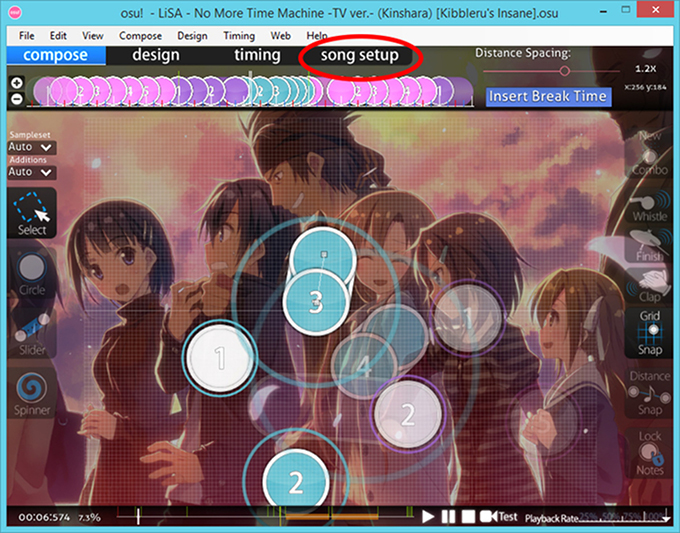
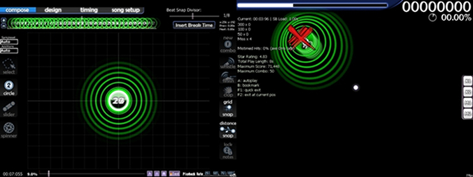

# Paramètres de la beatmap

Les paramètres d'une beatmap est une étape importante dans le [beatmapping](/wiki/Beatmapping), puisqu'il contient des paramètres importants qui sont les clés pour créer une map correcte.

## Général

### Métadonnées de la musique et de la map

")

")

[Guide pour trouver les métadonnées (anglais)](https://osu.ppy.sh/community/forums/topics/249288).

Toutes les musiques n'ont pas besion d'avoir quelque chose dans le champ "Source". La source est uniquement utilisée pour les musiques qui viennent de quelque chose de spécifique, comme un Jeu Vidéo ou un Anime. Les chansons de rock ou de pop régulières peuvent laisser ce champ vide.

Vous pouvez mettre le nom de l'album dans les "Tags", avec les informations spécifiques au sous-genre.

Vous devriez entrer ces informations avant de créer une seconde difficulté, pour assurer que ce champ soit cohérent entre toutes les difficultés du set.

-   **Artist (Artiste) :** **La bande, chanteur, ou groupe qui a joué ou crée la musique.** osu! prendra l'artiste du fichier mp3 si présent, mais assurez-vous qu'il soit correctement écrit. **Les noms d'anime/jeux vidéos et des compagnies n’appartiennent pas a ce champ (ils se trouvent habituellement dans "Tags").** Vous pouvez habituellement trouver les compositeurs des musiques d'Anime ou de Jeux Vidéos sur Wikipédia ou s'autres sources sûres comme [AnimeNewsNetwork](https://www.animenewsnetwork.com/) ou [MyAnimeList](https://myanimelist.net/) (sites en anglais). Les noms doivent être présenté de la même manière que sur Wikipédia (habituellement, Prénom suivi du Nom de famille).

<!-- -->

-   **Romanised Artist (Artiste Romanisé) :** **Le nom romanisé (sans accents) de l'artiste.** Les noms doivent être présenté de la même manière que sur Wikipédia (habituellement, Prénom suivi du Nom de famille). Ce champ devient actif si des caractères Unicode sont utilisés dans le champ "Artist", comme des caractères japonais ou des accents.

<!-- -->

-   **Title (Titre) :** **Le nom de la musique.** Il sera pris automatiquement du fichier mp3, mais revérifiez pour des erreurs d'orthographe et les majuscules, surtout si vous obtenez le mp3 en ligne.

<!-- -->

-   **Romanised Title (Titre romanisé) :** **Le nom romanisé (sans accents) de la musique.** Ce champ devient aussi actif si vous utilisez des caractères Unicode dans le champ "Title".

<!-- -->

-   **Beatmap Creator (Créateur de la beatmap) :** **C'est vous.** osu! devrait s'occuper de ceci automatiquement, vous ne devriez donc pas y toucher. Si vous ajoutez une [guest difficulty](/wiki/Glossary) crée par quelqu'un d'autre, leur nom appartient au champs "Difficulty" et "Tags" ci-dessous, pas ici.

<!-- -->

-   **Difficulty (Difficulté) :** **Le nom de la difficulté de la map.** Le menu déroulant contient des noms prédéfinis : Easy, Normal, Hard, Insane. Vous pouvez choisir un des noms par défaut, ou créer le votre. Bien qu'il soit bon d'être créatif, restez spécifique sur lesquels sont plus difficiles que les autres puisque des noms ne voulant rien dire peuvent agacer les joueurs. Il s'agit aussi du champ ou vous indiquez des mappers invités s'il s'agit de la leur (ex : "Larto's Hard").

<!-- -->

-   **Source :** **D'où vient la musique.** Ce champ devrait généralement être utilise pour des musique d'Anime ou de Jeux Vidéos, et occasionnellement des chansons de Novelty (Films, Télévision ou Internet). Si la musique vient d'un Anime ou d'un Jeu Vidéo, ou si il est célèbre pour avoir été utilisé dans une série télé ou un film, le nom de la source vient ici. Les chansons de Rock et Pop devraient généralement laisser ce champ vide. **Il n'est pas utilisé pour les choses tels que les noms d'album.**

<!-- -->

-   **Tags :** **Mots-clés pour aider dans les recherches.** Les utilisations communes des Tags comprend les noms d'albums, nom des créateurs de GD, nom d'une compagnie et d'autres termes qui puissent être utilisés par d'autre personnes quand ils recherchent quelque chose de particulier (comme eroge ou visual novel si la musique est basé sur un visual novel eroge). Si votre map possède des éléments de "Collab" fait par d'autres mappers, leur noms peuvent aller ici. Les tags sont déparés par des espaces. Il n'est pas obligatoire de remplir ce champ mais il est grandement apprécié en utilisant les fonctions de recherche sur le site web et dans le jeu.
    -   Note : Si vous avez "azertyuiop" comme tag dans votre beatmap, vous pouvez aussi le trouver dans le jeu en tapant "azertyuiop".

Une fois encore, pour éviter des problèmes, assurez vous que tous les champs (sauf "Difficulty") soient tous remplis identiquement dans toutes les difficultés. D'autres règles sont aussi mises en place, merci de lire les [critères de ranking](/wiki/Ranking_Criteria).

## Difficulty (Difficulté)

Onglet en relation avec le cœur des paramètres de la beatmap. Chaque paramètre affecte différent aspects de la beatmap.

### HP Drain Rate (Drain de vie)

Aussi connu en tant que "**HP**" lors de la sélection d'une beatmap.

La vitesse à laquelle la vie diminue, qui est toujours constante sauf pendant une pause. Plus de vie est perdue avec des miss. La vie peut être récupérée en obtenant des [valeurs de points](/wiki/Score) et en tournant des spinners. Plus de vie est récupérée en obtenant [des Geki et des Katu](/wiki/Score) à la fin d'un combo.

### Circle Size (Taille des cercles; osu!, osu!catch, osu!taiko seulement)

Aussi connu en tant que "**CS**" lors de la sélection d'une beatmap.

Ceci détermine la taille des cercles et des sliders. La valeur varie entre 2 et 7 avec les plus petites valeurs donnant des plus grosses tailles. Les petits cercles rendent la map difficile en exigeant le joueur à être plus précis.

La plupart des maps utilisent les tailles 3, 4 et 5. 6 est parfois utilisé et 7 est quasiment jamais utilisé (les objets font quasiment la taille du curseur par défaut). 7 a plus de chances d'être utilisé un utilisant le mod [Hard Rock](/wiki/Game_Modifiers). Un exemple d'une [beatmap utilisant 3, 5, 6, et 7 par défaut](https://osu.ppy.sh/beatmapsets/2008) et une [beatmap qui utilise 0, 1, 3 et 4 par défaut](https://osu.ppy.sh/beatmapsets/1208).

Il est possible en éditant manuellement le fichier `.osu` pour assigner une valeur entre 0 et 10 mais il est déconseillé de faire ceci puisque des valeurs non comprises entre 2 et 7 sont considérés non rankables.

#### Key Count (Nombre de touches; osu!mania seulement)

Aussi connu en tant que "**CS**" lors de la sélection d'une beatmap.

Cela détermine le nombres de touches pour la difficulté. La valeur varie entre 1 et 9 avec le nombre choisi signifiant le nombre de touches xK utilisées pour la difficulté.

Cliquer sur la case "Co-op mode" double le nombre actuel de touches (à partir de 5), allant à 10K (5), 12K (6), 14K (7), 16K (8), et 18K (9).

### Approach Rate (Vitesse d'approche)

Aussi connu en tant que "**AR**" lors de la sélection d'une beatmap.

#### Général

L'Approach Rate est un nombre (entre 0 et 10) indiquant combien de temps les objets restent à l'écran, du moment où ils apparaissent jusqu'au moment ou vous cliquez dessus. Des AR plus hauts feront en sorte que les objets seront montrés pendant une période de temps plus courte, vous donnant moins de temps pour réagir et prévoir quand cliquer. À l'inverse, des AR plus bas feront en sorte que les objets restent à l'écran plus longtemps. Cela vous donne plus de temps pour réagir aux objets présents, mais peut résulter en un nombre excessif d'objets à l'écran si l'AR est trop bas.

#### Détails techniques

La durée de présence des objets à l'écran (sans mods) peut aller de 1800 ms en AR0, jusqu'à 450 ms en AR10.

Quatre mods peuvent altérer l'AR quand actifs :

-   [Easy](/wiki/Game_Modifiers): Divise par 2 l'AR. (*ex.* AR10→AR5 ... AR2→AR1)
-   [Hard Rock](/wiki/Game_Modifiers): Multiplie l'AR par 1.4, jusqu'à un maximum de AR10. (*ex.* AR3→AR4.2 ... AR9→AR10)
-   [Double Time](/wiki/Game_Modifiers): La valeur de l'AR ne change pas, mais la vitesse de jeu de 1.5x cause les objets à apparaître 33% moins longtemps.
-   [Half Time](/wiki/Game_Modifiers): La valeur de l'AR ne change pas, mais la vitesse de jeu de 0.75x cause les objets à apparaître 33% plus longtemps.

**Note :** Alors que HT et DT ne change pas la valeur actuelle de l'AR, la différence de vitesse peut mener à un AR semblable à -5 ou jusqu'à 11. Sur le tableau à droite, ces valeurs apparentes sont données pour permettre une comparaison facile entre les vitesse d'approche avec et sans mods. Cependant, l'AR actuel est toujours un nombre entre 0 et 10. Sachez que les niveaux d'AR s'incrémentent de 120 ms sous AR5, et 150 ms au dessus d'AR5.

### Overall Difficulty (Difficulté Générale)

Aussi connu en tant que "**OD**" lors de la sélection d'une beatmap.

#### Général

L'Overall Difficulty est un nombre (entre 0 et 10) qui indique la difficulté pour obtenir une haute précision. Puisque la précision est importante pour obtenir de la vie, l'OD influe directement la difficulté pour passer la map. Des OD plus hauts signifient une fenêtre de temps plus petites pour cliquer sur les objets, et en général et pour obtenir un 300. Les Spinners doivent aussi être tournés plus rapidement afin de remplir la jauge à temps. Sachez que dans certains cas, augmenter l'OD peut rendre des spinners précédemment possible impossibles.

#### Détails techniques

À OD0, un 300 peut être obtenu a moins de 79.5 ms par rapport au moment précis. Dans l'autre cas, OD10 requiert moins de 19.5 ms pour un 300.

Quatre mods peuvent altérer l'OD quand actifs :

-   [Easy](/wiki/Game_Modifiers): Divise par deux l'OD.
-   [Hard Rock](/wiki/Game_Modifiers): Multiplie l'OD par 1.4, jusqu'à un maximum de OD10.
-   [Double Time](/wiki/Game_Modifiers): La valeur de l'OD ne change pas, mais la vitesse de jeu de 1.5x cause la fenêtre de temps à être 33% plus courte.
-   [Half Time](/wiki/Game_Modifiers): La valeur de l'OD ne change pas, mais la vitesse de jeu de 0.75x cause la fenêtre de temps à être 33% plus longue.

**Note :** Alors que HT et DT ne changent pas la valeur actuelle de l'OD, l'effet de la vitesse sur les fenêtres de temps feront croire que les objets ont un OD plus long ou court, selon le mod actif. Dans la charte ci-dessous, des valeurs semblables sont données pour permettre un comparaison entre les OD avec ou sans mods. Sachez que ces OD ne s'appliquent qu'aux 300. Les fenêtres pour les 100, 50 et les sliders (qui utilisent la fenêtre pour un 50) sont plus stricts avec DT et moins stricts avec HT, contrairement à ce que l'OD suggeste. Encore une fois, en dehors de NoMod/HR/EZ (à gauche), les valeurs ci-dessous ne sont que pour comparaison : l'OD actuelle est toujours une valeur entre 0 et 10.

**Note :** Le système de timing d'osu! n'autorise pas un [cercle](/wiki/Hit_Objects) a être cliqué avant que le précédent ne soit cliqué ou la fenêtre de temps s'est écoulée (résultant en un miss). Avec un OD bas, la fenêtre de temps d'un cercle peut se chevaucher avec la suivante. Donc, quelqu'un peut cliquer le second cercle avec un timing parfait (après avoir manqué la première note) et se retrouver à rater les deux notes puisque la fenêtre de temps du premier cercle ne s'était pas encore terminée.

## Audio

### Default Sample Settings (Sons par défaut)

Vous pouvez configurer ici les hitsounds à votre goût.

Si vous avez des [sections de timing](/wiki/Beatmap_Editor/Timing) (F6) qui changent le set de hitsounds ou le volume, vous ne pourrez pas les ajuster ici. Vous pouvez cliquer sur le bouton Reset Settings pour les enlever. La plupart des mappers utilisent les sections de timing pour paramétrer ce que vous trouvez ici.

#### Sample Set Selection (Sélection du set de sons)

Ici vous pouvez choisir entre les sets de sons Normal, Soft (doux) ou Drum (tambours) par défaut. Vous pouvez aussi [activer des sons personalisés](/wiki/Beatmap_Editor_Guides/Custom_Sample_Overrides) (Ajoutez des fichiers de hitsounds dans le dossier de la map d'abord).

#### Sample Set Volume (Volume des sons)

Ici vous pouvez ajuster le volume des hitsounds. Cela est important, puisque même si vous voulez entendre les hitsounds (un aspect important d'osu! et osu!mania), vous ne voudrez pas que les hitsounds couvrent la musique actuelle.

#### Test Sample Set (Test des sons)

Cliquez sur les boutons pour tester les hitsounds actuels. Ces sons sont additifs, Whistle est une combinaison de Normal et Whistle.

## Colours (Couleurs)

Cette section est utilisée principalement pour assigner des couleurs de combo. Ces couleurs sone un aspect important de la valeur esthétique de la beatmap, puisque il y aura beaucoup de cercles et de sliders dans la map. Cliquer sur une couleur ouvre la fenêtre de sélection de couleur de votre système d'exploitation (sur l'image ci-contre, Windows). Choisissez des couleurs qui complimentent l'arrière-plan mais qui ne se camouflent pas avec. Jusqu'à 8 couleurs peuvent être utilisées, bien que la plupart des maps en utilisent quatre. Cliquer sur "Remove Combo Colour" supprimera la couleur avec le numéro le plus élevé (en d'autres termes, ordre inverse 8-7-6-5-4-3-2).

L'autre partie de cette fenêtre permet d'assigner une couleur à l'arrière plan, mais c'est inutile puisque les maps ne peuvent pas être rankées sans arrière-plan, ce dernier annulant ce paramètre sauf si vous utilisez un storyboard où ce paramètre est visible.

## Storyboarding

Cet onglet contient les options sur comment certains éléments visuels apparaissent dans la beatmap.

### Countdown (Compte a rebours)

Un compte à rebours simile aux jeux DS EBA et Ouendan.

Vous pouvez changer la vitesse et le décalage du compte à rebours.

### Misc.Toggles (Autres options)

**Wide Screen Support (Support Écran Large)** : Retire les bords à gauche et à droite de l'écran si la résolution du jeu est différente de 4:3. Cette option est automatiquement activée quand vous commencez à utiliser des éléments de storyboard.

**Display storyboard in front of combo fire (Afficher le combo devant le combo fire)** : Il y a très longtemps, osu! avait du feu si vous obteniez un combo de 30 ou plus (c'était incroyable à l'époque !) mais il a maintenant été retiré... laissant cette potion quelque peu obsolète. Sinon, cette potion fait ce qu'elle dit, met le storyboard en face du combo fire.

**Display epilepsy warning (storyboard has quick strobing) (Afficher un avertissement d'épilepsie (le storyboard à des images stroboscopique))** : fait ce que ça dit, ajoute un avertissement pour avertir des flashs (rapides ou similaires) dans la beatmap causé par le storyboard. Extrait des [critères de ranking](/wiki/Ranking_Criteria) : "*Les maps qui possèdent des flashes, des pulsations ou des clignotements répétitifs doivent absolument afficher l'avertissement destinés aux joueurs épileptiques.*"

**Letterbox during breaks (Letterbox pendant les pauses)** : Cette option détermine si il faut (ou non) ajouter un [letterbox](https://fr.wikipedia.org/wiki/Letterbox) pendant une pause dans la beatmap. C'est habituellement activé par défaut, mais ce n'est pas autorisé pour les maps spécifiques à mania! (puisque les pauses sont interdites dans mania de toute façon)

### Skinning

Choisissez le skin de préférence (depuis votre dossier de skins) qui sera utilisé si le skin est présent dans le dossier de skins d'un autre joueur. Si le skin n'est pas présent, un avertissement apparaîtra et le skin par défaut du joueur sera utilisé. Cependant, la plupart des personnes incluront les éléments de skin directement dans la beatmaps donc cette option est rarement utilisée sauf pour réduire la taille de la beatmap. D'anciennes maps peuvent utiliser cette option, et très rarement ces jours-ci.

Un exemple de cette utilisation serait [Beautiful Day - Bang! Bang! Bang! (-SiN-)](https://osu.ppy.sh/beatmaps/41820).

## Advanced (Avancé)

### Stack Leniency (Tolérance de l'empilage)

osu! empilera automatiquement les notes se trouvant au même endroit et proches dans le temps afin que les joueurs puissent distinguer les différents objets.

Plus le curseur est à droite, plus il y aura de cercles empilés sur une période de temps plus longue. Les règles disent que si cette option est réglée pour que les notes ne soient plus empilées automatiquement, vous devez vous-même décaler les objets manuellement. Cette option est meilleure laissée telle quelle *si* vous savez *vraiment* pas ce que vous faites et ce qui arrivera.

Sachez que les cercles empilés se *dirigeront* vers le point d'empilage.

Les objets sont empilés si ils appartiennent aux mêmes coordonnées et ne sont pas loin dans le temps tel que (Fenêtre d'approche) \* (Tolérance de l'empilage) / 10, où la fenêtre d'approche est la durée d'apparition des objets (Voir Approach Rate ci dessus).

### Mode Specific (Mode spécifique)

Normalement, les beatmaps sont jouables dans tous les quatre modes (osu!standard, osu!taiko, osu!catch, osu!mania) par défaut. Si cette option est réglée sur osu!taiko, osu!catch or osu!mania, alors ce mode sera forcé pour cette difficulté.

[Osu Link]: /wiki/osu!_File_Formats/Osu_(file_format)
