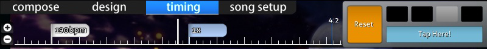

Timelines
=========

This will list all the possible timelines you will encounter in Beatmap Editor along with their respective location.

Song Player
------------

*Location: [Compose](/wiki/Beatmap_Editor/Compose), [Design](/wiki/Beatmap_Editor/Design), [Timing](/wiki/Beatmap_Editor/Timing) (Bottom)*

At **left**, it shows **timestamp in milliseconds (ms)** and **song duration %**. The "%" may be switched to "intro/outro" when there is intro/outro storyboarding.

At **centre**, it shows the **timeline with markings and the compulsory music player buttons.** For "Test" button, your beatmap will be saved to test the beatmap starting on current timestamp.

| Colour markers      |
|---------------------|
| Colour              |
| Bright White Long   |
| Yellow Long         |
| Yellow up           |
| Green up            |
| Red up              |
| Blue Down           |
| Colour Highlights   |
| Grey                |
| Orange              |
| Bookmarking command |
| Ctrl + B            |
| Ctrl + Shift + B    |
| Ctrl + Right Arrow  |
| Ctrl + Left Arrow   |

At **right**, you can adjust the **Playback Rate** by **per quarter value.**

Compose
------------

### osu!

*Location: Top @ [Compose](/wiki/Beatmap_Editor/Compose) tab in any modes other than osu!mania only.*

**Shows the timeline for hitobjects with respect to [Beat Snap Divisor](/wiki/Beatmap_Editor/Beat_Snap_Divisor) and timestamp.**

<table>
<thead>
<tr class="header">
<th>
Hit Object Timeline
</th>
</tr>
</thead>
<tbody>
<tr class="odd">
<td>
&quot;+&quot;/&quot;-&quot; buttons
</td>
</tr>
<tr class="even">
<td>
Double white vertical lines
</td>
</tr>
<tr class="odd">
<td>
Click on hitobject
</td>
</tr>
</tbody>
</table>

### osu!mania

*Location: Centre @ [Compose](/wiki/Beatmap_Editor/Compose) tab in osu!mania only.*

| Playfield Boxes          |
|--------------------------|
| Name                     |
| Left Box                 |
| Centre                   |
| Colour notes             |
| Double white line        |
| White line               |
| Green line               |
| Blue colour              |
| White/Pink/Yellow colour |

Design
--------

*Location: Top @ [Design](/wiki/Beatmap_Editor/Design) tab*

**Shows the timeline for transformations of the selected object.**

| Timeline                                                                                                                                                    |
|-------------------------------------------------------------------------------------------------------------------------------------------------------------|
| "+"/"-" buttons at left                                                                                                                                     |
| Arrow "Up"/"Down" buttons''' left-below                                                                                                                     |
| Centre                                                                                                                                                      |
| Keyframe Control                                                                                                                                            |
| This will be used for **adding anchor points (Start/End points).** It works pretty much the same way as bookmarks. The buttons are just under the timeline. |
| "+"/"-" buttons                                                                                                                                             |
| "|&lt;" / "&gt;|" buttons                                                                                                                                   |

If there is a transformation, that transformation is lighted with it's colour and will have two separated half-lines that determines the duration. Full white line determines the transformation switching points (eg going up -&gt; going down).

Timing
---------

*Location: Top @ [Timing](/wiki/Beatmap_Editor/Timing) tab*

| Timing Timeline         |
|-------------------------|
| "+"/"-" buttons at left |
| Centre                  |
| Flag colours            |
| White                   |
| Blue                    |

At right, it shows **Time Signature script (known as "Meter")** and **Metronome set**. The meter's **4:2** means **4th measure and 2nd beat of the song**. The **Metronome set plays the BPM beat** and **doubles as a helper to estimate a BPM value.**
