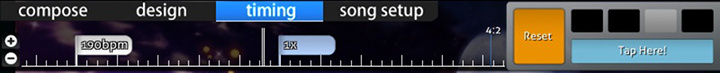

# Timelines

Dans le [beatmap editor](/wiki/Beatmap_Editor), il y a trois différentes chronologies qu'un cartographe peut rencontrer.
Cet article explique comment chacune d'entre elles fonctionne.

## Raccourcis

*Pour une liste des raccourcis clavier pour la timeline, voir :[Shortcut key r  reference](/wiki/Shortcut_key_reference)*

## Lecteur de chansons

Le lecteur de chansons est visible dans n'importe quelle partie de l'éditeur de beatmap.

Sur la gauche, il y a l'horodatage en millisecondes et le pourcentage de la durée de la chanson.
Le pourcentage peut afficher `intro` ou `outro` s'il y a un storyboard avant ou après la chanson.

Au centre, il montre la ligne de temps avec les marquages et les boutons obligatoires du lecteur de musique.
Le bouton `Test` va enregistrer votre beatmap puis va commencer à le tester en lecture à partir de l'horodatage actuel.

La ligne de temps elle-même utilise quelques coches qui ont des significations différentes.

| Couleur | Description |
| :-- | :-- |
| Blanc (long) | Horodatage actuel |
| Jaune (coche longue) | Point de prévisualisation |
| Jaune (tic-tac) | Début du temps de vidange |
| Vert (up tick) | Points hérités (Voir [Timing](/wiki/Timing)) |
| Rouge (up tick) | Points de chronométrage (Voir [Timing](/wiki/Timing)) |
| Bleu (coche en bas) | Signets |
| Gris (surligné) | Pause
| Orange (en surbrillance) | Heure du Kiai |

Sur la droite, vous pouvez régler le taux de lecture de `100%`, à `75%`, `50%`, ou `25%`.

## Objets Touchés

Il existe deux types différents de lignes de temps pour les objets touchés, selon le mode de jeu utilisé par le mapper.

### osu!, osu!taiko, et osu!catch

Dans le mode [compose](/wiki/Compose), cette timeline se trouve sous l'onglet "Composer" pour tous les modes de jeu sauf pour [osu!mania](/wiki/Game_Modes/osu!mania).

| Nom | Description |
| :-- | :-- |
| Boutons `+`/`-` | Augmenter/Diminuer le zoom de la timeline. |
| Double lignes verticales blanches | Ceci montre l'horodatage actuel par rapport à la timeline de l'objet touché. |

Un clic gauche sur un objet sélectionné le sélectionnera et un glisser-déposer déplacera l'objet sélectionné sur la timeline.

Un clic droit permet de supprimer les objets sélectionnés.

### osu!mania

En mode composition, cette ligne de temps se trouve au centre du terrain de jeu pour le mode osu!mania.

La boîte de gauche est un diagramme à barres horizontales qui affiche l'intensité de la note.
Cela agit comme une ligne de temps.

Au centre se trouve le terrain de jeu proprement dit.
Le terrain de jeu est composé de deux parties : les lignes et les notes.

| Couleur de la ligne | Description |
| :-- | :-- |
| Blanc épais | Mesure complète |
| Blanc | Temps commun |
| Vert | Ligne d'horodatage / de jugement en cours |

| Note Couleur | Description |
| :-- | :-- |
| Bleu | Note(s) sélectionnée(s) |
| Blanc/Rose/Jaune | Couleurs de notes non sélectionnées |

## Design

La timeline [design](/wiki/Design) est située sous l'onglet "Design".

### Timeline

| Nom | Description |
| :-- | :-- |
| Boutons `+`/`-` à gauche | Augmenter/Diminuer le zoom de la timeline. |
| Flèches `Haut`/`Bas` en bas à gauche | Faites défiler la timeline de transformation vers le haut ou vers le bas (ceci pour révéler la `Couleur` ou le `Mouvement` sur la timeline). |

Le centre de la timeline de conception montre les "images clés" du sprite sélectionné.

### Contrôle de l'image clé

Le contrôle de l'image clé ajoute ou supprime des points d'ancrage.
Ces points d'ancrage définissent les heures de début et de fin pour la façon dont un sprite doit être scénarisé.

| Nom | Description |
| :-- | :-- |
| `+`/`-` | Ajout/Suppression de points d'ancrage pour la transformation sélectionnée. |
| Flèches `Left`/`Right` | Sauter en arrière/en avant jusqu'au point d'ancrage le plus proche de la transformation sélectionnée. |

S'il y a une transformation, cette transformation est éclairée par sa couleur.
En plus de cela, elle aura deux demi-lignes séparées qui déterminent la durée.
La ligne blanche complète détermine les points de commutation de la transformation (par exemple de "monter" à "descendre").

## Timing

La ligne de temps est située sous l'onglet [`Timing`](/wiki/Timing).

### Timing Timeline

| Nom | Description |
| :-- | :-- |
| Boutons `+`/`-` à gauche | Augmenter/Diminuer le zoom de la timeline. |

Au centre se trouve la ligne de temps elle-même.
Elle utilise des drapeaux blancs et bleus pour décrire le type de point de chronométrage qu'ils sont ; décrits dans la section [flag colours](#flag-colours).

Sur la droite, il montre le script de signature temporelle (appelé "compteur") et le jeu de métronome.
Dans l'image ci-dessus, le compteur est à `4:2`.
Cela signifie que l'horodatage actuel est au deuxième temps de la quatrième mesure de la chanson.

Le jeu de métronome joue un son de tic-tac constant au BPM donné.
Ceci sert également d'aide pour estimer la valeur du BPM du morceau.

### Flag Colours

| Couleur | Description |
| :-- | :-- |
| Blanc | Points de chronométrage. Utilisez la nouvelle valeur de BPM. (Rouge sur la ligne de temps de la chanson) |
| Bleu | Points hérités. Réglage de la vitesse du curseur en fonction du BPM des points de chronométrage. (Vert sur la ligne de temps de la chanson) |
