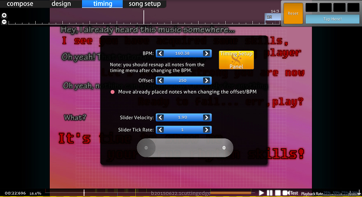

# Pestaña de Tempo

*También vea: [Cómo timear canciones](/wiki/Guides/How_To_Time_Songs)*

La **pestaña de tempo** del [editor de beatmap](/wiki/Beatmap_Editor) permite que los mapers cambien las configuraciones del tempo de un [beatmap](/wiki/Beatmap). El tempo es usualmente el primer paso al momento de crear un nuevo beatmap.

El tempo consiste en la [compensación](/wiki/Beatmapping/Offset) de una canción, los [beats por minuto(BPM)](/wiki/Beatmapping/Beats_per_minute) y la [métrica](https://es.wikipedia.org/wiki/M%C3%A9trica_(m%C3%BAsica) "Wikipedia"). El correcto tempo en los beatmaps es necesario para que los jugadores mantengan su [precisión](/wiki/Gameplay/Accuracy) mientras juegan. Beatmaps con tiempos incorrectos no pueden pasar por el [proceso de ranking de beatmaps](/wiki/Beatmap_ranking_procedure).

## Ventana de Tempo y de Punto de Control

Los puntos de tiempo pueden ser añadidos desde la ventana de `Tiempos y Puntos de Control` en el editor (acceso directo por defecto `F6`). Los puntos de tiempo dividen la canción en secciones para reflejar cambios precisos en el tempo de una canción.

### Punto de tempo no heredado

Un punto de tempo no heredado, desplegado como una línea roja, es la base para los BPM, la compensación y la métrica. Cada beatmap debe tener por lo menos una línea roja, sin embargo, algunas canciones requieres múltiples debido a la compleja composición o tempo impreciso causado por presentaciones en vivo.

### Punto de tempo heredado

Un punto de tempo heredado, desplegado como una línea verde, hereda la configuración del BPM, de la compensación y de la métrica de la previa línea roja. Las líneas verdes son usadas para ajustar configuración de la [velocidad del deslizador](/wiki/Hit_Objects/Slider_velocity) y de los [sonidos de golpe](/wiki/Beatmapping/Hitsound).

Un punto de tempo heredado no puede ser posicionado antes de uno no heredado, porque no heredaría ninguna configuración.
