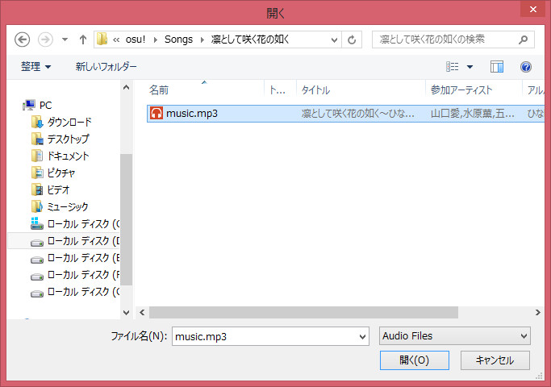

# Timing

谱面的计时包括计算歌曲的延迟(offset)和每分钟节拍数(beats per minute (BPM)。BP 决定了歌曲的快慢，offset 则是歌曲开始到第一个重音之间的时间差。

使用正确的计时才能让你在编辑器里看到的时间线很好地对应音乐]。如果计时不正确，那么时间线就对不上音乐。继而也就不能准确地放置击打物了，并且也几乎不可能跟着歌曲的节奏来制作谱面了。

## 计时分段（Timing Sections）

计时分段允许你在一首歌里使用不同的计时。计时分段分为两种，一种是定时的计时分段，还有一种则是延续的计时分段。

定时（timing）计时分段在编辑器里以红线来表示。每个谱面至少都有一根红线。有些歌曲可能会有节拍的变化，这个时候就需要使用定时的计时分段重新计时。红线定义了这个分段的 BPM，offset 和节拍数。

延续（inheriting）计时分段在编辑器里以绿线来表示。他们实际上并不是真正意义上的改变歌曲的计时，而是在上一个定时段，也就是红线的基础上调整一些参数。绿线的主要作用是改变音效的音量、换用不同的音轨（自定义音效），滑条速率的改变和是否为高潮段（kiai time）。

这两种计时分段在修图的时候一般被简称为“红线”和“绿线”。

## 如何进行 Timing

简单来说，就是两个方式：一是参考已有的数据，二是自行测定。

### 参考其他的音乐游戏

有的音乐游戏会直接给出音乐的 bpm 的，直接复制过来，再调一下 offset 就是了。

### 软件方式

适用范围：**单 BPM** 的音乐

不得不说，有些人还是懒得去进行 Timing 的。可以用这个软件进行 Timing：Timeanalyzer

（由于文件暂时无法上传，请先自行 google 或者百度。）

运行步骤如下：

1. 下载 timeanalyzer，并复制到 osu! 安装的路径
2. 运行，会弹出选择 mp3 的对话框（右图）
3. 然后应用会继续运行，提示输入 bpm。
   - 由于此时并不知道 bpm，就直接留空
4. 接着，bpm 和 offset 就出现了
5. 然后将 bpm 取整，将取整后的 bpm 和 offset（计算出来的即可）填上去，就行了
   - 当然，你也可以自己再测试合适的 offset，甚至 bpm

步骤是简单，但是：**这个应用无法计算多 bpm 的音乐**，如果需要进行多 bpm 的 timing，还是人工测定比较好。

### 人工测试

机器始终是死的。当遇到一些变 bpm 的音乐之后，基本上就测不出来了。这个时候，需要人工进行测定。

但是，人工还是会有比机器长的反应时间。可以尝试使用较低的播放速度调整进行测定。

#### T键

在作图模式的 osu! 中，默认的方式就是点 “tap here”/T键。一般情况下，会要求你点8遍完成 timing 和 offset 操作。当完成之后，会播放“嘀、嘀”之类的音效来增强节奏感，以确认 timing 和 offset 的准确性。

#### 九点

原理跟按键打拍差不多。步骤如下：

1. 将第一个节奏点设置为 offset。
2. 播放音乐，听到第九个节奏点时，停下来，调整 bpm，使其对齐第三个拍子的开始处（第三条长白线）。
