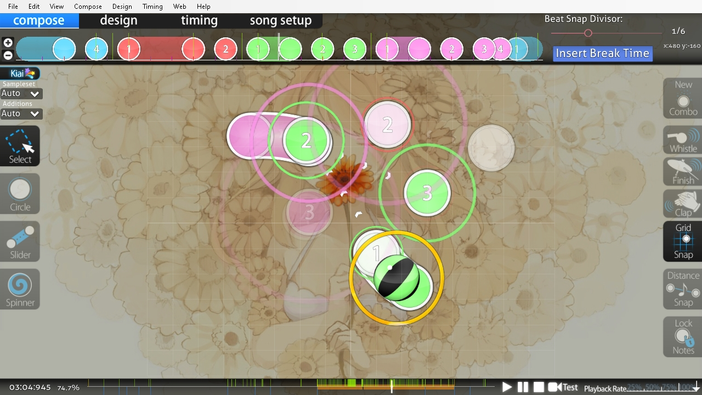

# Beatmap Editor

*Untuk tombol pintas beatmap editor, silahkan lihat: [Referensi Tombol Pintasan § Beatmap editor](/wiki/Shortcut_key_reference#beatmap-editor)*

**Beatmap Editor** merupakan suatu utilitas bawaan osu! berbasis tampilan antarmuka yang umumnya dipergunakan untuk membuat [beatmap](/wiki/Beatmap). Adapun [beatmapping](/wiki/Beatmapping) merupakan sebutan dari proses pembuatan beatmap itu sendiri.

Beatmap Editor memiliki empat komponen utama sebagaimana yang dapat dilihat pada pojok kiri atas layar editor, yaitu:

- Compose
- Design
- Timing
- Song setup

## Compose

Tab [Compose](/wiki/Beatmap_Editor/Compose) merupakan bagian dari editor yang dipergunakan untuk menempatkan [hit object](/wiki/Hit_Objects) dan elemen-elemen permainan lainnya. Pada umumnya, para mapper akan meluangkan sebagian besar waktunya pada tab ini.

## Design

Tab [Design](/wiki/Beatmap_Editor/Design) merupakan bagian dari editor yang dipergunakan untuk membuat [storyboard](/wiki/Storyboards) dan mengatur efek-efek visual lainnya. Meskipun demikian, untuk mendesain storyboard-storyboard yang lebih kompleks pada umumnya para mapper cenderung lebih menggunakan teknik [storyboard scripting](/wiki/Storyboard_Scripting) tanpa melalui tab Design.

## Timing

Tab [Timing](/wiki/Beatmap_Editor/Timing) merupakan bagian dari editor yang dipergunakan untuk mengatur timing dan hitsound pada beatmap. Pengaturan yang teliti pada tab ini sangat penting mengingat suatu beatmap harus memiliki timing yang tepat agar dapat dimainkan sesuai dengan irama lagu.

## Song Setup

Tab [Song Setup](/wiki/Beatmap_Editor/Song_Setup) merupakan bagian dari editor yang dipergunakan untuk mengatur informasi [metadata](/wiki/Beatmap_Editor/Song_Setup#song-and-map-metadata) dan seluk-beluk lainnya yang berlaku secara umum pada [beatmapset](/wiki/Beatmap/Beatmapsets) yang bersangkutan. Hal ini meliputi antara lain judul lagu, nama artis, nama tingkat kesultian, warna kombo, dan masih banyak lagi.

## Lainnya

Di samping empat komponen utama di atas, Beatmap Editor juga memiliki komponen-komponen pendukung lainnya yang di antaranya adalah sebagai berikut:

- [AiMod](AiMod): Sebuah sistem otomatis yang memuat laporan pada sebuah beatmap jika terjadi kesalahan.
- [Beat snap divisor](Beat_Snap_Divisor): Menentukan pada ketukan berapa sebuah hit object akan ditempatkan.
- [Distance snap](Distance_Snap): Menentukan jarak penempatan standar antar satu hit object dengan hit object lainnya.
- [Kiai time](Kiai_Time): Timing section khusus yang dapat digunakan untuk memberikan penekanan tambahan pada bagian-bagian beatmap tertentu.
- [Menu](Menu): Membantu kamu untuk memberikan petunjuk dalam Beatmap Editor.
- [SB load](SB_Load): Sebuah angka yang digunakan untuk memberitahu seberapa beratnya storyboard.
- [Timelines](Timelines): Menampilkan letak hit object, break, dan yang lainnya.
