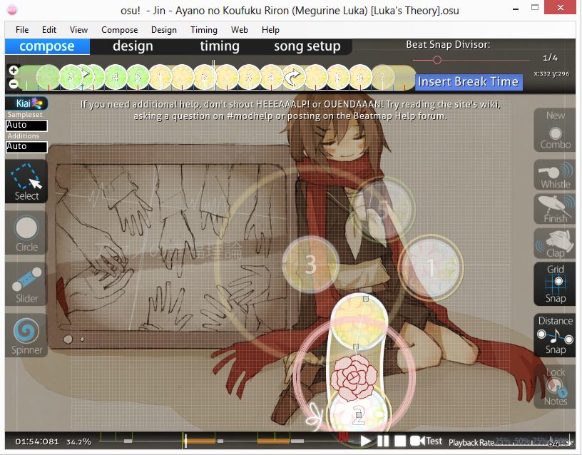

# Penyunting Beatmap

**Penyunting beatmap** (beatmap editor) adalah osu! in-game graphical interface untuk membuat [Beatmaps](/wiki/Beatmaps). Hal ini dipisahkan menjadi 4 modes:

-   [Compose](/wiki/Beatmap_Editor/Compose): Dimana [Hit Objects](/wiki/Hit_Objects) di letakkan dan di edit. Sebagian besar waktu didalam editor adalah disini.
-   [Design](/wiki/Beatmap_Editor/Design): Tempat dimana untuk membuat Storyboard, kebanyakan mappers lebih menggunakan "Background Image/Video" button disini.
-   [Timing](/wiki/Beatmap_Editor/Timing): Tempat dimana untuk mengatur BPM dan offset. Disini juga untuk mengatur beberapa Hitsound.
-   [Song Setup](/wiki/Beatmap_Editor/Song_Setup): Di sinilah berbagai pilihan tentang Maps yang akan ditetapkan. Dan termasuk combo colors dan juga difficulty settings.

## Artikel Terkait

-   [Beatmapping](/wiki/Beatmapping) (Basic Mapping)
-   [Beat Snap Divisor](/wiki/Beatmap_Editor/Beat_Snap_Divisor)
-   [Distance Snap](/wiki/Beatmap_Editor/Distance_Snap)
-   [Custom Sample Overrides](/wiki/Beatmap_Editor_Guides/Custom_Sample_Overrides)
-   [Kiai Time](/wiki/Beatmap_Editor/Kiai_Time)
