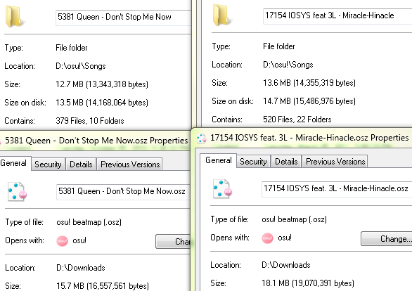

Compressing Beatmap Files
==========================

[*How to make your map fit the size limitations: Compression* by: ziin](https://osu.ppy.sh/forum/t/60002)

Osu! maps, according to the current ranking guidelines, must be under 10 MB, or 24 MB if the song has a video. In this tutorial I will tell you smart ways to get your map under that limit.

There are 2 types of compression. **Lossy** and **Lossless** compression.

-   **Lossless** implies that the quality never degrades and can be repeatedly compressed or decompressed.
-   **Lossy** is a much more powerful form of compression which sacrifices quality for space/processor demand.

Zip
---

The `*.osz` package is actually a `*.zip` file, and will compress your beatmap, although not very much, since audio, video, and images are usually compressed very well. Zip and other archives are all lossless compression, otherwise you wouldn't be able to get your data back.

Video
-----

Recommended reading: [Encoding Video](/wiki/Beatmap_Editor_Guides/Compressing_Videos).

Videos are usually where people go wrong. There are thousands of video codecs out there, and *believe it or not, YouTube is usually a terrible place to get videos*. For the best quality, you should always downsize from a high resolution source (720p YouTube videos are fine for this).

h.264 and XviD are very good codecs to use but like most video codecs, they are lossy. So do not re-encode multiple times, but encode from the high resolution source.

Audio
-----

Now that there is a limit on audio bitrate, it's not as much of a problem anymore. However long songs at 192 kbps will undoubtedly take up most of your space. I recommend using a variable bitrate between rate factor 2 and 5 (I try to stick around 4). With a variable bitrate, you get more compression in low activity areas, and more quality in higher areas.

Programs such as [Audacity 1.3.13](http://audacity.sourceforge.net/download/) does an excellent job of saving variable bitrate audio with the correct plugins.

Osu accepts 2 major file formats: mp3 and ogg vorbis. Vorbis has a clear advantage over mp3 at low bitrates (under 128 kbps), but suffers from lack of support by proprietary software like apple, since mp3 is the standard for audio. However, there are severely limiting returns on using anything higher than 128 kbps. For osu! it doesn't really matter which one you use.

Images
------

There are 2 major image formats which make up most of the images you find online: jpg and png. Png uses lossless compression which makes it ideal for small and or simple images. Complex images are better suited for jpg. The majority of image editing programs however do not naturally use `*.png` and `*.jpg` compression to the most of their ability however, leaving you with 4 KB pngs of 1 color, which could be compressed up to 400 times smaller.

[Gimp](http://www.gimp.org/) actually does a good job with `*.jpg` files.

There are four important things to check: Optimize, Progressive, subsampling, and quality. Optimize is just a way to compress the `*.jpg` without losing quality and should always be checked. Progressive is a method to make jpgs "fade in" when downloaded from the internet. It has a side effect of making the image smaller so long as the image is over 20 KB. Subsampling is a way to improve quality or compression. No subsampling (1x1) will make text and lines much clearer at the cost of space. 2x2 subsampling does very well for photographs which do not have distinct lines (like text). Quality is the easiest way to keep the image looking good. I use 95, since the gains after 95 aren't really worthwhile.

Pngs are actually much simpler to compress, but GIMP does not do it very well. [Optipng](http://optipng.sourceforge.net/) and [Pngout](http://advsys.net/ken/utils.htm) are two of the best tools to compress `*.png` files. Optipng can find the optimum settings for the `*.png`, and pngout re-compresses the image using `*.kzip`. Often times just using pngout will reduce the image size by 20%.

For even better compression, you can use a script which combines multiple compressors and brute forces close to the smallest file possible. The script's name is [pngslim](http://people.bath.ac.uk/ea2aced/tech/png/pngslim.zip).

Results
-------

So there you have it.

