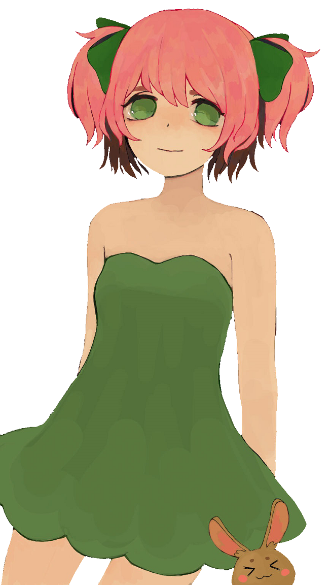

Cropping with Simple Backgrounds
==================================

So, I will show you a quick way how to remove one coloured backgrounds. Like in previous tutorial, same here, I am using GIMP and the picture you can see.

Step \#1
--------

Select magic wand tool in "Add to current selection mode" (this will help to select few parts at once) and select every white space of background you don't want.

Step \#2
--------

Now, we have selected background, we need to enlarge selection by 1px. Press Del to remove the selected background.

Step \#3
--------

Time to use our filter to make the removed background transparent.

Step \#4
--------

Sadly, after this there still will be some black spaces. Mostly in places with sharp angle. Choose Lasso tool and select with it these ugly places. Press `Ctrl` + `F` to repeat removing colour.

Finish
------

After removing any leftovers, your picture should be ready.

This method only works with one coloured background, but with it you can easily and quickly remove the background.

