---
tags:
  - charts
  - Ranking Charts
  - Seasonal Spotlights
---

# Beatmap Spotlights

The **Beatmap Spotlights** (also known as *Spotlights* or *Ranking Charts*) is a recurring curation program for recommending and highlighting [beatmaps](/wiki/Beatmap) for their excellent and unique design and gameplay. It is accompanied by a [seasonal league](#spotlights-seasons) that yields awards for all participating players.

**The current iteration of this program is still under development and many features are still pending implementation.** Specifics of this system, such as rewards, seasonal rankings or gameplay features, can change anytime.

The current season is the Autumn 2020 season.

## Organisation

The Beatmap Spotlights project is run by various community members across all game modes, led on by a dedicated project lead.

| Role | Members |
| :-- | :-- |
| Project lead | ![][flag_PL] [Venix](https://osu.ppy.sh/users/5999631) |
| Project manager | ![][flag_US] [pishifat](https://osu.ppy.sh/users/3178418) |
| Website manager | ![][flag_PL] [Venix](https://osu.ppy.sh/users/5999631), ![][flag_US] [Snowleopard](https://osu.ppy.sh/users/3790227) |

## Curators

Each Beatmap Spotlights release is assembled by a dedicated curator team and individually picked based on an extensive application and review process. Bold members are the respective team leaders.

### osu! curators

- ![][flag_US] **[pishifat](https://osu.ppy.sh/users/3178418)**
- ![][flag_US] [ChillierPear](https://osu.ppy.sh/users/9501251)
- ![][flag_US] [DigitalHypno](https://osu.ppy.sh/users/4384207)
- ![][flag_DE] [IceKalt](https://osu.ppy.sh/users/5410645)
- ![][flag_DE] [Kite](https://osu.ppy.sh/users/134572)
- ![][flag_FI] [Lefafel](https://osu.ppy.sh/users/2295850)
- ![][flag_DE] [Mao](https://osu.ppy.sh/users/2204515)
- ![][flag_CN] [Moecho](https://osu.ppy.sh/users/5075660)
- ![][flag_MX] [Riot](https://osu.ppy.sh/users/4256461)
- ![][flag_CN] [Ryuusei Aika](https://osu.ppy.sh/users/7777875)
- ![][flag_US] [squirrelpascals](https://osu.ppy.sh/users/6151332)
- ![][flag_DE] [Zetera](https://osu.ppy.sh/users/587737)

### osu!taiko curators

- ![][flag_DE] **[OnosakiHito](https://osu.ppy.sh/users/290128)**
- ![][flag_FR] [Arrival](https://osu.ppy.sh/users/1694000)
- ![][flag_JP] [Charlotte](https://osu.ppy.sh/users/3686901)
- ![][flag_DE] [Greenshell](https://osu.ppy.sh/users/8693851)
- ![][flag_HK] [Nardoxyribonucleic](https://osu.ppy.sh/users/876419)
- ![][flag_DE] [Nepuri](https://osu.ppy.sh/users/6637817)
- ![][flag_DE] [Zetera](https://osu.ppy.sh/users/587737)

### osu!catch curators

- ![][flag_GB] **[JBHyperion](https://osu.ppy.sh/users/4879508)**
- ![][flag_ES] [Deif](https://osu.ppy.sh/users/318565)
- ![][flag_CA] [SadEgg](https://osu.ppy.sh/users/10278243)
- ![][flag_US] [Snowless](https://osu.ppy.sh/users/4316266)
- ![][flag_US] [wonjae](https://osu.ppy.sh/users/5032045)

### osu!mania curators

- ![][flag_GB] **[Hydria](https://osu.ppy.sh/users/808176)**
- ![][flag_AU] [CrumpetFiddler](https://osu.ppy.sh/users/3518705)
- ![][flag_TH] [HowToPlayLN](https://osu.ppy.sh/users/10879600)
- ![][flag_DO] [Kaito-kun](https://osu.ppy.sh/users/4715184)
- ![][flag_PH] [lenpai](https://osu.ppy.sh/users/5314573)
- ![][flag_FR] [Madeline](https://osu.ppy.sh/users/2812098)
- ![][flag_SG] [Raveille](https://osu.ppy.sh/users/1388767)

## Spotlights seasons

*Main page: [Seasons](Seasons)*

The Beatmap Spotlights project is currently organised in pre-defined seasons. Each season consists of a pool of curated beatmaps and a competitive seasonal league for the whole community.

1. A single season lasts 8 weeks.
2. Seasons are fully prepared before they start.
   - Every curated beatmap is selected and locked in before a season starts.
   - Once a season begins, the whole schedule will be released.
3. Each season is split into weeks. Each week is labeled with a letter.
   - Each letter represents the playlist of a weekly multiplayer lobby.
   - Weeks cycle through the entire season and repeat twice.
4. Once a season finishes, there will be a break of 3 weeks before a new season begins. During that time, readjustments to the project can be made.

### Seasonal leaderboard

*This feature is pending implementation. Parts of it are to be added as the season goes on. Because of that, this section can change anytime.*

The seasonal leaderboard sums up the weekly ranked score results of every participant. Based on the seasonal leaderboard, every participant is assigned to a league bracket reflecting their relative placement within the leaderboard.

1. Seasonal leaderboard score is a weighed sum of all weekly ranked scores attained in the timeshift lobbies.
2. Participants can only possess one weekly ranked score per playlist.
   - Replaying a playlist at another week will make only the best weekly ranked score count, overwriting the worse one.
3. Participants will not be told their exact seasonal leaderboard placing or score. They will be assigned to league brackets instead.
   - Only the top 50 of the seasonal leaderboard will have their exact placing visible.
   - The bracket is assigned based on the placement within the leaderboard. Participants will be assigned the highest bracket they are eligible for.
4. The assigned bracket will be revealed once the 2nd week of a season has concluded.

### Rewards

*Parts of these rewards are pending implementation. They are to be added as the season goes on. Because of that, this section can change anytime.*

Rewards are distributed to weekly timeshift lobby winners, creators of curated beatmaps and every participant present on the seasonal leaderboard.

1. The top 10 of each weekly timeshift lobby will be awarded with 1 week of osu! supporter tags.
2. During the season, every participant is assigned to a league bracket, which is reflected by a unique profile badge on their profile that lasts for the duration of the season.
   - The badge will be updated every week after the 2nd week of a season.
   - The best players of a season may be able to keep their profile badge permanently. Details about that are yet to be decided.
3. At the end of each season, the best beatmap creator, as decided by the curators, will be awarded with 1 month of supporter tag.
4. At the end of each season, a new unlockable medal will be added. Players need to complete every beatmap of this season once to obtain it.

| Badges | Bracket Tier | Placement |
| :-: | :-- | :-- |
| 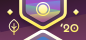 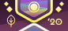 | Rhythm Incarnate | Top 50 |
| 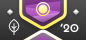 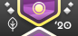 | Diamond | Top 51 – 3% |
| 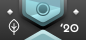  | Platinum | 3% – 10% |
|  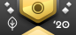 | Gold | 10% – 25% |
| 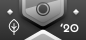  | Silver | 25% – 50% |
| 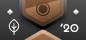  | Bronze | 50% – 70% |
| 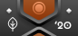 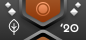 | Copper | 70% – 95% |
| 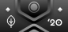  | Iron | 95% – 100% |

This table only shows one of four badge versions. Each game mode has its own badge version.

### Curation system

The curation system involves the process of curators selecting the beatmaps being put into the Beatmap Spotlights for each season.

1. Beatmaps are selected by the curators of their respective game mode for the duration of one season.
   - Curators need to agree on each individual beatmap difficulty in an open discussion.
   - Respective game mode leaders lock in decisions and solidify the selection after conclusive discussions.
   - The selection process itself varies between game modes and adjusts around the needs of the respective members.
2. Beatmaps are selected based on their uniqueness and excellence. Each selected beatmap should be a leading example of content quality in gameplay, design and aesthetics.
3. Curated beatmaps serve as recommendations to the entire osu! community.
4. To fulfill the duty of recommending excellent beatmaps to the whole community, curated beatmaps should cover a specific spread of Hard, Insane and Expert difficulties.
   - 25% of all curated beatmaps should be within the Hard difficulty tier.
   - 45% of all curated beatmaps should be within the Insane difficulty tier.
   - 30% of all curated beatmaps should be within the Expert difficulty tier.
5. For each season, 20 beatmaps must be selected at minimum.
   - All selected beatmaps must be Ranked.
   - When selecting more beatmaps, the distribution between difficulty tiers should be followed.
   - Curators can select multiple beatmaps of the same beatmap set.
6. Curated beatmaps should be a healthy mix of recent and established content.
   - At least 25% of the curated beatmap difficulties must have been ranked within the last 3 months prior the season start.
7. Individual curators must not recommend beatmaps they took part in creating.
   - At most 25% of the selected beatmaps can have such an involvement of curators themselves.
8. Every curated beatmap must be selected before the season begins. Once a season has started, beatmaps can not be exchanged anymore.
9. Curated beatmaps are being revealed incrementally during the season. The whole roster of selected beatmaps must be kept secret until every subset of the season has been unveiled.

### Feedback

The current implementation of the Beatmap Spotlights is highly experimental and can change anytime depending on how players respond to it. Because of that, it is important to collect as much feedback and criticism as possible to improve furtherly on the direction and implementation of this system. Players are encouraged to leave their thoughts and feedback here:

- [Feedback forum thread](https://osu.ppy.sh/community/forums/topics/1189626)
- `#beatmap-spotlights` in the [osu! community Discord server](https://discord.gg/0Vxo9AsejDkGlk3H)
- `#osu-spotlights` in the [osu!dev Discord server](https://discord.gg/ppy)

### Becoming a curator

Anyone can apply to become a curator by filling this [application form](https://spotlights.team/app). Applications open up between the seasons and are closed during an ongoing season.

All applicants are reviewed by project management and team leaders and assessed based on their proficiency as a player, mapper, modder and tournament mappool selector for their respective game mode. Applicants do not need to be proficient in all of these things to be selected, but having a broad skill set certainly helps. The roster of curators is based on a healthy mix and match of various skill levels, experiences and proficiencies. The number of curators is being purposefully kept small and limited at the moment as the project develops.

## History

Originally named "Ranking Charts" and initiated in November 2009 by ![][flag_US] [Cyclone](https://osu.ppy.sh/users/18589) and ![][flag_AU] [peppy](https://osu.ppy.sh/users/2), the project aimed to highlight the best beatmaps of a month by letting the [Beatmap Appreciation Team](/wiki/Modding/Beatmap_Appreciation_Team) and the [Mapping Assistance Team](/wiki/Modding/Mapping_Assistance_Team) nominate and vote for the most suitable candidates.

The project underwent several changes and additions, such as [themed Ranking Charts](https://osu.ppy.sh/rankings/osu/charts?spotlight=26), [mod restricted Ranking Charts](https://osu.ppy.sh/rankings/osu/charts?spotlight=19) or [seasonal leaderboards](https://osu.ppy.sh/home/news/2014-07-18-june-2014-ranking-chart). Originally, the winners of the Ranking Charts were awarded with osu! Supporter Tags. Later, rewards for mappers or seasonal leaderboard winners have been added.

The project lead has changed several times in its history. ![][flag_US] [SapphireGhost](https://osu.ppy.sh/users/388602) took over the project lead in May 2012, followed up by ![][flag_US] [DeathXShinigami](https://osu.ppy.sh/users/49516) and ![][flag_US] [Makar](https://osu.ppy.sh/users/686389). ![][flag_DE] [Loctav](https://osu.ppy.sh/users/71366) and ![][flag_DE] [OnosakiHito](https://osu.ppy.sh/users/290128) took over the project in December 2013. In March 2015 the project changed from its original design of nominate and vote into having renown [community members single-handedly select a roster of beatmap](https://osu.ppy.sh/home/news/2015-03-18-february-2015-monthly-ranking-charts-new-season) sets they recommend. In September 2016, the [selection system has been mostly reverted](https://osu.ppy.sh/home/news/2016-09-17-july-2016-ranking-charts-changes) and put the [Quality Assurance Team](/wiki/Modding/Quality_Assurance_Team) in charge of selecting the most noteworthy beatmap sets.

Renamed to [Beatmap Spotlights](https://osu.ppy.sh/home/news/2017-03-18-introducing-to-you-spotlights) in March 2017, the system itself stayed mostly consistent while adding additional rewards like medals and enhancing the presentation of the Beatmap Spotlights furtherly. During an internal overhaul of the Quality Assurance Team, the responsibility for the project has been reassigned to ![][flag_HU] [Kurokami](https://osu.ppy.sh/users/260933) and re-implemented a community-based selection team. In November 2018, the frequency of the Spotlights have been changed to a [seasonal release cycle](https://osu.ppy.sh/home/news/2018-11-01-beatmap-spotlights-summer-2018). In March 2020, ![][flag_DE] [Loctav](https://osu.ppy.sh/users/71366) rejoined the project lead together with Kurokami, both reworking it into a new shape and assembling a new team of osu! curators.

In August 2020, ![][flag_HU] [Kurokami](https://osu.ppy.sh/users/260933) stepped down from leading the project. At the end of November 2020, ![][flag_DE] [Loctav](https://osu.ppy.sh/users/71366) also resigned, and ![][flag_PL] [Venix](https://osu.ppy.sh/users/5999631) took over the project along with ![][flag_US] [pishifat](https://osu.ppy.sh/users/3178418).

[flag_AU]: /wiki/shared/flag/AU.gif "Australia"
[flag_CA]: /wiki/shared/flag/CA.gif "Canada"
[flag_CN]: /wiki/shared/flag/CN.gif "China"
[flag_DE]: /wiki/shared/flag/DE.gif "Germany"
[flag_DO]: /wiki/shared/flag/DO.gif "Dominican Republic"
[flag_ES]: /wiki/shared/flag/ES.gif "Spain"
[flag_FI]: /wiki/shared/flag/FI.gif "Finland"
[flag_FR]: /wiki/shared/flag/FR.gif "France"
[flag_GB]: /wiki/shared/flag/GB.gif "United Kingdom"
[flag_HK]: /wiki/shared/flag/HK.gif "Hong Kong"
[flag_HU]: /wiki/shared/flag/HU.gif "Hungary"
[flag_JP]: /wiki/shared/flag/JP.gif "Japan"
[flag_MX]: /wiki/shared/flag/MX.gif "Mexico"
[flag_PH]: /wiki/shared/flag/PH.gif "Philippines"
[flag_PL]: /wiki/shared/flag/PL.gif "Poland"
[flag_SG]: /wiki/shared/flag/SG.gif "Singapore"
[flag_TH]: /wiki/shared/flag/TH.gif "Thailand"
[flag_US]: /wiki/shared/flag/US.gif "United States"
