---
tags:
  - charts
  - Ranking Charts
  - Seasonal Spotlights
  - tableaux
  - Tableaux de classement
  - Spotlights saisonnier
---

# Beatmap Spotlights

Le **Beatmap Spotlights** (également connu sous le nom de *Spotlights* ou *Ranking Charts*) est un programme récurrent de recommandation et de mise en avant des [beatmaps](/wiki/Beatmap) pour leur conception et leur gameplay excellents et uniques. Il est accompagné d'une [ligue saisonnière](#saisons-spotlights) qui permet de récompenser tous les joueurs participants.

**L'itération actuelle de ce programme est toujours en cours de développement et de nombreuses fonctionnalités sont encore en attente de mise en œuvre.** Les spécificités de ce système, telles que les récompenses, les classements saisonniers ou les caractéristiques de jeu, peuvent changer à tout moment.

La saison actuelle est celle du printemps 2021.

## Organisation

Le projet Beatmap Spotlights est géré par différents membres de la communauté, tous modes de jeu confondus, sous la direction d'un chef de projet dédié.

| Rôle | Membres |
| :-- | :-- |
| Chef du projet | ![][flag_PL] [Venix](https://osu.ppy.sh/users/5999631) |
| Gestionnaire du projet | ![][flag_US] [pishifat](https://osu.ppy.sh/users/3178418) |
| Gestionnaire du site web | ![][flag_PL] [Venix](https://osu.ppy.sh/users/5999631), ![][flag_US] [Snowleopard](https://osu.ppy.sh/users/3790227) |

## Curateurs

Chaque publication du Beatmap Spotlights est assemblée par une équipe de conservateurs dévoués et choisie individuellement sur la base d'un processus de demande et d'examen approfondi. Les membres en gras sont les chefs d'équipe respectifs.

### curateurs osu! 

- ![][flag_US] **[pishifat](https://osu.ppy.sh/users/3178418)**
- ![][flag_US] [ChillierPear](https://osu.ppy.sh/users/9501251)
- ![][flag_US] [DigitalHypno](https://osu.ppy.sh/users/4384207)
- ![][flag_FI] [DTM9 Nowa](https://osu.ppy.sh/users/5428909)
- ![][flag_DE] [IceKalt](https://osu.ppy.sh/users/5410645)
- ![][flag_FI] [Lefafel](https://osu.ppy.sh/users/2295850)
- ![][flag_DE] [Mao](https://osu.ppy.sh/users/2204515)
- ![][flag_AT] [Omgforz](https://osu.ppy.sh/users/578943)
- ![][flag_MX] [Riot](https://osu.ppy.sh/users/4256461)
- ![][flag_CN] [Ryuusei Aika](https://osu.ppy.sh/users/7777875)
- ![][flag_RU] [xbopost](https://osu.ppy.sh/users/6842421)
- ![][flag_PL] [Zelq](https://osu.ppy.sh/users/8953955)

### curateurs osu!taiko

- ![][flag_DE] **[OnosakiHito](https://osu.ppy.sh/users/290128)**
- ![][flag_FR] [Arrival](https://osu.ppy.sh/users/1694000)
- ![][flag_AR] [Axer](https://osu.ppy.sh/users/7299864)
- ![][flag_JP] [Charlotte](https://osu.ppy.sh/users/3686901)
- ![][flag_HK] [Nardoxyribonucleic](https://osu.ppy.sh/users/876419)
- ![][flag_JP] [uone](https://osu.ppy.sh/users/5321719)

### curateurs osu!catch

- ![][flag_CA] **[SadEgg](https://osu.ppy.sh/users/10278243)**
- ![][flag_ES] [Deif](https://osu.ppy.sh/users/318565)
- ![][flag_US] [Snowless](https://osu.ppy.sh/users/4316266)
- ![][flag_KR] [Spectator](https://osu.ppy.sh/users/702598)
- ![][flag_US] [wonjae](https://osu.ppy.sh/users/5032045)

### curateurs osu!mania

- ![][flag_GB] **[Hydria](https://osu.ppy.sh/users/808176)**
- ![][flag_CA] [BringoBrango](https://osu.ppy.sh/users/10274043)
- ![][flag_AU] [CrumpetFiddler](https://osu.ppy.sh/users/3518705)
- ![][flag_KR] [Fresh Chicken](https://osu.ppy.sh/users/3984370)
- ![][flag_TH] [HowToPlayLN](https://osu.ppy.sh/users/10879600)
- ![][flag_DO] [Kaito-kun](https://osu.ppy.sh/users/4715184)
- ![][flag_PH] [lenpai](https://osu.ppy.sh/users/5314573)
- ![][flag_SG] [Raveille](https://osu.ppy.sh/users/1388767)

## Saisons Spotlights

*Page principale : [Saisons](Seasons)*

Le projet Beatmap Spotlights est actuellement organisé en saisons prédéfinies. Chaque saison se compose d'un pool de beatmaps sélectionnées et d'une ligue saisonnière compétitive pour l'ensemble de la communauté.

1. Une seule saison dure 8 semaines.
2. Les saisons sont entièrement préparées avant de commencer.
   - Chaque beatmap est sélectionnée et verrouillée avant le début de la saison.
   - Une fois la saison commencée, le calendrier complet sera publié.
3. Chaque saison est divisée en semaines. Chaque semaine est identifiée par une lettre.
   - Chaque lettre représente la playlist d'un lobby multijoueur hebdomadaire.
   - Les semaines se déroulent sur toute la saison et sont répétées deux fois.
4. Lorsqu'une saison se termine, il y aura une pause de 3 semaines avant le début d'une nouvelle saison. Pendant cette période, des réajustements du projet peuvent être effectués.

### Classement saisonnier

*Cette fonctionnalité est en attente de mise en œuvre. Certaines parties seront ajoutées au fur et à mesure de la saison. Pour cette raison, cette section peut changer à tout moment.*

Le classement saisonnier résume les résultats du classement hebdomadaire de chaque participant. Sur la base du classement saisonnier, chaque participant est assigné à une tranche de la ligue qui reflète sa position relative dans le classement.

1. Le score saisonnier au classement est la somme pondérée de tous les scores hebdomadaires obtenus dans les lobbies temporaires.
2. Les participants ne peuvent posséder qu'un seul score hebdomadaire classé par playlist.
   - En rejouant une playlist à une autre semaine, seul le meilleur score hebdomadaire classé comptera, écrasant le plus mauvais.
3. Les participants ne seront pas informés de leur classement ou de leur score exact dans le classement saisonnier. Ils seront affectés à des tranches de ligue à la place.
   - Seul le classement exact des 50 premiers du classement saisonnier sera visible.
   - La tranche est attribuée en fonction de la position dans le classement. Les participants se verront attribuer la tranche la plus élevée à laquelle ils sont éligibles.
4. Le bracket attribué sera révélé une fois que la 2ème semaine d'une saison sera terminée.

### Récompenses

*Certaines de ces récompenses sont en attente de mise en œuvre. Elles seront ajoutées au fur et à mesure de la saison. Pour cette raison, cette section peut changer à tout moment.*

Des récompenses sont distribuées aux gagnants du lobby temporaire hebdomadaire, aux créateurs des beatmaps et à chaque participant présent au classement saisonnier.

1. Les 10 premiers de chaque lobby temporaire hebdomadaire seront récompensés par un tag osu!supporter d'une semaine.
2. Au cours de la saison, chaque participant est affecté à une tranche de ligue, ce qui se traduit par un badge unique sur son profil qui dure toute la saison.
   - Le badge sera mis à jour chaque semaine après la deuxième semaine de la saison.
   - Les meilleurs joueurs d'une saison pourront peut-être conserver leur badge de profil de manière permanente. Les détails à ce sujet doivent encore être décidés.
3. À la fin de chaque saison, le meilleur créateur d'une beatmap, tel que décidé par les curateurs, sera récompensé par un osu!supporter d'un mois.
4. À la fin de chaque saison, une nouvelle médaille à débloquer sera ajoutée. Pour l'obtenir, les joueurs doivent terminer une fois chaque beatmap de cette saison.

| Badges | Palier de bracket | Placement |
| :-: | :-- | :-- |
| 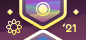 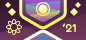 | Rhythm Incarnate | Le meilleur des meilleurs |
| 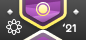 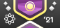 | Diamond | Top 3% |
| 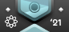 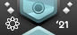 | Platinum | 3% – 10% |
| 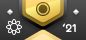 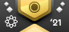 | Gold | 10% – 25% |
| 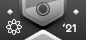 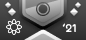 | Silver | 25% – 50% |
| 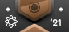 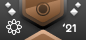 | Bronze | 50% – 70% |
| 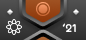 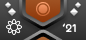 | Copper | 70% – 95% |
| 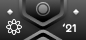 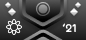 | Iron | 95% – 100% |

Le seuil du niveau Rhythm Incarnate est choisi manuellement en fonction du nombre de participants de la saison et de la taille générale des autres niveaux, bien qu'il s'agisse d'un nombre absolu qui se situe entre le top 2 et le top 50 dans la plupart des cas.

Ce tableau ne présente qu'une seule des quatre versions de badge. Chaque mode de jeu a sa propre version du badge.

### Système de curation

Le système de curation implique un processus de sélection par les curateurs des beatmaps mises en avant dans les Beatmap Spotlights pour chaque saison.

1. Les beatmaps sont sélectionnées par les curateurs de leur mode de jeu respectif pour la durée d'une saison.
   - Les curateurs doivent se mettre d'accord sur la difficulté de chaque beatmap dans le cadre d'une discussion ouverte.
   - Les responsables des modes de jeu respectifs verrouillent les décisions et consolident la sélection après des discussions concluantes.
   - Le processus de sélection lui-même varie selon les modes de jeu et s'adapte aux besoins des membres respectifs.
2. Les beatmaps sont sélectionnées en fonction de leur caractère unique et de leur excellence. Chaque beatmap sélectionnée doit être un exemple de qualité de contenu en termes de gameplay, de design et d'esthétique.
3. Ces maps servent de recommandations à l'ensemble de la communauté d'osu!
4. Pour remplir le devoir de recommander d'excellentes beatmaps à l'ensemble de la communauté, les curateurs des beatmaps doivent couvrir une répartition spécifique des difficultés Hard, Insane et Expert.
   - 25% de toutes les beatmaps sélectionnées doivent se situer dans le niveau de difficulté Hard.
   - 45% de toutes les beatmaps sélectionnées doivent se situer dans le niveau de difficulté Insane.
   - 30 % de toutes les beatmaps sélectionnées doivent être dans le niveau de difficulté Expert.
5. Pour chaque saison, 20 beatmaps au minimum doivent être sélectionnées.
   - Toutes les beatmaps sélectionnées doivent être classées.
   - Lors de la sélection de nouvelles beatmaps, il convient de respecter la répartition entre les niveaux de difficulté.
   - Les curateurs peuvent sélectionner plusieurs beatmaps d'un même ensemble de beatmaps.
6. Les beatmaps doivent être un mélange sain de contenu récent et établi.
   - Au moins 25 % des difficultés des beatmaps sélectionnées doivent avoir été classées dans les 3 derniers mois précédant le début de la saison.
7. Les curateurs individuels ne doivent pas recommander les beatmaps auxquelles ils ont contribué lors de leur création.
   - Au maximum 25% des beatmaps sélectionnées peuvent bénéficier d'une telle participation des curateurs eux-mêmes.
8. Chaque beatmap doit être sélectionnée avant le début de la saison. Une fois qu'une saison a commencé, les beatmaps ne peuvent plus être échangées.
9. Les beatmaps sélectionnées sont révélées progressivement au cours de la saison. L'ensemble de la liste des beatmaps sélectionnées doit être gardé secret jusqu'à ce que chaque sous-ensemble de la saison ait été dévoilé.

### Commentaires

L'implémentation actuelle des Beatmap Spotlights est hautement expérimentale et peut changer à tout moment en fonction de la réaction des joueurs. Pour cette raison, il est important de recueillir autant de commentaires et de critiques que possible pour améliorer continuellement la direction et la mise en œuvre de ce système. Les joueurs sont encouragés à laisser leurs impressions et leurs commentaires ici :

- [Fil de discussion du forum feedback](https://osu.ppy.sh/community/forums/topics/1189626)
- `#beatmap-spotlights` sur le [serveur Discord de la communauté osu!](https://discord.gg/0Vxo9AsejDkGlk3H)
- `#osu-spotlights` sur le [serveur Discord osu!dev](https://discord.gg/ppy)

### Devenir un curateur

Toute personne peut postuler pour devenir un curateur en remplissant le [formulaire de candidature](https://spotlights.team/app). Les candidatures sont ouvertes entre les saisons et sont fermées pendant une saison en cours.

Tous les candidats sont examinés par la direction du projet et les chefs d'équipe et évalués sur la base de leurs compétences en tant que joueur, mappeur, moddeur et sélectionneur de mappools de tournoi pour leur mode de jeu respectif. Les candidats n'ont pas besoin d'être compétents dans tous ces domaines pour être sélectionnés, mais un large éventail de compétences est certainement utile. La liste des curateurs est basée sur un mélange sain de différents niveaux de compétences, d'expériences et de qualifications. Le nombre de curateurs est volontairement limité pour le moment, au fur et à mesure que le projet se développe.

## Histoire

Nommé à l'origine "Ranking Charts" et lancé en novembre 2009 par ![][flag_US] [Cyclone](https://osu.ppy.sh/users/18589) et ![][flag_AU] [peppy](https://osu.ppy.sh/users/2), le projet visait à mettre en avant les meilleures beatmaps d'un mois en laissant la [Beatmap Appreciation Team](/wiki/Modding/Beatmap_Appreciation_Team) et la [Mapping Assistance Team](/wiki/Modding/Mapping_Assistance_Team) nommer et voter pour les candidats les plus appropriés.

Le projet a fait l'objet de plusieurs modifications et ajouts, tels que les [classements thématiques](https://osu.ppy.sh/rankings/osu/charts?spotlight=26), les [classements réservés aux mods](https://osu.ppy.sh/rankings/osu/charts?spotlight=19) ou les [classements saisonniers](https://osu.ppy.sh/home/news/2014-07-18-june-2014-ranking-chart). À l'origine, les gagnants des classements étaient récompensés par des tags osu!supporter. Plus tard, des récompenses pour les mappeurs ou les gagnants des classements saisonniers ont été ajoutées.

La direction du projet a changé plusieurs fois au cours de son histoire. ![][flag_US] [SapphireGhost](https://osu.ppy.sh/users/388602) a pris la tête du projet en mai 2012, suivi par ![][flag_US] [DeathXShinigami](https://osu.ppy.sh/users/49516) et ![][flag_US] [Makar](https://osu.ppy.sh/users/686389). ![][flag_DE] [Loctav](https://osu.ppy.sh/users/71366) et ![][flag_DE] [OnosakiHito](https://osu.ppy.sh/users/290128) ont repris le projet en décembre 2013. En mars 2015, le projet est passé de sa conception initiale de nomination et de vote à un système où [les membres de renom de la communauté sélectionnent à eux seuls une liste de beatmaps](https://osu.ppy.sh/home/news/2015-03-18-february-2015-monthly-ranking-charts-new-season) qu'ils recommandent. En septembre 2016, le [système de sélection a été en grande partie annulé](https://osu.ppy.sh/home/news/2016-09-17-july-2016-ranking-charts-changes) et la [Quality Assurance Team](/wiki/Modding/Quality_Assurance_Team) a été chargée de sélectionner les beatmaps les plus remarquables.

Renommé [Beatmap Spotlights](https://osu.ppy.sh/home/news/2017-03-18-introducing-to-you-spotlights) en mars 2017, le système lui-même est resté globalement cohérent tout en ajoutant des récompenses supplémentaires comme des médailles et en améliorant encore la présentation des Beatmap Spotlights. Lors d'une refonte interne de la Quality Assurance Team, la responsabilité du projet a été réattribuée à ![][flag_HU] [Kurokami](https://osu.ppy.sh/users/260933) et a réimplanté une équipe de sélection basée sur la communauté. En novembre 2018, la fréquence des Spotlights a été modifiée pour devenir un [cycle de publication saisonnier](https://osu.ppy.sh/home/news/2018-11-01-beatmap-spotlights-summer-2018). En mars 2020, ![][flag_DE] [Loctav](https://osu.ppy.sh/users/71366) a repris la direction du projet avec Kurokami, en lui donnant une nouvelle forme et en constituant une nouvelle équipe de curateurs osu!.

En août 2020, ![][flag_HU] [Kurokami](https://osu.ppy.sh/users/260933) s'est retiré de la direction du projet. Fin novembre 2020, ![][flag_DE] [Loctav](https://osu.ppy.sh/users/71366) a également démissionné, et ![][flag_PL] [Venix](https://osu.ppy.sh/users/5999631) a repris le projet avec ![][flag_US] [pishifat](https://osu.ppy.sh/users/3178418).

[flag_AT]: /wiki/shared/flag/AT.gif "Autriche"
[flag_AR]: /wiki/shared/flag/AR.gif "Argentine"
[flag_AU]: /wiki/shared/flag/AU.gif "Australie"
[flag_CA]: /wiki/shared/flag/CA.gif "Canada"
[flag_CN]: /wiki/shared/flag/CN.gif "Chine"
[flag_DE]: /wiki/shared/flag/DE.gif "Allemagne"
[flag_DO]: /wiki/shared/flag/DO.gif "République dominicaine"
[flag_ES]: /wiki/shared/flag/ES.gif "Espagne"
[flag_FI]: /wiki/shared/flag/FI.gif "Finlande"
[flag_FR]: /wiki/shared/flag/FR.gif "France"
[flag_GB]: /wiki/shared/flag/GB.gif "Royaume-Uni"
[flag_HK]: /wiki/shared/flag/HK.gif "Hong Kong"
[flag_HU]: /wiki/shared/flag/HU.gif "Hongrie"
[flag_JP]: /wiki/shared/flag/JP.gif "Japon"
[flag_MX]: /wiki/shared/flag/MX.gif "Mexique"
[flag_PH]: /wiki/shared/flag/PH.gif "Philippines"
[flag_PL]: /wiki/shared/flag/PL.gif "Pologne"
[flag_KR]: /wiki/shared/flag/KR.gif "Corée du Sud"
[flag_RU]: /wiki/shared/flag/RU.gif "Russie"
[flag_SG]: /wiki/shared/flag/SG.gif "Singapour"
[flag_TH]: /wiki/shared/flag/TH.gif "Thaïlande"
[flag_US]: /wiki/shared/flag/US.gif "États-Unis "
