# Beatmap Spotlights

**Beatmap Spotlights** (dikenal juga sebagai *Spotlights* atau *Ranking Charts*) adalah sebuah program kurasi berulang untuk merekomendasikan dan menyoroti [beatmap](/wiki/Beatmap) karena desain dan permainannya yang luar biasa dan unik. Spotlights disertai dengan [liga musiman](#musim-spotlights) yang mana akan memberi penghargaan kepada seluruh pemain yang berpartisipasi.

**Program Beatmap Spotlights saat ini masih berjalan dalam tahapan uji coba dan masih terdapat berbagai fitur yang belum sepenuhnya diimplementasikan.** Seluk-beluk dari sistem ini seperti penghargaan, papan peringkat musiman, dan fitur-fitur permainan lainnya masih bersifat tentatif dan dapat berubah kapan saja.

Musim saat ini adalah Musim Dingin 2022.

## Organisasi

Proyek Beatmap Spotlights dijalankan oleh berbagai anggota komunitas di semua mode permainan, dipimpin oleh pemimpin proyek khusus.

| Jabatan | Anggota |
| :-- | :-- |
| Pimpinan proyek | ::{ flag=PL }:: ::Venix::{ user-id=5999631 } |
| Manajer proyek | ::{ flag=TN }:: ::Hivie::{ user-id=14102976 } |
| Manajer website | ::{ flag=PL }:: ::Venix::{ user-id=5999631 }, ::{ flag=US }:: ::Snowleopard::{ user-id=3790227 } |

## Kurator

Setiap rilis Beatmap Spotlights disusun oleh tim kurator khusus dan dipilih secara individual berdasarkan aplikasi dan proses peninjauan yang ekstensif. Anggota dengan nama pengguna yang dicetak tebal adalah pemimpin dari masing-masing tim.

### Kurator osu!

- ::{ flag=FI }:: **::Nowaie::{ user-id=5428909 }**
- ::{ flag=US }:: ::ChillierPear::{ user-id=9501251 }
- ::{ flag=GB }:: ::DeviousPanda::{ user-id=4966334 }
- ::{ flag=US }:: ::DigitalHypno::{ user-id=4384207 }
- ::{ flag=FI }:: ::Lefafel::{ user-id=2295850 }
- ::{ flag=AT }:: ::Omgforz::{ user-id=578943 }
- ::{ flag=MX }:: ::Riot::{ user-id=4256461 }
- ::{ flag=PL }:: ::Zelq::{ user-id=8953955 }

### Kurator osu!taiko

- ::{ flag=TN }:: **::Hivie::{ user-id=14102976 }**
- ::{ flag=AR }:: ::Axer::{ user-id=7299864 }
- ::{ flag=US }:: ::Nifty::{ user-id=4956097 }
- ::{ flag=US }:: ::radar::{ user-id=7131099 }
- ::{ flag=JP }:: ::uone::{ user-id=5321719 }
- ::{ flag=MY }:: ::\1Zeth\1::{ user-id=9912966 }

### Kurator osu!catch

- ::{ flag=CA }:: **::SadEgg::{ user-id=10278243 }**
- ::{ flag=US }:: ::radar::{ user-id=7131099 }
- ::{ flag=KR }:: ::x\1angelkawaii\1x::{ user-id=566276 }
- ::{ flag=US }:: ::Snowless::{ user-id=4316266 }
- ::{ flag=US }:: ::wonjae::{ user-id=5032045 }

### Kurator osu!mania

- ::{ flag=GB }:: **::Hydria::{ user-id=808176 }**
- ::{ flag=KR }:: ::Aruel::{ user-id=3984370 }
- ::{ flag=CA }:: ::BringoBrango::{ user-id=10274043 }
- ::{ flag=AU }:: ::CrumpetFiddler::{ user-id=3518705 }
- ::{ flag=AU }:: ::\1 Decku \1::{ user-id=13360768 }
- ::{ flag=TH }:: ::HowToPlayLN::{ user-id=10879600 }
- ::{ flag=DO }:: ::Kaito-kun::{ user-id=4715184 }
- ::{ flag=MY }:: ::Kibitz::{ user-id=7418493 }
- ::{ flag=PH }:: ::lenpai::{ user-id=5314573 }

## Musim Spotlights

*Halaman Utama: [Musim](Seasons)*

Proyek Beatmap Spotlights saat ini diatur dalam musim yang telah ditentukan sebelumnya. Setiap musim terdiri dari kumpulan beatmap yang dikurasi dan liga musiman kompetitif untuk seluruh komunitas.

1. Satu musim berlangsung selama 8 minggu.
2. Musim telah disiapkan sepenuhnya sebelum dimulai.
   - Setiap beatmap yang dikurasi, dipilih dan dikunci sebelum musim dimulai.
   - Setelah musim dimulai, seluruh jadwal akan mulai dirilis.
3. Setiap musim dibagi menjadi beberapa minggu. Setiap minggu diberi label dengan surat.
   - Setiap huruf mewakili playlist multiplayer lobby mingguan.
   - Putaran mingguan dilaksanakan sepanjang musim dan diulangi 2 kali.
4. Setelah satu musim berakhir, akan terdapat jeda 3 minggu sebelum musim baru dimulai. Selama jeda waktu ini, Penyesuaian terhadap proyek dapat dilakukan.

### Papan peringkat musiman

*Fitur ini masih menunggu untuk diimplementasikan. Sebagian akan ditambahkan seiring berjalannya musim. Maka dari itu, hal ini dapat berubah sewaktu-waktu.*

Papan peringkat musiman ini merangkum hasil skor ranking mingguan dari setiap peserta. Berdasar papan peringkat musiman, setiap peserta akan ditempatkan ke kelompok liga yang mencerminkan penempatan relatif mereka dalam papan peringkat.

1. Papan peringkat musiman adalah jumlah yang ditimbang dari keseluruhan papan peringkat mingguan yang dicapai di timeshift lobbies.
2. Peserta hanya dapat memiliki satu skor ranked mingguan per playlist.
   - Mengulang sebuah playlist pada minggu yang lain hanya akan memperbarui skor terbaik dan skor baru yang lebih baik ini akan menimpa skor lama yang lebih buruk.
3. Peserta tidak akan diberi tahu tentang peringkat musiman mereka. Sebagai gantinya, mereka akan dimasukan kedalam braket liga.
   - Hanya peringkat 50 teratas di papan peringkat musiman yang peringkat tepatnya akan terlihat.
   - Braket ditetapkan berdasarkan peringkat dalam papan peringkat. Peserta akan dikelompokan kedalam braket yang sesuai dengan peringkat mereka.
4. Braket yang ditetapkan akan diumumkan setelah minggu ke dua pada 1 musim.

### Hadiah

*Sebagian dari hadiah ini masih menunggu diimplementasikan. Mereka akan ditambahkan seiring berjalannya musim. Maka dari itu, hal ini dapat berubah sewaktu-waktu.*

Hadiah akan dibagikan kepada timeshift lobby mingguan, mapper dari beatmap yang dikurasi, dan setiap peserta yang mendapat peringkat di papan peringkat musiman.

1. Posisi 10 teratas dari setiap timeshift lobby mingguan akan diberikan hadiah osu! supporter tag selama 1 minggu.
2. Selama musim berlangsung, setiap peserta akan ditempatkan ke braket, yang ditunjukkan oleh lencana profil unik yang terdapat di profil mereka selama musim berlangsung.
   - Lencana akan diperbarui setiap minggu setelah minggu ke dua pada 1 musim.
   - Pemain terbaik selama 1 musim mungkin saja dapat mempertahankan lencana tersebut secara permanen. Namun, rincian tentang hal tersebut masih belum diputuskan.
3. Di setiap akhir musim, mapper terbaik, sesuai keputusan curator, akan mendapatkan hadiah supporter tag selama 1 bulan.
4. Di setiap akhir musim, medali baru yang tidak bisa dibuka akan ditambahkan. Pemain harus menyelesaikan setiap beatmap musim ini setidaknya satu kali untuk mendapatkannya.

| Lencana | Tingkat Pencapaian | Peringkat |
| :-: | :-- | :-- |
|   | Rhythm Incarnate | Terbaik dari yang terbaik |
| 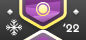 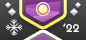 | Diamond | Top 3% |
| 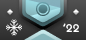 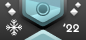 | Platinum | 3% – 10% |
| 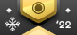 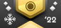 | Gold | 10% – 25% |
| 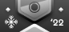 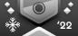 | Silver | 25% – 50% |
|  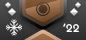 | Bronze | 50% – 70% |
| 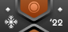 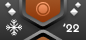 | Copper | 70% – 95% |
| 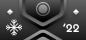 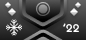 | Iron | 95% – 100% |

Tingkatan ambang batas pada Rhythm Incarnate dipilih secara manual berdasarkan jumlah peserta musim dan ukuran umum tingkatan lainnya, meskipun itu adalah angka absolut yang berkisar antara top 2 dan top 50 dalam banyak kasus.

Tabel ini hanya menunjukkan satu dari empat versi Lencana. Setiap mode permainan memiliki versi lencana nya sendiri.

### Sistem kurasi

Sistem kurasi melibatkan proses kurator memilih beatmap yang akan dimasukkan kedalam Beatmap Spotlight untuk setiap musim.

1. Beatmap dipilih oleh kurator dari masing–masing mode permainan selama 1 musim.
   - Kurator harus menyepakati tingkat kesulitan beatmap individu dalam diskusi yang terbuka.
   - Pemimpin mode permainan masing-masing mengunci keputusan dan memperkuat pilihan setelah diskusi konklusif.
   - Proses pemilihannya sendiri bervariasi antara mode permainan dan menyesuaikan dengan kebutuhan tiap anggota.
2. Beatmap dipilih berdasar keunikan dan keunggulannya. Setiap beatmap yang dipilih harus menjadi contoh utama kualitas konten dalam gameplay, desain, dan estetika.
3. Beatmap yang diseleksi berfungsi sebagai rekomendasi untuk seluruh komunitas dalam osu!.
4. Untuk memenuhi tugas perekomendasian beatmap yang sangat baik kepada komunitas, beatmap yang di kurasi harus mencakup spread khusus dari tingkat kesulitan Hard, Insane, dan Expert.
   - 25% dari keseluruhan beatmap yang dikurasi harus berada pada tingkat kesulitan “Hard”.
   - 45% dari keseluruhan beatmap yang dikurasi harus berada pada tingkat kesulitan “Insane”.
   - 30% dari keseluruhan beatmap yang dikurasi harus berada pada tingkat kesulitan “Expert”.
5. Untuk setiap musim, minimal 20 beatmap harus dipilih.
   - Semua beatmap yang dipilih harus berada dalam status “Ranked”.
   - Saat memilih lebih banyak beatmap, distribusi antara tiap tingkat kesulitan harus diikuti.
   - Kurator dapat memilih beberapa beatmap dari kumpulan beatmap yang sama.
6. Beatmap yang diseleksi harus merupakan perpaduan yang sehat antara konten terkini dan konten mapan.
   - Setidaknya, sejumlah 25% dari keseluruhan beatmap yang dipilih dapat melibatkan kurator sendiri.
7. Setiap individu kurator tidak boleh merekomendasikan beatmap yang mereka buat sendiri.
   - Paling banyak 25% dari beatmap yang di seleksi dapat melibatkan kurator.
8. Setiap beatmap yang dikurasi harus dipilih sebelum musim dimulai. Setelah musim dimulai, beatmap tidak dapat ditukar lagi.
9. Beatmap yang diseleksi akan ditampilkan secara bertahap selama 1 musim berlangsung. Seluruh daftar beatmap yang dipilih harus dirahasiakan sampai setiap subset musim terungkap.

### Kritik dan saran

Keberjalanan Beatmap Spotlights pada saat ini masih sangat eksperimental dan dapat berubah kapan saja berdasarkan tanggapan yang masuk dari para pemain. Oleh karena itu, tim Beatmap Spotlights sangat mengapresiasi kritik dan saran yang membangun dalam bentuk apapun agar Beatmap Spotlights dapat berkembang ke arah yang lebih baik ke depannya. Pemain disarankan untuk meninggalkan kritik dan saran mereka di sini:

- [Feedback utas forum](https://osu.ppy.sh/community/forums/topics/1189626)
- `#beatmap-spotlights` pada [server Discord komunitas osu!](https://discord.gg/0Vxo9AsejDkGlk3H)
- `#osu-spotlights` pada [server Discord osu!dev](https://discord.gg/ppy)

### Menjadi kurator

Siapa pun dapat melamar menjadi kurator dengan mengisi [formulir lamaran](https://spotlights.team/app) ini. Aplikasi terbuka di antara musim dan ditutup selama musim yang sedang berlangsung.

Semua pelamar kemudian akan ditinjau oleh manajemen proyek dan pemimpin tim, di mana tiap-tiap individu akan dinilai berdasarkan keahlian dan rekam jejak mereka sebagai pemain, *mapper*, *modder*, dan *mappool selector* turnamen pada mode permainannya masing-masing. Pelamar tidak perlu ahli dalam semua hal tersebut untuk bisa dipilih. Namun, memiliki keahlian yang luas pasti akan sangat membantu. Daftar kurator didasarkan pada perpaduan yang sehat dari berbagai skill level, pengalaman, dan keahlian. Jumlah kurator sengaja dibuat kecil dan dibatasi pada saat proyek berkembang.

## Sejarah

Awalnya bernama "Ranking Charts" dan dimulai pada November 2009 oleh ::{ flag=US }:: ::Cyclone::{ user-id=18589 } dan ::{ flag=AU }:: ::peppy::{ user-id=2 }, proyek ini bertujuan untuk menyorot beatmap terbaik dalam sebulan dengan mengizinkan [Beatmap Appreciation Team](/wiki/People/Beatmap_Appreciation_Team) dan [Mapping Assistance Team](/wiki/People/Mapping_Assistance_Team) mencalonkan dan memilih kandidat yang paling sesuai.

Proyek ini mengalami beberapa perubahan dan penambahan, seperti [Ranking Chart bertema](https://osu.ppy.sh/rankings/osu/charts?spotlight=26), [Ranking Charts dengan mod yang dibatasi](https://osu.ppy.sh/rankings/osu/charts?spotlight=19) atau [Papan peringkat musiman](https://osu.ppy.sh/home/news/2014-07-18-june-2014-ranking-chart). Awalnya, pemenang Ranking Charts diberi hadiah osu! Supporter Tag. Kemudian, hadiah untuk mapper atau pemenang papan peringkat musiman telah ditambahkan.

Pimpinan proyek telah berubah beberapa kali dalam sejarahnya. ::{ flag=US }:: ::SapphireGhost::{ user-id=388602 } mengambil alih pimpinan proyek pada Mei 2012, diikuti oleh ::{ flag=US }:: ::DeathXShinigami::{ user-id=49516 } dan ::{ flag=US }:: ::Makar::{ user-id=686389 }. ::{ flag=DE }:: ::Loctav::{ user-id=71366 } dan ::{ flag=DE }:: ::OnosakiHito::{ user-id=290128 } mengambil atas proyek tersebut pada bulan Desember 2013. Pada bulan Maret 2015, proyek tersebut berubah dari desain awal nominasi dan pemungutan suara menjadi terkenal [anggota komunitas secara pribadi memilih daftar set beatmap](https://osu.ppy.sh/home/news/2015-03-18-february-2015-Monthly-ranking-charts-new-season) yang mereka rekomendasikan. Pada bulan September 2016, [sistem pemilihan sebagian besar telah dikembalikan](https://osu.ppy.sh/home/news/2016-09-17-july-2016-ranking-charts-changes) dan memberi otoritas [Quality Assurance Team](/wiki/People/Quality_Assurance_Team) yang kemudian bertugas memilih set beatmap yang dirasa paling penting.

Berganti nama menjadi [Beatmap Spotlights](https://osu.ppy.sh/home/news/2017-03-18-introducing-to-you-spotlights) pada Maret 2017, sistem itu sendiri sebagian besar tetap konsisten sambil menambahkan hadiah tambahan seperti medali dan meningkatkan presentasi Beatmap Spotlights lebih lanjut. Selama perbaikan internal Quality Assurance Team, tanggung jawab untuk proyek telah dialihkan ke ::{ flag=HU }:: ::Kurokami::{ user-id=260933 } dan mengimplementasikan kembali seleksi berbasis komunitas. Pada November 2018, frekuensi Spotlights telah diubah menjadi [siklus rilis musiman](https://osu.ppy.sh/home/news/2018-11-01-beatmap-spotlights-summer-2018). Pada Maret 2020, ::{ flag=DE }:: ::Loctav::{ user-id=71366 } bergabung kembali dengan pimpinan proyek bersama dengan Kurokami, keduanya mengerjakan ulang menjadi bentuk baru dan menyusun tim baru yaitu osu! kurator.

Pada Agustus 2020, ::{ flag=HU }:: ::Kurokami::{ user-id=260933 } mengundurkan diri sebagai pemimpin proyek Beatmap Spotlights. Pada akhir November 2020, ::{ flag=DE }:: ::Loctav::{ user-id=71366 } turut mengundurkan diri di mana setelahnya kepemimpinan atas proyek Beatmap Spotlights dipercayakan kepada ::{ flag=PL }:: ::Venix::{ user-id=5999631 } bersama dengan ::{ flag=US }:: ::pishifat::{ user-id=3178418 }.
