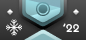
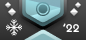
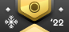
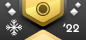

# Beatmap Spotlights

O **Beatmap Spotlights** (também conhecido como *Spotlights* ou *Ranking Charts*) é um projeto de curadoria recorrente para recomendação e destaque de [beatmaps](/wiki/Beatmap) por seu design e gameplay excelentes e únicos. É acompanhado por uma [liga de temporada](#temporadas-dos-spotlights) que dá recompensas para todos os jogadores participantes.

**A iteração atual desse projeto está em desenvolvimento e muitas de suas funcionalidades ainda estão sendo implementadas.** Específicos desse sistema, tais como recompensas, rankings sazonais ou funcionalidades de jogabilidade, podem mudar a qualquer momento.

A temporada atual é a temporada de Inverno 2022. É considerada o primeiro teste do novo sistema de Beatmap Spotlights.

## Organização

O projeto Beatmap Spotlights é mantido por vários membros da comunidade dentre todos os modos de jogo, liderados por um líder de projeto dedicado para essa função.

| Função | Membros |
| :-- | :-- |
| Líder de projeto | ::{ flag=PL }:: [Venix](https://osu.ppy.sh/users/5999631) |
| Gerente de projeto | ::{ flag=US }:: [pishifat](https://osu.ppy.sh/users/3178418) |
| Gerente do website | ::{ flag=PL }:: [Venix](https://osu.ppy.sh/users/5999631), ::{ flag=US }:: [Snowleopard](https://osu.ppy.sh/users/3790227) |

## Curadores

Cada lançamento do Beatmap Spotlights é montado por um time dedicado de curadores e individualmente escolhido baseado num processo de revisão e aplicação extensivos. Membros em negrito são os respectivos líderes de cada time

### Curadores osu!

- ::{ flag=FI }:: **[Nowaie](https://osu.ppy.sh/users/5428909)**
- ::{ flag=US }:: [ChillierPear](https://osu.ppy.sh/users/9501251)
- ::{ flag=GB }:: [DeviousPanda](https://osu.ppy.sh/users/4966334)
- ::{ flag=US }:: [DigitalHypno](https://osu.ppy.sh/users/4384207)
- ::{ flag=FI }:: [Lefafel](https://osu.ppy.sh/users/2295850)
- ::{ flag=AT }:: [Omgforz](https://osu.ppy.sh/users/578943)
- ::{ flag=MX }:: [Riot](https://osu.ppy.sh/users/4256461)
- ::{ flag=PL }:: [Zelq](https://osu.ppy.sh/users/8953955)

### Curadores osu!taiko

- ::{ flag=TN }:: **[Hivie](https://osu.ppy.sh/users/14102976)**
- ::{ flag=AR }:: [Axer](https://osu.ppy.sh/users/7299864)
- ::{ flag=US }:: [Nifty](https://osu.ppy.sh/users/4956097)
- ::{ flag=US }:: [radar](https://osu.ppy.sh/users/7131099)
- ::{ flag=JP }:: [uone](https://osu.ppy.sh/users/5321719)
- ::{ flag=MY }:: [[Zeth]](https://osu.ppy.sh/users/9912966)

### Curadores osu!catch

- ::{ flag=CA }:: **[SadEgg](https://osu.ppy.sh/users/10278243)**
- ::{ flag=US }:: [radar](https://osu.ppy.sh/users/7131099)
- ::{ flag=KR }:: [x_angelkawaii_x](https://osu.ppy.sh/users/566276)
- ::{ flag=US }:: [Snowless](https://osu.ppy.sh/users/4316266)
- ::{ flag=US }:: [wonjae](https://osu.ppy.sh/users/5032045)

### Curadores osu!mania

- ::{ flag=GB }:: **[Hydria](https://osu.ppy.sh/users/808176)**
- ::{ flag=KR }:: [Aruel](https://osu.ppy.sh/users/3984370)
- ::{ flag=CA }:: [BringoBrango](https://osu.ppy.sh/users/10274043)
- ::{ flag=AU }:: [CrumpetFiddler](https://osu.ppy.sh/users/3518705)
- ::{ flag=AU }:: [[ Decku ]](https://osu.ppy.sh/users/13360768)
- ::{ flag=TH }:: [HowToPlayLN](https://osu.ppy.sh/users/10879600)
- ::{ flag=DO }:: [Kaito-kun](https://osu.ppy.sh/users/4715184)
- ::{ flag=MY }:: [Kibitz](https://osu.ppy.sh/users/7418493)
- ::{ flag=PH }:: [lenpai](https://osu.ppy.sh/users/5314573)

## Playlists (Verão 2020)

### osu!

**Playlist A**

- [Kurenainagi Tabibito - Beloved Tomboyish Girl (Glass) \[Extended\]](https://osu.ppy.sh/beatmapsets/21678#osu/153246)
- [Krewella - Ghost (Sulfur) \[Sulfur's Hard\]](https://osu.ppy.sh/beatmapsets/1060866#osu/2329519)
- [nana(Sevencolours) - Chameleon (L\_P) \[Chameleon\]](https://osu.ppy.sh/beatmapsets/53632#osu/180969)
- [Tove Styrke - Changed My Mind (Mint) \[Expert\]](https://osu.ppy.sh/beatmapsets/982452#osu/2056844)
- [Britney Spears - Toxic (schoolboy) \[In The Zone\]](https://osu.ppy.sh/beatmapsets/1061947#osu/2223745)

**Playlist B**

- [Makino Yui - Undine (Hollow Wings) \[Lullaby\]](https://osu.ppy.sh/beatmapsets/396227#osu/862094)
- [-45 - Midorigo Queen Bee (PandaHero) \[Another\]](https://osu.ppy.sh/beatmapsets/812792#osu/1728260)
- [xi feat. Sta - Tiferet (ktgster) \[Insane\]](https://osu.ppy.sh/beatmapsets/714225#osu/1511130)
- [Thank You Scientist - Mr. Invisible (DTM9 Nowa) \[Insane\]](https://osu.ppy.sh/beatmapsets/1130581#osu/2387334)
- [Limp Bizkit - Take A Look Around (FCL) \[life lesson feat. piroshki\]](https://osu.ppy.sh/beatmapsets/1109633#osu/2318842)

**Playlist C**

- [Kalafina - Yume no Daichi (Vell) \[Sinfonia\]](https://osu.ppy.sh/beatmapsets/468807#osu/1002657)
- [Meramipop - Rakujitsu Romance (Loneight) \[Romance\]](https://osu.ppy.sh/beatmapsets/145976#osu/557980)
- [Sound Horizon - Raijin no Hidariude (AngelHoney) \[Insane\]](https://osu.ppy.sh/beatmapsets/16792#osu/60089)
- [Chata - Remind (Patchouli) \[Overdrive!!\]](https://osu.ppy.sh/beatmapsets/37292#osu/120030)
- [kors k - Playing With Fire (Sota Fujimori Remix) (xlni) \[Pyrotechnics\]](https://osu.ppy.sh/beatmapsets/202252#osu/478605)

**Playlist D**

- [UNDEAD CORPORATION - Sad Dream (Hinsvar) \[Hard\]](https://osu.ppy.sh/beatmapsets/1019827#osu/2145695)
- [Powerwolf - Christ & Combat (piroshki) \[Amen\]](https://osu.ppy.sh/beatmapsets/1013426#osu/2121136)
- [rerulili feat. Dancing Dolls - Kami no Manima ni (Sephira) \[RLC's Insane\]](https://osu.ppy.sh/beatmapsets/1182518#osu/2465404)
- [HujuniseikouyuuP - Talent Shredder (val0108) \[0108 style\]](https://osu.ppy.sh/beatmapsets/47710#osu/178966)
- [tricot - POOL (dsco) \[Lover\]](https://osu.ppy.sh/beatmapsets/854942#osu/1786452)

### osu!taiko

**Playlist A**

- [Zekk - Feelsleft0ut (komasy) \[Muzukashii\]](https://osu.ppy.sh/beatmapsets/1143253#taiko/2393341)
- [t+pazolite - Shiny Kung-fu Revival (DakeDekaane) \[Muzukashii\]](https://osu.ppy.sh/beatmapsets/352991#taiko/777798)
- [Hoshio Yuka - Tabidachi no Shuen (lolcubes) \[Oni\]](https://osu.ppy.sh/beatmapsets/119729#taiko/307304)
- [Mary - Artificial Rose (Urushi38) \[TK'S Oni\]](https://osu.ppy.sh/beatmapsets/99434#taiko/281675)
- [Nippon Gakuon Noise Kyoukai - Igomoyos=Omul no Thema ni yoru Buyobuyo Sketch no Kokoromi (uone) \[Inner Oni\]](https://osu.ppy.sh/beatmapsets/690019#taiko/1460471)

**Playlist B**

- [lapix feat. Luschel - Cranberry City (Charlotte) \[Muzukashii\]](https://osu.ppy.sh/beatmapsets/1133066#taiko/2388992)
- [Kuripurin - Jutenija (qinche) \[Alace's Taiko\]](https://osu.ppy.sh/beatmapsets/25500#taiko/87086)
- [MuryokuP - Catastrophe (meiikyuu) \[Haruka's Oni\]](https://osu.ppy.sh/beatmapsets/72740#taiko/217519)
- [Gekidan Record - Yuukyuu Shinwaroku -Haruka naru Sanmyaku ni Nagareru Taiga no Hotori nite- (AxelHino) \[Oni\]](https://osu.ppy.sh/beatmapsets/205637#taiko/485264)
- [Xandria - Call Of Destiny (Nardoxyribonucleic) \[Inner Oni\]](https://osu.ppy.sh/beatmapsets/635559#taiko/1348707)

**Playlist C**

- [wa. - Black Lotus (komasy) \[Muzukashii\]](https://osu.ppy.sh/beatmapsets/605096#taiko/1279183)
- [Ryu* - Mind Mapping (kors k mix) (Jerry) \[m1ng's Oni\]](https://osu.ppy.sh/beatmapsets/107237#taiko/281558)
- [Hige Driver join. SELEN - Dadadadadadadadadada (qoot8123) \[Oni\]](https://osu.ppy.sh/beatmapsets/237306#taiko/549277)
- [Zekk - Falling Down feat. Renko x TRIANGLE (Raiden) \[Hell Oni\]](https://osu.ppy.sh/beatmapsets/1150487#taiko/2401584)
- [LeaF - Doppelganger (extended ver.) (Midnaait) \[Inner Oni\]](https://osu.ppy.sh/beatmapsets/833092#taiko/1745096)

**Playlist D**

- [RoughSketch vs. L.E.D.-G - Engoku OVERKILL (Yales) \[Muzukashii\]](https://osu.ppy.sh/beatmapsets/889395#taiko/1860173)
- [nmk - sola (TKS) \[Oni\]](https://osu.ppy.sh/beatmapsets/171239#taiko/414274)
- [S3RL feat Krystal - R4V3 B0Y (Nishizumi) \[0N1\]](https://osu.ppy.sh/beatmapsets/593010#taiko/1254644)
- [Yu_Asahina - Trickstarz (kitafuma) \[Inner Oni\]](https://osu.ppy.sh/beatmapsets/1118075#taiko/2335498)
- [Nekomata Master+ - encounter (tasuke912) \[Inner Oni\]](https://osu.ppy.sh/beatmapsets/474003#taiko/1012645)

### osu!catch

**Playlist A**

- [Virtual Self - Angel Voices (Sinnoh) \[Platter\]](https://osu.ppy.sh/beatmapsets/939437#fruits/2060158)
- [IOSYS - Endless Tewi-ma Park (Kurosanyan) \[Drafura's Rain\]](https://osu.ppy.sh/beatmapsets/48874#fruits/181233)
- [cYsmix - Breeze (wonjae) \[Rocma's Rain\]](https://osu.ppy.sh/beatmapsets/840964#fruits/1761864)
- [DECO*27 feat. marina - Aimai Elegy (val0108) \[Red Light \~CtB\~\]](https://osu.ppy.sh/beatmapsets/43248#fruits/155227)
- [HyuN - Grin (Absolute Zero) \[Collab Overdose\]](https://osu.ppy.sh/beatmapsets/1065368#fruits/2230881)

**Playlist B**

- [Wisp X - Moonglow (wonjae) \[Platter\]](https://osu.ppy.sh/beatmapsets/1016833#fruits/2128303)
- [illion - AIWAGUMA (Ellyu) \[Tenshichan's Rain\]](https://osu.ppy.sh/beatmapsets/533037#fruits/1254563)
- [AAAA - Bokutachi no Tabi to Epilogue.[Long ver.] (Ascendance) \[Epilogue\]](https://osu.ppy.sh/beatmapsets/648071#fruits/1372995)
- [Hecq - Dstrukt (JBHyperion) \[Overdose\]](https://osu.ppy.sh/beatmapsets/511538#fruits/1087385)
- [ak+q - Axium Crisis (Lacrima) \[Vicious Labyrinth\]](https://osu.ppy.sh/beatmapsets/996639#fruits/2084648)

**Playlist C**

- [sakuzyo - Altale (toybot) \[AFB's Rain\]](https://osu.ppy.sh/beatmapsets/228815#fruits/724582)
- [sana - Sunset March (Benita) \[Rain\]](https://osu.ppy.sh/beatmapsets/959995#fruits/2020804)
- [Hatsuki Yura - Drivi'n greedy - Nhato Remix - (Rocma) \[The Dead Voyage\]](https://osu.ppy.sh/beatmapsets/998578#fruits/2088626)
- [Sasaki Sayaka - Atlantico Blue (-Luminate) \[Overdose\]](https://osu.ppy.sh/beatmapsets/1097911#fruits/2293993)
- [IKIMONOGAKARI - Blue Bird feat. k*chan \[ dj-Jo Remix \] TV Size (Ascendance) \[Overdose\]](https://osu.ppy.sh/beatmapsets/1174801#fruits/2450381)

**Playlist D**

- [FELT - Goldrop (Lust) \[Spec's Rain\]](https://osu.ppy.sh/beatmapsets/204927#fruits/506395)
- [sakuraburst - anticrystal (WildOne94) \[Team United Kingdom's Overdose\]](https://osu.ppy.sh/beatmapsets/1062804#fruits/2225576)
- [LiLA'c Records - Jue (Original extended) (alienflybot) \[Oblivion\]](https://osu.ppy.sh/beatmapsets/1023485#fruits/2141040)
- [Eisyo-kobu - Oriental Blossom -Eika Shuuei- (Yumeno Himiko) \[Sakura\]](https://osu.ppy.sh/beatmapsets/910194#fruits/1899381)
- [lapix - Carry Me Away (Minato Yukina) \[Ultra\]](https://osu.ppy.sh/beatmapsets/1018810#fruits/2131975)

### osu!mania

**Playlist A**

- [An - ExaVid (Abraxos) \[at\_the\_threshold\]](https://osu.ppy.sh/beatmapsets/649306#mania/1589629)
- [Camellia - Artificial Snow (Dergo) \[ash's hard\]](https://osu.ppy.sh/beatmapsets/1026319#mania/2147852)
- [Culprate - Finger VIP (Parachor) \[Trigger Finger\]](https://osu.ppy.sh/beatmapsets/508572#mania/1081560)
- [Chroma - lost memory (Youwhang) \[a light received from you.\]](https://osu.ppy.sh/beatmapsets/961321#mania/2012530)
- [bbn - Identic Conflict (pporse) \[Birdcage\]](https://osu.ppy.sh/beatmapsets/246853#mania/568463)

**Playlist B**

- [X&G - Whiplash ft. josh pan (sakuraburst Remix) (error_exe777) \[break out\]](https://osu.ppy.sh/beatmapsets/723633#mania/1527737)
- [Igorrr & Ruby My Dear - Figue Folle (Parachor) \[Grotesque [Lv.18]\]](https://osu.ppy.sh/beatmapsets/347453#mania/782953)
- [Frums - theyaremanycolors (Vortex-) \[780THz\]](https://osu.ppy.sh/beatmapsets/829383#mania/1737654)
- [Silentroom - NULCTRL EX (-mint-) \[MOTION\]](https://osu.ppy.sh/beatmapsets/1086666)
- [Middleisland - Achromat (iJinjin) \[7K Black Another\]](https://osu.ppy.sh/beatmapsets/195940#mania/553820)

**Playlist C**

- [Synergy Sound - Dreaming (-MysticEyes) \[serenity\]](https://osu.ppy.sh/beatmapsets/966717#mania/2023410)
- [Azu - Haryu (asd123iii) \[Another\]](https://osu.ppy.sh/beatmapsets/183478#mania/524443)
- [KOAN Sound & Asa - fuego (sakuraburst remix) (Couil) \[MX\]](https://osu.ppy.sh/beatmapsets/622946#mania/1313121)
- [Camellia - POWA OF DA WILDANES (Monheim) \[YATSUKAMIZUOMITSUNO\]](https://osu.ppy.sh/beatmapsets/1098578#mania/2295244)
- [Camellia - Beyond the Geostationary Orbit Level (Leniane) \[Equatorial\]](https://osu.ppy.sh/beatmapsets/1011337#mania/2116795)

**Playlist D**

- [The Flashbulb - Every Two Days (Monheim) \[2\]](https://osu.ppy.sh/beatmapsets/905599#mania/1890121)
- [siqlo - One Way Street (Dreamwalker) \[Unilateral\]](https://osu.ppy.sh/beatmapsets/688453#mania/1867902)
- [Ta9-5 - Positive (feat. Looci) (Dubstek) \[Loop Loop Loop\]](https://osu.ppy.sh/beatmapsets/1026168#mania/2146057)
- [Camellia - PLANET//SHAPER (Evening) \[GEOLOGICAL//IRRESOLUTION\]](https://osu.ppy.sh/beatmapsets/376293#mania/823842)
- [Frums - We Want To Run (Blocko) \[Another\]](https://osu.ppy.sh/beatmapsets/1025170#mania/2335802)

## Temporadas dos Spotlights

O projeto do Beatmap Spotlights é atualmente organizado em temporadas pré-definidas. Cada temporada consiste de uma seleção de beatmaps curados pelas equipes e uma liga competitiva por temporada para toda a comunidade.

1. Uma única temporada dura 10 semanas.
2. Temporadas são preparadas por completo antes que elas comecem.
   - Cada beatmap curado é selecionado e confirmado antes que a temporada comece.
   - Após o início de uma temporada, toda o cronograma será anunciado.
3. Cada temporada é dividida por semana. Cada semana é nomeada com sua própria letra.
   - Cada letra representa a playlist de um lobby de multiplayer semanal.
   - Semanas revezam pela temporada inteira e repetem duas vezes. As 2 semanas finais terão as playlists anteriores agrupadas em 2 playlists combinadas.
4. Quando uma temporada acabar, haverá uma pausa de 3 semanas antes que a nova temporada comece. Durante esse tempo, ajustes ao projeto poderão ser feitos.

### Cronograma (Verão 2020)

Este cronograma mostra a disponibilidade de salas permanentes da temporada atual.

| Evento | Horário |
| :-- | :-- |
| Começo de temporada | 2020-07-06 |
| Sala permanente: Playlist A | 2020-07-10/2020-07-12 |
| Sala permanente: Playlist B | 2020-07-17/2020-07-19 |
| Sala permanente: Playlist C | 2020-07-24/2020-07-26 |
| Sala permanente: Playlist D | 2020-07-31/2020-08-02 |
| Sala permanente: Playlist A | 2020-08-07/2020-08-09 |
| Sala permanente: Playlist B | 2020-08-14/2020-08-16 |
| Sala permanente: Playlist C | 2020-08-21/2020-08-23 |
| Sala permanente: Playlist D | 2020-08-28/2020-08-30 |
| Sala permanente: Playlist A e B | 2020-09-04/2020-09-06 |
| Sala permanente: Playlist C e D | 2020-09-11/2020-09-13 |
| Término de temporada | 2020-09-14/2020-09-18 |

### Salas de multiplayer permanente semanais

A partir de agora, entrar nessas salas de multiplayer permanente semanais requer que os participantes baixem e instalem o [osu!(lazer)](https://github.com/ppy/osu/releases).

1. Toda sexta-feira de uma semana em cada temporada, uma sala multiplayer permanente será aberta. Todo mundo poderá participar por 3 dias.
   - Nas 2 semanas finais de uma temporada, a sala multiplayer permanente será aberta novamente para duas playlists ao invés de uma.
2. Cada sala multiplayer permanente fornece uma playlist pré-definida de beatmaps.
   - Cada playlist é um subconjunto de toda a lista de beatmaps curados para cada temporada.
   - Cada playlist contém uma distribuição equilibrada de beatmaps de dificuldades Hard, Insane e Expert.
   - Cada playlist corresponde com a letra atribuída a cada semana. Portanto, cada playlist é revezada 3 vezes durante a temporada.
3. Dentro de uma sala permanente, todo mundo compete entre si em uma colocação específica para aquela sala.
   - Colocações de sala são baseados no sistema de Pontuação Ranqueada. Portanto, apenas os melhores resultados de pontuação em cada beatmap dentro da playlist são contados para criar uma Pontuação Ranqueada semanal para cada jogador.
   - Cada beatmap de uma playlist conta igualmente para a pontuação na colocação. Dificuldades mais difíceis não irão fornecer mais pontuação do que as mais fáceis.
   - Pontuação individual de beatmap é baseada no sistema de pontuação do osu!(lazer).
4. O total semanal de Pontuação Ranqueada visível na sala permanente é chamado de "Pontuação Ranqueada Semanal" na colocação.
5. Assim que uma sala permanente termina, a Pontuação Ranqueada Semanal de cada participante é adicionada a Colocação de Temporada.

### Colocação de temporada

*Essa funcionalidade ainda está sendo implementada. Partes dela serão adicionadas ao longo da temporada. Por causa disso, essa seção pode mudar a qualquer momento.*

A Colocação de Temporada conta todo os resultados semanais de Pontuação Ranqueada de cada participante. Baseado na Colocação de Temporada, cada participante é atribuído com uma divisão de liga refletindo a sua posição relativa dentro da colocação.

1. A pontuação da colocação de temporada é uma soma ponderada de toda a Pontuação Ranqueada Semanal adquirida em salas permanentes.
2. Participantes poderão possuir apenas uma Pontuação Ranqueada Semanal por playlist.
   - Jogar a mesma playlist em outra semana irá fazer que apenas a melhor Pontuação Ranqueada Semanal seja contabilizada, ao invés da pior pontuação em seu lugar.
3. Participantes não poderão saber da sua posição exata na Colocação de Temporada ou sua pontuação. Ao invés disso, eles irão ser atribuídos as divisões de liga.
   - Apenas o top 50 da colocação de temporada irá ter sua posição exata visível.
   - A divisão é atribuída baseado na posição dentro da colocação. Participantes irão ser atribuídos a maior divisão que eles são elegíveis.
4. A divisão atribuída será revelada assim que a segunda semana de uma temporada estiver concluída.

### Recompensas

*Partes dessas recompensas ainda estão sendo implementadas. Elas serão adicionadas ao longo da temporada. Por causa disso, essa seção pode mudar a qualquer momento.*

Recompensas são distribuídas para vencedores de salas permanentes semanalmente, criadores dos beatmaps curados e todos os participantes presentes na colocação de temporada.

1. O top 10 de cada sala permanente semanal será recompensado com 1 semana de osu! supporter tags.
2. Durante a temporada, cada participante é atribuído a uma divisão de liga, que é demonstrado por um distintivo de perfil única que dura pela duração da temporada.
   - O distintivo será atualizado a cada semana depois da segunda semana de uma temporada.
   - Os melhores jogadores de uma temporada talvez poderão manter seu distintivo de perfil permanentemente. Detalhes sobre isso ainda serão decididos.
3. No final de cada temporada, o melhor criador de beatmap, assim decidido pelos curadores, será recompensado com 1 mês de supporter tag.
4. No final de cada temporada, uma nova medalha desbloqueável será adicionada. Jogadores precisarão completar cada beatmap dessa temporada pelo menos uma vez para obtê-la.

| Distintivos | Divisão de Liga | Posição |
| :-: | :-- | :-- |
|   | Rhythm Incarnate | Top 50 |
|   | Diamante | Top 51 – 3% |
|   | Platina | 3% – 10% |
|   | Ouro | 10% – 25% |
|   | Prata | 25% – 50% |
|   | Bronze | 50% – 70% |
|   | Cobre | 70% – 95% |
|   | Ferro | 95% – 100% |

Essa tabela mostra apenas uma das quatro versões de distintivos. Cada modo de jogo tem seu próprio distintivo.

### Sistema de curadoria

O sistema de curadoria envolve o processo de curadores selecionando os beatmaps que irão para o Beatmap Spotlights para cada temporada.

1. Beatmaps são selecionados pelos curadores de seus modos de jogo respectivos pela duração de uma temporada.
   - Curadores precisam concordar com cada dificuldade de beatmap individual em uma discussão aberta.
   - Líderes de seus modos de jogo respectivos confirmam as decisões e solidificam a seleção após discussões conclusivas.
   - O processo de seleção em si varia entre os modos de jogo e se ajustam em volta das necessidades de seus membros respectivos.
2. Beatmaps são selecionados baseado em sua originalidade e excelência. Cada beatmap selecionado deve ser um grande exemplo de qualidade de conteúdo em jogabilidade, design e estética.
3. Beatmaps curados servem de recomendações para toda a comunidade do osu! em geral.
4. Para preencher o dever de recomendar excelente beatmaps para toda a comunidade, beatmaps curados devem cobrir um leque específico de dificuldades Hard, Insane e Expert.
   - 25% de todos os beatmaps curados devem estar dentro do tier de dificuldade Hard.
   - 45% de todos os beatmaps curados devem estar dentro do tier de dificuldade Insane.
   - 30% de todos os beatmaps curados devem estar dentro do tier de dificuldade Expert.
5. Para cada temporada, pelo menos 20 beatmaps devem ser selecionados.
   - Todos os beatmaps selecionados devem ser Ranqueados.
   - Se mais beatmaps forem selecionados, a distribuição entre tiers de dificuldade devem ser seguidos.
   - Curadores podem selecionar múltiplos beatmaps do mesmo set de beatmap.
6. Beatmaps curados devem ser um mix saudável de conteúdo recente e estabelecido.
   - Pelo menos 25% das dificuldades de beatmaps curados devem ter sido Ranqueados dentro dos últimos 3 meses antes do começo da temporada.
7. Curadores individuais não devem recomendar beatmaps que eles tiveram parte em sua criação.
   - No máximo 25% dos beatmaps selecionados podem ter tal envolvimento de criação dos próprios curadores.
8. Cada beatmap curado deve ser selecionado antes da temporada começar. Depois do começo de uma temporada, os beatmaps não podem mais ser trocados.
9. Beatmaps curados estão sendo revelados gradativamente durante a temporada. A lista inteira dos beatmaps selecionados deve ser mantida em segredo até cada subconjunto da temporada for revelada.

### Feedback

A implementação atual do Beatmap Spotlights é altamente experimental e pode mudar a qualquer momento dependendo de como os jogadores responderem ao projeto. Por conta disso, é importante coletar o máximo de feedback e criticismo possível para melhorar ainda mais na direção e implementação desse sistema. Os jogadores são encorajados a deixar suas opiniões aqui:

- [Feedback forum thread](https://osu.ppy.sh/community/forums/topics/1101170)
- `#beatmap-spotlights` no [Servidor de Discord da comunidade do osu!](https://discord.gg/0Vxo9AsejDkGlk3H)
- `#osu-spotlights` no [Servidor de Discord do osu!dev](https://discord.gg/ppy)

### Se tornando um curador

Qualquer um pode se candidatar a se tornar um curador preenchendo este [formulário](https://spotlights.team/app). Esses formulários abrem entre as temporadas e fecham durante uma temporada em andamento.

Todos os candidatos são analisados pela gerência do projeto e líderes de times e são avaliados baseado em sua proficiência como jogador, mapper, modder e selecionador de mappool de torneio para seu modo de jogo respectivo. Candidatos não precisam ser proficientes em todas essas coisas para serem selecionados, mas ter um leque grande de habilidades certamente ajuda. A lista de curadores é baseada num mix saudável de variantes níveis de habilidade, experiências e proficiências. O número de curadores está sendo mantido propositalmente pequeno e limitado no momento enquanto o projeto se desenvolve.

## História

Originalmente conhecido como "Ranking Charts" e criado em Novembro de 2009 por ::{ flag=US }:: [Cyclone](https://osu.ppy.sh/users/18589) e ::{ flag=AU }:: [peppy](https://osu.ppy.sh/users/2), o projeto tinha como objetivo destacar os melhores beatmaps do mês deixando a [Equipe de Apreciação de Beatmap](/wiki/People/Beatmap_Appreciation_Team) e a [Equipe de Assistência de Mapping](/wiki/People/Mapping_Assistance_Team) nomear e votar nos candidatos mais adequados.

O projeto sofreu várias mudanças e adições, tais como [Ranking Charts temáticas](https://osu.ppy.sh/rankings/osu/charts?spotlight=26), [Ranking Charts com restrição de mods](https://osu.ppy.sh/rankings/osu/charts?spotlight=19) ou [colocações de temporada](https://osu.ppy.sh/home/news/2014-07-18-june-2014-ranking-chart). Originalmente, os vencedores dos Ranking Charts foram recompensados com osu! Supporter Tags. Depois disso, recompensas para mappers ou vencedores de colocações de temporada foram adicionadas.

A liderança do projeto mudou várias vezes em sua história. ::{ flag=US }:: [SapphireGhost](https://osu.ppy.sh/users/388602) tomou conta da liderança do projeto em Maio de 2012, seguido de ::{ flag=US }:: [DeathXShinigami](https://osu.ppy.sh/users/49516) e ::{ flag=US }:: [Makar](https://osu.ppy.sh/users/686389). ::{ flag=DE }:: [Loctav](https://osu.ppy.sh/users/71366) e ::{ flag=DE }:: [OnosakiHito](https://osu.ppy.sh/users/290128) tomaram conta do projeto em Dezembro de 2013. Em Março de 2015 o projeto mudou de seu design original de nomear e votar para ter [membros de comunidade de renome por sí sós selecionarem uma lista de beatmap](https://osu.ppy.sh/home/news/2015-03-18-february-2015-monthly-ranking-charts-new-season) sets que recomendam. Em Setembro de 2016, o [sistema de seleção foi quase totalmente revertido](https://osu.ppy.sh/home/news/2016-09-17-july-2016-ranking-charts-changes) e colocou a [Equipe de Garantia de Qualidade](/wiki/People/Quality_Assurance_Team) no comando de selecionar os mais notáveis beatmap sets.

Renomeado para [Beatmap Spotlights](https://osu.ppy.sh/home/news/2017-03-18-introducing-to-you-spotlights) em Março de 2017, o sistema em sí manteve relativamente consistente enquanto adicionou recompensas adicionais tais como distintivos e melhorando a apresentação do Beatmap Spotlights ainda mais. Durante uma revisão interna da Equipe de Garantia de Qualidade, a responsabilidade do projeto foi transferida a ::{ flag=HU }:: [Kurokami](https://osu.ppy.sh/users/260933) e re-implementada a equipe de seleção baseada em membros da comunidade. Em Novembro de 2018, a frequência dos Spotlights mudaram para um [ciclo de lançamento por temporada](https://osu.ppy.sh/home/news/2018-11-01-beatmap-spotlights-summer-2018). Em março de 2020, ::{ flag=DE }:: [Loctav](https://osu.ppy.sh/users/71366) entrou novamente como líder de projeto junto de Kurokami, ambos refazendo o projeto em uma nova forma e reunindo uma nova equipe de curadores do osu!.
