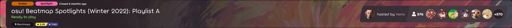
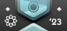
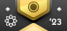
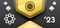
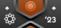
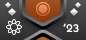

---
tags:
  - charts
  - Ranking Charts
  - Seasonal Spotlights
  - спотлайт
  - спотлайты
  - чарт
  - чарты
  - ранкинг-чарты
---

# Beatmap Spotlights

**Beatmap Spotlights** (*Spotlights*, жарг. *спотлайт*, в прошлом — ранкинг-чарты) — проект, участники которого регулярно выпускают подборки интересных или значимых [карт](/wiki/Beatmap), выделяющихся своим содержанием или оформлением. После выхода очередной подборки открывается [сезонная лига](#сезоны), где игроки могут соревноваться за право получения [значков для профиля](#призы).

Текущий сезон — весна 2025.

На странице группы [кураторов Beatmap Spotlight](https://osu.ppy.sh/groups/48) приведён полный список её участников. Чтобы узнать об их обязанностях, см. [соответствующую статью](/wiki/People/Beatmap_Spotlight_Curators).

## Участие

Чтобы состязаться с другими игроками, [скачайте](https://osu.ppy.sh/home/download) клиент [osu!(lazer)](/wiki/Client/Release_stream/Lazer).

После установки игры и входа в аккаунт выберите вкладку с плейлистами, чтобы попасть в лобби. Комнаты, посвящённые Beatmap Spotlights, можно найти либо по характерному розовому ярлыку над названием, либо с помощью фильтра в правом верхнем углу.

Если открытых комнат нет, значит, сезон кончился — ждите следующего. Перед этим обычно проходит несколько недель, после чего новый сезон анонсируется на [главной странице веб-сайта](https://osu.ppy.sh/home).

## Сезоны

*Полный список см. тут: [Сезоны](Seasons)*

Подборки карт в Beatmap Spotlights называются сезонами. Каждый сезон состоит из набора карт, составленного кураторами проекта, и сезонной лиги, где могут состязаться игроки со всего коммьюнити.

1. Сезон длится 9 недель, в ходе которых в лобби по очереди открываются 3 плейлиста.
   - Плейлисты помечены отдельными буквами.
   - Плейлисты состоят из 2 сложностей Hard, 3 — Insane и 4 — Expert.
   - В первые 6 недель плейлисты по очереди открываются на 2 недели.
   - В последние 3 недели плейлисты по очереди открываются на 1 неделю.
2. О расписании плейлистов сообщается в начале сезона.
3. Самый первый плейлист сезона либо имеет единую тематику, либо отличается какой-нибудь особенностью.
4. В конце сезона выходит новость, подводящая его итоги, а также открывается голосование среди участников за лучшую карту сезона. Его результаты публикуются в начале нового сезона.
5. Следующий сезон начинается через несколько недель после подведения итогов предыдущего.

### Сезонные рейтинги

В сезонную таблицу рекордов для каждого участника записывается сумма очков, полученных за наилучшие еженедельные прохождения плейлистов. В зависимости от положения в сезонном рейтинге, игроки распределяются по категориям.

1. Результат в сезонной таблице — взвешенная сумма очков, полученных за успешное прохождение карт во всех плейлистах.
2. В рамках одного и того же плейлиста участники могут иметь только один еженедельный рекорд.
   - Если участник перепроходит плейлист в другую неделю, то **будет сохранён только лучший результат прохождения**.
3. Таблица рекордов обновляется после закрытия очередного плейлиста.
   - Участники не знают своё точное положение или результат, только категорию.
   - Таблица рекордов публикуется в [дискорд-сервере сообщества osu!](https://discord.com/invite/0Vxo9AsejDkGlk3H) в канале `#osu-spotlights`, а также в чате комнаты, посвящённой следующему плейлисту.

### Призы

Награды выдаются победителям мультиплеерных комнат, авторам лучших карт сезона, а также всем, кто попал в сезонный рейтинг.

Игроки, занявшие первые 10 мест в рамках любой комнаты с плейлистом, получают **1 неделю [osu!supporter](/wiki/osu!supporter)**.

После подведения итогов открывается голосование за лучшую карту сезона, где участвуют игроки и кураторы от каждого режима игры (в сумме будет отобрано 8 карт). Карты, понравившиеся наибольшему числу участников, будут анонсированы в начале следующего сезона, а их авторы получат **3 месяца [osu!supporter](/wiki/osu!supporter)**.

На время проведения сезона игроки получают временный **значок для профиля**, отражающий их положение в сезонном рейтинге (см. ниже). Значки обновляются после закрытия каждого плейлиста. Игроки, которым удаётся сохранить значок Rhythm Incarnate до конца сезона, получают его **навсегда**.

| Значок | Категория | Положение участников |
| :-: | :-- | :-- |
|   | Rhythm Incarnate | Лучший из лучших |
|   | Diamond | Топ 3% |
|   | Platinum | 3% – 10% |
|   | Gold | 10% – 25% |
|   | Silver | 25% – 50% |
|   | Bronze | 50% – 70% |
|   | Copper | 70% – 95% |
|   | Iron | 95% – 100% |

Размер категории Rhythm Incarnate высчитывается вручную в зависимости от общего числа участников и их распределения по остальным категориям. В большинстве случаев он варьируется от 2 до 50 человек.

В таблице выше приведена только одна версия значка — он уникален для каждого режима игры.

### Курирование карт

Кураторы — это игроки и мапперы, отвечающие за то, какие карты попадут в следующий сезон Beatmap Spotlights.

1. Карты выбираются не более чем на один сезон.
   - Кураторы вместе договариваются о том, какие сложности выбрать.
   - После этого лидеры, закреплённые за каждым режимом, формируют окончательный пул карт после дополнительных обсуждений.
   - Процесс отбора карт может отличаться в зависимости от режима игры и целей, преследуемых его кураторами.
2. При выборе учитывается оригинальность и качество маппинга: каждая карта должна служить образцом для подражания в отношении геймплея, дизайна и стиля.
3. Отобранные карты помечаются особым тегом *Spotlights* и рекомендуются для игры всему сообществу.
4. Чтобы все игроки могли по достоинству оценить подборку, кураторы выбирают определённое число сложностей каждого уровня:
   - 6 карт должны быть уровня сложности Hard;
   - 9 карт — уровня Insane;
   - 12 карт — уровня Expert.
5. Всего в каждом сезоне участвуют 27 карт.
   - Все выбранные карты должны быть ранкнутыми.
   - Если выбрано больше карт, должно соблюдаться соотношение между их уровнями сложности.
   - В сезоне могут участвовать несколько сложностей одной и той же карты.
6. Подборка должна включать как новые, так и уже зарекомендовавшие себя карты.
   - В подборке должно быть как минимум 25% сложностей, ранкнутых не более чем за 3 месяца до начала сезона.
7. Кураторам запрещается рекомендовать карты, в создании которых они сами принимали участие.
   - В подборке должно быть не более 25% карт, сделанных с участием кураторов в принципе.
8. Окончательный список карт нужно предоставить до начала сезона, после чего карты уже нельзя поменять.
9. Выбранные карты должны публиковаться постепенно в течение сезона. Полный список карт необходимо держать в секрете, пока все они не станут известны.

### Обратная связь

Beatmap Spotlights — экспериментальный проект, открытый для предложений и идей от игроков. Авторам проекта хотелось бы собрать как можно отзывов и критических мнений, чтобы иметь возможность улучшать и развивать его. Если вам есть, о чём сказать, пишите сюда:

- [Тема на форуме, посвящённая проекту](https://osu.ppy.sh/community/forums/topics/1189626)
- Канал `#beatmap-spotlights` в [дискорд-сервере сообщества osu!](https://discord.com/invite/0Vxo9AsejDkGlk3H)
- Канал `#osu-spotlights` в [дискорд-сервере osu!](https://discord.com/invite/ppy)

## История

Первоначальная версия проекта называлась Ranking Charts и была запущена ::{ flag=AU }:: [peppy](https://osu.ppy.sh/users/2) и ::{ flag=US }:: [Cyclone](https://osu.ppy.sh/users/18589) в октябре 2009 г.[^charts-09-oct] [^charts-09-nov] Основной задачей в то время был выпуск ежемесячных или ежегодных[^charts-10-jan] подборок лучших карт, которые составляли члены [Beatmap Appreciation Team](/wiki/People/Beatmap_Appreciation_Team) и [Mapping Assistance Team](/wiki/People/Mapping_Assistance_Team). В сентябре 2011 г. появились чарты для osu!taiko и osu!catch.[^charts-11-per-mode]

Проект пережил ряд изменений и нововведений, среди которых были [тематические чарты](https://osu.ppy.sh/rankings/osu/charts?spotlight=26), [чарты для определённых модов](https://osu.ppy.sh/rankings/osu/charts?spotlight=19) и [сезонные рейтинги](https://osu.ppy.sh/home/news/2014-07-18-june-2014-ranking-chart). Награда в виде [osu!supporter](/wiki/osu!supporter) сперва предназначалась только победителям чартов, но потом её стали выдавать мапперам и лидерам сезонных рейтингов.

Руководство также менялось. В мае 2012 г. проект перешёл под руководство ::{ flag=US }:: [SapphireGhost](https://osu.ppy.sh/users/388602),[^charts-manager-sg] затем его сменили ::{ flag=US }:: [DeathXShinigami](https://osu.ppy.sh/users/49516) [^charts-manager-dxs] и — позднее — ::{ flag=US }:: [Makar](https://osu.ppy.sh/users/686389).[^charts-manager-makar] В декабре 2013 г. им на смену пришли ::{ flag=DE }:: [Loctav](https://osu.ppy.sh/users/71366) и ::{ flag=DE }:: [OnosakiHito](https://osu.ppy.sh/users/290128).[^charts-manager-loctav]

Чарты появились в игровом клиенте в январе 2014 г.,[^charts-in-osu-14-jan] а в июне того же года команда [Chart Assembly Team](/wiki/Beatmap_Spotlights/Chart_Assembly_Team) пополнилась известными игроками.[^charts-cat-recruitment-14-jun] Через год, в мае 2015 г., поменялась методика составления чартов: если раньше за них голосовали, то теперь известные участники сообщества (каждый месяц — новые) составляли списки сто̀ящих, по их мнению, карт.[^charts-curated-15-mar] От этой системы отказались в сентябре 2016 г.,[^charts-reverted-16-sep] переложив обязанность выбора карт на плечи [Quality Assurance Team](/wiki/People/Quality_Assurance_Team).

В марте 2017 г. чарты получили современное название — Beatmap Spotlights[^charts-renamed-into-spotlights] — но сохранили суть, разнообразив её дополнительными наградами вроде медалей, а также более существенным процессом презентации карт. Во время внутренних перестановок в Quality Assurance Team проект перешёл под руководство ::{ flag=HU }:: [Kurokami](https://osu.ppy.sh/users/260933) и вновь вернулся к идее отдельной команды, ответственной за выбор карт. В ноябре 2018 г. частота выпуска подборок замедлилась до ежесезонной.[^spotlights-seasonal] В марте 2020 г. проектом занялся ::{ flag=DE }:: [Loctav](https://osu.ppy.sh/users/71366), и вместе с Kurokami они придумали ему новый формат, а заодно сформировали отдельную команду кураторов.[^spotlights-reworked-20-june]

::{ flag=HU }:: [Kurokami](https://osu.ppy.sh/users/260933) ушёл из Beatmap Spotlights в августе 2020 г. В ноябре того же года ушёл и ::{ flag=DE }:: [Loctav](https://osu.ppy.sh/users/71366), после чего проект переняли ::{ flag=PL }:: [Venix](https://osu.ppy.sh/users/5999631) и ::{ flag=US }:: [pishifat](https://osu.ppy.sh/users/3178418).

После завершения весеннего сезона 2021 г. проект был заморожен до сентября, когда на смену ::{ flag=US }:: [pishifat](https://osu.ppy.sh/users/3178418) пришёл ::{ flag=TN }:: [Hivie](https://osu.ppy.sh/users/14102976). В феврале 2022 г. Beatmap Spotlights продолжил работу после очередных структурных и внутренних изменений.

В октябре 2023 г. менеджером проекта стал ::{ flag=AU }:: [Crumpey](https://osu.ppy.sh/users/3518705), занявшийся разными организационными вопросами. ::{ flag=TN }:: [Hivie](https://osu.ppy.sh/users/14102976) ушёл с поста менеджера в ноябре того же года.

## Ссылки

[^charts-09-oct]: [«osu! Public Release b1077», тема от peppy, 25.10.2009](https://osu.ppy.sh/community/forums/topics/19115)
[^charts-09-nov]: [(ограниченный доступ) «'Monthly Chart' discussion November edition», тема от Cyclone, 03.11.2009](https://osu.ppy.sh/community/forums/topics/19560)
[^charts-10-jan]: [«Best Beatmaps of 2009!», тема от Cyclone, 10.12.2009](https://osu.ppy.sh/community/forums/topics/21059)

[^charts-11-per-mode]: [«Apply to help create ranking charts! (osu!, Taiko, or CtB)», тема от Cyclone, 24.08.2011](https://osu.ppy.sh/community/forums/topics/60660)
[^charts-manager-sg]: [«May 2012 Ranking Chart, and new Chart Manager», тема от Cyclone, 20.05.2012](https://osu.ppy.sh/community/forums/topics/84573)
[^charts-manager-dxs]: [«April 2013 Ranking Chart», тема от DeathxShinigami, 14.04.2013](https://osu.ppy.sh/community/forums/topics/127847)
[^charts-manager-makar]: [«2013 NewCAT Applications», тема от Makar, 19.05.2013](https://osu.ppy.sh/community/forums/topics/133248)
[^charts-manager-loctav]: [(ограниченный доступ) Пост от Loctav в теме «Regarding the charts», 21.11.2013](https://osu.ppy.sh/community/forums/posts/2697871)
[^charts-in-osu-14-jan]: [(ограниченный доступ) Пост от peppy в теме «So peppy's planning something chart related», 24.01.2014](https://osu.ppy.sh/community/forums/posts/2824323)
[^charts-cat-recruitment-14-jun]: [(ограниченный доступ) «\[IMPORTANT\] Recruiting NewCATs», тема от Loctav, 16.06.2014](https://osu.ppy.sh/community/forums/topics/218032)
[^charts-curated-15-mar]: [«February 2015 Monthly Ranking Charts - New Season!», новость от Loctav, 18.03.2015](https://osu.ppy.sh/home/news/2015-03-18-february-2015-monthly-ranking-charts-new-season)
[^charts-reverted-16-sep]: [«July 2016 Ranking Charts - Changes», новость от OnosakiHito, 17.09.2016](https://osu.ppy.sh/home/news/2016-09-17-july-2016-ranking-charts-changes)

[^charts-renamed-into-spotlights]: [«Introducing to you: Spotlights», новость от OnosakiHito, 18.03.2017](https://osu.ppy.sh/home/news/2017-03-18-introducing-to-you-spotlights)
[^spotlights-seasonal]: [«Seasonal Spotlights: Summer 2018», новость от Kurokami, 01.11.2018](https://osu.ppy.sh/home/news/2018-11-01-beatmap-spotlights-summer-2018)
[^spotlights-reworked-20-june]: [«Beatmap Spotlights (Summer 2020) - Discussion Thread», тема от Loctav, 06.07.2020](https://osu.ppy.sh/community/forums/topics/1101170)
