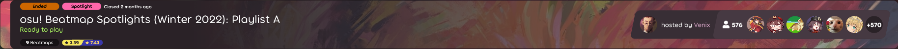
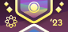
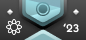
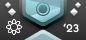
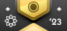
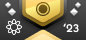
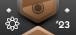
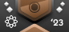
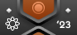
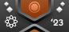

---
tags:
  - charts
  - Ranking Charts
  - Seasonal Spotlights
---

# Beatmap Spotlights

**Beatmap Spotlights** (หรือเรียกสั้นๆ ว่า *Spotlights* เดิมชื่อ *Ranking Charts*) คือโปรแกรมคัดกรองผลงานอย่างต่อเนื่องเพื่อแนะนำและเน้นย้ำถึง [Beatmap](/wiki/Beatmap) ที่มีรูปแบบการเล่นและการออกแบบที่ยอดเยี่ยมและมีเอกลักษณ์ โดยจะมาคู่กับ [ลีกประจำฤดูกาล (Seasonal league)](#ฤดูกาลของ-spotlights (spotlights-seasons)) ซึ่งผู้เล่นจะมาแข่งขันกันในแมพที่ได้รับเลือกเพื่อชิง [รางวัลเหรียญตรา (Badge prizes)](#รางวัล-(rewards))

ฤดูกาลปัจจุบันคือ Winter 2026

หน้า [รายชื่อกลุ่มผู้คัดเลือก Beatmap (Beatmap Spotlight Curators)](https://osu.ppy.sh/groups/48) จะระบุรายชื่อสมาชิกในทีมทั้งหมด คุณสามารถดูรายละเอียดหน้าที่ต่างๆ ภายใน BSC ได้ที่บทความ [ผู้คัดเลือก Beatmap Spotlights (Beatmap Spotlight Curators)](/wiki/People/Beatmap_Spotlight_Curators)

## การเข้าร่วม (Participation)

ในการเข้าร่วม Beatmap Spotlights ให้ทำการ [ดาวน์โหลด](https://osu.ppy.sh/home/download) ตัวเกม [osu!(lazer)](/wiki/Client/Release_stream/Lazer)

หลังจากติดตั้งและลงชื่อเข้าใช้บัญชีของคุณแล้ว ให้ไปที่แถบเพลย์ลิสต์ (Playlists) ในส่วนของการเล่น (Play) และค้นหาห้อง (Lobby) ของ Spotlights ซึ่งจะสังเกตได้จากแถบสีชมพูเล็กๆ หรือจะเลือกกรองข้อมูลที่มุมขวาบนก็ได้

หากไม่มีห้องที่เปิดอยู่ โปรดรอฤดูกาลถัดไป โดยปกติช่วงพักระหว่างฤดูกาลจะใช้เวลาไม่กี่สัปดาห์ และจะมีการประกาศเริ่มฤดูกาลใหม่ที่ [หน้าหลักของเว็บไซต์](https://osu.ppy.sh/home)

## ฤดูกาลของ Spotlights (Spotlights seasons)

*สำหรับรายชื่อฤดูกาลของ Spotlights ดูที่: [ฤดูกาล (Seasons)](Seasons)*

ปัจจุบันโปรเจกต์ Beatmap Spotlights ถูกจัดแบ่งเป็นฤดูกาลที่กำหนดไว้ล่วงหน้า ในแต่ละฤดูกาลจะประกอบด้วยชุดของ Beatmap ที่ผ่านการคัดเลือกและลีกการแข่งขันประจำฤดูกาลสำหรับทุกคนในชุมชน

1. หนึ่งฤดูกาลมีระยะเวลา 9 สัปดาห์ และจะวนรอบระหว่าง 3 เพลย์ลิสต์
   - แต่ละเพลย์ลิสต์จะระบุด้วยตัวอักษร
   - แต่ละเพลย์ลิสต์ประกอบด้วยความยากระดับ Hard 2 แมพ, Insane 3 แมพ และ Expert 4 แมพ
   - ในช่วง 6 สัปดาห์แรก แต่ละเพลย์ลิสต์จะมีระยะเวลาเพลย์ลิสต์ละ 2 สัปดาห์
   - ในช่วง 3 สัปดาห์สุดท้าย แต่ละเพลย์ลิสต์จะมีระยะเวลาเพลย์ลิสต์ละ 1 สัปดาห์แทน
2. ตารางเวลาของแต่ละฤดูกาลจะมีการประกาศเมื่อเริ่มฤดูกาลนั้นๆ
3. เพลย์ลิสต์แรกของแต่ละฤดูกาลจะเป็นเพลย์ลิสต์ตามธีมที่มีลูกเล่น (Gimmick) บางอย่าง
4. เมื่อสิ้นสุดฤดูกาล จะมีการเปิดโหวต "Beatmap of the Season" (แมพยอดเยี่ยมประจำฤดูกาล) พร้อมกับการโพสต์ข่าวสรุปผล โดยผลการโหวตจะประกาศในช่วงเริ่มต้นของฤดูกาลถัดไป
5. ฤดูกาลถัดไปจะเริ่มขึ้นหลังจากสิ้นสุดฤดูกาลปัจจุบันไม่กี่สัปดาห์

### ตารางคะแนนประจำฤดูกาล (Seasonal leaderboard)

ตารางคะแนนประจำฤดูกาลจะรวมคะแนน Ranked score รายสัปดาห์ของผู้เข้าร่วมทุกคน โดยอิงจากตารางคะแนนนี้ ผู้เข้าร่วมแต่ละคนจะถูกจัดกลุ่มเข้าสู่ระดับลีก (League bracket) ตามลำดับคะแนนของตนเอง

1. คะแนนตารางคะแนนประจำฤดูกาลคือผลรวมถ่วงน้ำหนักของคะแนน Ranked score รายสัปดาห์ทั้งหมดที่ทำได้ในห้องเพลย์ลิสต์
2. ผู้เข้าร่วมสามารถมีคะแนน Ranked score รายสัปดาห์ได้เพียงหนึ่งคะแนนต่อหนึ่งเพลย์ลิสต์เท่านั้น
   - หากเล่นเพลย์ลิสต์เดิมซ้ำในสัปดาห์อื่น **ระบบจะนับเฉพาะคะแนนที่ดีที่สุดเท่านั้น** และจะเขียนทับคะแนนที่ด้อยกว่า
3. ตารางคะแนนจะได้รับการอัปเดตหลังจากสิ้นสุดแต่ละเพลย์ลิสต์
   - ผู้เข้าร่วมจะไม่ทราบคะแนนดิบที่แน่นอนของตนเอง แต่จะถูกแจ้งระดับลีกที่ได้รับแทน
   - ตารางคะแนนจะถูกเผยแพร่ใน [osu! community discord](https://discord.com/invite/0Vxo9AsejDkGlk3H) ในแชนแนล `#osu-spotlights` รวมถึงในแชทของห้องเพลย์ลิสต์ถัดไป

### รางวัล (Rewards)

รางวัลจะมอบให้กับผู้ชนะในห้องเพลย์ลิสต์, ผู้สร้าง Beatmap ที่ได้รับเลือกเป็น Beatmap of the Season และผู้เข้าร่วมทุกคนที่มีชื่ออยู่ในตารางคะแนนประจำฤดูกาล

ผู้เล่น 10 อันดับแรกของแต่ละห้องเพลย์ลิสต์จะได้รับ **[osu!supporter](/wiki/osu!supporter) เป็นเวลา 1 สัปดาห์**

หลังจากสิ้นสุดแต่ละฤดูกาล จะมีการเปิดโหวตสำหรับ *Beatmap of the Season* โดยผู้เล่นและผู้คัดเลือกจะเลือกแมพที่ชนะในแต่ละโหมดเกม รวมทั้งหมด 8 แมพ ผลงานที่ชนะจะได้รับการประกาศเมื่อเริ่มฤดูกาลถัดไป และผู้สร้างแมพเหล่านั้นจะได้รับ **[osu!supporter](/wiki/osu!supporter) เป็นเวลา 3 เดือน**

ในระหว่างฤดูกาล ผู้เข้าร่วมทุกคนจะได้รับ **เหรียญตรา (Badge)** ชั่วคราวซึ่งแสดงถึงลำดับปัจจุบันในตารางคะแนนประจำฤดูกาลตามตารางด้านล่าง เหรียญตราเหล่านี้จะได้รับการอัปเดตหลังจากจบแต่ละเพลย์ลิสต์ ผู้เล่นที่ถือเหรียญตราระดับ Rhythm Incarnate เมื่อสิ้นสุดฤดูกาลจะได้รับสิทธิ์ **ครอบครองเหรียญตรานั้นอย่างถาวร**

| เหรียญตรา | ระดับลีก (Bracket tier) | ลำดับคะแนน |
| :-: | :-- | :-- |
|   | Rhythm Incarnate | สุดยอดของผู้เล่นทั้งหมด |
|   | Diamond | 3% อันดับแรก |
|   | Platinum | 3% – 10% |
|   | Gold | 10% – 25% |
|   | Silver | 25% – 50% |
|   | Bronze | 50% – 70% |
|   | Copper | 70% – 95% |
|   | Iron | 95% – 100% |

เกณฑ์คะแนนสำหรับระดับ Rhythm Incarnate จะถูกเลือกด้วยตนเองโดยอิงจากจำนวนผู้เข้าร่วมในฤดูกาลนั้นๆ และขนาดโดยรวมของระดับอื่นๆ โดยปกติจะเป็นจำนวนเต็มที่อยู่ระหว่างอันดับที่ 2 ถึงอันดับที่ 50

ตารางนี้แสดงเพียงหนึ่งในสี่รูปแบบของเหรียญตราเท่านั้น เนื่องจากแต่ละโหมดเกมจะมีรูปแบบเหรียญตราเป็นของตัวเอง

### ระบบการคัดเลือก (Curation system)

ระบบการคัดเลือกคือกระบวนการที่ผู้คัดเลือก (Curators) เลือก Beatmap เพื่อนำเข้าสู่ Beatmap Spotlights ในแต่ละฤดูกาล

1. Beatmap จะถูกเลือกโดยผู้คัดเลือกประจำโหมดเกมนั้นๆ สำหรับระยะเวลาหนึ่งฤดูกาล
   - ผู้คัดเลือกจำเป็นต้องเห็นพ้องต้องกันในแต่ละระดับความยากผ่านการพูดคุยแบบเปิดเผย
   - หัวหน้าโหมดเกม (Game mode leaders) จะเป็นผู้ตัดสินใจขั้นสุดท้ายและยืนยันการเลือกหลังจากได้ข้อสรุป
   - ขั้นตอนการเลือกจะแตกต่างกันไปตามโหมดเกมและปรับเปลี่ยนตามความต้องการของสมาชิก
2. Beatmap จะได้รับเลือกโดยอิงจากความมีเอกลักษณ์และความยอดเยี่ยม แต่ละแมพที่ได้รับเลือกควรเป็นตัวอย่างชั้นนำของคุณภาพในด้านเกมเพลย์, การออกแบบ และความสวยงาม
3. Beatmap ที่ได้รับการคัดเลือกจะทำหน้าที่เป็นคำแนะนำสำหรับชุมชน osu! ทั้งหมด และจะถูกทำเครื่องหมายด้วยแท็กพิเศษ *Spotlights*
4. เพื่อบรรลุหน้าที่ในการแนะนำ Beatmap ที่ยอดเยี่ยมให้กับทุกคนในชุมชน แมพที่ได้รับเลือกควรครอบคลุมช่วงความยากที่เจาะจง ได้แก่ Hard, Insane และ Expert
   - 6 แมพควรอยู่ในระดับความยาก Hard
   - 9 แมพควรอยู่ในระดับความยาก Insane
   - 12 แมพควรอยู่ในระดับความยาก Expert
5. ในแต่ละฤดูกาล ต้องมีการคัดเลือก Beatmap รวมทั้งหมด 27 แมพ
   - ทุกแมพที่เลือกต้องอยู่ในสถานะ Ranked
   - หากมีการเลือกแมพเพิ่มขึ้น ต้องรักษาสัดส่วนระหว่างระดับความยากตามกำหนด
   - ผู้คัดเลือกสามารถเลือกหลายระดับความยากจาก Beatmap ชุดเดียวกันได้
6. Beatmap ที่ได้รับเลือกควรเป็นการผสมผสานที่ลงตัวระหว่างผลงานใหม่และผลงานที่มีชื่อเสียงอยู่แล้ว
   - อย่างน้อย 25% ของระดับความยากที่ได้รับเลือก ต้องได้รับการจัดอันดับ (Ranked) ภายในช่วง 3 เดือนก่อนเริ่มฤดูกาล
7. ผู้คัดเลือกแต่ละคนห้ามแนะนำ Beatmap ที่ตนเองมีส่วนร่วมในการสร้าง
   - อย่างมากที่สุดไม่เกิน 25% ของแมพที่ได้รับเลือกทั้งหมด สามารถเป็นแมพที่มีผู้คัดเลือกมีส่วนเกี่ยวข้องได้
8. ทุกแมพที่คัดเลือกต้องได้รับเลือกก่อนที่ฤดูกาลจะเริ่มขึ้น เมื่อฤดูกาลเริ่มแล้ว จะไม่สามารถเปลี่ยนแมพได้อีก
9. Beatmap ที่ได้รับเลือกจะถูกเปิดเผยทีละส่วนในระหว่างฤดูกาล รายชื่อแมพทั้งหมดต้องถูกเก็บเป็นความลับจนกว่าจะมีการเปิดเผยครบทุกส่วนของฤดูกาลนั้นๆ

### การแจ้งข้อเสนอแนะ (Feedback)

ปัจจุบันระบบ Beatmap Spotlights ยังอยู่ในขั้นทดลองและสามารถเปลี่ยนแปลงได้ตลอดเวลาตามการตอบรับของผู้เล่น ดังนั้นจึงเป็นเรื่องสำคัญมากที่ต้องรวบรวมข้อเสนอแนะและคำวิจารณ์ให้ได้มากที่สุดเพื่อนำมาปรับปรุงแนวทางและระบบนี้ต่อไป ผู้เล่นสามารถแสดงความคิดเห็นได้ที่ช่องทางเหล่านี้:

- [กระทู้ฟอรัมแจ้งข้อเสนอแนะ](https://osu.ppy.sh/community/forums/topics/1189626)
- แชนแนล `#beatmap-spotlights` ใน [osu! community Discord server](https://discord.com/invite/0Vxo9AsejDkGlk3H)
- แชนแนล `#osu-spotlights` ใน [osu! Discord server](https://discord.com/invite/ppy)

## ประวัติความเป็นมา (History)

เดิมทีใช้ชื่อว่า "Ranking Charts" และเริ่มดำเนินการในเดือนตุลาคม 2009[^charts-09-oct] [^charts-09-nov] โดย ::{ flag=AU }:: [peppy](https://osu.ppy.sh/users/2) และ ::{ flag=US }:: [Cyclone](https://osu.ppy.sh/users/18589) โปรเจกต์นี้มีเป้าหมายเพื่อเน้นย้ำถึง Beatmap ที่ดีที่สุดในแต่ละเดือนหรือแต่ละปี[^charts-10-jan] โดยให้ทีม [Beatmap Appreciation Team](/wiki/People/Beatmap_Appreciation_Team) และ [Mapping Assistance Team](/wiki/People/Mapping_Assistance_Team) เป็นผู้เสนอชื่อและโหวตเลือกผู้ที่เหมาะสมที่สุด ต่อมาในเดือนกันยายน 2011 ได้มีการเพิ่มชาร์ตสำหรับโหมด osu!taiko และ osu!catch เข้ามา[^charts-11-per-mode]

โปรเจกต์นี้ผ่านการเปลี่ยนแปลงและเพิ่มเติมหลายอย่าง เช่น [Ranking Charts แบบมีธีม](https://osu.ppy.sh/rankings/osu/charts?spotlight=26), [Ranking Charts แบบจำกัด Mod](https://osu.ppy.sh/rankings/osu/charts?spotlight=19) หรือ [ตารางคะแนนประจำฤดูกาล](https://osu.ppy.sh/home/news/2014-07-18-june-2014-ranking-chart) โดยเดิมทีผู้ชนะใน Ranking Charts จะได้รับรางวัลเป็นสถานะ [osu!supporter](/wiki/osu!supporter) และภายหลังได้มีการเพิ่มรางวัลสำหรับ Mapper หรือผู้ชนะในตารางคะแนนประจำฤดูกาลเข้ามา

หัวหน้าโปรเจกต์มีการเปลี่ยนมือหลายครั้งตลอดประวัติศาสตร์ ::{ flag=US }:: [SapphireGhost](https://osu.ppy.sh/users/388602) เข้ามารับช่วงต่อในเดือนพฤษภาคม 2012[^charts-manager-sg] ตามด้วย ::{ flag=US }:: [DeathXShinigami](https://osu.ppy.sh/users/49516) [^charts-manager-dxs] และ ::{ flag=US }:: [Makar](https://osu.ppy.sh/users/686389)[^charts-manager-makar] จากนั้น ::{ flag=DE }:: [Loctav](https://osu.ppy.sh/users/71366) และ ::{ flag=DE }:: [OnosakiHito](https://osu.ppy.sh/users/290128) ได้เข้ามารับหน้าที่ดูแลโปรเจกต์ในเดือนธันวาคม 2013[^charts-manager-loctav]

ในเดือนมกราคม 2014 ได้มีการเพิ่มระบบค้นหาชาร์ตเข้าไปในตัวเกม osu![^charts-in-osu-14-jan] และในเดือนมิถุนายน 2014 ผู้เล่นที่มีชื่อเสียงหลายคนได้รับการรับเข้าทีม [Chart Assembly Team](/wiki/Beatmap_Spotlights/Chart_Assembly_Team)[^charts-cat-recruitment-14-jun] ต่อมาในเดือนมีนาคม 2015 โปรเจกต์ได้เปลี่ยนจากการเสนอชื่อและโหวต เป็นการให้สมาชิกชุมชนที่มีชื่อเสียงเลือกรายชื่อ Beatmap ที่พวกเขาแนะนำด้วยตนเองเพียงคนเดียว[^charts-curated-15-mar] จนกระทั่งในเดือนกันยายน 2016 ระบบการคัดเลือกส่วนใหญ่ถูกเปลี่ยนกลับไปใช้รูปแบบเดิม[^charts-reverted-16-sep] และมอบหมายให้ทีม [Quality Assurance Team](/wiki/People/Quality_Assurance_Team) เป็นผู้รับผิดชอบในการเลือก Beatmap ที่โดดเด่นที่สุด

ในเดือนมีนาคม 2017 โปรเจกต์ถูกเปลี่ยนชื่อเป็น Beatmap Spotlights[^charts-renamed-into-spotlights] แม้ว่าระบบส่วนใหญ่จะยังคงเดิมแต่มีการเพิ่มรางวัลเพิ่มเติม เช่น เหรียญตรา (Medals) และการปรับปรุงรูปแบบการนำเสนอให้ดียิ่งขึ้น ในระหว่างการยกเครื่องภายในของทีม Quality Assurance Team ความรับผิดชอบต่อโปรเจกต์นี้ถูกมอบหมายให้กับ ::{ flag=HU }:: [Kurokami](https://osu.ppy.sh/users/260933) และได้เริ่มนำระบบทีมคัดเลือกที่อิงจากชุมชนกลับมาใช้ใหม่อีกครั้ง ต่อมาในเดือนพฤศจิกายน 2018 ความถี่ของการปล่อย Spotlights ถูกเปลี่ยนเป็นรอบรายฤดูกาล[^spotlights-seasonal] และในเดือนมีนาคม 2020 ::{ flag=DE }:: [Loctav](https://osu.ppy.sh/users/71366) ได้กลับมาร่วมนำทีมโปรเจกต์ร่วมกับ Kurokami โดยทั้งคู่ได้ยกเครื่องระบบใหม่และรวมทีมผู้คัดเลือก (Curators) ชุดใหม่ของ osu! ขึ้นมา[^spotlights-reworked-20-june]

ในเดือนสิงหาคม 2020 ::{ flag=HU }:: [Kurokami](https://osu.ppy.sh/users/260933) ได้ลาออกจากตำแหน่งหัวหน้าโปรเจกต์ และเมื่อสิ้นเดือนพฤศจิกายน 2020 ::{ flag=DE }:: [Loctav](https://osu.ppy.sh/users/71366) ก็ได้ลาออกเช่นกัน โดยมี ::{ flag=PL }:: [Venix](https://osu.ppy.sh/users/5999631) เข้ามารับช่วงต่อพร้อมกับ ::{ flag=US }:: [pishifat](https://osu.ppy.sh/users/3178418)

หลังจากสิ้นสุดฤดูกาล Spring 2021 โปรเจกต์เข้าสู่ช่วงพักยาวจนถึงเดือนกันยายน 2021 เมื่อมีความพยายามในการฟื้นฟูโปรเจกต์ขึ้นมาใหม่ โดย ::{ flag=US }:: [pishifat](https://osu.ppy.sh/users/3178418) ลาออกจากบทบาทการจัดการ และมี ::{ flag=TN }:: [Hivie](https://osu.ppy.sh/users/14102976) เข้ามาแทนที่ ในเดือนกุมภาพันธ์ 2022 โปรเจกต์ได้กลับมาดำเนินงานอีกครั้งหลังจากมีการเปลี่ยนแปลงโครงสร้างและทีมงานบางส่วน

ในเดือนตุลาคม 2023 ::{ flag=AU }:: [Crumpey](https://osu.ppy.sh/users/3518705) ได้รับหน้าที่เป็นผู้จัดการโปรเจกต์เพื่อช่วยเหลือในด้านการจัดระเบียบทั่วไป และในเดือนพฤศจิกายน 2023 ::{ flag=TN }:: [Hivie](https://osu.ppy.sh/users/14102976) ได้ลาออกจากตำแหน่งเดียวกัน

## อ้างอิง (References)

[^charts-09-oct]: [กระทู้ฟอรัมโดย peppy (2009-10-25) "osu! Public Release b1077"](https://osu.ppy.sh/community/forums/topics/19115)
[^charts-09-nov]: [(จำกัดสิทธิ์) กระทู้ฟอรัมโดย Cyclone (2009-11-03) "'Monthly Chart' discussion November edition"](https://osu.ppy.sh/community/forums/topics/19560)
[^charts-10-jan]: [กระทู้ฟอรัมโดย Cyclone (2009-12-10) "Best Beatmaps of 2009!"](https://osu.ppy.sh/community/forums/topics/21059)

[^charts-11-per-mode]: [กระทู้ฟอรัมโดย Cyclone (2011-08-24) "Apply to help create ranking charts! (osu!, Taiko, or CtB)"](https://osu.ppy.sh/community/forums/topics/60660)
[^charts-manager-sg]: [กระทู้ฟอรัมโดย Cyclone (2012-05-20) "May 2012 Ranking Chart, and new Chart Manager"](https://osu.ppy.sh/community/forums/topics/84573)
[^charts-manager-dxs]: [กระทู้ฟอรัมโดย DeathxShinigami (2013-04-14) "April 2013 Ranking Chart"](https://osu.ppy.sh/community/forums/topics/127847)
[^charts-manager-makar]: [กระทู้ฟอรัมโดย Makar (2013-05-19) "2013 NewCAT Applications"](https://osu.ppy.sh/community/forums/topics/133248)
[^charts-manager-loctav]: [(จำกัดสิทธิ์) โพสต์ฟอรัมโดย Loctav (2013-11-21) ใน "Regarding the charts"](https://osu.ppy.sh/community/forums/posts/2697871)
[^charts-in-osu-14-jan]: [(จำกัดสิทธิ์) โพสต์ฟอรัมโดย peppy (2014-01-24) ใน "So peppy's planning something chart related"](https://osu.ppy.sh/community/forums/posts/2824323)
[^charts-cat-recruitment-14-jun]: [(จำกัดสิทธิ์) กระทู้ฟอรัมโดย Loctav (2014-06-16) "\[IMPORTANT\] Recruiting NewCATs"](https://osu.ppy.sh/community/forums/topics/218032)
[^charts-curated-15-mar]: [โพสต์ข่าวโดย Loctav (2015-03-18) "February 2015 Monthly Ranking Charts - New Season!"](https://osu.ppy.sh/home/news/2015-03-18-february-2015-monthly-ranking-charts-new-season)
[^charts-reverted-16-sep]: [โพสต์ข่าวโดย OnosakiHito (2016-09-17) "July 2016 Ranking Charts - Changes"](https://osu.ppy.sh/home/news/2016-09-17-july-2016-ranking-charts-changes)

[^charts-renamed-into-spotlights]: [โพสต์ข่าวโดย OnosakiHito (2017-03-18) "Introducing to you: Spotlights"](https://osu.ppy.sh/home/news/2017-03-18-introducing-to-you-spotlights)
[^spotlights-seasonal]: [โพสต์ข่าวโดย Kurokami (2018-11-01) "Seasonal Spotlights: Summer 2018"](https://osu.ppy.sh/home/news/2018-11-01-beatmap-spotlights-summer-2018)
[^spotlights-reworked-20-june]: [กระทู้ฟอรัมโดย Loctav (2020-07-06) "Beatmap Spotlights (Summer 2020) - Discussion Thread"](https://osu.ppy.sh/community/forums/topics/1101170)
