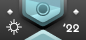
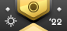
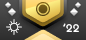
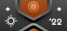

---
tags:
  - Beatmap Spotlights
  - charts
  - Ranking Charts
  - 季赛
  - 月赛
---

# 聚光灯

**聚光灯**（Beatmap Spotlights，或简称 Spotlights），也被称为*月赛*（*Ranking Charts*）。是一个定期举办的活动系统，用于推荐或突出玩家制作的拥有出色或独特玩法设计的[谱面](/wiki/Beatmap)。它有一个[赛季排行榜](#赛季)，并为所有参与的玩家提供奖励。

当前赛季为 2022 夏。

## 参加

必须使用 osu!(lazer) 客户端才能参加聚光灯，前往它的 [GitHub 发行页](https://github.com/ppy/osu/releases/latest)进行下载。

安装并登入账号后，在游玩菜单中进入 `课题模式`，找到带有粉色标识的 `Spotlights` 大厅，或使用右上角的下拉框进行筛选。

如果当前没有进行中的大厅，请等待下一赛季。赛季间会间隔几周，全新赛季开始时都会在[主页](https://osu.ppy.sh/home)进行公告。

## 组织

聚光灯由各种社区成员在所有游戏模式下维护运行，并由专门的项目负责人领导。

| 职责 | 成员 |
| --: | :-- |
| 项目负责人 | ::{ flag=PL }:: [Venix](https://osu.ppy.sh/users/5999631) |
| 项目管理 | ::{ flag=TN }:: [Hivie](https://osu.ppy.sh/users/14102976) |
| 网站管理 | ::{ flag=PL }:: [Venix](https://osu.ppy.sh/users/5999631), ::{ flag=US }:: [Snowleopard](https://osu.ppy.sh/users/3790227) |

## 策展

每个赛季的课题均由专门的策展团队精选，并根据广泛的申请与审查流程进行逐个挑选。加粗成员为团队负责人。

### osu! 策展人

- ::{ flag=FI }:: **[Nowaie](https://osu.ppy.sh/users/5428909)**
- ::{ flag=US }:: [ChillierPear](https://osu.ppy.sh/users/9501251)
- ::{ flag=GB }:: [DeviousPanda](https://osu.ppy.sh/users/4966334)
- ::{ flag=US }:: [DigitalHypno](https://osu.ppy.sh/users/4384207)
- ::{ flag=FI }:: [Lefafel](https://osu.ppy.sh/users/2295850)
- ::{ flag=AT }:: [Omgforz](https://osu.ppy.sh/users/578943)
- ::{ flag=MX }:: [Riot](https://osu.ppy.sh/users/4256461)
- ::{ flag=PL }:: [Zelq](https://osu.ppy.sh/users/8953955)

### osu!taiko 策展人

- ::{ flag=TN }:: **[Hivie](https://osu.ppy.sh/users/14102976)**
- ::{ flag=AR }:: [Axer](https://osu.ppy.sh/users/7299864)
- ::{ flag=US }:: [Nifty](https://osu.ppy.sh/users/4956097)
- ::{ flag=US }:: [radar](https://osu.ppy.sh/users/7131099)
- ::{ flag=JP }:: [uone](https://osu.ppy.sh/users/5321719)
- ::{ flag=MY }:: [[Zeth]](https://osu.ppy.sh/users/9912966)

### osu!catch 策展人

- ::{ flag=CA }:: **[SadEgg](https://osu.ppy.sh/users/10278243)**
- ::{ flag=RU }:: [Nelly](https://osu.ppy.sh/users/4741164)
- ::{ flag=US }:: [radar](https://osu.ppy.sh/users/7131099)
- ::{ flag=CA }:: [WadBot](https://osu.ppy.sh/users/14571181)
- ::{ flag=US }:: [wonjae](https://osu.ppy.sh/users/5032045)
- ::{ flag=CA }:: [wwwww](https://osu.ppy.sh/users/8434466)

### osu!mania 策展人

- ::{ flag=AU }:: **[Crumpey](https://osu.ppy.sh/users/3518705)**
- ::{ flag=DO }:: [Antalf](https://osu.ppy.sh/users/8793773)
- ::{ flag=GB }:: [Hydria](https://osu.ppy.sh/users/808176)
- ::{ flag=MY }:: [Kibitz](https://osu.ppy.sh/users/7418493)
- ::{ flag=PH }:: [lenpai](https://osu.ppy.sh/users/5314573)
- ::{ flag=US }:: [Protastic101](https://osu.ppy.sh/users/6712747)

## 赛季

*主页：[赛季](Seasons)*

聚光灯目前在规定时段中进行。每个赛季都包含一组课题和一个面向整个社区的竞争性赛季排行榜。

1. 每个赛季持续 9 周，一个周期有 3 个课题。
   - 每个课题都会用一个字母标记。
   - 每个课题包含 2 个 Hard，3 个 Insane 和 4 个 Expert 难度。
   - 在前 6 周，每个课题会持续 2 个星期。
   - 在最后 3 周，每个课题只会持续 1 个星期。
2. 每个赛季的时间表会在赛季开始前公布。
3. 每个赛季的首轮课题都会拥有一个特定的主题。
4. 每个赛季结束后，赛季最佳谱面的投票通道会随着结算新闻贴同步开放。其结果会在下赛季开始前公布。
5. 下个赛季会在当前赛季结束的几周后开始。

### 赛季排行榜

赛季排行榜汇总每位玩家的周 Ranked 谱面总分。根据赛季排行榜，玩家会被分配到一个段位，以反映他们在排行榜中的相对位置。

1. 赛季排行榜的得分是课题模式大厅中所有“周 Ranked 谱面总分”的总和。
2. 玩家在每个课题中只能拥有一个“周 Ranked 谱面总分”。
   - 在另一周重复的课题中将只计算最佳的“周 Ranked 谱面总分”。
3. 排行榜会在每轮课题结算后更新。
   - 玩家不会得知其确切的赛季排行榜排名或得分。他们只会被分配到各自的段位当中。
   - 排行榜会在 [osu! 社区 Discord 服务器](https://discord.gg/0Vxo9AsejDkGlk3H) 的 `#osu-spotlights` 频道和下一轮的大厅聊天窗口中公布。

### 段位奖励

奖励将分发给课题模式大厅的获胜者，赛季最佳谱面的作者以及赛季排行榜上的每位玩家。

每个课题模式大厅的前 10 名会获得 **1 周的 [osu! 支持者标签](/wiki/osu!supporter)**。

每个赛季结算后，*赛季最佳谱面* 的投票通道会被开启, 玩家和策展人可以为每个游戏模式都挑选一张最佳谱面，总共 8 张。最佳谱面会在下赛季开始时公布，每位胜者获得 **3 个月的 [osu! 支持者标签](/wiki/osu!supporter)**。

赛季期间，每一位参与的玩家都会获得一个与其段位所对应的临时**个人资料徽章**。这些徽章会在每轮课题结束后更新。所有达到 `人韵合一` 段位的玩家都能**永久保留**其个人资料徽章。

| 徽章 | 段位 | 排名 |
| :-: | :-- | :-- |
|   | 人韵合一（Rhythm Incarnate） | 赛季最佳玩家 |
|   | 钻石（Diamond） | 3% |
|   | 铂金（Platinum） | 3% – 10% |
|   | 黄金（Gold） | 10% – 25% |
|   | 白银（Silver） | 25% – 50% |
|   | 青铜（Bronze） | 50% – 70% |
|   | 黄铜（Copper） | 70% – 95% |
|   | 黑铁（Iron） | 95% – 100% |

`人韵合一` 段位的玩家数量是根据该赛季的参与人数和其他段位的规模手动挑选的，在大多数情况下为前 2 - 50 名。

该表仅展示四个徽章设计中的 osu! 版本。每种游戏模式都有其自己的徽章设计。

### 策展系统

策展系统涉及策展人精选每个赛季要加入聚光灯的高质量谱面的过程。

1. 在一个赛季的时间中，谱面将由各个模式的策展人选择出来。
   - 策展人需要在公开讨论中就每个谱面达成共识。
   - 模式负责人会确定将选择的谱面，并在最终讨论后锁定结果。
   - 选择的过程在各个游戏模式之间有所不同，并且会根据成员的需求进行调整。
2. 谱面的选择基于其独特性和卓越性。每个选定的谱面都应在游戏性，设计和美学方面出类拔萃。
3. 选定的谱面会推荐到整个 osu! 社区，并标上独一无二的 *Spotlights* 标签。
4. 为了履行向整个社区推荐优秀谱面的职责，谱面应涵盖特定范围的 Hard，Insane 和 Expert 难度。
   - 统计时，应至少包含 6 个 Hard 难度。
   - 统计时，应至少包含 9 个 Insane 难度。
   - 统计时，应至少包含 12 个 Expert 难度。
5. 每赛季一共选择 27 个高质量谱面。
   - 所有谱面必须 Ranked。
   - 就算挑选出了超过 27 个谱面，也必须遵循难度之间的均匀分布。
   - 策展人可以选择同一谱面集的多个谱面。
6. 谱面应该是最新和公认内容的健康组合。
   - 所选谱面中至少有 25％ 必须在本赛季开始前的最近三个月内 Ranked。
7. 策展人不得推荐他们参与制作的谱面。
   - 最多 25％ 的谱面可以由策展人自己参与。
8. 每个谱面都必须在赛季开始前进行选择。一个赛季开始后，就无法更改谱面。
9. 所选谱面在赛季中被逐渐揭晓。所选谱面的整个列表必须保密，直到该赛季的每个课题都揭晓为止。

### 反馈

聚光灯的当前状态是高度实验性的，可以根据玩家的反应随时更改。所以目前最重要的是收集尽可能多的反馈与批评，以进一步改善该系统的方向和表现。鼓励所有玩家在这里留下他们的意见和反馈：

- [论坛反馈贴](https://osu.ppy.sh/community/forums/topics/1189626)
- [社区 Discord 服务器](https://discord.gg/0Vxo9AsejDkGlk3H) 中的 `#beatmap-spotlights` 频道
- [osu!dev](https://discord.gg/ppy) 中的 `#osu-spotlights` 频道

### 成为策展人

在大多数情况下，各自的游戏模式团队会推荐新的策展人以适应当前游戏环境。这些建议将由项目管理人员、团队领导人和策展人自己进行评估。

此外，某些赛季可能会公开部分游戏模式的申请周期。

项目管理人员和团队负责人将审核所有申请人，并根据其作为各自游戏模式的玩家，以及作图摸图和图池选择的熟练程度进行评估。申请人不必精通所有这些技能，但是拥有广泛的认识肯定会有所帮助。策展人团队的基础是各种技能水平，经验和熟练程度的健康搭配。随着项目的发展，策展人的数量目前被有意地控制在很小的范围内。

## 历史

该项目最初由 ::{ flag=US }:: [Cyclone](https://osu.ppy.sh/users/18589) 和 ::{ flag=AU }:: [peppy](https://osu.ppy.sh/users/2) 在 2009 年 10 月[^charts-09-oct] [^charts-09-nov]提出，原名 “Ranking Charts”。该项目旨在让 [BAT](/wiki/Modding/Beatmap_Appreciation_Team) 和 [MAT](/wiki/Modding/Mapping_Assistance_Team) 提名并投票选出展示为期一个月或一年[^charts-10-jan]的最佳谱面。2011 年 9 月, osu!taiko 和 osu!catch 也启动了类似的项目[^charts-11-per-mode]。

该项目进行了多次更改和补充，例如[主题月赛](https://osu.ppy.sh/rankings/osu/charts?spotlight=26)，[Mod 月赛](https://osu.ppy.sh/rankings/osu/charts?spotlight=19)或是[赛季排行榜](https://osu.ppy.sh/home/news/2014-07-18-june-2014-ranking-chart)等等。 最初，只有月赛胜者才能获得 [osu! 支持者](/wiki/osu!supporter)标签。后来，添加了对谱面作者或赛季排行榜胜者的奖励。

项目负责人在其历史上已经发生了数次变化。::{ flag=US }:: [SapphireGhost](https://osu.ppy.sh/users/388602) 于 2012 年 5 月接任项目负责人[^charts-manager-sg]，随后是 ::{ flag=US }:: [DeathXShinigami](https://osu.ppy.sh/users/49516) [^charts-manager-dxs] 和 ::{ flag=US }:: [Makar](https://osu.ppy.sh/users/686389) [^charts-manager-makar]。::{ flag=DE }:: [Loctav](https://osu.ppy.sh/users/71366) 和 ::{ flag=DE }:: [OnosakiHito](https://osu.ppy.sh/users/290128) 于 2013 年 12 月接任项目负责人[^charts-manager-loctav]。

2014 年 1 月，月赛浏览器被添加到 osu! 客户端当中[^charts-in-osu-14-jan]，同年 6 月，几位知名玩家被招募进入了 [CAT](/wiki/Beatmap_Spotlights/Chart_Assembly_Team)[^charts-cat-recruitment-14-jun]。从 2015 年 3 月开始，该项目从最初的提名和投票，转变为让[知名社区成员逐个选择他们推荐的谱面](https://osu.ppy.sh/home/news/2015-03-18-february-2015-monthly-ranking-charts-new-season)[^charts-curated-15-mar]。在 2016 年 9 月，提名系统已大体恢复[^charts-reverted-16-sep]。此时，[QAT](/wiki/Modding/Quality_Assurance_Team) 将负责选择最值得关注的谱面。

在 2017 年 3 月改名为 [Beatmap Spotlights](https://osu.ppy.sh/home/news/2017-03-18-introducing-to-you-spotlights)[^charts-renamed-into-spotlights]。该系统本身保持了基本的连贯性，同时增加了诸如成就之类的奖励，并进一步增强了 Beatmap Spotlights 的显示效果。在 QAT 休整期间，::{ flag=HU }:: [Kurokami](https://osu.ppy.sh/users/260933) 重新任职为该项目的负责人，并重组了一个基于社区的谱面选择团队。2018 年 11 月，月赛的频率更改为季节性[^spotlights-seasonal]。2020 年 3 月，::{ flag=DE }:: [Loctav](https://osu.ppy.sh/users/71366) 和 Kurokami 重任项目负责人、重新设计项目结构、并新建了名为 osu! 策展人的团队[^spotlights-reworked-20-june]。

2020 年 8 月 ::{ flag=HU }:: [Kurokami](https://osu.ppy.sh/users/260933) 退出了该项目，在 2020 年 11 月底 ::{ flag=DE }:: [Loctav](https://osu.ppy.sh/users/71366) 也随 Kurokami 辞职。于是 ::{ flag=PL }:: [Venix](https://osu.ppy.sh/users/5999631) 和 ::{ flag=US }:: [pishifat](https://osu.ppy.sh/users/3178418) 一起接管了该项目。

在第 4 赛季（2021 春）后，项目进入停顿期。直至 2021 年 9 月，出现了复兴的倾向，::{ flag=US }:: [pishifat](https://osu.ppy.sh/users/3178418) 卸任，而 ::{ flag=TN }:: [Hivie](https://osu.ppy.sh/users/14102976) 加入管理团队，于 2022 年 2 月，在人员重组后，项目恢复了运作。

## 参见

[^charts-09-oct]: [peppy 创建的论坛贴 (2009-10-25) "osu! Public Release b1077"](https://osu.ppy.sh/community/forums/topics/19115)
[^charts-09-nov]: [(受限) Cyclone 创建的论坛贴 (2009-11-03) "'Monthly Chart' discussion November edition"](https://osu.ppy.sh/community/forums/topics/19560)
[^charts-10-jan]: [Cyclone 创建的论坛贴 (2009-12-10) "Best Beatmaps of 2009!"](https://osu.ppy.sh/community/forums/topics/21059)

[^charts-11-per-mode]: [Cyclone 创建的论坛贴 (2011-08-24) "Apply to help create ranking charts! (osu!, Taiko, or CtB)"](https://osu.ppy.sh/community/forums/topics/60660)
[^charts-manager-sg]: [Cyclone 创建的论坛贴 (2012-05-20) "May 2012 Ranking Chart, and new Chart Manager"](https://osu.ppy.sh/community/forums/topics/84573)
[^charts-manager-dxs]: [DeathxShinigami 创建的论坛贴 (2013-04-14) "April 2013 Ranking Chart"](https://osu.ppy.sh/community/forums/topics/127847)
[^charts-manager-makar]: [Makar 创建的论坛贴 (2013-05-19) "2013 NewCAT Applications"](https://osu.ppy.sh/community/forums/topics/133248)
[^charts-manager-loctav]: [(受限) Loctav 发表的论坛回复 (2013-11-21) "Regarding the charts"](https://osu.ppy.sh/community/forums/posts/2697871)
[^charts-in-osu-14-jan]: [(受限) peppy 发表的论坛回复 (2014-01-24) "So peppy's planning something chart related"](https://osu.ppy.sh/community/forums/posts/2824323)
[^charts-cat-recruitment-14-jun]: [(受限) Loctav 创建的论坛贴 (2014-06-16) "\[IMPORTANT\] Recruiting NewCATs"](https://osu.ppy.sh/community/forums/topics/218032)
[^charts-curated-15-mar]: [Loctav 的新闻稿 (2015-03-18) "February 2015 Monthly Ranking Charts - New Season!"](https://osu.ppy.sh/home/news/2015-03-18-february-2015-monthly-ranking-charts-new-season)
[^charts-reverted-16-sep]: [OnosakiHito 的新闻稿 (2016-09-17) "July 2016 Ranking Charts - Changes"](https://osu.ppy.sh/home/news/2016-09-17-july-2016-ranking-charts-changes)

[^charts-renamed-into-spotlights]: [OnosakiHito 的新闻稿 (2017-03-18) "Introducing to you: Spotlights"](https://osu.ppy.sh/home/news/2017-03-18-introducing-to-you-spotlights)
[^spotlights-seasonal]: [Kurokami 的新闻稿 (2018-11-01) "Seasonal Spotlights: Summer 2018"](https://osu.ppy.sh/home/news/2018-11-01-beatmap-spotlights-summer-2018)
[^spotlights-reworked-20-june]: [Loctav 创建的论坛贴 (2020-07-06) "Beatmap Spotlights (Summer 2020) - 论坛贴"](https://osu.ppy.sh/community/forums/topics/1101170)
