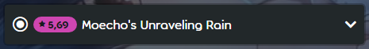
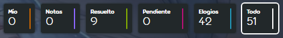
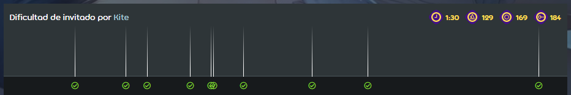
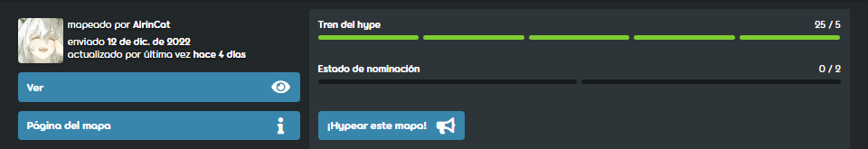
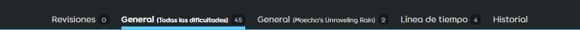
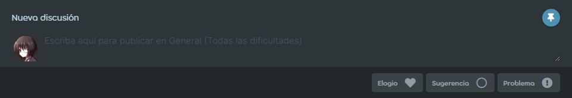

---
tags:
  - beatmap discussions
  - modding V2
  - MV2
  - discusiones de beatmaps
outdated: true
---

# Discusión de beatmaps

*Véase también: [Modding v1](/wiki/Modding/Forum_modding)*

La **discusión de beatmaps** (también conocida como *Modding v2*) es un sistema para administrar y simplificar el proceso de [modding](/wiki/Modding). Su objetivo es proporcionar una interfaz clara y comprensible, donde se enfoca la mejora de un beatmap. Cuando un beatmap es [enviado](/wiki/Beatmapping/Beatmap_submission), se crea automáticamente una página de discusión junto con la página de información del beatmap. Cuando se actualice el beatmap, la página de discusión también se actualizará. Se puede acceder a la página de discusión haciendo clic en el botón `Discusión` en la página de información. La página de discusión del beatmap consta de algunos elementos (de arriba a abajo):

- Selección de modo
- Encabezado del beatmap
- Menú de dificultad
- Opciones de clasificación
- Línea de tiempo visual
- Estado del beatmap
- Pestañas de modding
- Campo de envío
- Discusiones

¡Puedes seguir nuestras imágenes de [este mapa](https://osu.ppy.sh/beatmapsets/924551/discussion) para familiarizarte con las discusiones de beatmaps o intentar abrir una página de discusión tú mismo!

## Inicio rápido

Es importante tener en cuenta algunas cosas para usar las páginas de discusiones de beatmaps de manera efectiva:

- Elige el modo correcto y la dificultad que deseas modear.
- Selecciona la sección adecuada a la que estás enviando tu modeo.
- **Solo publica un problema a la vez.** No envíes varios problemas en una sola publicación.
- Verifica si el problema ya se ha solucionado cuando aparezca la advertencia de publicación similar.
- Si te gusta el mapa, considera hypearlo para acercarlo a la nominación.

## Selección de modo

La selección de modo cambia el [modo de juego](/wiki/Game_mode) que estás modeando. Solo es posible seleccionar un modo de juego si el beatmap tiene una dificultad de ese modo de juego. Esto solo se usa con beatmaps que contienen múltiples modos de juego; de lo contrario, se establecerá de forma predeterminada en el modo de juego mapeado.

## Encabezado del beatmap

*Para obtener información sobre la configuración de metadatos, véase: [Configuración de la canción § Metadatos de canciones y mapas](/wiki/Client/Beatmap_editor/Song_setup#song-and-map-metadata)*

El encabezado del beatmap muestra el título y el artista proporcionados en el [editor de beatmaps](/wiki/Client/Beatmap_editor). Al hacer clic en el encabezado del beatmap, volverás a la página de información.

## Menú de dificultad

Puedes seleccionar diferentes [dificultades](/wiki/Beatmap/Difficulty) a través del menú desplegable. Esto mostrará todas las dificultades disponibles actualmente, junto con las más antiguas, eliminadas que han tenido sugerencias/problemas. El número que aparece junto al nombre de una dificultad es el número de publicaciones no resueltas en esa dificultad específica. Es importante verificar dos veces este menú antes de enviar cualquier modeo.

## Opciones de clasificación

Las opciones de clasificación cambian la forma en que se ven las discusiones del beatmap. Cuando se elige una opción, cambia tanto la línea de tiempo de modeo como la sección de modeo para incluir solo el tipo de publicación seleccionada. Esto es especialmente útil para ver publicaciones pendientes en una página de discusión. Las diferentes opciones incluyen:

- `Mío` muestra tus propias publicaciones
- `Notas` muestra cualquier nota del mapper o [Beatmap Nominator](/wiki/People/Beatmap_Nominators)
- `Resuelto` muestra publicaciones resueltas
- `Pendiente` muestra publicaciones pendientes
- `Elogios` muestra publicaciones de elogios y hype
- `Todo` muestra todas las publicaciones

## Línea de tiempo visual

La línea de tiempo visual muestra todos los modeos creados para una dificultad que usan una marca de tiempo. Al hacer clic en cualquiera de estos, se desplazará hacia abajo hasta el modeo publicado en esa marca de tiempo. Ten en cuenta que cualquier opción de filtrado cambiará lo que se muestra aquí. La línea de tiempo visual es una herramienta útil para ver cuánto se ha modificado un beatmap de un vistazo. Una línea de tiempo apretada significaría que un beatmap ya ha recibido mucha atención. La configuración de la dificultad seleccionada también se muestra en la parte superior derecha de la línea de tiempo visual. De izquierda a derecha, describen la `Duración`, `BPM`, `Número de círculos` y `Número de sliders` de una dificultad.

## Estado del beatmap

La barra de estado del beatmap muestra todo lo relevante para el lugar de un beatmap en el [procedimiento de clasificación del beatmap](/wiki/Beatmap_ranking_procedure). Esto incluye:

- Tren del hype
- Información general
- Botones Ver/Dejar de ver
- Botón de la página del beatmap

### Tren del Hype

El tren del hype registra cuántos [hypes](/wiki/Beatmap/Hype) ha recibido un conjunto de mapas. Una vez que se hayan logrado 5 hypes, el beatmap puede ser nominado por los [Beatmap Nominators](/wiki/People/Beatmap_Nominators). Los hypes solo se pueden dar yendo a la pestaña `General (Todas las dificultades)`, ya que no funcionará a través de las pestañas `General` o `Línea de tiempo`. Al hacer clic en el botón `Hype`, te moverá automáticamente a la pestaña correcta.

### Estado de nominación

La barra de estado de nominación rastrea las nominaciones de un beatmap. Una vez que un beatmap haya recibido dos nominaciones, será [calificado](/wiki/Beatmap/Category#calificados).

### Información general

La información general muestra al creador del beatmap, la fecha de envío y la fecha en que se actualizó por última vez. [Cambios de estado](/wiki/Beatmap), como que un beatmap se clasifique, sea amado o abandonado, también se consideran actualizaciones y se mostrarán aquí.

### Ver/Dejar de ver

Los botones `Ver` y `Dejar de ver` permiten seguir/dejar de seguir los desarrollos de un beatmap. Si se sigue un beatmap, las nuevas publicaciones y respuestas en la página de discusión de ese beatmap crearán notificaciones en la web de osu!. Las suscripciones se pueden administrar a través de la [lista de seguimiento de modeo](https://osu.ppy.sh/beatmapsets/watches), que se puede encontrar a través del menú de la página de inicio.

### Página del beatmap

El botón `Página del mapa` navegará a la página de información de un beatmap. Esto también se puede hacer haciendo clic en el [encabezado del beatmap](#encabezado-del-beatmap).

## Pestañas de modeo

El modeo se realiza a través de tres pestañas, que separan las publicaciones de diferentes tipos y las dividen en formatos legibles. Además, una cuarta pestaña registra todos los cambios. El número al lado de cada pestaña describe la cantidad de publicaciones que contiene.

`General (Todas las dificultades)` muestra publicaciones que se aplican a todas las dificultades. Las publicaciones comunes en esta pestaña incluyen metadatos, notas y debates sobre el beatmap en conjunto.

`General (Nombre de la dificultad)` muestra publicaciones que solo se aplican a la dificultad seleccionada actualmente. Las publicaciones comunes en esta pestaña incluyen la configuración del beatmap, los problemas recurrentes y la discusión general sobre la dificultad seleccionada.

`Línea de tiempo` muestra publicaciones en puntos específicos de una dificultad según la primera marca de tiempo colocada. Cada publicación en esta pestaña debe incluir una marca de tiempo para ser publicada. Cualquier marca de tiempo posterior no tendrá influencia en el orden de publicación.

`Historial` registra todos los cambios en una página de discusión en orden cronológico. Los cambios están codificados por colores, siendo el verde las publicaciones resueltas y los cambios de estado, el rojo los problemas nuevos después de la nominación y el azul todo lo demás. Al hacer clic en cualquier número de referencia, se saltará a la publicación específica. Esta pestaña no se usa durante el modeo, pero es útil para los [Beatmap Nominators](/wiki/People/Beatmap_Nominators) y otro personal para verificar problemas.

## Campo de envío

El campo de envío es donde se escriben los [modeos](/wiki/Modding). Una vez escrito, el modeo debe enviarse a la página de discusión. Esto se puede hacer presionando uno de los tres botones de tipo; `Elogio`, `Sugerencia` o `Problema`.

`Elogio` se usa para elogiar y animar. `Sugerencia` se usa para publicaciones que no están directamente en conflicto con ninguna regla. `Problema` se usa para publicaciones que están en conflicto directo con los [criterios de clasificación](/wiki/Ranking_criteria), o que se consideran intersubjetivamente incorrectas. Una vez que se presiona un botón, el modeo se enviará a la página de discusión.

Si publica en la pestaña `Línea de tiempo`, debe incluir una marca de tiempo en su publicación. Si su marca de tiempo está cerca de otro modeo, deberá confirmar que no aborda el problema que está enviando actualmente. **¡Revisa cada publicación antes de marcar la casilla!** Puede ser beneficioso `Anclar` el campo de modeo mientras se comprueban otros problemas. Habilitar el anclaje permitirá que el campo de envío se desplace contigo.

## Discusiones

Las discusiones son donde se colocan las publicaciones del [campo de envío](#campo-de-envío) una vez enviadas. Los usuarios que visiten una página de discusión pueden ver las publicaciones realizadas por todos los demás usuarios y podrán participar en la discusión sobre las publicaciones. Esto se hace haciendo clic en los botones `Responder` o `Contestar` debajo de una publicación y escriba una respuesta. Después de terminar una respuesta, al presionar `Enter` o hacer clic en `Responder` se enviará a la discusión.

El creador del beatmap y los autores de las publicaciones de modeo tienen la capacidad de cerrar problemas con el botón `Marcar como resuelto`. Esto marca que el problema se ha tratado con otros usuarios y lo elimina de la [opción de clasificación](#opciones-de-clasificación) `Pendiente`. Cualquier usuario puede volver a abrir publicaciones de modeo agregando más respuestas a una publicación y haciendo clic en `Responder y reabrir`. Esto se usa cuando los modders se topan con problemas cerrados que no se han solucionado por completo, o cuando un tema necesita más discusión.

### Clasificación de discusiones

Las discusiones se pueden ordenar con los botones debajo del título `Discusiones`. Inicialmente, las publicaciones de la pestaña `Línea de tiempo` se ordenarán cronológicamente según la primera marca de tiempo proporcionada. Las publicaciones de `General (Todas las dificultades)` y `General (Nombre de la dificultad)` se ordenarán por última actualización. Tenga en cuenta que las [opciones de clasificación](#opciones-de-clasificación) seleccionadas también cambiarán lo que se muestra aquí. Otros botones en la parte superior del campo de discusión que cambian la forma en que se ven las discusiones incluyen `Contraer todo` y `Expandir todo`, que mostrarán/ocultarán las publicaciones respectivamente.

### Pulgares arriba/abajo

Si una publicación de modeo fue útil, se puede dar [Kudosu!](/wiki/Modding/Kudosu). Esto lo puede hacer cualquier persona, excepto el creador de la publicación, dándole un pulgar hacia arriba. Esto es útil para los modders, ya que el Kudosu! es necesario para ingresar a los [Beatmap Nominators](/wiki/People/Beatmap_Nominators). Si se abusa de esta función, los miembros del [BN](/wiki/People/Beatmap_Nominators), [NAT](/wiki/People/Nomination_Assessment_Team) y [GMT](/wiki/People/Global_Moderation_Team) pueden rechazar cualquier Kudosu! dado. Si el abuso se hace maliciosamente, también se puede sancionar a los abusadores.

### Línea de tiempo de la discusión

La línea de tiempo a la izquierda de una discusión muestra la marca de tiempo a la que se refiere la publicación. Esto solo está disponible en la sección `Línea de tiempo`. De lo contrario, la línea de tiempo de la discusión se dejará en blanco.

### Etiquetas

Las etiquetas muestran [roles importantes](/wiki/People/osu!_team) debajo del nombre de un usuario. Solo se muestran los roles relevantes para la discusión del beatmap. Estos incluyen miembros de `MAPPER`, `BN`, `NAT`, `GMT` y `DEV` que tienen más opciones que un usuario normal que mira una página de discusión.

### Herramientas de formato

Los propietarios de una publicación en una página de discusión pueden usar herramientas de formato para facilitar el uso. Esto incluye enlaces permanentes, ediciones y eliminaciones.

`Enlace permanente` toma un enlace directo a una publicación. Esto se mostrará como un número de referencia (por ejemplo, `#1234567`) para otros usuarios, en el que se puede hacer clic para pasar rápidamente a la publicación a la que se hace referencia. Esto es especialmente útil cuando se hace referencia a problemas entre publicaciones de modeo.

`Editar` permite a un usuario editar su envío en caso de errores. Esto no está destinado a ser utilizado para responder a los mensajes. Crea una nueva respuesta en su lugar.

`Eliminar` permite al remitente eliminar su envío en caso de errores graves. Esta característica está deshabilitada para las publicaciones con discusión para impedir las eliminaciones causadas por discusiones acaloradas.
