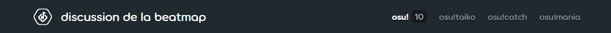
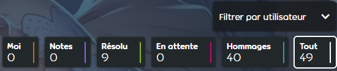
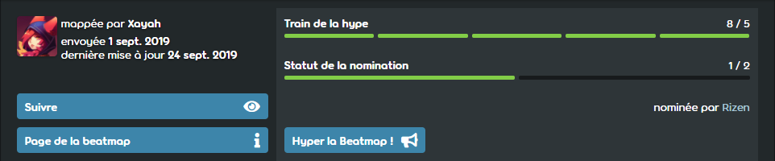
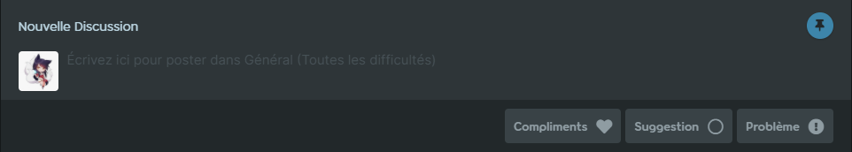
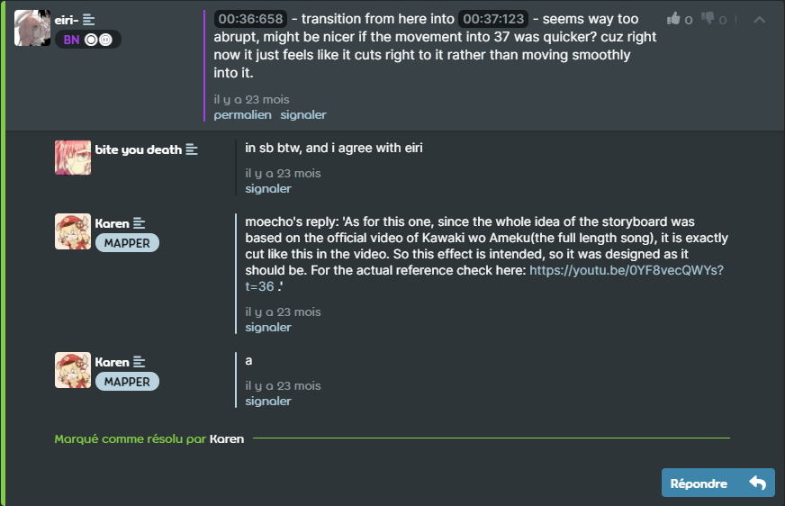

---
tags:
  - beatmap discussions
  - modding V2
  - MV2
  - discussion de la beatmap
outdated: true
---

<!-- TODO: the interface has changed quite a bit. this whole article should be rechecked to make sure it all makes sense still -->

# Discussion de la beatmap

*Voir également : [Modding v1](/wiki/Modding/Forum_modding)*

La **discussion de la beatmap** (aussi connu sous le nom de *Modding v2*) est un système pour gérer et simplifier le processus de [modding](/wiki/Modding). Il vise à fournir une interface claire et compréhensible, où l'amélioration d'une beatmap est au centre des préoccupations. Lorsqu'une beatmap est [soumise](/wiki/Beatmapping/Beatmap_submission), une page de discussion est automatiquement créée à côté de la page d'information de la beatmap. Lorsque la beatmap est mis à jour, la page de discussion est également mise à jour. La page de discussion peut être atteinte en cliquant sur le bouton `Discussion` de la page d'information. La page de discussion de la beatmap se compose de quelques éléments (de haut en bas) :

- La sélection du mode
- L'en-tête de la beatmap
- Le menu de difficulté
- Les options de tri
- La visualisation de la timeline
- Le statut de la beatmap
- les onglets de modding
- Le champ de soumission
- Les discussions

Vous pouvez suivre nos images à partir de [cette beatmap](https://osu.ppy.sh/beatmapsets/924551/discussion) pour vous familiariser avec la discussion de la beatmap ou essayer d'ouvrir une page de discussion vous-même !

## Démarrage rapide

Il est important de garder quelques éléments à l'esprit pour utiliser efficacement les pages de discussions des beatmaps :

- Choisissez le mode et la difficulté que vous souhaitez modérer.
- Sélectionnez la section appropriée à laquelle vous soumettez votre mod.
- **Ne postez qu'un seul problème à la fois.** Ne soumettez pas plusieurs problèmes dans un seul message.
- Vérifiez si le problème a déjà été traité lorsque l'avertissement de message similaire s'affiche.
- Si vous aimez la beatmap, pensez à le mettre en avant pour le rapprocher de la nomination.

## Sélection du mode

La sélection du mode change le [mode de jeu](/wiki/Game_mode) que vous modifiez. Il n'est possible de sélectionner un mode de jeu que si la beatmap possède une difficulté de ce mode. Cette option n'est utilisée qu'avec les beatmap contenant plusieurs modes de jeu ; sinon, le mode sélectionné par défaut sera utilisé.

## En-tête de la beatmap

*Pour plus d'informations sur le paramétrage des métadonnées, voir : [Song Setup § General](/wiki/Client/Beatmap_editor/Song_setup#general)*

L'en-tête de la beatmap affiche le titre et l'artiste fournis dans l'[éditeur du beatmap](/wiki/Client/Beatmap_editor). En cliquant sur l'en-tête de la beatmap, vous retournerez à la page d'information.

## Menu de difficulté

Vous pouvez sélectionner différentes [difficultés](/wiki/Beatmap/Difficulty) via le menu déroulant. Cela affichera toutes les difficultés actuellement disponibles, ainsi que les difficultés plus anciennes, supprimées, qui ont fait l'objet de suggestions/problèmes. Le nombre qui apparaît à côté du nom d'une difficulté est le nombre de messages non résolus sur cette difficulté spécifique. Il est important de vérifier ce menu avant de soumettre des mods.

## Options de tri

Les options de tri modifient la façon dont les discussions sont affichées. Lorsqu'une option est choisie, elle modifie à la fois la timeline de mod et la section de mod pour n'inclure que le type de message sélectionné. Ceci est particulièrement utile pour voir les messages en attente sur une page de discussion. Les différentes options sont les suivantes :

- `Moi` montre vos propres messages
- `Notes` montre toutes les notes prises par le mappeur ou des [Beatmap Nominators](/wiki/People/Beatmap_Nominators)
- `Résolu` montre les postes résolus
- `En Attente` montre les messages en attente
- `Hommages` montre des messages d'hommages et de hype
- `Tout` montre tous les messages

## Visualisation de la timeline

La visualisation de la timeline affiche tous les mods réalisés pour une difficulté qui utilisent un horodatage. En cliquant sur l'une d'entre elles, vous ferez défiler la liste jusqu'au mod posté à cette date. Notez que toutes les options de filtrage modifieront ce qui est affiché ici. La visualisation de la timeline est un outil utile pour voir d'un coup d'œil à quel point une beatmap a été modifiée. Une timeline serrée signifie qu'une beatmap a déjà reçu beaucoup d'attention. Les paramètres de la difficulté sélectionnée sont également affichés en haut à droite de la visualisation de la timeline. De gauche à droite, ils décrivent la `Longueur`, le `BPM`, le `Circle Count` et le `Slider Count` d'une difficulté.

## Statut de la beatmap

Le statut de la beatmap indique tout ce qui concerne la place d'un beatmap dans la [procédure de classement des beatmaps](/wiki/Beatmap_ranking_procedure). Cela inclut :

- Le train de la hype
- Les informations générale
- Les boutons `Suivre` et `Ne plus suivre`
- Le bouton `Page de la beatmap`

### Train de la hype

Le train de la hype permet de savoir combien de [hypes](/wiki/Beatmap/Hype) un mapset a reçu. Une fois que 5 hypes ont été atteints, la beatmap peut être nommé par les [Beatmap Nominators](/wiki/People/Beatmap_Nominators). Les hypes ne peuvent être données qu'en allant dans l'onglet `Général (Toutes les difficultés)`, car cela ne fonctionnera pas à travers les onglets `Général` ou `Chronologie`. En cliquant sur le bouton "Hype", vous serez automatiquement dirigé vers le bon onglet.

### Statut de la nomination

Le statut de la nomination permet de suivre les nominations d'une beatmap. Lorsqu'une beatmap a reçu deux nominations, elle est [qualifié](/wiki/Beatmap/Category#qualified).

### Informations générales

Les informations générales indiquent le créateur de la beatmap, la date de soumission et la date de la dernière mise à jour. Les [changements de statut](/wiki/Beatmap), tels que le classement, l'appréciation ou le classement au cimetière d'une beatmap, sont également considérés comme des mises à jour et seront affichés ici.

### Suivre/Ne plus suivre

Les boutons `Suivre` et `Ne plus suivre` permettent de suivre/ne plus suivre les développements d'une beatmap. Si une beatmap est suivi, les nouveaux messages et les réponses sur la page de discussion de cette beatmap créeront des notifications sur osu!web. Les abonnements peuvent être gérés par le biais de la [liste de suivi](https://osu.ppy.sh/beatmapsets/watches), qui se trouve dans le menu de la page d'accueil.

### Page de la beatmap

Le bouton `Page de la beatmap` permet de naviguer vers la page d'information d'une beatmap. Cela peut également être fait en cliquant sur l'[en-tête de la beatmap](#en-tête-de-la-beatmap).

## Onglets de modding

Le mod se fait par le biais de trois onglets, qui séparent les messages de différents types et les divisent en formats lisibles. En outre, un quatrième onglet enregistre toutes les modifications. Le nombre à côté de chaque onglet décrit le nombre de messages qu'il contient.

`Général (toutes les difficultés)` affiche les messages qui s'appliquent à toutes les difficultés. Les messages courants de cet onglet comprennent les métadonnées, les notes et les discussions sur l'ensemble de la beatmap.

`Général (Cette difficulté)` affiche les messages qui ne s'appliquent qu'à la difficulté actuellement sélectionnée. Les messages les plus courants de cet onglet concernent les paramètres de la beatmap, les problèmes récurrents et les discussions générales sur la difficulté sélectionnée.

`Chronologie` affiche les messages à des moments précis d'une difficulté en fonction du premier horodatage placé. Chaque message de cet onglet doit comporter un horodatage pour être affiché. Tout horodatage ultérieur n'aura aucune influence sur l'ordre des messages.

`Historique` enregistre toutes les modifications apportées à une page de discussion dans l'ordre chronologique. Les changements sont codés par couleur : le vert correspond aux messages résolus et aux changements d'état, le rouge aux nouveaux problèmes après nomination, et le bleu à tout le reste. En cliquant sur un numéro de référence, vous accéderez au message en question. Cet onglet n'est pas utilisé pour le mod, mais il est utile pour les [Beatmap Nominators](/wiki/People/Beatmap_Nominators) et les autres membres du staff pour vérifier les problèmes.

## Champ de soumission

Le champ de soumission est l'endroit où les [mods](/wiki/Modding) sont écrits. Une fois écrit, le mod doit être soumis à la page de discussion. Cela peut être fait en appuyant sur l'un des trois boutons de type ; `Compliments`, `Suggestion` ou `Problème`.

`Compliments` est utilisé pour les éloges et les encouragements. `Suggestion` est utilisé pour les messages qui ne sont pas directement en conflit avec les règles. `Problème` est utilisé pour les messages qui sont en conflit direct avec les [critères de classement](/wiki/Ranking_criteria), ou qui sont considérés comme mauvais. Une fois le bouton pressé, le mod sera soumis à la page de discussion.

Si vous postez dans l'onglet `Chronologie`, vous devez inclure un horodatage dans votre message. Si votre horodatage est proche de celui d'un autre mod, **vous devrez confirmer qu'il ne concerne pas le problème que vous soumettez actuellement.** Il peut être utile d'épingler le champ de modding pendant que vous vérifiez d'autres problèmes. L'activation de l'épingle permettra au champ de soumission de défiler avec vous.

## Discussions

Les discussions sont l'endroit où les messages du [champ de soumission](#champ-de-soumission) sont placés une fois soumis. Les utilisateurs qui visitent une page de discussion peuvent voir les messages rédigés par tous les autres utilisateurs, et pourront participer à la discussion sur les messages. Pour ce faire, il suffit de cliquer sur les boutons "Répondre" ou "Répliquer" sous un message et d'écrire une réponse. Après avoir terminé une réponse, appuyez sur la touche "Entrée" ou cliquez sur "Répondre" pour la soumettre à la discussion.

Le créateur de la beatmap et l'auteur d'un modpost, ont la possibilité de fermer les problèmes avec le bouton `Marquer comme résolu`. Cela indique aux autres utilisateurs que le problème a été traité et le supprime de la liste des questions dans [l'option de tri](#options-de-tri) `En Attente`. Les modposts peuvent être réouverts par n'importe quel utilisateur en ajoutant des réponses supplémentaires à un post et en cliquant sur `Répondre et réouvrir`. Ceci est utilisé lorsque les moddeurs tombent sur des problèmes fermés qui n'ont pas été entièrement résolus, ou lorsqu'un sujet nécessite une discussion plus approfondie.

### Tri des discussions

Les discussions peuvent être triées à l'aide des boutons situés sous le titre `Discussions`. Initialement, les messages de l'onglet `Chronologie` seront triés chronologiquement sur la base du premier horodatage fourni. Les messages de l'onglet `Général (Toutes les difficultés)` et `Général (Cette difficulté)` seront triés selon la dernière mise à jour. Notez que toutes les [options de tri](#options-de-tri) sélectionnées modifieront également ce qui est affiché ici. Les autres boutons en haut du champ de discussion changent la façon dont les discussions sont affichées, incluant `Tout réduire` et `Tout développer` qui afficheront/masqueront les messages respectivement.

### Vote positifs/négatifs

Si un modpost a été utile, des [Kudosu!](/wiki/Modding/Kudosu) peuvent être donnés. Cela peut être fait par n'importe qui, à l'exception du créateur du message, en lui donnant un pouce en l'air. Cette fonction est utile pour les moddeurs car les Kudosu! sont nécessaire pour entrer chez les [Beatmap Nominators](/wiki/People/Beatmap_Nominators). Si cette fonction est utilisée de manière abusive, les [BN](/wiki/People/Beatmap_Nominators), [NAT](/wiki/People/Nomination_Assessment_Team) et [GMT](/wiki/People/Global_Moderation_Team) peuvent donner un avis négatif pour refuser tout Kudosu! donné. Si l'abus est fait de manière malveillante, une pénalité peut également être donnée aux abuseurs.

### Chronologie des discussions

La timeline à gauche d'une discussion montre l'horodatage du message. Ceci est seulement disponible dans la section `Chronologie`. Sinon, la timeline de la discussion sera laissée vide.

### Tags

Les tags affichent les [rôles importants](/wiki/People/osu!_team) sous le nom de l'utilisateur. Seuls les rôles pertinents pour la discussion sur la beatmap sont affichés. Cela inclut les membres `MAPPER`, `BN`, `NAT`, `GMT`, et `DEV` qui ont plus d'options qu'un utilisateur normal regardant une page de discussion.

### Outils de mise en forme

Les propriétaires d'un message sur une page de discussion peuvent utiliser des outils de mise en forme pour rendre l'utilisation plus facile. Cela inclut les permalinks, les modifications et les suppressions.

`Permalink` saisit un lien direct vers un message. Il s'agit d'un numéro de référence (par exemple, `#1234567`) pour les autres utilisateurs, qui peut être cliqué pour accéder rapidement au message référencé. C'est particulièrement utile pour référencer les problèmes entre les modposts.

`Éditer` permet à un utilisateur de modifier sa soumission en cas d'erreur. Cette fonction n'est pas destinée à être utilisée pour répondre à des messages. Créez plutôt une nouvelle réponse.

`Supprimer` permet à l'auteur de supprimer son message en cas d'erreur grave. Cette fonction est désactivée pour les messages qui font l'objet d'une discussion afin d'éviter les suppressions causées par des discussions animées.

<!--TODO: insert lots of links-->
