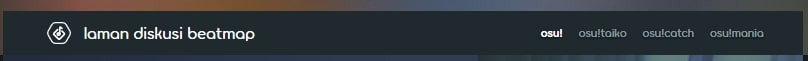
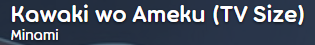
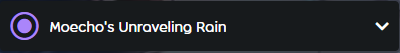
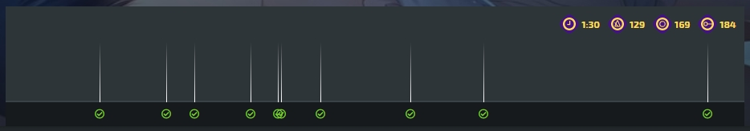
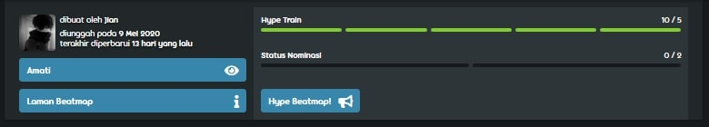

---
tags:
  - beatmap discussions
  - modding V2
  - MV2
outdated: true
---

# Diskusi beatmap

*Lihat juga: [Modding v1](/wiki/Modding/Forum_modding)*

**Diskusi beatmap** (juga dikenal sebagai *Modding v2*) adalah sistem untuk mengatur dan memudahkan proses dari [modding](/wiki/Modding). Diskusi beatmap bertujuan untuk memberikan antarmuka yang jelas dan dapat dimengerti, yang di mana peningkatan pada beatmap menjadi hal yang utama. Ketika beatmap telah [dikirim](/wiki/Beatmapping/Beatmap_submission), laman diskusi secara otomatis dibuat di samping laman info beatmap. Ketika beatmap diperbarui, laman diskusi juga akan diperbarui. Laman diskusi dapat diakses dengan mengklik tombol `Diskusi` pada laman info. Laman diskusi beatmap terdiri dari beberapa elemen (dari atas ke bawah):

- Pemilihan mode
- Beatmap header
- Menu tingkat kesulitan
- Opsi pengurutan
- Tampilan linimasa
- Status beatmap
- Tab modding
- Tempat pengajuan
- Diskusi

Kamu juga bisa mengikuti apa yang kami jelaskan di atas dari [beatmap ini](https://osu.ppy.sh/beatmapsets/924551/discussion) untuk lebih familiar dengan diskusi beatmap atau coba buka laman diskusi kamu sendiri.

## Panduan

Penting untuk diperhatikan bagaimana menggunakan laman diskusi beatmap secara efektif:

- Pilih mode yang tepat dan tingkat kesulitan yang ingin kamu mod.
- Pilih bagian yang tepat untuk kirim mod.
- **Hanya posting satu masalah dalam satu waktu.** Jangan kirim banyak masalah dalam satu posting.
- Periksa untuk melihat apakah masalah telah diatasi ketika peringatan posting serupa muncul.
- Jika kamu menyukai beatmapnya, pertimbangkan untuk meng-hype beatmap tersebut untuk lebih cepat dinominasi.

## Pemilihan mode

Pemilihan mode merubah [mode permainan](/wiki/Game_mode) yang kamu modding. Pemilihan mode bisa dilakukan jika beatmap tersebut memiliki mode permainan yang berbeda; jika tidak, maka akan ditampilkan mode permainan default.

## Beatmap header

*Untuk informasi tentang pengaturan metadata, lihat: [Pengaturan Lagu § General](/wiki/Client/Beatmap_editor/Song_setup#general)*

Beatmap header menampilkan judul dan artis yang telah ditentukan di dalam [beatmap editor](/wiki/Client/Beatmap_editor). Mengklik beatmap header akan mengarahkan kembali ke laman info.

## Menu tingkat kesulitan

Kamu dapat memilih [tingkat kesulitan](/wiki/Beatmap/Difficulty) yang berbeda melalui dropdown menu. Ini akan memunculkan semua tingkat kesulitan yang tersedia saat ini, bersama dengan yang lama, dan menghapus tingkat kesulitan yang memiliki saran/masalah. Angka yang muncul di samping nama tingkat kesulitan adalah angka postingan yang belum terselesaikan berdasarkan tingkat kesulitan tertentu. Ini penting untuk memeriksa kembali menu ini sebelum melakukan pengiriman mod apa pun.

## Opsi pengurutan

Opsi pengurutan merubah cara pandang diskusi beatmap dilihat. Ketika sebuah opsi dipilih, opsi pengurutan merubah modding timeline dan modding section hanya menyertakan jenis postingan yang dipilih. Opsi pengurutan juga sangat berguna untuk melihat postingan yang belum terjawab di laman diskusi. Opsi yang berbeda meliputi:

- `Milik Saya` menunjukkan postingan kamu sendiri
- `Catatan` menunjukkan catatan dari mapper atau [Beatmap Nominator](/wiki/People/Beatmap_Nominators)
- `Terjawab` menunjukkan postingan yang terjawab
- `Belum Terjawab` menunjukkan postingan yang belum terjawab
- `Pujian` menunjukkan postingan pujian dan hype
- `Semua` menunjukkan semua postingan

## Tampilan linimasa

Tampilan linimasa menampilkan semua mod yang telah dibuat untuk tingkat kesulitan yang menggunakan timestamp. Mengklik salah satu timestamp di tampilan linimasa akan menggulir ke bawah menuju postingan mod terkait. Perhatikan bahwa opsi pem-filteran apa pun akan mengubah apa yang ditampilkan di sini. Tampilan linimasa merupakan alat yang berguna untuk melihat seberapa banyak beatmap yang telah dimodifikasi. Tampilan linimasa yang padat berarti beatmap tersebut telah menerima banyak perhatian. Pengaturan tingkat kesulitan yang dipilih juga ditampilkan di kanan atas tampilan linimasa. Dari kiri ke kanan ini menjelaskan tingkat kesulitan `Durasi`, `BPM`, `Jumlah Circle` dan `Jumlah Slider`.

## Status beatmap

Status bar beatmap menampilkan semua yang relevan sesuai dengan posisi beatmap berdasarkan [Prosedur Beatmap Ranking](/wiki/Beatmap_ranking_procedure). Ini termasuk:

- Hype train
- Informasi umum
- Tombol Amati/Tidak amati
- Tombol laman beatmap

### Hype train

Hype train melacak berapa banyak [hype](/wiki/Beatmap/Hype) mapset yang telah di-hype. Setelah 5 hype dicapai, beatmap dapat dinominasikan oleh [Beatmap Nominator](/wiki/People/Beatmap_Nominators). Hype hanya dapat diberikan dengan membuka tab `Umum (Semua tingkat kesulitan)`, karena hype tidak akan berfungsi jika diakses melalui tab `Umum` atau `Linimasa`. Mengklik tombol `Hype` akan otomatis memindahkan kamu ke tab yang benar.

### Status nominasi

Status bar nominasi akan melacak nominasi dari sebuah beatmap. Setelah beatmap tersebut menerima dua nominasi, maka beatmap tersebut akan [di-qualified](/wiki/Beatmap/Category#qualified).

### Informasi umum

Informasi umum menunjukkan pembuat beatmap, tanggal pengiriman, dan tanggal terakhir diperbarui. [Perubahan status](/wiki/Beatmap/Category), seperti beatmap yang mendapatkan status Ranked, Loved atau Graveyard, juga dianggap sebagai pembaruan dan akan ditampilkan di sini.

### Amati/Tidak amati

Tombol `Amati` dan `Tidak amati` mengijinkan untuk mengikuti/tidak mengikuti perkembangan beatmap. Jika beatmap diikuti, postingan baru dan balasan di laman diskusi beatmap akan membuat notifikasi di osu!web. Langganan dapat dikelola melalui [modding watchlist](https://osu.ppy.sh/beatmapsets/watches), yang dapat ditemukan melalui menu laman beranda.

### Laman beatmap

Tombol `Laman Beatmap` akan mengarahkan pengguna menuju ke laman info beatmap. Ini juga dapat dilakukan dengan mengklik [beatmap header](#beatmap-header).

## Tab modding

Modding terjadi melalui tiga tab, yang memisahkan postingan dari berbagai jenis dan membaginya menjadi format yang dapat dibaca. Selain itu, tab keempat mencatat semua perubahan. Nomor di samping setiap tab menggambarkan jumlah postingan di dalamnya.

`Umum (Semua tingkat kesulitan)` menunjukkan postingan yang berlaku untuk semua tingkat kesulitan. Postingan yang umum di tab ini mencakup metadata, catatan, dan diskusi di beatmap secara keseluruhan.

`Umum (Tingkat kesulitan ini)` menunjukkan tulisan yang hanya berlaku untuk kesulitan yang saat ini dipilih. Postingan umum di tab ini termasuk pengaturan beatmap, masalah berulang dan diskusi umum tentang tingkat kesulitan yang dipilih.

`Linimasa` menampilkan postingan pada titik-titik tertentu dari suatu kesulitan menurut timestamp pertama yang ditempatkan. Setiap postingan di tab ini harus menyertakan timestamp untuk diposting. Timestamp apa pun tidak akan mempengaruhi urutan postingan.

`Riwayat` mencatat semua perubahan ke laman diskusi dalam urutan kronologis. Perubahan diberi kode warna; dengan hijau yang merupakan postingan yang diselesaikan dan perubahan status, merah merupakan masalah baru setelah nominasi, dan biru merupakan hal-hal yang lainnya. Mengklik nomor referensi mana pun akan membuka postingan tertentu. Tab riwayat tidak digunakan saat modding, tetapi berguna untuk [Beatmap Nominator](/wiki/People/Beatmap_Nominators) dan staf lain untuk memeriksa masalah tersebut.

## Tempat pengajuan

Tempat pengajuan adalah sebuah tempat untuk menulis [mod](/wiki/Modding). Setelah ditulis, mod harus dikirim ke laman diskusi. Ini dapat dilakukan dengan menekan salah satu dari tiga tombol jenis; `Pujian`, `Saran` atau `Masalah`.

`Pujian` digunakan untuk pujian dan dorongan. `Saran` digunakan untuk postingan yang secara langsung tidak bertentangan dengan aturan apa pun. `Masalah` digunakan untuk postingan yang berkonflik langsung dengan [Kriteria Ranking](/wiki/Ranking_criteria), atau yang dianggap salah secara intersubjektif. Setelah tombol ditekan, mod akan dikirim ke laman diskusi.

Jika kamu memposting di tab `Linimasa`, kamu harus menyertakan timestamp di postingan kamu. Jika timestamp kamu dekat dengan mod lain, kamu harus konfirmasi bahwa timestamp tersebut tidak berhubungan dengan mod yang ada didekat timestamp kamu. **Periksa setiap postingan sebelum mencentang kotaknya!** Ini mungkin bermanfaat untuk `Pin` di tempat modding sambil memeriksa masalah lain. Mengaktifkan pin akan memungkinkan tempat pengajuan untuk pindah langsung ke tempat yang sudah di pin.

## Diskusi

Diskusi adalah postingan di mana [tempat pengajuan](#tempat-pengajuan) ditaruh ketika dikirim. Pengguna yang sedang mengunjungi laman diskusi bisa melihat postingan yang dibuat oleh semua pengguna lainnya, dan bisa ikut partisipasi dalam postingan diskusi. Diskusi bisa diselesaikan dengan mengklik tombol `Tanggapi` atau `Balas` di bawah postingan dan tulis sebuah tanggapan. Setelah selesai menanggapi, tekan `Enter` atau mengklik `Balas` untuk mengirimkan ke dalam diskusi.

Pembuat beatmap dan penulis dari postingan mod, memiliki kemampuan untuk menutup postingan masalah dengan tombol `Ditandai sebagai telah terjawab`. Ini menandai bahwa masalah telah ditangani oleh pengguna lain dan menghapusnya dari [opsi pengurutan](#opsi-pengurutan) `Belum terjawab`. Postingan mod dapat dibuka kembali oleh pengguna mana pun dengan menambahkan balasan lebih lanjut ke sebuah postingan dan mengklik `Balas dan Buka kembali`. Balasan ini digunakan ketika modder merasa kesalahan yang telah ditutup belum diperbaiki sepenuhnya, atau topik tersebut perlu didiskusikan lebih lanjut.

### Pengurutan diskusi

Diskusi dapat diurut dengan tombol di bawah judul `Diskusi`. Awalnya, postingan tab `Linimasa` akan diurutkan secara kronologis berdasarkan timestamp pertama yang diberikan. Postingan `Umum (Semua tingkat kesulitan)` dan `Umum (Tingkat kesulitan ini)` akan diurutkan berdasarkan pembaruan terakhir. Perhatikan bahwa [opsi pengurutan](#opsi-pengurutan) yang dipilih juga akan mengubah apa yang ditampilkan di sini. Tombol lain di bagian atas tempat diskusi yang mengubah cara diskusi dilihat termasuk `Ciutkan semua` dan `Lebarkan semua` yang di mana masing-masing akan menampilkan/menyembunyikan postingan.

### Jempol ke atas/ke bawah

Jika terdapat sebuah postingan mod yang sangat membantu, [Kudosu!](/wiki/Modding/Kudosu) dapat diberikan. Kudosu dapat diberikan oleh siapapun dengan memberikan sebuah jempol ke atas, kecuali pengguna yang membuat postingan tersebut. Ini berguna bagi modder yang di mana Kudosu! diperlukan untuk masuk ke [Beatmap Nominator](/wiki/People/Beatmap_Nominators). Jika fitur Kudosu! disalahgunakan, anggota [BN](/wiki/People/Beatmap_Nominators), [NAT](/wiki/People/Nomination_Assessment_Team), dan [GMT](/wiki/People/Global_Moderation_Team) dapat memberi jempol ke bawah untuk menyangkal Kudosu! yang telah diberikan. Jika penyalahgunaan dilakukan dengan niat jahat, hukuman juga dapa diberikan kepada pelaku.

### Diskusi linimasa

Linimasa di sebelah kiri diskusi menunjukkan postingan timestamp terkait. Ini hanya tersedia di bagian `Linimasa`. Jika tidak, linimasa diskusi akan dikosongkan.

### Tag

Tag menampilkan [peran penting](/wiki/People/osu!_team) di bawah nama pengguna. Hanya peran-peran yang relevan saja untuk diskusi beatmap yang ditampilkan. Ini termasuk `MAPPER`, anggota dari `BN`, `NAT`,`GMT`, dan `DEV` yang memiliki lebih banyak opsi daripada pengguna biasa di laman diskusi.

### Alat pemformatan

Pemilik postingan di laman diskusi dapat menggunakan alat pemformatan agar penggunaannya lebih mudah. Ini termasuk tautan, penyuntingan, dan penghapusan.

`Tautan` mengambil tautan langsung ke sebuah postingan. Tautan akan muncul sebagai nomor referensi (misalnya, `#1234567`) untuk pengguna lain, yang dapat diklik untuk berpindah ke posting yang direferensikan dengan cepat. Ini sangat berguna ketika mereferensikan masalah di suatu postingan mod.

`Sunting` memungkinkan pengguna untuk men-sunting kiriman mereka jika terjadi kesalahan. Ini tidak dimaksudkan untuk digunakan untuk membalas pesan. Disarankan buat balasan baru sebagai gantinya.

`Hapus` memungkinkan pengirim untuk menghapus kiriman mereka jika terjadi kesalahan parah. Fitur ini dinonaktifkan untuk postingan dengan diskusi di dalamnya untuk mencegah penghapusan yang disebabkan oleh diskusi yang memanas.
