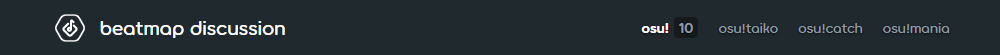
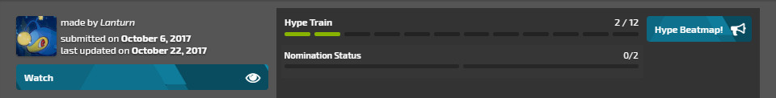
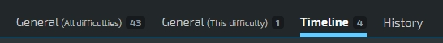
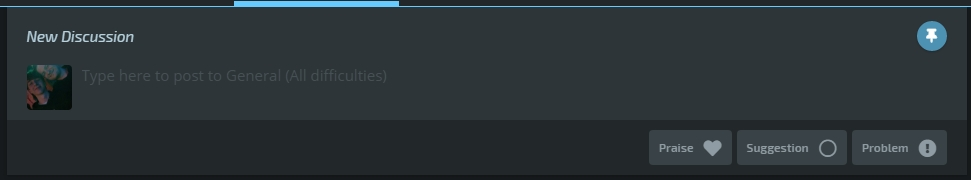
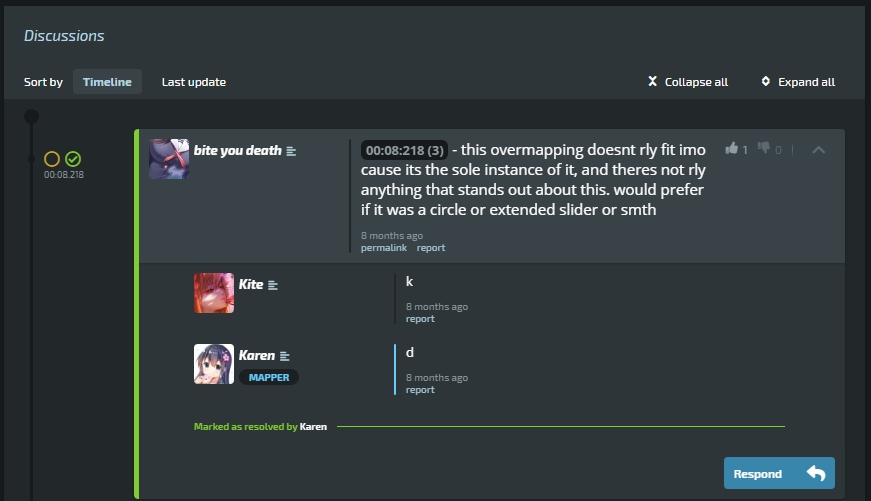

---
tags:
  - beatmap discussions
  - modding V2
  - MV2
no_native_review: true
outdated_translation: true
outdated_since: 5f24e4b2df25bd38f386bd2cd48e541ebc2e1095
---

# Beatmapdiscussie

**Beatmapdiscussie** (ook bekend als *Modden v2*) is een systeem om het [mod](/wiki/Modding)proces te beheren en te vereenvoudigen. Het doel is om een duidelijke en begrijpelijke interface te bieden, waar het verbeteren van een beatmap centraal staat. Wanneer een beatmap wordt [ingezonden](/wiki/Beatmapping/Beatmap_submission) wordt er automatisch een discussiepagina gecreëerd samen met de informatiepagina van de beatmap. Wanneer de beatmap wordt geupdatet zal ook de discussiepagina bijgewerkt worden. De discussiepagina kan bezocht worden door op de `Discussie`-knop aan de onderkant van de informatiepagina te klikken. De beatmap-discussiepagina bestaat uit een paar elementen (van boven naar beneden):

- Modusselectie
- Beatmaphoofding
- Moeilijkheidsgraadmenu
- Sorteeropties
- Visuele tijdlijn
- Beatmapstatus
- Mod-tabbladen
- Inzendingsveld
- Discussies

Je kan meevolgen met onze afbeeldingen van [deze beatmap](https://osu.ppy.sh/beatmapsets/924551/discussion) om vertrouwd te raken met beatmapdiscussies of probeer zelf een discussiepagina te openen!

## Snelle start

Het is belangrijk om een paar dingen te onthouden zodat je de beatmapdiscussiepagina’s zo effeciënt mogelijk kan gebruiken:

- Kies de correcte spelmodus en moeilijkheidsgraad waarvoor je wilt modden.
- Selecteer de juiste sectie waarvoor je jouw mod inzendt.
- **Plaats slechts één probleem per keer.** Zet meerdere problemen niet in één post.
- Controleer of het probleem al geadresseerd werd wanneer de gelijkaardige post-waarschuwing wordt weergegeven.
- Overweeg het om de beatmap te hypen als je ze leuk vindt.

## Modusselectie

Modusselectie verandert de [spelmodus](/wiki/Game_mode) waarvoor je modt. Het is enkel mogelijk om een bepaalde spelmodus te selecteren als de beatmap een moeilijkheidsgraad heeft van die spelmodus. Dit wordt enkel gebruikt voor beatmaps die meerdere spelmodi bevatten; anders zal gewoon de spelmodus waarvoor gemapt werd gebruikt worden.

## Beatmaphoofding

*Voor meer info over het instellen van metadata, zie: [Song Setup § Muziek en Map Metadata](/wiki/Client/Beatmap_editor/Song_setup#song-and-map-metadata)*

De beatmaphoofding geeft de titel en artiest die in de [beatmap editor](/wiki/Client/Beatmap_editor). Als je op de beatmaphoofding klikt zal je terug naar de informatiepagina navigeren.

## Moeilijkheidsgraadmenu

Je kan de verschillende [moeilijkheidsgraden](/wiki/Beatmap/Difficulty) selecteren via het uitklapmenu. Dit zal alle beschikbare moeilijkheidsgraden tonen, ook oudere, verwijderde moeilijkheidsgraden die suggesties/problemen hadden. Het cijfer dat verschijnt naast de naam van een moeilijkheidsgraad staat voor de hoeveelheid posts die niet opgelost werden voor die specifieke moeilijkheidsgraad. Het is belangrijk om dit menu grondig te controleren vooraleer je mods inzendt.

## Sorteeropties

Sorteeropties veranderen de manier waarop de beatmapdiscussies worden bekeken. Wanneer er een optie is geselecteerd, verandert deze zowel de mod-tijdlijn als de moddingsectie zodat enkel het geselecteerde type posts wordt weergegeven. Dit is vooral nuttig om posts in afwachting te zien op een discussiepagina. Deze verschillende opties omvatten:

- `Mine` toont jouw eigen berichten
- `Notes` toont alle aantekeningen van de mapper of de [Beatmap Nominators](/wiki/People/Beatmap_Nominators)
- `Resolved` toont de opgeloste posts
- `Pending` toont de posts in afwachting
- `Praises` toont lovende en hype-berichten
- `All` toont alle posts

## Visuele tijdlijn

De visuele tijdlijn geeft alle mods die gemaakt werden voor een beatmap weer met een tijdmarkering. Door op één van deze tijdmarkeringen te klikken zal je scrollen naar de mod die gepost werd op die tijd. Merk op dat elke filteroptie het resultaat zal veranderen. De visuele tijdlijn is een nuttig hulpmiddel om in één oogopslag te kunnen zien hoeveel een gemod werd. Een tijdlijn met erg veel markeringen wilt zeggen dat die beatmap al veel aandacht heeft ontvangen. De geselecteerde moeilijkheidsisntellingen worden ook weergeven rechtsboven op de visuele tijdlijn. Van links naar rechts geven deze de `Lengte`, `BPM`, het `Aantal Cirkels` en het `Aantal Sliders` van een moeilijkheidgraad weer.

## Beatmapstatus

De beatmapstatusbalk toont alle relevante info over de plek van een beatmap in de  [Beatmap Rankingprocedure](/wiki/Beatmap_ranking_procedure). Dit houdt in:

- Hype train
- Algemene informatie
- Volg-/Ontvolgknoppen
- Beatmappaginaknop

### Hype train

De hype trein volgt hoeveel [hypes](/wiki/Beatmap/Hype) een beatmap ontvangen heeft. Zodra 5 hypes bereikt zijn kan de beatmap genomineerd worden door de [Beatmap Nominators](/wiki/People/Beatmap_Nominators). Hypes kunnen enkel gegeven worden door naar het `Algemeen (Alle Moeilijkheidgraden)`-tabblad te gaan, je kan dit niet doen via de `Algemeen`- of de `Tijdlijn`-tabbladen. Als je op de `Hype`-knop klikt zal je automatisch naar het juiste tabblad gaan.

### Nominatiestatus

De nominatiestatusbalk volgt het aantal nominaties van een beatmap. Wanneer een beatmap twee nominaties heeft ontvangen zal ze gekwalificeerd worden.

### Algemene info

Algemene info toont de maker van een beatmap, de datum waarop ze werd ingezonden en de datum waarop ze voor het laatst werd geüpdatet.  [Statusveranderingen](/wiki/Beatmap), zoals een beatmap die Ranked, Loved of op de begraafplaats geraakt, worden ook beschouwd als updates en zal hier ook weergegeven worden.

### Volg/Ontvolg

De `Volg`- en `Ontvolg`-knoppen maken het mogelijk om de ontwikkeling van een beatmap te volgen of ontvolgen. Als een beatmap gevolgd wordt zal je over alle nieuwe posts en antwoorden op de discussiepagina van die beatmap een melding krijgen op osu!web. Abonnementen kunnen beheerd worden via de [modding volglijst](https://osu.ppy.sh/beatmapsets/watches), deze vind je op de hoofdpagina van osu!web.

### Beatmappagina

De `Beatmappagina`-knop brengt je naar de infopagina van een beatmap. Je kan ook op de [beatmaphoofding](#beatmaphoofding) klikken om hier te geraken.

## Mod-tabbladen

Modden gebeurt via drie tabbladen, die de verschillende types van posts opsplitst in overzichtelijke indelingen. Een vierde tabblad houdt bovendien alle veranderingen bij. Het cijfer naast elk tabblad staat voor het aantal posts hierin.

`Algemeen (Alle moeilijkheidsgraden)` toont posts die van toepassing zijn op alle moeilijkheidsgraden. Veel voorkomende posts in dit tabblad zijn metadata, notities en discussie over de beatmap in het geheel.

`Algemeen (Deze moeilijkheigraad)` toont posts die enkel van toepassing zijn op de moeilijkheidsgraad die op dat moment is geselecteerd. Veel voorkomende posts in dit tabblad zijn onder andere de beatmapinstellingen, terugkerende problemen en algemene discussie over de geselecteerde moeilijkheidsgraad.

De `Tijdlijn` toont posts op een specifiek moment in een moeilijkheidsgraad volgens de eerst geplaatste tijdsmarkering. Elke post in dit tabblad moet een tijdsmarkering bevatten om gepost te kunnen worden. Eventuele latere tijdsmarkeringen hebben geen invloed op de volgorde van de posts.

`Geschiedenis` registreert alle veranderingen aan een beatmapdiscussiepagina in chronologische volgerde. Alle veranderingen krijgen een kleurencode; groen staat voor opgeloste posts en statusveranderingen, rood voor nieuwe problemen na nominatie, en blauw voor de rest. Door te klikken op eenderwelk referentienummer spring je naar die specifieke post. Dit tabblad wordt niet gebruikt tijdens het modden, maar het is wel nuttig voor [Beatmap Nominators](/wiki/People/Beatmap_Nominators) en andere medewerkers om problemen te bekijken.

## Inzendingsveld

Het inzendingsveld is waar [mods](/wiki/Modding) geschreven worden. Ze moeten ingezonden worden naar de discussiepagina wanneer ze klaar zijn. Dit kan gedaan worden door op één van de drie types knoppen te drukken;  `Prijs`, `Suggestie` of `Probleem`.

`Prijs` wordt gebruikt voor lof en aanmoediging. `Suggestie` wordt gebruikt voor posts die niet rechtstreeks in strijd zijn met de regels. `Probleem` wordt gebruikt voor posts die in direct conflict zijn met de [Ranking Criteria](/wiki/Ranking_criteria), of die intersubjectief als fout worden beschouwd. Wanneer je één van de knoppen indrukt wordt de mod ingezonden naar de discussiepagina.

Als je post in het `Tijdlijn`-tabblad, moet je een tijdsmarkering opnemen in jouw bericht. Als jouw tijdsmarkering in de buurt is van een andere mod moet je bevestigen dat die mod niet het probleem adresseert waarvoor jij er één aan het inzenden bent. **Controleer elke post vooraleer je het vakje aankruist!** Het kan handig zijn om het moddingveld te `Pinnen` terwijl je andere problemen bekijkt. Het pinnen van het moddingveld zal ervoor zorgen dat het inzendingsveld met je mee scrolt.

## Discussies

Discussies is waar posts uit het [inzendingsveld](#inzendingsveld) geplaatst worden wanneer ze eenmaal zijn ingezonden. Gebruikers die een discussiepagina bezoeken kunnen alle posts zijn die door andere gebruikers werden gemaakt, en kunnen deelnemen aan de discussie. Dit kan door op de `Reageer`- of `Antwoord`-knoppen onder een post te klikken en een antwoord te schrijven.

De maker van de beatmap en de auteur van een modpost hebben de mogelijkheid om problemen te sluiten met de `Markeer als Opgelost`-knop. Dit markeert voor andere gebruikers dat het probleem behandeld werd en verwijdert het ook uit de  `Afwachtend` [sorteeroptie](#sorteeropties). Modposts kunnen heropend worden door eenderwelke gebruiker door opnieuw te reageren op een post en op de `Antwoord en Heropen`-knop te klikken. Dit wordt gebruikt wanneer modders gesloten problemen ontdekken die eigenlijk niet volledig opgelost werden, of wanneer een onderwerp verdere discussie vereist.

### Discussies sorteren

Discussies kunnen gesorteerd worden met de knoppen onder de `Discussions` titel. Initieel worden posts uit het `Tijdlijn`-tabblad chronologisch geordend gebaseerd op de eerste tijdsmarkering. `Algemeen (Alle moeilijkheidsgraden)`- en `Algemeen (Deze moeilijkheidgraad)`-posts zullen gesorteerd worden op welke het laatst geüpdatet werd. Merk op dat eenderwelke geselecteerde [sorteeropties](#sorteeropties) ook zullen veranderen wat hier wordt weergegeven. Andere knoppen bovenaan het discussieveld die veranderen hoe discussies weergegeven worden zijn onder andere `Alles verbergen` en `Alles uitvouwen` wat respecievelijk posts zal tonen en verbergen.

### Duim omhoog/omlaag

Als een modpost nuttig was kan [Kudosu!](/wiki/Modding/Kudosu) gegeven worden. Dit kan door iedereen behalve de auteur van de post door de post een duim omhoog te geven. Dit is nuttig voor modders aangezien Kudosu! nodig is om tot de [Beatmap Nominators](/wiki/People/Beatmap_Nominators) toe te treden. Als deze functie misbruikt wordt kunnen [BN](/wiki/People/Beatmap_Nominators)-, [NAT](/wiki/People/Nomination_Assessment_Team)-, en [GMT](/wiki/People/Global_Moderation_Team)-leden een duim omlaag geven om Kudosu! van speleres te ontzeggen. Als dit kwaadwillig misbruik betreft kan er ook een sanctie worden opgelegd aan de daders.

### Discussietijdlijn

De tijdlijn aan de linkerkant van een discussie toont de tijdsmarkering die de post adresseert. Dit is enkel beschikbaar in de `Tijdlijn`-sectie. Anders wordt de discussietijdlijn leeg gelaten.

### Tags

Tags geven [belangrijke functies](/wiki/People/osu!_team) onder de naam van een gebruiker weer. Enkel functies die relevant zijn voor de beatmapdiscussie worden getoond. Deze zijn `MAPPER`, `BN`-, `NAT`-, `GMT`-, en `DEV`-leden die dus meer opties hebben dan gewone gebruikers die een discussiepagina bekijken.

### Formatteringshulpmiddelen

De auter(s) van een post op een discussiepagina kunnen formatteringshulpmiddelen gebruiken om het gebruiksgemak van de post te verbeteren. Dit omvat permalinks, aanpassingen en verwijderingen.

`Permalink` neemt een directe link naar een post. Dit zal getoond worden als een referentienummer (bv. `#1234567`) aan andere gebruikers, deze kan aangeklikt worden om snel naar de desbetreffende post te navigeren. Dit is vooral nuttig bij het verwijzen naar problemen over verschillende modposts.

`Edit` geeft gebruikers de mogelijkheid om hun inzeding aan te passen in het geval van fouten. Het is niet de bedoeling dat deze functie gebruikt wordt om op berichten te antwoorden. Maak in plaats daarvan een nieuw antwoord aan.

`Delete` staat gebruikers toe om hun inzending te verwijderen als er serieuze fouten in staan. Deze functie is uitgeschakeld voor posts met veel discussie om het verwijderen van posts door verhitte discussie te voorkomen.
