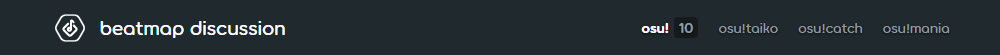
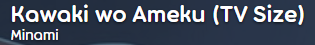
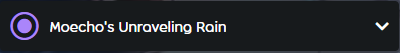
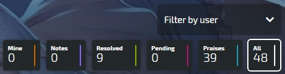
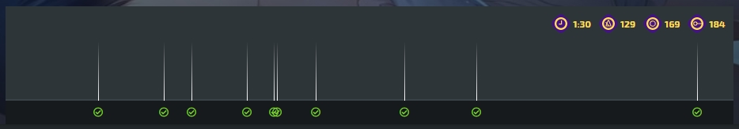
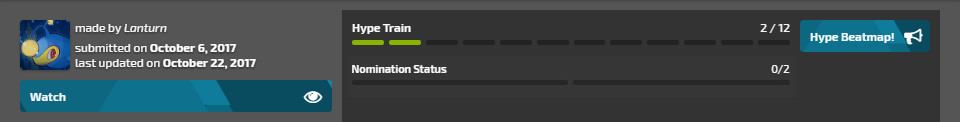
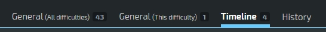
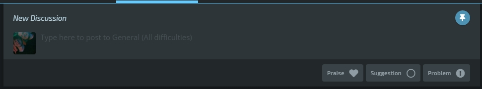
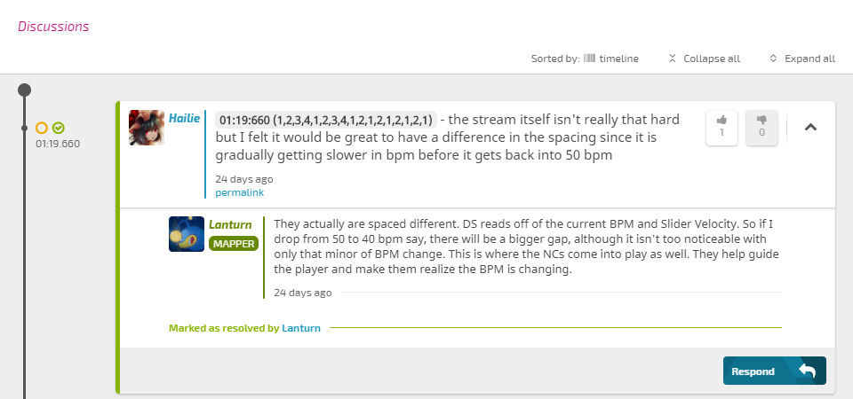

---
tags:
  - beatmap discussions
  - modding V2
  - MV2
---

# การสนทนาของ Beatmap (Beatmap discussion)

*ดูเพิ่มเติม: [Modding v1](/wiki/Modding/Forum_modding)*

**การสนทนาของ Beatmap (Beatmap discussion)** (หรือที่รู้จักในชื่อ *Modding v2*) คือระบบที่ใช้จัดการและทำให้ขั้นตอนการ [Modding](/wiki/Modding) ง่ายขึ้น โดยมีจุดมุ่งหมายเพื่อให้อินเทอร์เฟซมีความชัดเจนและเข้าใจง่าย ซึ่งเน้นไปที่การปรับปรุงคุณภาพของ Beatmap เป็นหลัก เมื่อมีการ [ส่งผลงาน (Submit)](/wiki/Beatmapping/Beatmap_submission) หน้าการสนทนาจะถูกสร้างขึ้นโดยอัตโนมัติควบคู่ไปกับ [หน้าข้อมูล Beatmap (Beatmap info page)](/wiki/Beatmap_information) และเมื่อ Beatmap มีการอัปเดต หน้าการสนทนาก็จะถูกอัปเดตตามไปด้วย คุณสามารถเข้าถึงหน้าการสนทนาได้โดยคลิกปุ่ม `Discussion` ในหน้าข้อมูล Beatmap โดยหน้าการสนทนาจะประกอบด้วยองค์ประกอบต่างๆ ดังนี้ (เรียงจากบนลงล่าง):

- การเลือกโหมด (Mode selection)
- ส่วนหัวของ Beatmap (Beatmap header)
- เมนูระดับความยาก (Difficulty menu)
- ตัวเลือกการเรียงลำดับ (Sorting options)
- ไทม์ไลน์ภาพ (Visual timeline)
- สถานะของ Beatmap (Beatmap status)
- แถบการ Modding (Modding tabs)
- ช่องส่งข้อความ (Submission field)
- รายการการสนทนา (Discussions)

คุณสามารถศึกษาภาพประกอบจาก [Beatmap นี้](https://osu.ppy.sh/beatmapsets/924551/discussion) เพื่อสร้างความคุ้นเคย หรือลองเปิดหน้าการสนทนาด้วยตัวเองได้เลย!

## เริ่มต้นใช้งานอย่างรวดเร็ว (Quick-start)

เพื่อให้การใช้งานหน้าการสนทนาของ Beatmap มีประสิทธิภาพ ควรคำนึงถึงสิ่งต่อไปนี้:

- เลือกโหมดเกมและระดับความยากที่คุณต้องการจะ Mod ให้ถูกต้อง
- เลือกหมวดหมู่ที่เหมาะสมกับสิ่งที่คุณต้องการจะส่ง
- **โพสต์ทีละหนึ่งปัญหาเท่านั้น** อย่ารวมหลายปัญหาไว้ในโพสต์เดียว
- ตรวจสอบว่าปัญหานั้นมีคนเคยแจ้งไว้หรือยัง เมื่อมีข้อความเตือนว่ามีโพสต์ที่คล้ายกันปรากฏขึ้น
- หากคุณชอบ Beatmap นี้ ลองกด Hype เพื่อช่วยผลักดันให้เข้าสู่ขั้นตอนการเสนอชื่อ (Nomination)

## การเลือกโหมด (Mode selection)

การเลือกโหมดจะเปลี่ยน [โหมดการเล่น (Game mode)](/wiki/Game_mode) ที่คุณกำลัง Mod อยู่ คุณจะสามารถเลือกโหมดเกมได้ก็ต่อเมื่อ Beatmap นั้นมีระดับความยากของโหมดนั้นๆ อยู่ โดยปกติระบบจะเลือกโหมดเกมเริ่มต้นตามที่แมพถูกสร้างมา

## ส่วนหัวของ Beatmap (Beatmap header)

*สำหรับข้อมูลเกี่ยวกับการตั้งค่า Metadata ดูที่: [การตั้งค่าเพลง (Song Setup) § ทั่วไป (General)](/wiki/Client/Beatmap_editor/Song_setup#general)*

ส่วนหัวจะแสดงชื่อเพลงและชื่อศิลปินตามที่ระบุไว้ใน [ตัวแก้ไข Beatmap (Beatmap editor)](/wiki/Client/Beatmap_editor) หากคลิกที่ส่วนหัวนี้จะพากลับไปยังหน้าข้อมูล Beatmap

## เมนูระดับความยาก (Difficulty menu)

คุณสามารถเลือกระดับ [ความยาก (Difficulties)](/wiki/Beatmap/Difficulty) ต่างๆ ได้ผ่านเมนูแบบดร็อปดาวน์ ซึ่งจะแสดงความยากที่มีอยู่ในปัจจุบันทั้งหมด รวมถึงความยากเก่าๆ ที่ถูกลบไปแล้วแต่เคยมีการเสนอแนะหรือแจ้งปัญหาไว้ ตัวเลขที่ปรากฏข้างชื่อความยากคือจำนวนโพสต์ที่ยังไม่ได้รับการแก้ไข (Unresolved) ในความยากนั้นๆ โปรดตรวจสอบเมนูนี้ให้ดีก่อนที่จะส่งการ Mod ใดๆ

## ตัวเลือกการเรียงลำดับ (Sorting options)

ตัวเลือกการเรียงลำดับจะเปลี่ยนวิธีการแสดงผลของการสนทนา เมื่อเลือกตัวเลือกใดตัวเลือกหนึ่ง ทั้งไทม์ไลน์และส่วนการสนทนาจะแสดงเฉพาะประเภทโพสต์ที่เลือกเท่านั้น ซึ่งมีประโยชน์มากในการค้นหาโพสต์ที่ยังค้างอยู่ ตัวเลือกต่างๆ ได้แก่:

- `Mine` แสดงโพสต์ของคุณเอง
- `Notes` แสดงบันทึกจาก Mapper หรือ [Beatmap Nominators](/wiki/People/Beatmap_Nominators)
- `Resolved` แสดงโพสต์ที่แก้ไขเสร็จแล้ว
- `Pending` แสดงโพสต์ที่ยังค้างอยู่
- `Praises` แสดงโพสต์ที่ชื่นชมและ Hype
- `All` แสดงโพสต์ทั้งหมด

## ไทม์ไลน์ภาพ (Visual timeline)

ไทม์ไลน์ภาพจะแสดงการ Mod ทั้งหมดในระดับความยากนั้นที่มีการระบุเวลา (Timestamp) ไว้ การคลิกที่จุดใดๆ จะเป็นการเลื่อนหน้าจอลงไปยังโพสต์ที่ระบุเวลานั้น โปรดทราบว่าตัวกรองที่คุณเลือกจะส่งผลต่อสิ่งที่แสดงบนนี้ด้วย ไทม์ไลน์ภาพเป็นเครื่องมือที่มีประโยชน์ในการดูภาพรวมว่า Beatmap นี้ได้รับการ Mod ไปมากน้อยเพียงใด หากไทม์ไลน์มีความหนาแน่นแสดงว่าแมพนี้ได้รับความสนใจอย่างมากแล้ว นอกจากนี้ การตั้งค่าของความยากที่เลือกจะแสดงอยู่ที่มุมขวาบนของไทม์ไลน์ ได้แก่: `Length` (ความยาว), `BPM`, `Circle Count` (จำนวนวงกลม) และ `Slider Count` (จำนวน Slider)

## สถานะของ Beatmap (Beatmap status)

แถบสถานะของ Beatmap จะแสดงข้อมูลที่เกี่ยวข้องกับลำดับใน [ขั้นตอนการจัดอันดับ Beatmap (Beatmap Ranking Procedure)](/wiki/Beatmap_ranking_procedure) ซึ่งประกอบด้วย:

- Hype train
- ข้อมูลทั่วไป (General info)
- ปุ่ม Watch/Unwatch (ติดตาม/เลิกติดตาม)
- ปุ่ม Beatmap Page (หน้าข้อมูลแมพ)

### Hype train

Hype train จะติดตามจำนวน [Hype](/wiki/Beatmap/Hype) ที่แมพได้รับ เมื่อสะสมครบ 5 Hype แมพจะสามารถถูกเสนอชื่อโดย [Beatmap Nominators](/wiki/People/Beatmap_Nominators) ได้ การมอบ Hype สามารถทำได้ผ่านแถบ `General (All Difficulties)` เท่านั้น หากคลิกที่ปุ่ม `Hype` ระบบจะนำคุณไปยังแถบที่ถูกต้องโดยอัตโนมัติ

### สถานะการเสนอชื่อ (Nomination status)

แถบสถานะการเสนอชื่อจะติดตามการได้รับเสนอชื่อของแมพ เมื่อได้รับครบสองการเสนอชื่อ แมพจะเข้าสู่สถานะ [Qualified (ผ่านการรับรอง)](/wiki/Beatmap/Category#qualified)

### ข้อมูลทั่วไป (General info)

แสดงผู้สร้าง Beatmap, วันที่ส่งผลงาน และวันที่อัปเดตล่าสุด รวมถึงการเปลี่ยนแปลงสถานะต่างๆ เช่น การได้รับสถานะ Ranked, Loved หรือการถูกย้ายไป Graveyarded

### Watch/Unwatch

ปุ่ม `Watch` และ `Unwatch` ใช้สำหรับติดตามหรือเลิกติดตามความเคลื่อนไหวของ Beatmap หากติดตามไว้ คุณจะได้รับการแจ้งเตือนบนเว็บไซต์ osu! เมื่อมีการโพสต์หรือตอบกลับใหม่ๆ โดยคุณสามารถจัดการรายการที่ติดตามได้ผ่าน [Modding watchlist](https://osu.ppy.sh/beatmapsets/watches)

### Beatmap page

ปุ่ม `Beatmap Page` จะนำคุณไปยังหน้าข้อมูล Beatmap (หน้าหลักของแมพ) หรือสามารถทำได้โดยคลิกที่ [ส่วนหัวของ Beatmap](#ส่วนหัวของ Beatmap (beatmap-header))

## แถบการ Modding (Modding tabs)

การ Mod จะแบ่งออกเป็น 3 แถบหลักเพื่อให้ง่ายต่อการอ่าน และแถบที่ 4 สำหรับบันทึกการเปลี่ยนแปลงทั้งหมด ตัวเลขข้างแถบคือจำนวนโพสต์ที่มีอยู่ในแถบนั้น

`General (All difficulties)` แสดงโพสต์ที่มีผลกับความยากทุกระดับ มักใช้แจ้งเรื่อง Metadata, บันทึกทั่วไป หรือการสนทนาเกี่ยวกับ Beatmap ในภาพรวม

`General (This difficulty)` แสดงโพสต์ที่มีผลเฉพาะกับระดับความยากที่เลือกอยู่เท่านั้น มักใช้แจ้งเรื่องการตั้งค่าแมพ, ปัญหาที่เกิดขึ้นซ้ำๆ หรือการสนทนาทั่วไปเฉพาะความยากนั้น

`Timeline` แสดงโพสต์ ณ เวลาที่ระบุเจาะจงในแมพ โดยอิงจากเวลา (Timestamp) แรกที่ใส่ไว้ ทุกโพสต์ในแถบนี้จำเป็นต้องระบุเวลาเสมอ

`History` บันทึกการเปลี่ยนแปลงทั้งหมดของหน้าการสนทนาตามลำดับเวลา โดยมีการแยกสีเพื่อให้ดูง่าย: สีเขียวคือโพสต์ที่แก้ไขแล้วหรือการเปลี่ยนสถานะแมพ, สีแดงคือปัญหาใหม่ที่พบหลังจากได้รับเสนอชื่อ และสีฟ้าคือเรื่องอื่นๆ แถบนี้มักใช้โดย [Beatmap Nominators](/wiki/People/Beatmap_Nominators) หรือทีมงานเพื่อตรวจสอบย้อนหลัง

## ช่องส่งข้อความ (Submission field)

ช่องส่งข้อความคือที่สำหรับเขียน [การ Mod (Mods)](/wiki/Modding) เมื่อเขียนเสร็จแล้ว จะต้องเลือกว่าจะเป็นโพสต์ประเภทใดจาก 3 ปุ่ม ได้แก่: `Praise`, `Suggestion` หรือ `Problem`

`Praise` (ชื่นชม) ใช้สำหรับการให้กำลังใจหรือชมเชย `Suggestion` (เสนอแนะ) ใช้สำหรับโพสต์ที่ไม่ได้รับผิดกฎข้อบังคับโดยตรง แต่เป็นการเสนอทางเลือกที่ดีกว่า และ `Problem` (ปัญหา) ใช้สำหรับสิ่งที่ผิด [เกณฑ์การพิจารณา (Ranking Criteria)](/wiki/Ranking_criteria) อย่างชัดเจน หรือสิ่งที่มองว่าผิดพลาดอย่างรุนแรง

หากโพสต์ในแถบ `Timeline` คุณต้องใส่เวลา (Timestamp) ในโพสต์ด้วย หากเวลาที่คุณใส่ใกล้เคียงกับโพสต์อื่น ระบบจะให้คุณยืนยันว่าปัญหานั้นไม่ได้ซ้ำกับที่มีอยู่แล้ว **โปรดตรวจสอบโพสต์อื่นๆ ให้ดีก่อนกดยืนยัน!** คุณสามารถใช้ปุ่ม `Pin` เพื่อให้ช่องส่งข้อความเลื่อนตามหน้าจอไปพร้อมกับคุณขณะตรวจสอบโพสต์อื่นๆ ได้

## รายการการสนทนา (Discussions)

รายการการสนทนาคือที่ที่โพสต์จาก [ช่องส่งข้อความ](#ช่องส่งข้อความ (submission-field)) จะไปปรากฏอยู่ ผู้ใช้คนอื่นๆ สามารถเข้ามาดูและร่วมสนทนาได้โดยการคลิกปุ่ม `Respond` หรือ `Reply` ใต้โพสต์นั้นๆ และเมื่อเขียนเสร็จให้กด `Enter` หรือคลิก `Reply` เพื่อส่งข้อความ

เจ้าของ Beatmap และผู้โพสต์สามารถปิดประเด็นได้ด้วยปุ่ม `Mark as Resolved` เพื่อแจ้งให้ทราบว่าปัญหาได้รับการแก้ไขแล้ว และจะถูกคัดออกจากตัวกรอง `Pending` อย่างไรก็ตาม ทุกคนสามารถเปิดประเด็นขึ้นมาใหม่ได้หากเห็นว่ายังแก้ไขไม่ครบถ้วน โดยพิมพ์ตอบกลับแล้วคลิกปุ่ม `Reply and Reopen`

### การเรียงลำดับการสนทนา

คุณสามารถเรียงลำดับได้ด้วยปุ่มใต้หัวข้อ `Discussions` โดยโพสต์ในแถบ `Timeline` จะเรียงตามเวลาในเพลง ส่วนแถบ `General` จะเรียงตามการอัปเดตล่าสุด นอกจากนี้ยังมีปุ่ม `Collapse all` (ยุบทั้งหมด) และ `Expand all` (ขยายทั้งหมด) เพื่อให้จัดการหน้าจอได้ง่ายขึ้น

### Thumbs up/down (เห็นด้วย/ไม่เห็นด้วย)

หากโพสต์นั้นมีประโยชน์ สามารถมอบ [Kudosu!](/wiki/Modding/Kudosu) ให้ได้โดยการกดปุ่มรูปหัวแม่มือชี้ขึ้น (Thumbs up) ซึ่งผู้ที่โพสต์เองจะไม่สามารถกดให้ตัวเองได้ Kudosu! มีความสำคัญสำหรับ Modder ที่ต้องการจะสมัครเข้าเป็น [Beatmap Nominators](/wiki/People/Beatmap_Nominators) หากมีการใช้งานฟีเจอร์นี้ในทางที่ผิด สมาชิกทีม [BN](/wiki/People/Beatmap_Nominators), [NAT](/wiki/People/Nomination_Assessment_Team) และ [GMT](/wiki/People/Global_Moderation_Team) สามารถกดรูปหัวแม่มือชี้ลง (Thumbs down) เพื่อยกเลิก Kudosu! นั้นได้ และอาจมีการลงโทษหากเป็นการกระทำที่มุ่งร้าย

### ไทม์ไลน์การสนทนา (Discussion timeline)

แถบสีเล็กๆ ทางซ้ายของโพสต์จะแสดงเวลา (Timestamp) ที่โพสต์นั้นอ้างถึง ซึ่งจะมีเฉพาะในส่วนของ `Timeline` เท่านั้น

### แท็กบทบาท (Tags)

แท็กจะแสดง [บทบาทหน้าที่สำคัญ](/wiki/People/osu!_team) ใต้ชื่อผู้ใช้ ซึ่งจะแสดงเฉพาะบทบาทที่เกี่ยวข้อง ได้แก่ `MAPPER`, `BN`, `NAT`, `GMT` และ `DEV` ซึ่งบุคคลกลุ่มนี้จะมีสิทธิ์จัดการหน้าการสนทนาได้มากกว่าผู้ใช้ทั่วไป

### เครื่องมือจัดการโพสต์ (Formatting tools)

เจ้าของโพสต์สามารถใช้เครื่องมือต่างๆ ได้ดังนี้:

`Permalink` ใช้คัดลอกลิงก์ตรงมายังโพสต์นั้น ซึ่งจะปรากฏเป็นเลขรหัส (เช่น `#1234567`) เมื่อนำไปให้คนอื่นคลิก

`Edit` ใช้แก้ไขข้อความที่ส่งไปในกรณีที่พิมพ์ผิด (ไม่แนะนำให้ใช้เพื่อตอบโต้ข้อความ ให้ใช้การ Reply แทน)

`Delete` ใช้ลบโพสต์ในกรณีที่ส่งผิดพลาดอย่างร้ายแรง แต่ฟีเจอร์นี้จะถูกปิดหากมีคนเริ่มมาตอบต่อจากโพสต์นั้นแล้ว เพื่อป้องกันการลบข้อมูลที่กำลังถกเถียงกันอยู่
