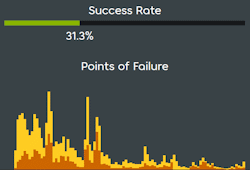

# Beatmap information

The **beatmap information page** displays various statistics about a [beatmap](/wiki/Beatmap), such as its mapper, [star rating](/wiki/Beatmap/Star_rating), and the BPM. This article details the many aspects and features the information page has to offer.

## Difficulty menu

This is the main part section of the information page, containing the most important details about a beatmap. The background depicts a cutout version of the beatmap's image.

At the top-left, next to the currently selected `info` tab, is the [beatmap discussion](/wiki/Beatmap_discussion) tab used for [modding](/wiki/Modding) a beatmap.

### Mapping information

::: Infobox

:::

::: Infobox

:::

Right below the tab selection is the difficulty section which lists every [difficulty](/wiki/Beatmap/Difficulty) in the beatmap. The game mode icons are coloured according to the [star rating colour spectrum](/wiki/Beatmap/Difficulty#difficulty-and-star-rating).

Next to this display are the difficulty's name, the total play count, and the number of users who have added this beatmap to their favourites. Hovering over a different icon other than the currently selected one will reveal the difficulty's name and its star rating. Clicking the icon will select this difficulty as the active one, causing any beatmap statistics on the page to change accordingly. When hovering over the favourite count, up to 50 profile icons of users favouriting this beatmap will be displayed.

Difficulties from other [game modes](/wiki/Game_mode) can be accessed by clicking on their respective icons in the game mode selection. The number next to the icons indicates the total number of difficulties for each game mode. Difficulties mapped in [osu!](/wiki/Game_mode/osu!) are automatically available as [converts](/wiki/Beatmap/Converts) in the other game modes.

On the left side, beneath the play count, the title and artist are displayed. Clicking on the title will automatically search for other beatmaps with the exact same song title. Underneath the artist's name, the mapper's icon and username are displayed, along with the upload date and when the beatmap was last changed (e.g. when the beatmap was moved to a different [category](/wiki/Beatmap/Category)).

Further below, the following action buttons may be present, arranged from left to right:

- **Favourite:** Adds this beatmap to the favourites section in the user's profile.
- **Download:** Download the beatmap. If the beatmap has a background video, the user can choose to download the beatmap with or without the video.
- **osu!direct**: Download the beatmap directly in the game client without requiring to manually open the file.
- **Report:** If the beatmap is in either the [graveyard](/wiki/Beatmap/Category#graveyard), or the [WIP and Pending](/wiki/Beatmap/Category#wip-and-pending) categories, the user has the ability to [report the beatmap](/wiki/Reporting_bad_behaviour#beatmap), should there be any rule-violating content. By clicking on the 3 dots, a dropdown menu will appear, revealing the `report` button.

### Statistics panel

::: Infobox

:::

To the right side of the difficulty menu is the statistics panel. Above the panel, the beatmap's category can be seen. Small icons will indicate if the beatmap has a video or a storyboard. When clicking the triangle-shaped button below the category, a short preview of the song will be played. Pause the preview by clicking a second time.

Underneath the preview menu the song length, the BPM, as well as the number of [hit objects](/wiki/Gameplay/Hit_object) can be seen from left to right respectively. Upon hovering over the song length, a tooltip will additionally show the [drain time](/wiki/Beatmap/Drain_time) of the difficulty.

Depending on the game mode, the following beatmap settings may be visible, along with the corresponding values next to it:

| Setting | Description | Game mode |
| :-: | :-- | :-: |
| [Circle size](/wiki/Beatmap/Circle_size) (CS) | Determines how big the hit circles are. | ![][osu!] ![][osu!catch] |
| [HP drain](/wiki/Beatmap/HP_drain_rate) (HP) | Defines how much health is gained and lost while playing. | ![][osu!] ![][osu!taiko] ![][osu!catch] ![][osu!mania] |
| [Approach rate](/wiki/Beatmap/Approach_rate) (AR) | Controls the speed at which hit objects appear in. | ![][osu!] ![][osu!catch] |
| [Accuracy](/wiki/Gameplay/Accuracy) | Controls how tight the timing window for each hit object will be. | ![][osu!] ![][osu!taiko] ![][osu!catch] ![][osu!mania] |
| Key count | Specifies the number of keys used when playing a beatmap. | ![][osu!mania] |

At the bottom of the statistics panel is the [star rating](/wiki/Beatmap/Star_rating), which is an algorithmic abstraction of a map's difficulty.

::: Infobox

:::

If the beatmap is [Qualified](/wiki/Beatmap/Category#qualified), [Ranked](/wiki/Beatmap/Category#ranked), or [Loved](/wiki/Beatmap/Category#loved), the user rating will be displayed below the statistics panel. After passing a beatmap in osu!(stable), users are able to vote between 1 and 10 stars based on how much they liked it.

If the user votes 6 stars or more (positive vote), the bar will be coloured green, otherwise yellow (negative vote). The numbers to the side of the bar indicate the number of users that have voted either positively or negatively. Above the bar, a number in brackets shows the average number of stars from all user votes.

The rating graph below the user rating shows the proportion of votes for each star value.

## Metadata

### Beatmap description

The beatmap description is a field editable by the mapper often used for...

- ...linking resources such as the background image's source or hitsound samples used.
- ...commending other users for their help (e.g. guest mappers, modders, storyboarders).
- ...trivia related to the beatmap (e.g. mapping milestones).

### Keywords

In addition to gameplay-related statistics, every beatmap includes metadata fields to improve a beatmap's searchability. Before submitting a beatmap as part of the [ranking process](/wiki/Beatmap_ranking_procedure), a mapper is required to add this information to the beatmap:

- [Genre](/wiki/Beatmap/Genre_and_language#list-of-genres): The song's main musical genre.
- [Language](/wiki/Beatmap/Genre_and_language#list-of-languages): The primary language in the lyrics, or instrumental if no lyrics are present.
- [Mapper tags](/wiki/Beatmap/Beatmap_tags#mapper-tags): Useful keywords containing information about the song.
- **Source:** The original media the song was produced for, or a piece of media the song is most known for.

The nominator section is added as soon as the beatmap is nominated by [beatmap nominators](/wiki/People/Beatmap_Nominators) as part of the [ranking process](/wiki/Beatmap_ranking_procedure).

After the beatmap is ranked, users are able to vote for [user tags](/wiki/Beatmap/Beatmap_tags#user-tags) from the osu!(lazer) client. Upon reaching 5 votes on an user tag, it will be displayed in the `user tag` segment in this section.

### Success rate display

The success rate display visualises how many players were able to successfully pass the beatmap. When hovering over the percentage value, a tooltip will provide the exact number of passes out of the total number of plays in a beatmap.

Below is a diagram showing a map's points of failure, showing at what points users failed their play. The higher the spike, the more players failed at that point.

## Hype train

If a beatmap is WIP or Pending, the hype train section is visible where users can [hype](/wiki/Beatmap/Hype) the beatmap to indicate that they want the beatmap to be ranked.

## Rankings

If a beatmap is Qualified or Ranked, it has access to leaderboards, on which players can compete against each other.

Three leaderboards can be accessed from the beatmap information page, those being `Global Ranking`, `Country Ranking`, and `Friend Ranking`, of which the last two require [osu!supporter](/wiki/osu!supporter) for usage. Selecting one of the tabs at the top of the menu will display the respective leaderboard in the score listing below. Clicking on one or several mod icons in the filter menu allows the user to show solely scores with that exact [mod](/wiki/Gameplay/Game_modifier) combination.

The score listing shows up to 50 top scores, while the best score is highlighted with an enlarged score card.

Hovering over a score will reveal 3 dots at the right side of the menu. Clicking on the dots opens up a menu with 3 options:

- **View details:** The score will be visualised on a single page.
- **Download replay:** Download the [replay](/wiki/Gameplay/Replay) file.
- **Report score:** Users can file a report on a suspicious score if they believe foul play was involved.

## Comments

In the comment section, users are able to exchange their opinions about the beatmap. The beatmap host also has the ability to pin a comment, which will cause it to be displayed at the top of the section. The number at the top reflects the number of total comments. Comments can be sorted by either most recent, oldest, or comments with the most upvotes by selecting the respective sort mode below the input box. To post a new comment, write something in the textbox, and click `Post` or press `Enter`.

When clicking the `Watch` button on the right side, the user will receive notifications about new comments on this beatmap.

Users have several options available when navigating through comments from other users:

- **Upvote:** Like a comment by clicking on the number on the left side next to the comment. After liking, the upvote count will be coloured green.
- **Permalink:** Copy a permanent link to this comment to the clipboard.
- **Reply:** Replies are inserted with more space to the left side to distinguish them from other comments.
- **Report:** Do not hesitate to report rule-breaking content!

## Trivia

- In osu!(stable), it was not possible to automatically replace old audio files after the mapper updated them. The beatmap description field would be used for instructing the user to manually redownload the beatmap to apply the new audio files.

[osu!]: /wiki/shared/mode/osu.png "osu!"
[osu!taiko]: /wiki/shared/mode/taiko.png "osu!taiko"
[osu!catch]: /wiki/shared/mode/catch.png "osu!catch"
[osu!mania]: /wiki/shared/mode/mania.png "osu!mania"
