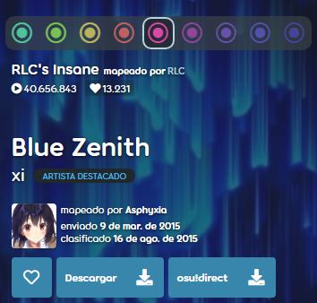
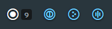
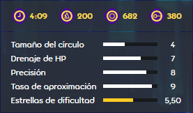
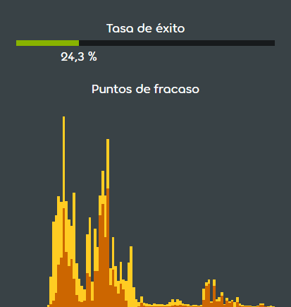
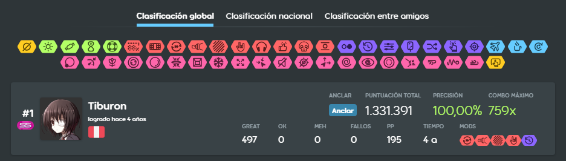
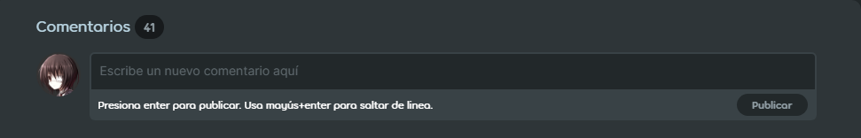

# Información de los beatmaps

La **página de información de los beatmaps** muestra diversas estadísticas sobre un [beatmap](/wiki/Beatmap), como su creador, la [calificación por estrellas](/wiki/Beatmap/Star_rating) y el BPM. Este artículo detalla los numerosos aspectos y características que ofrece la página de información.

## Menú de dificultad

Esta es la sección principal de la página de información, que contiene los detalles más importantes de un beatmap. El fondo se muestra como una versión recortada de la imagen del beatmap.

En la parte superior izquierda, junto a la pestaña de `información` seleccionada, se encuentra la pestaña [`discusión`](/wiki/Beatmap_discussion), que se usa para el proceso de [modding](/wiki/Modding) de los beatmaps.

### Información sobre los mapas

::: Infobox

:::

::: Infobox

:::

Justo debajo de la selección de las pestañas se encuentra la sección de dificultad, que muestra todas las [dificultades](/wiki/Beatmap/Difficulty) de un beatmap. Los iconos del modo de juego del beatmap están coloreados según el [espectro de colores de la calificación por estrellas](/wiki/Beatmap/Difficulty#dificultad-y-calificación-por-estrellas).

Junto a esto, se muestra el nombre de la dificultad, el número total de veces que se ha jugado el beatmap y el número de usuarios que han añadido este beatmap a sus favoritos. Al pasar el cursor por encima de un icono distinto al seleccionado, se mostrará el nombre de la dificultad y su calificación por estrellas. Al hacer clic en el icono, se seleccionará esa dificultad como la activa, lo que provocará que las estadísticas del beatmap que aparecen en la página cambien en consecuencia. Al pasar el cursor por encima del número de favoritos, se mostrarán los usuarios que han marcado este beatmap como favorito recientemente, hasta un máximo de 50 usuarios.

Se puede acceder a las dificultades de otros [modos de juego](/wiki/Game_mode) haciendo clic en sus respectivos iconos en la selección del modo de juego. El número que aparece junto a los iconos indica el número total de dificultades para cada modo de juego. Las dificultades mapeadas en [osu!](/wiki/Game_mode/osu!) están disponibles automáticamente como [beatmaps convertidos](/wiki/Beatmap/Converts) para los demás modos de juego.

En el lado izquierdo, debajo del número total de veces jugado, se muestran el título y el artista. Al hacer clic en el título, se buscarán automáticamente otros beatmaps con el mismo título de la canción. Debajo del nombre del artista, se muestran la foto y el nombre de usuario del creador del mapa, junto con la fecha de subida y la fecha de la última modificación del beatmap (por ejemplo, cuando el beatmap se movió a una [categoría](/wiki/Beatmap/Category) diferente).

Más abajo, pueden aparecer los siguientes botones de acción, ordenados de izquierda a derecha:

- **Favorito:** Añade este beatmap a la sección de favoritos del perfil del usuario.
- **Descargar:** Descarga el beatmap. Si el beatmap tiene un vídeo de fondo, el usuario podrá elegir entre descargar el beatmap con o sin el vídeo.
- **osu!direct**: Descarga el beatmap directamente en el cliente del juego sin necesidad de abrir el archivo manualmente.
- **Reportar:** Si el beatmap se encuentra en las categorías de [Abandonados](/wiki/Beatmap/Category#graveyard) o [Trabajo en progreso y pendientes](/wiki/Beatmap/Category#wip-and-pending), el usuario tendrá la posibilidad de [reportar el beatmap](/wiki/Reporting_bad_behaviour#beatmaps), en caso de que haya algún contenido que incumpla las reglas. Al hacer clic en los tres puntos, aparecerá un menú desplegable que mostrará el botón `reportar`.

### Panel de estadísticas

::: Infobox

:::

A la derecha del menú de dificultad se encuentra el panel de estadísticas. Por encima del panel se puede ver la categoría del beatmap. Los iconos pequeños indicarán si el beatmap tiene un vídeo o un storyboard. Al hacer clic en el botón con forma de triángulo situado debajo de la categoría, se reproducirá una vista previa breve de la canción. Pausa la vista previa haciendo clic por segunda vez.

Debajo del menú de la vista previa se puede ver, de izquierda a derecha, la duración de la canción, el BPM y el número de [objetos](/wiki/Gameplay/Hit_object). Al pasar el cursor sobre la duración de la canción, aparecerá una ventana emergente que mostrará el [tiempo de drenaje](/wiki/Beatmap/Drain_time) de la dificultad.

Dependiendo del modo de juego, pueden aparecer los siguientes ajustes del beatmap, junto con los valores correspondientes a su lado:

| Ajuste | Descripción | Modo de juego |
| :-: | :-- | :-: |
| [Tamaño del círculo](/wiki/Beatmap/Circle_size) (CS) | Determina el tamaño de los círculos. | ![][osu!] ![][osu!catch] |
| [Drenaje de HP](/wiki/Beatmap/HP_drain_rate) (HP) | Define cuánta salud se gana y se pierde mientras se juega. | ![][osu!] ![][osu!taiko] ![][osu!catch] ![][osu!mania] |
| [Velocidad de aproximación](/wiki/Beatmap/Approach_rate) (AR) | Controla la velocidad a la que aparecen los objetos. | ![][osu!] ![][osu!catch] |
| [Precisión](/wiki/Gameplay/Accuracy) | Controla lo ajustada que será la ventana de tiempo para cada objeto | ![][osu!] ![][osu!taiko] ![][osu!catch] ![][osu!mania] |
| Cantidad de teclas | Especifica el número de teclas que se usarán al jugar un beatmap. | ![][osu!mania] |

En la parte inferior del panel de estadísticas se encuentra la [calificación por estrellas](/wiki/Beatmap/Star_rating), que es una abstracción algorítmica de la dificultad de un mapa.

::: Infobox

:::

Si el beatmap está [calificado](/wiki/Beatmap/Category#qualified), [clasificado](/wiki/Beatmap/Category#ranked) o [amado](/wiki/Beatmap/Category#loved), la valoración de los usuarios se mostrará debajo del panel de estadísticas. Después de completar un beatmap en osu!(stable), los usuarios pueden votar entre 1 y 10 estrellas según cuánto les haya gustado.

Si el usuario vota con 6 estrellas o más (voto positivo), la barra se coloreará de verde; de lo contrario, se coloreará de amarillo (voto negativo). Los números que aparecen al lado de la barra indican el número de usuarios que han votado positiva o negativamente. Por encima de la barra, un número entre paréntesis muestra el promedio de estrellas de todas las votaciones de los usuarios.

El gráfico de valoración situado debajo de la valoración de los usuarios muestra la proporción de votos para cada valor de estrellas.

## Metadatos

### Descripción del beatmap

La descripción del beatmap es un campo editable por el creador del mapa que se usa a menudo para...

- ...añadir enlaces a los recursos usados en el beatmap, como la procedencia de la imagen de fondo o los hitsounds usados.
- ...agradecer a otros usuarios por su ayuda (por ejemplo, mappers invitados, modders, storyboarders).
- ...curiosidades relacionadas con el beatmap (por ejemplo, hitos importantes en la creación del mapa).

### Palabras clave

Además de las estadísticas relacionadas con la jugabilidad, cada beatmap incluye campos de metadatos para mejorar la capacidad de búsqueda de los beatmaps. Antes de enviar un beatmap como parte del [proceso de clasificación](/wiki/Beatmap_ranking_procedure), los creadores de mapas deben añadir esta información al beatmap:

- [Género](/wiki/Beatmap/Genre_and_language#lista-de-géneros): El género musical principal de la canción.
- [Idioma](/wiki/Beatmap/Genre_and_language#lista-de-idiomas): El idioma principal de la letra de la canción, o instrumental si no hay letra.
- [Etiquetas de los mappers](/wiki/Beatmap/Beatmap_tags#etiquetas-de-los-mappers): Palabras clave útiles que contienen información sobre la canción.
- **Fuente:** El medio original para el que se produjo la canción, o el medio por el que la canción es más conocida.

La sección de nominadores se añade una vez que el beatmap es nominado por los [Beatmap Nominators](/wiki/People/Beatmap_Nominators) como parte del [proceso de clasificación](/wiki/Beatmap_ranking_procedure).

Una vez clasificado el beatmap, los usuarios pueden votar por las [etiquetas de los usuarios](/wiki/Beatmap/Beatmap_tags#etiquetas-de-los-usuarios) desde el cliente osu!(lazer). Al alcanzar los 5 votos en una etiqueta, esta se mostrará en el apartado `Etiqueta de usuario` de esta sección.

### Indicador de la tasa de éxito

El indicador de la tasa de éxito muestra cuántos jugadores han conseguido completar con éxito el beatmap. Al pasar el cursor por encima del porcentaje, aparecerá un cuadro de información con el número exacto de veces que se ha pasado la dificultad seleccionada respecto al número total de jugadas en un beatmap.

Debajo hay un diagrama que muestra los puntos de fallo de un mapa, indicando en qué puntos los usuarios fallaron su jugada. Cuanto más alto es el pico, más jugadores fallaron en ese punto.

## Tren del hype

Si un beatmap está en WIP o pendiente, se muestra la sección del tren del hype, donde los usuarios pueden [hypear](/wiki/Beatmap/Hype) el beatmap para indicar que quieren que se clasifique.

## Tablas de clasificación

Si un beatmap está calificado o clasificado, tiene acceso a las tablas de clasificación, en las que los jugadores pueden competir entre sí.

Se puede acceder a tres tablas de clasificación desde la página de información del beatmap: `Clasificación global`, `Clasificación nacional` y `Clasificación entre amigos`, de las cuales las dos últimas requieren [osu!supporter](/wiki/osu!supporter) para su acceso. Al seleccionar una de las pestañas de la parte superior del menú, se mostrará la tabla de clasificación correspondiente en la lista de puntuaciones que hay debajo. Al hacer clic en uno o varios iconos de mods en el menú de filtros, el usuario puede mostrar únicamente las puntuaciones con esa combinación exacta de [mods](/wiki/Gameplay/Game_modifier).

La tabla de puntuaciones muestra hasta las 50 mejores puntuaciones, mientras que la mejor puntuación se destaca con una tarjeta de puntuación ampliada.

Al pasar el cursor sobre una puntuación, aparecerán tres puntos en la parte derecha del menú. Al hacer clic en los puntos se abre un menú con 3 opciones:

- **Ver detalles:** Los detalles de la puntuación se visualizarán en una página aparte.
- **Descargar repetición:** Descarga el archivo de la [repetición](/wiki/Gameplay/Replay) de la puntuación.
- **Reportar puntuación:** Los usuarios pueden enviar un reporte sobre una puntuación sospechosa si creen que hubo algún tipo de trampa.

## Comentarios

En la sección de comentarios, los usuarios pueden intercambiar sus opiniones sobre el beatmap. El anfitrión del beatmap también tiene la posibilidad de fijar un comentario, lo que hará que se muestre en la parte superior de la sección. El número en la parte superior refleja el número total de comentarios. Los comentarios se pueden ordenar por los más recientes, los más antiguos o los comentarios con más votos positivos seleccionando el modo de ordenación correspondiente debajo del cuadro de texto. Para publicar un nuevo comentario, escribe algo en el cuadro de texto y haz clic en `Publicar` o presiona `Entrar`.

Al hacer clic en el botón `Ver` situado a la derecha, el usuario recibirá notificaciones sobre los nuevos comentarios relacionados con este beatmap.

Los usuarios tienen varias opciones disponibles al navegar por los comentarios de otros usuarios:

- **Voto positivo:** Marca un comentario como «me gusta» haciendo clic en el número situado a la izquierda, junto al comentario. Después de dar un «me gusta», el contador de votos positivos aparecerá en color verde.
- **Enlace permanente:** Copia un enlace permanente a este comentario en el portapapeles.
- **Responder:** Las respuestas se insertan con más espacio a la izquierda para distinguirlas de otros comentarios.
- **Reportar:** ¡No dudes en reportar cualquier contenido que incumpla las reglas!

## Curiosidades

- En osu!(stable), no era posible remplazar automáticamente los archivos de audio antiguos después de que el mapper los actualizara. El campo de la descripción del beatmap se usaba para indicar a los usuarios que descarguen de nuevo manualmente el beatmap para aplicar los nuevos archivos de audio.

[osu!]: /wiki/shared/mode/osu.png "osu!"
[osu!taiko]: /wiki/shared/mode/taiko.png "osu!taiko"
[osu!catch]: /wiki/shared/mode/catch.png "osu!catch"
[osu!mania]: /wiki/shared/mode/mania.png "osu!mania"
