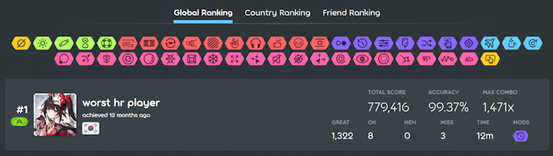

# Información del beatmap

La **página de información del beatmap** muestra varias estadísticas sobre un [beatmap](/wiki/Beatmap), como su mapeador, la [calificación por estrella](/wiki/Beatmap/Star_rating), y el BPM. Este artículo detalla los muchos aspectos y características que ofrece esta página de información.

## Menú de dificultad

Esta es la sección principal de la página de información, que contiene los detalles más importantes sobre un beatmap. El fondo muestra una versión recortada de la imagen del beatmap.

En la esquina superior izquierda, junto a la pestaña `información` seleccionada, se encuentra la pestaña [discusión sobre beatmaps](/wiki/Beatmap_discussion), que se utiliza para [modificar](/wiki/Modding) 

### Información de mapping

::: Infobox

:::

::: Infobox

:::

Justo debajo de la selección de pestañas se encuentra la sección de dificultad que lista cada [dificultad](/wiki/Beatmap/Difficulty) en el beatmap. Los iconos del modo de juego son coloreados de acuerdo al [espectro de colores de calificación de estrellas](/wiki/Beatmap/Difficulty#difficulty-and-star-rating).

Junto a esta pantalla se muestran el nombre de la dificultad, el total de reproducciones y el número de usuarios que han añadido este beatmap a sus favoritos. Al pasar el cursor sobre un icono distinto al seleccionado, se mostrará el nombre de la dificultad y su puntuación. Al hacer clic en el icono, se activará esta dificultad y las estadísticas del beatmap se modificarán en consecuencia. Al pasar el cursor sobre el número de favoritos, se mostrarán hasta 50 iconos de perfil de los usuarios que han marcado este mapa de ritmo como favorito.

Se puede acceder a las dificultades de otros [modos de juego](/wiki/Game_mode) haciendo clic en sus respectivos iconos en la selección de modos. El número junto a los iconos indica el número total de dificultades de cada modo. Las dificultades asignadas en [osu!](/wiki/Game_mode/osu!) están disponibles automáticamente como [converts](/wiki/Beatmap/Converts) en los demás modos.

A la izquierda, debajo del recuento de reproducciones, se muestran el título y el artista. Al hacer clic en el título, se buscarán automáticamente otros mapas de ritmo con el mismo título de canción. Debajo del nombre del artista, se muestran el icono y el nombre de usuario del creador del beatmap, junto con la fecha de subida y la última modificación del mapa de ritmo (por ejemplo, cuándo se movió a otra [categoría](/wiki/Beatmap/Category)).

Más abajo pueden estar presentes los siguientes botones, dispuestos de izquierda a derecha:

- **Favorito:** Añade este beatmap a la sección de favoritos en el perfil del usuario.
- **Descargar:** Descargar el beatmap. Si el beatmap incluye un vídeo de fondo, el usuario puede elegir descargarlo con o sin vídeo.
- **osu!direct**: Descarga el beatmap directamente en el cliente del juego sin necesidad de abrir el archivo manualmente.
- **Reportar:** Si el beatmap se encuentra en las categorías de [abandonado](/wiki/Beatmap/Category#graveyard) o [trabajo en progreso y pendientes](/wiki/Beatmap/Category#wip-and-pending), el usuario puede [reportar el beatmap](/wiki/Reporting_bad_behaviour#beatmap) si contiene contenido que infrinja las reglas. Al hacer clic en los tres puntos, aparecerá un menú desplegable con el botón "Reportar".

### Panel de estadísticas

::: Infobox

:::

A la derecha del menú de dificultad se encuentra el panel de estadísticas. Sobre él, se puede ver la categoría del beatmap. Pequeños iconos indicarán si el beatmap incluye un video o un storyboard. Al hacer clic en el botón triangular debajo de la categoría, se reproducirá una breve vista previa de la canción. Para pausar la vista previa, haga clic de nuevo.

Debajo del menú de vista previa, se pueden ver la duración de la canción, los BPM y el número de [objetos](/wiki/Gameplay/Hit_object) de izquierda a derecha, respectivamente. Al pasar el cursor sobre la duración de la canción, una descripción emergente mostrará además él [tiempo de drenaje](/wiki/Beatmap/Drain_time) de la dificultad.

Dependiendo del modo de juego, pueden verse las siguientes configuraciones del mapa de ritmo, junto con los valores correspondientes al lado:

| Configuración | Descripción | Modo de juego |
| :-: | :-- | :-: |
| [Tamaño del círculo](/wiki/Beatmap/Circle_size) (CS) | Determina qué tan grandes son los círculos. | ![][osu!] ![][osu!catch] |
| [Tasa de drenaje de HP](/wiki/Beatmap/HP_drain_rate) (HP) | Define cuánta salud se gana y se pierde mientras se juega. | ![][osu!] ![][osu!taiko] ![][osu!catch] ![][osu!mania] |
| [Velocidad de aproximación](/wiki/Beatmap/Approach_rate) (AR) | Controla la velocidad a la que aparecen los objetos impactados. | ![][osu!] ![][osu!catch] |
| [Precisión](/wiki/Gameplay/Accuracy) | Controla qué tan ajustada será la ventana de tiempo para cada objeto. | ![][osu!] ![][osu!taiko] ![][osu!catch] ![][osu!mania] |
| Numero de teclas | Especifica el número de teclas utilizadas al reproducir un mapa de ritmo. | ![][osu!mania] |

En la parte inferior del panel de estadísticas se encuentra la [calificación de estrellas](/wiki/Beatmap/Star_rating), que es una abstracción algorítmica de la dificultad de un mapa.

::: Infobox

:::

Si el beatmap está [Calificado](/wiki/Beatmap/Category#qualified), [Clasificado](/wiki/Beatmap/Category#ranked) o [Amado](/wiki/Beatmap/Category#loved), la calificación del usuario se mostrará debajo del panel de estadísticas. Tras aprobar un mapa de ritmos en osu!(stable), los usuarios pueden votar con entre 1 y 10 estrellas según cuanto les gusto.

Si el usuario vota 6 estrellas o más (voto positivo), la barra se mostrará en verde; de ​​lo contrario, en amarillo (voto negativo). Los números a un lado de la barra indican el número de usuarios que han votado, ya sea positiva o negativamente. Sobre la barra, un número entre paréntesis muestra el promedio de estrellas de todos los votos de los usuarios.

El gráfico de calificación debajo de la calificación del usuario muestra la proporción de votos para cada valor de estrella.

## Metadata

### Descripción del beatmap

La descripción del beatmap es un campo editable por el asignador que se utiliza a menudo para...

- ...vincular recursos como la fuente de la imagen de fondo o las muestras de sonido utilizadas.
- ...elogiar a otros usuarios por su ayuda (por ejemplo, mapeadores invitados, modders, creadores de storyboards).
- ...curiosidades relacionadas con el beatmap (por ejemplo, hitos del mapeo).

### Palabras clave

Además de las estadísticas de juego, cada mapa de ritmo incluye campos de metadatos para mejorar su capacidad de búsqueda. Antes de enviar un mapa de ritmo como parte del [proceso de clasificación](/wiki/Beatmap_ranking_procedure), el mapeador debe añadir la siguiente información:

- [Género](/wiki/Beatmap/Genre_and_language#list-of-genres): El género musical principal de la canción.
- [Idioma](/wiki/Beatmap/Genre_and_language#list-of-languages): El idioma principal de la letra, o instrumental si no hay letra.
- [Etiquetas del mapeador](/wiki/Beatmap/Beatmap_tags#mapper-tags): Palabras clave útiles que contienen información sobre la canción.
- **Fuente:** El medio original para el que se produjo la canción o un medio por el que es más conocida.

La sección de nominadores se agrega tan pronto como el beatmap es nominado por un [nominador de beatmaps](/wiki/People/Beatmap_Nominators) como parte del [proceso de clasificación](/wiki/Beatmap_ranking_procedure).

Una vez clasificado el mapa de ritmos, los usuarios pueden votar por [etiquetas de usuario](/wiki/Beatmap/Beatmap_tags#user-tags) desde el cliente osu!(lazer). Al alcanzar 5 votos por una etiqueta de usuario, esta se mostrará en el segmento `Etiquetas de usuario` de esta sección.

### Visualización de la tasa de éxito

La pantalla de tasa de éxito muestra cuántos jugadores lograron completar el beatmap. Al pasar el cursor sobre el porcentaje, una descripción emergente mostrará el número exacto de pases del total de jugadas en el mapa.

A continuación, se muestra un diagrama que muestra los puntos de fallo de un mapa, indicando en qué puntos los usuarios fallaron. Cuanto mayor sea el pico, más jugadores fallaron en ese punto.

## Tren del hype

Si un beatmap está en proceso o pendiente, la sección del tren de hype es visible, donde los usuarios pueden [hypear](/wiki/Beatmap/Hype) el beatmap para indicar que quieren que se clasifique.

## Rankings

Si un mapa de ritmo está calificado o clasificado, tiene acceso a tablas de clasificación, en las que los jugadores pueden competir entre sí.

Se puede acceder a tres tablas de clasificación desde la página de información del beatmap: `Clasificación global`, `Clasificación por país` y `Clasificación de amigos`. Las dos últimas requieren [osu!supporter](/wiki/osu!supporter) para su uso. Al seleccionar una de las pestañas en la parte superior del menú, se mostrará la tabla de clasificación correspondiente en la lista de puntuaciones inferior. Al hacer clic en uno o varios iconos de mod en el menú de filtros, se muestran solo las puntuaciones con esa combinación exacta de [mod](/wiki/Gameplay/Game_modifier).

La lista de puntuaciones muestra hasta 50 puntuaciones máximas, y la mejor puntuación se resalta con una tarjeta de puntuación ampliada.

Al pasar el cursor sobre una puntuación, se mostrarán tres puntos a la derecha del menú. Al hacer clic en los puntos, se abrirá un menú con tres opciones:

- **Ver detalles:** La puntuación se visualizará en una sola página.
- **Descargar repetición:** Descarga el archivo de [repetición](/wiki/Gameplay/Replay).
- **Reportar puntuación:** Los usuarios pueden reportar una puntuación sospechosa si creen que hubo juego sucio.

## Comentarios

En la sección de comentarios, los usuarios pueden intercambiar opiniones sobre el beatmap. El administrador del beatmap también puede fijar un comentario, lo que hará que se muestre en la parte superior de la sección. El número en la parte superior refleja el total de comentarios. Los comentarios se pueden ordenar por más recientes, más antiguos o con más votos positivos seleccionando el modo de ordenación correspondiente debajo del cuadro de entrada. Para publicar un nuevo comentario, escriba algo en el cuadro de texto y haga clic en `Publicar` o presione `Intro`.

Al hacer clic en el botón `Ver` a la derecha, el usuario recibirá notificaciones sobre nuevos comentarios en este mapa de ritmos.

Los usuarios tienen varias opciones disponibles para navegar por los comentarios de otros usuarios:

- **Voto positivo:** Dale "Me gusta" a un comentario haciendo clic en el número a la izquierda. Tras darle "Me gusta", el recuento de votos positivos se mostrará en verde.
- **Enlace permanente:** Copia un enlace permanente a este comentario en el portapapeles.
- **Responder:** Las respuestas se insertan con más espacio a la izquierda para distinguirlas de otros comentarios.
- **Reportar:** ¡No dudes en reportar contenido que infrinja las normas!

## Curiosidades

- En osu!(stable), no era posible reemplazar automáticamente los archivos de audio antiguos después de que el mapeador los actualizara. El campo de descripción del mapa de ritmos se usaba para indicar al usuario que volviera a descargar manualmente el mapa de ritmos para aplicar los nuevos archivos de audio.

[osu!]: /wiki/shared/mode/osu.png "osu!"
[osu!taiko]: /wiki/shared/mode/taiko.png "osu!taiko"
[osu!catch]: /wiki/shared/mode/catch.png "osu!catch"
[osu!mania]: /wiki/shared/mode/mania.png "osu!mania"
