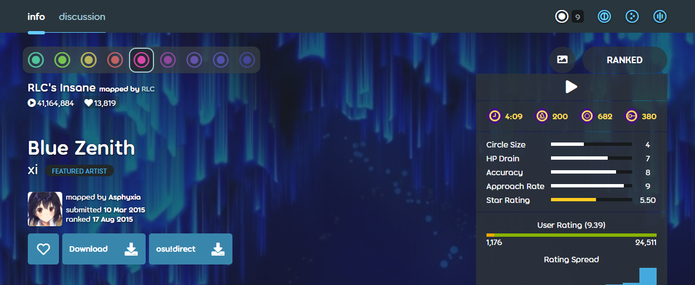
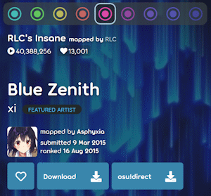
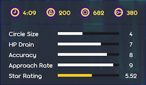
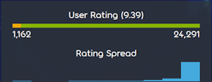
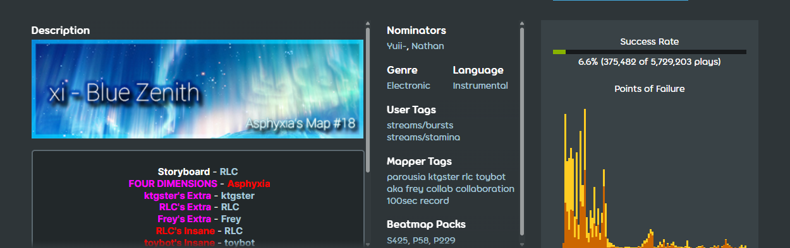
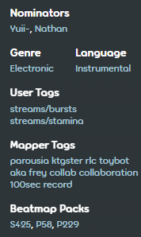
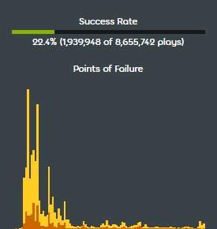
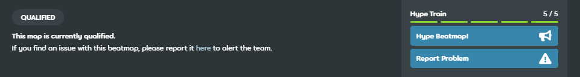
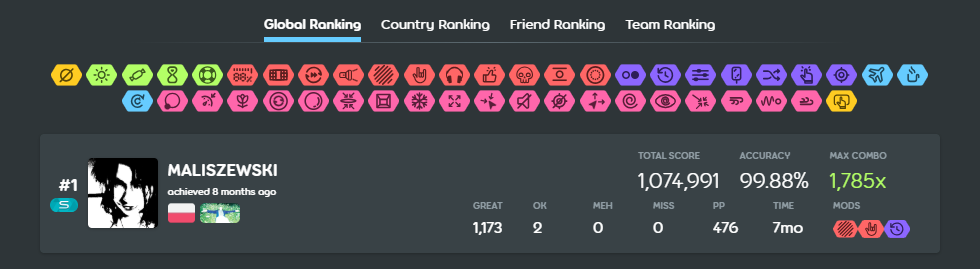
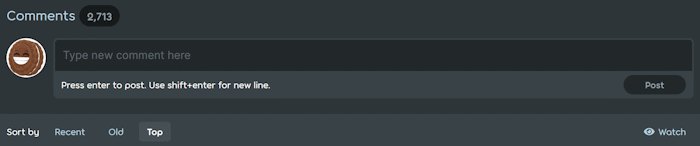

# Информация о карте

**Страница информации о карте** содержит различные сведения, касающиеся [карты](/wiki/Beatmap) — например, её метаданные, рейтинг и комментарии.

## Навигация

:::infobox

:::

::: Infobox

:::

В левом верхнем углу страницы можно переключаться между двумя вкладками: `главная`, где показывается сама информация, и [`обсуждение`](/wiki/Beatmap_discussion), где происходит [моддинг](/wiki/Modding) карты.

По четырём иконкам в правом верхнем углу можно увидеть выбранный сейчас [режим игры](/wiki/Game_mode). Числа около них — это количество [сложностей](/wiki/Beatmap/Difficulty) в каждом из них. Серым цветом обозначены режимы, для которых нет сложностей. Сложности, замапанные в режиме [osu!](/wiki/Game_mode/osu!), автоматически доступны в других режимах в виде [конвертов](/wiki/Beatmap/Converts).

## Отдельная сложность

Это — главная часть меню, в которой размещена вся важная информация о карте. В качестве фона используется обрезанный фон сложности.

### Маппинг

::: Infobox

:::

Здесь указано название песни и её исполнитель, ник автора карты и его аватар, а также дата публикации и последнего изменения карты.

Цвет, в который окрашены иконки режима игры, соответствует [числу звёзд сложности](/wiki/Beatmap/Difficulty#уровень-сложности-по-звёздам). При переключении на другую сложность вся информация обновится.

Под названием сложности расположены разные счётчики: сколько раз её сыграли и добавили в избранное, а также — [в некоторых случаях](/wiki/Beatmap/Category#wip-and-pending) — число номинаций. Если навести курсор на счётчик избранного, можно увидеть до 50 аватаров пользователей, добавивших карту в избранное.

Под счётчиками указано название песни и её исполнитель. Кликнув по каждому из них, можно перейти к поиску других карт с таким же названием или исполнителем.

Ники автора карты и гостевых мапперов также кликабельны и ведут на их профили.

Ещё чуть ниже расположены кнопки действий:

- **Добавить в избранное:** добавить карту в раздел с избранным в вашем профиле.
- **Скачать:** скачать карту. Если в ней есть фоновое видео, будет видна дополнительная кнопка для скачивания без видео.
- **osu!direct**: скачать карту напрямую через клиент игры, чтобы не импортировать файл вручную. Для клиента osu!(stable) необходимо наличие [osu!supporter](/wiki/osu!supporter).
- **Пожаловаться:** на карты, находящиеся [на кладбище](/wiki/Beatmap/Category#graveyard) или [в процессе разработки](/wiki/Beatmap/Category#wip-and-pending), можно [пожаловаться](/wiki/Reporting_bad_behaviour#beatmap), если они нарушают правила. Кнопку для жалобы можно найти, нажав на три вертикальные точки.

### Статистика

::: Infobox

:::

Справа от меню, посвящённого маппингу, расположен блок статистики. Наверху в нём указана статус карты, а также — при наличии сториборда или фонового видео — соответствующие иконки. Под названием категории есть кнопка для прослушивания аудиопревью (через неё же превью можно поставить на паузу).

Под превью перечислены длина песни, её темп и число [игровых объектов](/wiki/Gameplay/Hit_object). При наведении курсора на длину песни можно увидеть [игровое время](/wiki/Beatmap/Drain_time) сложности.

В зависимости от режима игры будут видны следующие параметры сложности и их значения:

| Параметр | Описание | Режимы игры |
| :-: | :-- | :-: |
| [Размер нот](/wiki/Beatmap/Circle_size) (CS) | Определяет, насколько большими будут ноты. | ![][osu!] ![][osu!catch] |
| [Скорость потери HP](/wiki/Beatmap/HP_drain_rate) (HP) | Определяет, как быстро будет меняться здоровье в ходе игры. | ![][osu!] ![][osu!taiko] ![][osu!catch] ![][osu!mania] |
| [Скорость появления нот](/wiki/Beatmap/Approach_rate) (AR) | Отвечает за скорость появления объектов на экране. | ![][osu!] ![][osu!catch] |
| [Точность](/wiki/Gameplay/Accuracy) | Отвечает за ширину окон тайминга у игровых объектов. | ![][osu!] ![][osu!taiko] ![][osu!catch] ![][osu!mania] |
| Количество клавиш | Сколько клавиш задействовано в карте. | ![][osu!mania] |

Под настройками карты указаны [звёзды сложности](/wiki/Beatmap/Star_rating) — число, отражающее интенсивность сложности в целом.

::: Infobox

:::

Если карта находится в статусах [Qualified](/wiki/Beatmap/Category#qualified), [Ranked](/wiki/Beatmap/Category#ranked), [Approved](/wiki/Beatmap/Category#approved) или [Loved](/wiki/Beatmap/Category#loved), то под настройками также будет виден её рейтинг. Проголосовать за карту можно один раз, если пройти любую её сложность в клиенте osu!(stable) — после этого карте можно поставить оценку по шкале от 1 до 10.

В случае положительного рейтинга (6 и выше) полоска будет покрашена в зелёный, в случае отрицательного — в жёлтый. Числа слева и справа показывают общее число положительных и отрицательных голосов, а число в скобках — среднюю оценку.

Диаграмма ниже показывает распределение голосов по конкретным оценкам.

## Метаданные

### Описание карты

[Описание карты](/wiki/Beatmap/Beatmap_description) — это поле, которое маппер может редактировать вручную и использовать для...

- ...ссылок на различные ресурсы — например, откуда был взят фон карты или используемые [хитсаунды](/wiki/Beatmapping/Hitsound).
- ...ссылок на медиа, связанное с картой — например, музыкальный клип или домашнюю страницу исполнителя.
- ...упоминания других пользователей, поучаствовавших в создании карты — например, [гостевых мапперов](/wiki/Beatmap/Guest_difficulty), [моддеров](/wiki/Modding) или [сторибордеров](/wiki/Storyboard).
- ...размещения любой информации о карте.

### Ключевые слова

::: Infobox

:::

Чтобы карты было проще искать, в них содержатся различные метаданные, которые маппер заполняет перед публикацией в ходе [процесса ранкинга](/wiki/Beatmap_ranking_procedure):

- [Жанр](/wiki/Beatmap/Genre_and_language#таблица-жанров): основной музыкальный жанр песни.
- [Язык](/wiki/Beatmap/Genre_and_language#список-языков): основной язык песни, если в ней есть текст, либо пометка instrumental, если его нет.
- [Теги от маппера](/wiki/Beatmap/Beatmap_tags#пользовательские-теги): ключевые слова, связанные с картой и песней.
- **Источник:** медиа, для которого была написана песня, либо с которым она чаще всего связывается.

Если карту [номинировали](/wiki/People/Beatmap_Nominators) в ходе [процесса ранкинга](/wiki/Beatmap_ranking_procedure), то у неё будет видна строка `Номинаторы` с никами пользователей, которые в этом участвовали.

После того, как карту ранкнули, игроки могут голосовать в osu!(lazer) за различные [пользовательские теги](/wiki/Beatmap/Beatmap_tags#пользовательские-теги). Теги, набравшие 5 и более голосов, будут показаны в строке `Теги от игроков`.

У карт, добавленных хотя бы в одну [подборку](/wiki/Beatmap/Packs), будет видна строка `В сборке карт` со списком подборок.

### Процент прохождений

::: Infobox

:::

Процент прохождений наглядно демонстрирует, сколько раз карта была пройдена до конца. Под шкалой показан сам процент и число прохождений по сравнению с общим числом попыток.

Ещё ниже расположена диаграмма, показывающая, где именно у игроков возникли проблемы. Чем выше пик, тем больше игроков провалили прохождение именно на этом месте.

## Хайп

Раздел с хайпом показывается у карт в категориях [WIP](/wiki/Beatmap/Category#wip-and-pending), [Pending](/wiki/Beatmap/Category#wip-and-pending) и [Qualified](/wiki/Beatmap/Category#qualified). В левой части страницы можно прочесть объяснение текущего состояния карты, а в правой — увидеть число хайпов и кнопки действий. Объяснение меняется в зависимости от текущей категории карты.

Кнопка `Хайпануть карту!` открывает [страницу с обсуждением](/wiki/Beatmap_discussion), где можно выразить свой [хайп](/wiki/Beatmap/Hype), т.е. желание видеть карту ранкнутой. Серый цвет кнопки означает, что пользователь уже это сделал.

Если карта находится в категории [Qualified](/wiki/Beatmap/Category#qualified), то под кнопкой хайпа будет находиться кнопка `Пожаловаться`, также открывающая обсуждение карты, но уже для сообщения о проблемах, пропущенных в ходе номинации.

## Таблицы рекордов

Когда карта попадает в статус [Qualified](/wiki/Beatmap/Category#qualified), [Ranked](/wiki/Beatmap/Category#ranked), [Approved](/wiki/Beatmap/Category#approved) или [Loved](/wiki/Beatmap/Category#loved), на ней появляются таблицы рекордов, где игроки могут соревноваться друг против друга.

На странице информации о карте можно посмотреть четыре таблицы: `Мировой рейтинг`, `Рейтинг по стране`, `Рейтинг среди друзей` и `Рейтинг по команде` (для просмотра таблиц рекордов по стране и среди друзей необходимо иметь [osu!supporter](/wiki/osu!supporter)). У каждой сложности — отдельные таблицы рекордов, переключаться между которыми можно, кликая по их названиям. Нажимая на иконки [игровых модов](/wiki/Gameplay/Game_modifier), можно просматривать рекорды только с выбранной комбинацией модов.

В таблице показаны лучшие 50 рекордов, самый высокий из них выделен отдельной строчкой.

Если навести курсор на определённый рекорд, в правом конце строки появятся три точки, за которыми скрыто следующее меню:

- **Подробнее:** перейти на страницу с подробной информацией о рекорде.
- **Скачать запись:** скачать [реплей](/wiki/Gameplay/Replay).
- **Пожаловаться:** пожаловаться на подозрительный рекорд, который, возможно, был поставлен нечестно.

## Комментарии

В разделе комментариев можно обсудить карту. Автор карты может закрепить один комментарий, который после этого будет показан в самом начале раздела. Число наверху показывает количество комментариев, которые также можно отсортировать по дате публикации или популярности. Чтобы отправить комментарий, нажмите клавишу `Enter` или кнопку `Отправить`.

С помощью кнопки `Подписаться`, расположенной справа, можно начать следить за картой и получать уведомления о новых комментариях.

Под комментариями других пользователей есть кнопки для действий:

- **Проголосовать:** проголосовать можно, нажав на число слева от комментария. После этого его фон сменится на зелёный.
- **Прямая ссылка:** скопировать ссылку, указывающую сразу на комментарий.
- **Ответить:** ответы на комментарии располагаются сразу под ними с небольшим сдвигом вправо, чтобы не смешиваться с остальными комментариями.
- **Пожаловаться:** не бойтесь сообщить о нарушении правил!

## Заметки

- Если маппер переименовал аудиофайл у карты, то игроки osu!(stable) не смогут автоматически его обновить. В таких случаях автор карты обычно указывает в описании, когда её нужно удалить и перекачать.

[osu!]: /wiki/shared/mode/osu.png "osu!"
[osu!taiko]: /wiki/shared/mode/taiko.png "osu!taiko"
[osu!catch]: /wiki/shared/mode/catch.png "osu!catch"
[osu!mania]: /wiki/shared/mode/mania.png "osu!mania"
