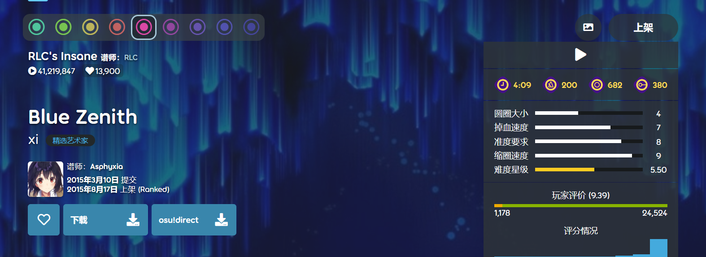
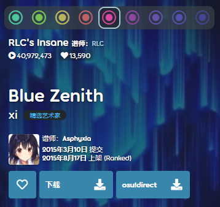
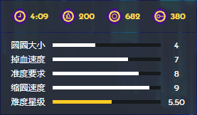
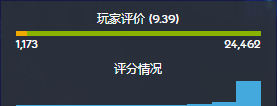
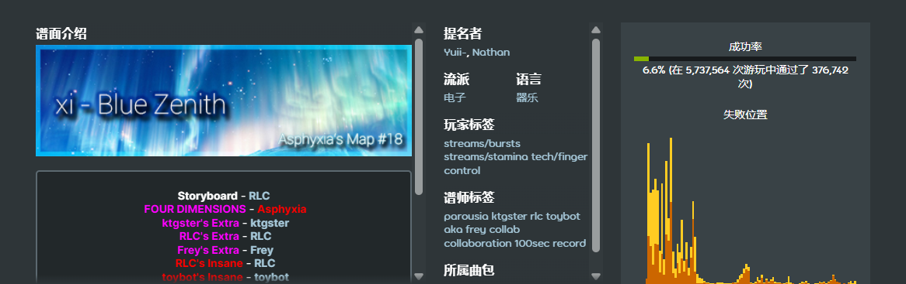
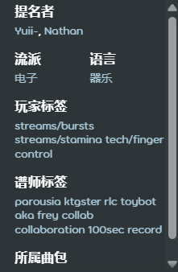
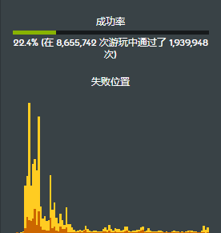
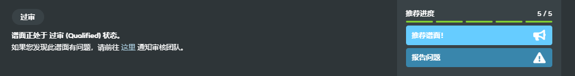
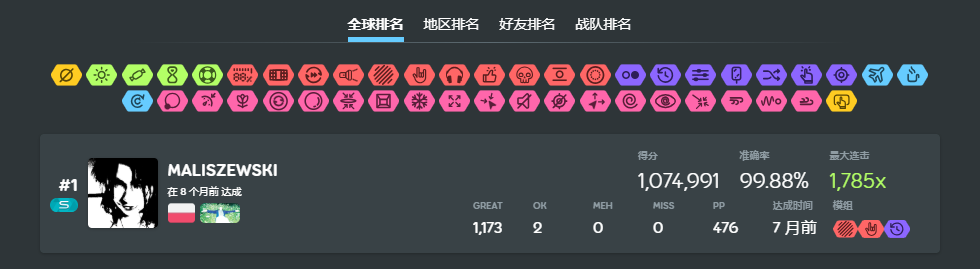
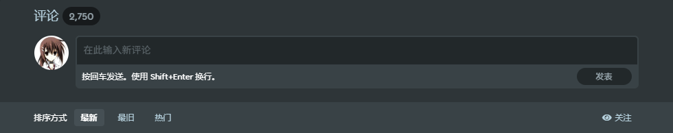

# 谱面信息页

**谱面信息页**展示了与一张[谱面](/wiki/Beatmap)相关的各种信息，例如其元数据、用户评分和评论等。

## 导航

:::infobox

:::

::: Infobox

:::

在左上角，当前选中的 `信息` 标签旁边，是用于[摸图](/wiki/Modding)的[谱面讨论页](/wiki/Beatmap_discussion)选项卡。

右上角的四个游戏图标显示了当前谱面难度所属的[游戏模式](/wiki/Game_mode)。数字对应每个游戏模式下的[难度](/wiki/Beatmap/Difficulty)总数，如果该游戏模式下没有难度，其图标将被显示为灰色。[osu!](/wiki/Game_mode/osu!) 模式的难度会自动作为[转谱](/wiki/Beatmap/Converts)在其他游戏模式中显示。

## 难度菜单

这是谱面信息页的主要部分，包含了关于谱面的最重要的详细信息。其背景是谱面所用背景图片的裁剪版本。

### 谱面信息

::: Infobox

:::

谱面信息面板列出了歌曲标题、艺术家、谱面主的头像和用户名、谱面的提交日期和最后更改日期，以及每个难度的信息等。

难度图标根据[谱面星级光谱](/wiki/Beatmap/Difficulty#谱面星级)进行着色。选择一个难度将会相应地更新页面上的统计数据。

当前难度的名称、谱师和星级下方是一些关于谱面的统计数据，包括游玩次数、收藏次数和提名次数（在[适用](/wiki/Beatmap/Category#wip-and-pending)的情况下）。光标悬停在收藏计数上时，将会显示最多 50 位收藏此谱面的用户的头像。

歌曲标题与艺术家显示在这些数字下方。点击它们会自动搜索其他具有相同歌曲标题或艺术家名的谱面。

点击谱面主和客串谱师的名字时，可查看他们的个人资料。

再往下，从左到右排列着以下操作按钮：

- **收藏：** 将此谱面添加到用户个人资料的收藏谱面区域。
- **下载：** 下载谱面。如果谱面包含背景视频，用户可选择下载带视频或不带视频的版本。
- **osu!direct**：直接在游戏客户端内下载谱面，无需手动打开文件。玩家需要 [osu!supporter](/wiki/osu!supporter) 身份才能在 osu!(stable) 中使用此功能。
- **举报：** 如果谱面处于[坟场](/wiki/Beatmap/Category#graveyard)或[制作中与待定](/wiki/Beatmap/Category#wip-and-pending)类别，且存在违规内容，用户可以[举报该谱面](/wiki/Reporting_bad_behaviour#谱面)。点击三个点的图标会展开一个下拉菜单，其中包含`举报`按钮。

### 统计面板

::: Infobox

:::

难度菜单的右侧是统计面板，其上方显示谱面类别。小图标会指示谱面是否包含视频或故事板。点击类别下方的三角形按钮，会播放歌曲的简短预览。再次点击可停止预览。

预览菜单下方从左到右依次显示歌曲时长、BPM 以及[打击物件](/wiki/Gameplay/Hit_object)数量。悬停在歌曲时长上时，会额外弹框显示该难度的游玩长度（即[掉血时间](/wiki/Beatmap/Drain_time)）。

取决于游戏模式，可能会显示以下难度设置及其对应的数值：

| 设置 | 描述 | 游戏模式 |
| :-: | :-- | :-: |
| [圆圈大小](/wiki/Beatmap/Circle_size) (CS) | 决定打击物件的大小。 | ![][osu!] ![][osu!catch] |
| [掉血速度](/wiki/Beatmap/HP_drain_rate) (HP) | 定义游玩时的掉血与回血量。 | ![][osu!] ![][osu!taiko] ![][osu!catch] ![][osu!mania] |
| [缩圈速度](/wiki/Beatmap/Approach_rate) (AR) | 控制打击物件的出现速度。 | ![][osu!] ![][osu!catch] |
| [准度要求](/wiki/Gameplay/Accuracy) (OD) | 控制打击物件判定区间的严格程度。 | ![][osu!] ![][osu!taiko] ![][osu!catch] ![][osu!mania] |
| 键数 | 指定游玩谱面时使用的按键数量。 | ![][osu!mania] |

统计面板底部显示[星数](/wiki/Beatmap/Star_rating)，这是对谱面难度基于算法的抽象表示。

::: Infobox

:::

如果谱面处于[过审](/wiki/Beatmap/Category#qualified)、[上架](/wiki/Beatmap/Category#ranked)、[达标](/wiki/Beatmap/Category#approved)或[社区喜爱](/wiki/Beatmap/Category#loved)状态，面板下方将会显示用户评分。在 osu!(stable) 中通过谱面的其中一个难度后，用户可以基于对谱面的偏好程度为其打出 1 到 10 星的评分。

如果用户给出 6 星或以上（好评），评分条将显示为绿色，否则为黄色（差评）。评分条下方的数字表示给出好评和差评的用户数量。评分条上方括号中的数字则显示所有用户的平均评分。

用户评分下方的评分图显示了每个星值所占的投票比例。

## 元数据

### 谱面介绍

[谱面介绍](/wiki/Beatmap/Beatmap_description)是一个可由谱师编辑的区域，常用于：

- ……提供资源链接，例如背景图片来源或使用的[打击音效样本](/wiki/Beatmapping/Hitsound)。
- ……分享歌曲的相关内容，例如歌曲的 MV 或艺术家的官方网站。
- ……感谢其他用户的帮助（例如[客串谱师](/wiki/Beatmap/Guest_difficulty)、[摸图者](/wiki/Modding)、[故事板制作者](/wiki/Storyboard)）。
- ……分享与谱面相关的趣闻（例如作图过程中的里程碑）。

### 关键词

::: Infobox

:::

除了与游戏玩法相关的统计数据外，每张谱面都包含元数据字段，使谱面更容易被搜索到。作为[上架流程](/wiki/Beatmap_ranking_procedure)的一部分，在提交谱面之前，谱师需要将这些信息添加到谱面中：

- [流派](/wiki/Beatmap/Genre_and_language#歌曲风格列表)：歌曲的主要音乐风格。
- [语言](/wiki/Beatmap/Genre_and_language#语言列表)：歌词的主要语言，若无歌词则为纯音乐。
- [谱师标签](/wiki/Beatmap/Beatmap_tags#谱师标签-(mapper-tags))：包含歌曲信息的有用关键词。
- **来源：** 歌曲最初创作所服务的媒介，或歌曲最为人所知的媒介。

作为[上架流程](/wiki/Beatmap_ranking_procedure)的一部分，在谱面被[谱面审核成员 (BN)](/wiki/People/Beatmap_Nominators) 提名时，`提名者` 区域会自动显示。

谱面上架后，用户可以在 osu!(lazer) 客户端中为各个[玩家标签](/wiki/Beatmap/Beatmap_tags#玩家标签-(user-tags))投票。当某个玩家标签获得超过 5 票时，它将显示在 `玩家标签` 区域中。

如果谱面被添加到一个或多个[曲包](/wiki/Beatmap/Packs)中，这些曲包也会被列在 `所属曲包` 区域中。

### 成功率显示

::: Infobox

:::

该部分直观呈现成功通过难度的玩家数。成功率显示在条下方，同时也会显示该难度的通过次数与总游玩次数。

再下方则是一个显示难度失败时间点的图表，呈现游玩失败的位置。某一列的高度越高，表示在该点失败的玩家越多。

## 推荐进度

如果谱面处于[制作中](/wiki/Beatmap/Category#wip-and-pending)、[待定](/wiki/Beatmap/Category#wip-and-pending)或[过审](/wiki/Beatmap/Category#qualified)状态，则会显示推荐进度。该区域左侧显示谱面当前状态描述，而右侧显示推荐数和按钮。根据谱面所属类别，描述内容会有所不同。

点击 `推荐谱面！` 按钮将会跳转到[谱面讨论页](/wiki/Beatmap_discussion)，在此可以为谱面投推荐票，表示希望该谱面上架。用户为谱面投票后，`推荐谱面！` 按钮将变灰，并变得不可点击。

特别地，如果谱面处于[过审](/wiki/Beatmap/Category#qualified)状态，`推荐谱面！` 按钮下方还会显示 `报告问题` 按钮，点击后依然会跳转到谱面讨论页，但目的则是报告在提名阶段内，谱面中可能被遗漏的任何问题。

## 排名

如果谱面处于[过审](/wiki/Beatmap/Category#qualified)、[上架](/wiki/Beatmap/Category#ranked)、[达标](/wiki/Beatmap/Category#approved)或[社区喜爱](/wiki/Beatmap/Category#loved)状态，则其排行榜可以被访问，且玩家可以在排行榜上相互竞争。

谱面信息页展示了四个排行榜，分别是 `全球排名`、`地区排名`、`好友排名` 和 `战队排名`，其中 `地区排名` 和 `好友排名` 需要 [osu!supporter](/wiki/osu!supporter) 才能使用。谱面的每个难度都有其独立的排行榜。选择顶部菜单中的标签后，相应分数排行榜的列表将显示在下方。点击筛选菜单中的一个或多个模组图标，可以仅显示带有选中[模组](/wiki/Gameplay/Game_modifier)组合的分数。

分数列表最多显示 50 个最高分，其中最佳分数以大号卡片突出显示。

光标悬停在分数上时，菜单右侧会显示三个点。点击后会打开一个包含 3 个选项的菜单：

- **查看详情：** 在单独的页面中呈现该成绩。
- **下载回放：** 下载[回放](/wiki/Gameplay/Replay)文件。
- **举报成绩：** 如果用户认为成绩涉嫌作弊，可以提交举报。

## 评论

在评论区，用户可以交流他们对谱面的看法。谱面主还可以置顶一条评论，该评论将固定显示在评论区顶部。评论区顶部的数字对应评论总数。输入框下方可以设置评论排序方式，支持按最新、最早或最多点赞数进行排序。要发表新评论，请在文本框中输入内容，然后点击 `发表` 按钮，或者按键盘上的 `Enter` 键。

点击右侧的 `关注` 按钮后，用户将收到关于此谱面新评论的通知。

在浏览其他用户的评论时，用户可以对评论进行几种操作：

- **点赞：** 点击评论左侧的数字即可点赞评论。点赞后，点赞计数将变为绿色。
- **固定链接：** 将此评论的永久链接复制到剪贴板。
- **回复：** 回复内容会缩进插入到评论下方，以便与其他评论区分。
- **举报：** 遇到违规内容请不要犹豫，立即举报。

## 冷知识

- 谱师更新谱面后，玩家在 osu!(stable) 中无法自动替换旧的音频文件。谱师可以在谱面介绍中指导玩家手动重新下载谱面以应用新的音频文件。

[osu!]: /wiki/shared/mode/osu.png "osu!"
[osu!taiko]: /wiki/shared/mode/taiko.png "osu!taiko"
[osu!catch]: /wiki/shared/mode/catch.png "osu!catch"
[osu!mania]: /wiki/shared/mode/mania.png "osu!mania"
