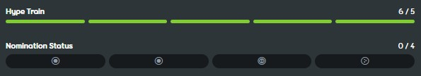

---
tags:
  - qualification
  - nomination
  - nominations
  - nom
  - ranking
  - ranked
  - Qualifizierung
  - Nominierung
  - gerankt
---

# Ranking-Verfahren für Beatmaps

*Siehe auch: [Rank (Begriffsabgrenzung)](/wiki/Disambiguation/Rank) und [Ranking-Warteschlange](Ranking_queue)*
*Für unten genannte Beatmap-Kategorien, siehe: [Beatmap-Kategorie](/wiki/Beatmap/Category)*

Bevor [Beatmaps](/wiki/Beatmap) in die Kategorie [Ranked](/wiki/Beatmap/Category#ranked) eingestuft werden können, müssen sie von der Community überprüft werden, indem sie das Ranking-Verfahren durchlaufen.

## Feedback

Der Ersteller einer Beatmap kann seine Einsendungen als `Work in Progress` oder `Ausstehend` kennzeichnen. Die osu!-Community soll Feedback zu Beatmaps geben, die den beiden Kategorien zugeordnet sind.

Durch [Modding](/wiki/Modding) erhält man konstruktive Kritik für eine Beatmap und kann so die Qualität der Beatmap steigern. Üblicherweise veröffentlichen Nutzer ihr Feedback auf der [Diskussionsseite](/wiki/Beatmap_discussion) einer Beatmap oder reden mit dem Ersteller direkt über Probleme.

Die Qualitätsstandards für die Ranked-Kategorie sind hoch, beim Modding müssen also viele Punkte beachtet werden. Für die Erstellung qualitativ hochwertiger Beatmaps ist viel Erfahrung notwendig. Unerfahrene Beatmap-Ersteller müssen ihre Beatmaps potentiell an vielen Stellen überarbeiten. Manchmal kann es auch passieren, dass Beatmaps komplett neu gemacht werden müssen.

Bevor die Beatmap für das Ranking nominiert wird, müssen mindestens 5 verschiedene Nutzer einen [Hype](/wiki/Beatmap/Hype) vergeben.

## Nominierungen {id=nominations}

::: Infobox

:::

Eine **Nominierung** ist eine Bestätigung, dass eine Beatmap [gerankt](/wiki/Beatmap/Category#ranked) werden soll. Beatmaps können nominiert werden, wenn die nominierenden Nutzer ihre Qualität für angemessen halten. Als Mindestanforderung gilt, dass Beatmaps den [Ranking-Kriterien](/wiki/Ranking_criteria) entsprechen müssen und 5 oder mehr [Hypes](/wiki/Beatmap/Hype) haben.

Nominierungen werden oft von [Beatmap-Nominatoren](/wiki/People/Beatmap_Nominators) (*BN*), einer Gruppe erfahrener Modder, vergeben. Mitglieder des [Nomination Assessment Teams](/wiki/People/Nomination_Assessment_Team) (*NAT*) dürfen Beatmaps auch nominieren, jedoch ist das nicht ihre Hauptaufgabe.

Es wird empfohlen, Feedback durch Modding einzuholen bevor man BN nach Nominierungen fragt, allerdings sind 5 Hypes die einzige Voraussetzung.

## Qualifizierung

Im Rahmen der Qualifizierung werden Beatmaps, die genug Nominierungen erhalten, in die Beatmap-Kategorie [Qualifiziert](/wiki/Beatmap/Category#qualified) verschoben. Beatmaps, bei denen alle [Schwierigkeitsgrade](/wiki/Beatmap#schwierigkeitsgrad) in einem [Spielmodus](/wiki/Game_mode) erstellt wurden, benötigen zwei Nominierungen, während Beatmaps mit Schwierigkeitsgraden aus mehreren Spielmodi[^hybrid-sets] zwei Nominierungen für den [Hauptspielmodus](#main-mode) und eine für jeden anderen Modus benötigen.

Qualifizierte Beatmaps werden in einem letzten Schritt zur **Qualitätssicherung** von einem größeren Teil der osu!-Community angeschaut, bevor sie dauerhaft in die Kategorie [Ranked](/wiki/Beatmap/Category#ranked) gelangen. In dieser Phase erhalten Beatmaps die meiste Rückmeldung und es werden Änderungen eingepflegt, wenn Probleme gefunden werden. Während dieser Zeit gilt:

- Community-Mitglieder können eine Beatmap testen oder Mods einreichen und dann über die Diskussionsseite der Beatmap Rückmeldung geben und Probleme melden[^report-correctly].
- Die BN und das NAT werden automatisch über alle Vorschläge und Probleme benachrichtigt. Nutzer, die Benachrichtigungen für neue Probleme auf qualifizierten Beatmaps aktiviert haben, werden ebenfalls informiert.
- Vorschläge und Probleme können von der Community gemeinsam mit dem Beatmap-Ersteller diskutiert und gelöst werden.
- Qualifizierte Beatmaps können nicht direkt von ihren Erstellern aktualisiert werden.

Wenn Probleme identifiziert werden, die Änderungen erfordern, werden die Nominierungen der Beatmap möglicherweise [zurückgesetzt](#zurücksetzung-der-nominierungen). Dadurch kann der Ersteller auf das Feedback eingehen, während gleichzeitig die Integrität des Ranking-Verfahrens gewahrt bleibt.

### Den Hauptspielmodus bestimmen {id=main-mode}

Bei Beatmaps mit Schwierigkeitsgraden aus mehreren Spielmodi[^hybrid-sets] wird der Hauptspielmodus nach folgender Priorisierung bestimmt:

1. Der Spielmodus, für den die meisten Schwierigkeitsgrade in der Beatmap erstellt wurden.
2. Wenn zwei oder mehr Spielmodi dieselbe Anzahl an Schwierigkeitsgraden haben, ist der Spielmodus der Hauptmodus, für den der Beatmap-Ersteller die meisten Schwierigkeitsgrade erstellt hat.
3. Falls beide Bedingungen zutreffen, ist der zuerst nominierte Modus der Hauptspielmodus.

### Zurücksetzung der Nominierungen

Nominierungen können zurückgesetzt werden, wenn eine Beatmap von ihrem Ersteller modifiziert wird oder ein BN bzw. ein NAT-Mitglied ein Problem in der Beatmap findet. Nominierte Beatmaps können auch vom [globalen Moderationsteam](/wiki/People/Global_Moderation_Team) zurückgesetzt werden, wenn dort unangemessene Inhalte vorhanden sind. Falls die Nominierungen bei einer qualifizierten Beatmap zurückgesetzt werden, wird die Beatmap *disqualifiziert* (häufig abgekürzt mit *DQ*), aus der [Ranking-Warteschlange](Ranking_queue) entfernt und wieder der Kategorie Ausstehend zugeordnet. Alle Nominierungen der Beatmap werden ebenfalls entfernt. Nur BN-, NAT- und GMT-Mitglieder dürfen qualifizierte Beatmaps disqualifizieren.

Eine Zurücksetzung der Nominierungen ermöglicht dem Ersteller, Änderungen an der Beatmap vorzunehmen, bevor er eine erneute Nominierung beantragt. Es wird ebenfalls sichergestellt, dass Modder, Beatmap-Nominatoren und NAT-Mitglieder die aktuelle Version einer Beatmap überprüfen, bevor diese in die [Ranking-Warteschlange](Ranking_queue) gelangt.

### Vetos

Wenn ein Mitglied der Beatmap-Nominatoren oder ein NAT-Mitglieder glaubt, dass eine Beatmap erhebliche Qualitätsprobleme aufweist, kann das Mitglied ein [Veto](/wiki/People/Beatmap_Nominators/Beatmap_Veto) aussprechen, um die Beatmap daran zu hindern, in die Kategorie [Ranked](/wiki/Beatmap/Category#ranked) aufgenommen zu werden. Durch das Veto können subjektive Ansichten, die angesprochen werden müssen, bevor die Beatmap mit der [Qualifizierung](#qualifizierung) fortfahren kann, diskutiert und weitere Klarstellungen gefordert werden.

## Ranked-Status

Wenn eine Beatmap für mindestens 7 Tage ohne Beiträge zu [Problemen oder Vorschlägen](/wiki/Modding#types-of-mod-posts) qualifiziert bleibt, wird sie über die [Ranking-Warteschlange](Ranking_queue) der Kategorie [Ranked](/wiki/Beatmap/Category#ranked) zugeordnet. Nach einer Disqualifizierung der Beatmap wird bei einer erneuten Qualifizierung die Zeit, die die Beatmap in der Ranking-Warteschlange bleibt, möglicherweise [neu berechnet](Ranking_queue#dq-and-re-qualification). Gerankte Beatmaps haben [Ranglisten](/wiki/Ranking) und vergeben [Performance-Punkte](/wiki/Performance_points) an Spieler.

Bei gerankten Beatmaps wird der Ranked-Status nur in Ausnahmefällen entfernt, wenn kurz nach Abschluss des Ranking-Verfahrens Probleme entdeckt werden.

## Anmerkungen

[^hybrid-sets]: Im Englischen als "hybrid set" bezeichnet.
[^report-correctly]: Für Details, wie man Probleme korrekt meldet, siehe: [Verhalten](/wiki/Rules/Code_of_conduct_for_modding_and_mapping#verhalten) sowie [Beatmap-Diskussion § Beitragsfeld](/wiki/Beatmap_discussion#submission-field)
